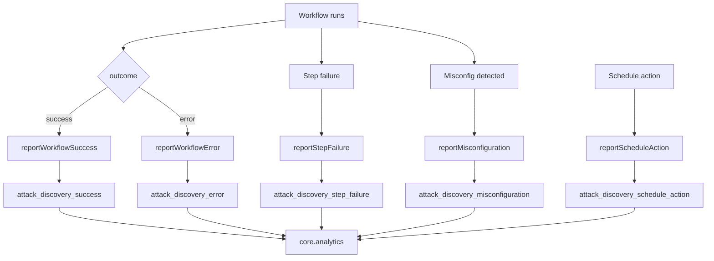

# Attack Discovery Workflows Telemetry

Event-Based Telemetry (EBT) events emitted by the `discoveries` plugin for the Attack Discovery 2.0 Workflows feature.

For system context (three execution paths, security surfaces, where these events are emitted from), see the canonical [discoveries plugin README](../../../../../plugins/discoveries/README.md).

## Privacy contract

**No event field may carry**: query content, alert content, alert rule names, user-defined workflow names, user identifiers, connector credentials. Only enums, counts, durations, booleans, and IDs (UUIDs / connector IDs / workflow IDs).

This contract is enforced at the boundary by the per-event reporters (`reportMisconfiguration`, `reportStepFailure`, `reportScheduleAction`, `reportWorkflowSuccess`, `reportWorkflowError`). Failed events MUST NOT include stack traces with file paths, raw provider error text, or user-controlled strings — only the classified `error_category` and a sanitized reason.

### EBT event flow

## Field Naming Convention

All new EBT fields must use `snake_case`, consistent with broader Kibana EBT conventions (Agent Builder, Observability, Data/Search, Fleet, etc.).

The `attack_discovery_success` and `attack_discovery_error` events are shared with the `elastic_assistant` plugin, which originally defined them with camelCase field names. Those camelCase fields are retained as-is to avoid breaking the shared event schema. They are marked **_(legacy)_** in the tables below.

All three events owned exclusively by `discoveries` — `attack_discovery_schedule_action`, `attack_discovery_misconfiguration`, and `attack_discovery_step_failure` — already use snake_case exclusively.

## Distinguishing Legacy vs Workflow Execution

The `attack_discovery_success` and `attack_discovery_error` event types are shared with the `elastic_assistant` plugin (the legacy path). Events from each path are distinguishable via the `execution_mode` field:

| Path | `execution_mode` | When |
| --- | --- | --- |
| Legacy (`elastic_assistant` public API, feature flag off) | absent | `elastic_assistant` never sets this field |
| Workflows (`discoveries` internal API, feature flag on) | `workflow` | Always set by `discoveries` |

Additionally, the three events owned exclusively by `discoveries` (`attack_discovery_schedule_action`, `attack_discovery_misconfiguration`, `attack_discovery_step_failure`) are only emitted when the workflows feature is active.

---

## User Action Events

These events record discrete user actions in the UI. Each maps 1:1 to a button click or API call the user explicitly performed.

### `attack_discovery_schedule_action`

Emitted after a successful schedule lifecycle operation.

| Field | Type | Required | Description |
| --- | --- | --- | --- |
| `action` | keyword | yes | Action performed: `create`, `update`, `delete`, `enable`, or `disable` |
| `has_actions` | boolean | no | Whether the schedule has notification actions configured |
| `interval` | keyword | no | Schedule interval (e.g. `1h`, `24h`) |

| Detail | |
| --- | --- |
| **Registered by** | `discoveries` |
| **Emitted from** | Schedule route handlers (`create_schedule.ts`, `update_schedule.ts`, `delete_schedule.ts`, `enable_schedule.ts`, `disable_schedule.ts`) via `reportScheduleAction` |

---

## Execution Insight Events

These events provide deeper observability into the Attack Discovery generation pipeline. They are emitted automatically during workflow execution, not in direct response to a single user click.

### `attack_discovery_success`

Emitted after a successful generation workflow execution. This event type is registered by `elastic_assistant`; `discoveries` reports to the same stream with workflow-specific fields populated.

| Field | Type | Required | Description |
| --- | --- | --- | --- |
| `actionTypeId` | keyword | yes | Kibana connector type (e.g. `.gen-ai`) _(legacy)_ |
| `alertsContextCount` | integer | yes | Number of alerts sent as context to the LLM _(legacy)_ |
| `alertsCount` | integer | yes | Unique alerts referenced in generated discoveries _(legacy)_ |
| `configuredAlertsCount` | integer | yes | Number of alerts configured by the user _(legacy)_ |
| `custom_retrieval_workflow_count` | integer | no | Number of user-selected custom alert retrieval workflows |
| `dateRangeDuration` | integer | yes | Duration of the time range in hours _(legacy)_ |
| `default_alert_retrieval_mode` | keyword | no | Default retrieval mode: `custom_query`, `esql`, or `disabled` |
| `discoveriesGenerated` | integer | yes | Number of attack discoveries generated _(legacy)_ |
| `duplicatesDroppedCount` | integer | no | Number of discoveries dropped because they were duplicates of existing ones _(legacy)_ |
| `durationMs` | integer | yes | Total pipeline duration in ms _(legacy)_ |
| `execution_mode` | keyword | no | Always `workflow` when emitted by `discoveries` (absent on legacy) |
| `hasFilter` | boolean | yes | Whether a filter was applied to the alerts used as context _(legacy)_ |
| `isDefaultDateRange` | boolean | yes | Whether the default date range (last 24 hours) was used _(legacy)_ |
| `model` | keyword | no | LLM model ID |
| `prebuilt_step_types_used` | keyword[] | no | Prebuilt step type IDs that participated in the execution |
| `provider` | keyword | no | Connector provider (e.g. `OpenAI`) |
| `retrieval_workflow_count` | integer | no | Total number of retrieval workflows executed (default + custom) |
| `trigger` | keyword | no | What triggered generation: `manual` or `schedule` |
| `uses_default_retrieval` | boolean | no | Whether the default alert retrieval workflow was run |
| `uses_default_validation` | boolean | no | Whether the default validation workflow was used |
| `validation_discoveries_count` | integer | no | Post-validation count of valid discoveries |

| Detail | |
| --- | --- |
| **Registered by** | `elastic_assistant` (shared event type) |
| **Emitted from** | `execute_generation_workflow.ts` via `reportWorkflowSuccess` |

### `attack_discovery_error`

Emitted when the generation workflow fails. Augmented with step-failure and misconfiguration context to support root cause analysis.

| Field | Type | Required | Description |
| --- | --- | --- | --- |
| `actionTypeId` | keyword | yes | Kibana connector type _(legacy)_ |
| `errorMessage` | keyword | yes | Error message _(legacy)_ |
| `execution_mode` | keyword | no | Always `workflow` when emitted by `discoveries` (absent on legacy) |
| `failed_step` | keyword | no | Which pipeline step failed: `alert_retrieval`, `generation`, or `validation` |
| `misconfiguration_detected` | boolean | no | Whether a misconfiguration was detected as the root cause |
| `model` | keyword | no | LLM model ID |
| `provider` | keyword | no | Connector provider |
| `trigger` | keyword | no | What triggered generation: `manual` or `schedule` |

| Detail | |
| --- | --- |
| **Registered by** | `elastic_assistant` (shared event type) |
| **Emitted from** | `execute_generation_workflow.ts` via `reportWorkflowError` |

### `attack_discovery_misconfiguration`

Emitted when a misconfiguration is detected that prevents or degrades Attack Discovery execution. Provides fleet-wide visibility into configuration problems.

| Field | Type | Required | Description |
| --- | --- | --- | --- |
| `detail` | keyword | no | Human-readable detail about the misconfiguration |
| `misconfiguration_type` | keyword | yes | Category of misconfiguration (see values below) |
| `space_id` | keyword | no | Space where the misconfiguration was detected |
| `workflow_id` | keyword | no | Workflow ID related to the misconfiguration |

**`misconfiguration_type` values**:

| Value | Meaning | Emitter |
| --- | --- | --- |
| `alerts_index_missing` | Alerts index does not exist | Pre-execution validation in `execute_generation_workflow.ts` |
| `connector_unreachable` | Configured connector is not accessible | Pre-execution validation in `execute_generation_workflow.ts` |
| `default_workflows_resolution_failed` | WorkflowsManagement API is unavailable | Pre-execution validation in `execute_generation_workflow.ts` |
| `managed_workflow_disabled` | A required managed workflow is unavailable (disabled, not found, or not managed) | Pre-execution validation in `execute_generation_workflow.ts` |
| `step_registration_failed` | A workflow step failed to register | Step registration in `plugin.ts` |
| `workflow_disabled` | Referenced user workflow is disabled | Validation checks |
| `workflow_modified` | A managed workflow drifted from its registered definition; platform will reconcile on next restart | `check_managed_workflow_integrity.ts` — emitted when hash drift is detected for required or optional workflows |
| `workflow_not_found` | Referenced workflow does not exist | Validation checks |

| Detail | |
| --- | --- |
| **Registered by** | `discoveries` |
| **Emitted from** | `check_managed_workflow_integrity.ts` (`workflow_modified`), `execute_generation_workflow.ts` (pre-execution validation misconfigurations) |

### `attack_discovery_step_failure`

Emitted when an individual pipeline step fails during generation. Provides per-step failure visibility for fleet-wide debugging.

| Field | Type | Required | Description |
| --- | --- | --- | --- |
| `duration_ms` | integer | no | How long the step ran before failing (ms) |
| `error_category` | keyword | yes | Category of error (see values below) |
| `execution_uuid` | keyword | no | Execution UUID for this generation run |
| `step` | keyword | yes | Which pipeline step failed (see values below) |
| `workflow_id` | keyword | no | Workflow ID that was being executed when the step failed |

**`step` values**: `alert_retrieval`, `generation`, `validation`

**`error_category` values**:

| Value | Meaning |
| --- | --- |
| `connector_error` | Connector-related failure |
| `timeout` | Step timed out |
| `unknown` | Unclassified error |
| `validation_error` | Validation-specific failure |
| `workflow_error` | Workflow execution failure |

| Detail | |
| --- | --- |
| **Registered by** | `discoveries` |
| **Emitted from** | `run_manual_orchestration/index.ts` (catch block for retrieval/generation failures, post-validation for validation failures) |

---

## Architecture

- **Event definitions**: `event_based_telemetry.ts` defines `EventTypeOpts<T>` objects for each event type.
- **Registration**: Three events are registered in `plugin.ts` via `core.analytics.registerEventType()`: `attack_discovery_misconfiguration`, `attack_discovery_schedule_action`, and `attack_discovery_step_failure`. The shared `attack_discovery_success` and `attack_discovery_error` types are registered by `elastic_assistant`.
- **Reporting helpers**: Dedicated modules wrap each event type:
  - `report_workflow_telemetry.ts` — `reportWorkflowSuccess` / `reportWorkflowError`
  - `report_schedule_action/` — `reportScheduleAction`
  - `report_misconfiguration/` — `reportMisconfiguration`
  - `report_step_failure/` — `reportStepFailure` (includes `classifyErrorCategory` heuristic)
- **Pipeline metadata**: `PipelineStepError` in `run_manual_orchestration/helpers/pipeline_step_error/` carries step-failure metadata from orchestration to the top-level error handler.

## Trigger Sources

| Trigger | `trigger` value | Source |
| --- | --- | --- |
| Manual (UI button or API call) | `manual` | `post_generate.ts` route handler |
| Scheduled execution | `schedule` | `workflow_executor/index.ts` |

## Product Questions Answered

| Question | Fields / Events |
| --- | --- |
| Legacy vs workflow execution? | `execution_mode` (`workflow` vs absent) on `attack_discovery_success` / `attack_discovery_error` |
| Default vs custom workflows? | `uses_default_retrieval`, `uses_default_validation`, `custom_retrieval_workflow_count` |
| How many retrieval workflows ran? | `retrieval_workflow_count` |
| Which prebuilt steps are reused? | `prebuilt_step_types_used` |
| Schedule adoption and lifecycle? | `attack_discovery_schedule_action` with `action`, `interval`, `has_actions` |
| Execution outcomes by trigger? | `attack_discovery_success` vs `attack_discovery_error` with `trigger` dimension |
| Configuration problems across fleet? | `attack_discovery_misconfiguration` with `misconfiguration_type` |
| Which pipeline step failed and why? | `attack_discovery_step_failure` with `step` and `error_category` |
| Root cause: config issue or runtime? | `failed_step` and `misconfiguration_detected` on `attack_discovery_error` |
| How many discoveries were deduplicated? | `duplicatesDroppedCount` on `attack_discovery_success` (both legacy and workflow paths) |

## `error_category` enum reference

`error_category` on `attack_discovery_step_failure` is produced by `classifyErrorCategory` (see [`report_step_failure/`](report_step_failure/)) which heuristically maps an error to one of the bounded values below. The raw error message is **not** retained on the event.

| Value | Meaning |
| --- | --- |
| `connector_error` | Connector-related failure (LLM rejected request, auth failure, model unavailable) |
| `timeout` | Step exceeded its workflow `timeout` value |
| `validation_error` | Validation step rejected the discoveries (e.g., hallucination detection failed all of them) |
| `workflow_error` | Workflow execution failure (engine error, missing step, invalid YAML) |
| `unknown` | Heuristic could not classify; fallback so the field is always set |

If a new failure mode warrants its own category, extend the enum in `classifyErrorCategory` and update this table.

## FAQ

**Why are some fields camelCase?** `attack_discovery_success` and `attack_discovery_error` are shared with `elastic_assistant`'s legacy path. Their pre-existing fields are camelCase and must not be renamed (would break the schema). All new fields on these events and all fields on the three `discoveries`-owned events are snake_case.

**How are `discoveries`-owned events distinguished from legacy events?** Via `execution_mode: 'workflow'` on `attack_discovery_success/error` (legacy never sets this field). The three `discoveries`-owned events (`attack_discovery_misconfiguration`, `attack_discovery_step_failure`, `attack_discovery_schedule_action`) are only emitted on the workflow path, so their presence is itself a signal.
