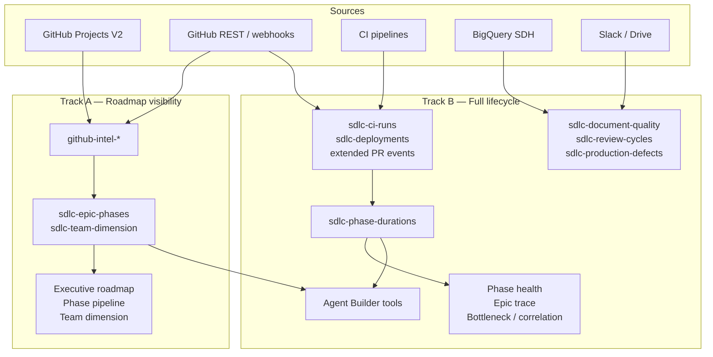

# SDLC platform architecture — v1.1 delta

Draft update to **`sdlc-platform-architecture.docx` (v1.0)** reflecting the implemented Kibana data layer (`@kbn/sdlc-data-layer` + `sdlcIntel` plugin).

**Status:** Draft for review · **Supersedes:** architecture v1.0 §3–§8 index and rollout sections · **Companion:** [PRD_TRACEABILITY.md](./PRD_TRACEABILITY.md)

---

## Changelog (v1.0 → v1.1)

| Area | v1.0 | v1.1 |
| --- | --- | --- |
| Primary ingest | Connector v2 fetch across GitHub/Slack/Drive/CI/BQ from day one | **GitHub Projects V2 GraphQL first** (`.github` connector for auth only) |
| Index model | 8 flat `sdlc-*` indices | **Three tiers:** `github-intel-*` (raw) → `sdlc-epic-phases` / `sdlc-team-dimension` (analytics) → optional event indices (Track B) |
| Join key | `epic.id` on every document from start | **`epic.key` + `hierarchy.epic` + `content_ref`** now; `epic.id` when Track B starts |
| Phase model | 10 PRD lifecycle phases only | **Dual model:** 10 PRD phases (Track B) + **8 P-gates** on `sdlc-epic-phases` (Track A roadmap mocks) |
| Rollout | Phase A = engineering events (weeks 1–6) | **Track A** = roadmap visibility first; **Track B** = full lifecycle when PRD phases 6–10 are in scope |
| Dashboards | 5 dashboards on `sdlc-phase-durations` | Track A: 3 HTML mock dashboards on `sdlc-epic-phases` + `sdlc-team-dimension`; Track B dashboards unchanged |
| Agent Builder | Phase D (weeks 17–20) | Unchanged timing; tools query whichever indices exist for active track |

---

## §1 Vision (no change)

Read-only, team-aggregated lifecycle visibility. No write-back to GitHub. No individual developer scoring (NFR-001).

---

## §2 Dual delivery tracks (NEW — replaces implicit single-path rollout)

The PRD describes one platform; delivery splits into two tracks that share indices but differ in scope and ingest.



### Track A — Roadmap visibility (current implementation)

**Goal:** Executive and team-lead views from GitHub Projects V2 — coverage, P4/P5 gates, roadmap grouping.

| Deliverable | Primary indices | Status |
| --- | --- | --- |
| GitHub Projects sync | `github-intel-projects`, `-items`, `-views`, `-issues`, `-prs` | **Shipped** |
| Org catalog | `github-intel-teams`, `-repos` | **Shipped** |
| Epic phase rollups | `sdlc-epic-phases` (P1–P8 gates; P4/P5 computed) | **Shipped (partial)** |
| Team taxonomy | `sdlc-team-dimension` | **Shipped** |
| Executive roadmap dashboard | `sdlc-epic-phases` | **Not started (Kibana)** |
| Phase pipeline dashboard | `sdlc-epic-phases` | **Not started (Kibana)** |
| Team dimension dashboard | `sdlc-epic-phases` + `sdlc-team-dimension` | **Not started (Kibana)** |

**Track A remaining work (no new index tiers required):**

1. Populate `tickets_by_repo` in `buildEpicPhases`
2. Wire Kibana dashboards to HTML mock specs
3. Optional: ingest `comments`, `people`, `relationships`, write `sync-state`
4. Expand `PRODUCT_INITIATIVE_ROADMAP_MAP` / project filters
5. ILM + Spaces RBAC (NFR-005/006)

### Track B — Full lifecycle (original v1.0 Phase A–D)

**Goal:** PRD §3.2 linkage chain, phase durations, bottleneck/correlation analytics, Agent Builder.

Starts when leadership requires PRD phases 6–10 metrics (review latency, CI, deploy, SDH). **Does not require renaming Track A indices.**

| Deliverable | Indices | Depends on |
| --- | --- | --- |
| PR review / merge events | Extend `github-intel-pull-requests` | GitHub REST or connector |
| CI runs | **New** `sdlc-ci-runs` | Buildkite / GHA HTTP |
| Deployments | **New** `sdlc-deployments` | Pipeline webhooks |
| Cross-source join | `epic.id` on all event docs | Linkage enrichment step |
| Phase durations | **New** `sdlc-phase-durations` (ES Transform) | Track B event timestamps |
| Document quality | **New** `sdlc-document-quality` | Drive + `ai.prompt` |
| Cross-func reviews | **New** `sdlc-review-cycles` | Slack connector |
| Production defects | **New** `sdlc-production-defects` | BigQuery |
| Lifecycle dashboards | `sdlc-phase-durations` | Transform live |
| Agent Builder | ES\|QL tools on active indices | Phase D |

---

## §3 Platform layers (REVISED)

| Layer | v1.0 | v1.1 |
| --- | --- | --- |
| **1 Sources** | All sources parallel | **Track A:** GitHub Projects V2 + org catalog · **Track B:** add REST/webhooks, CI, BQ, Slack, Drive |
| **2 Ingest** | Connector v2 pipelines | **`sdlcIntel` workflow steps** + custom GraphQL; `.github` connector for token; Connector v2 optional for Track B |
| **3 Storage** | 8 `sdlc-*` indices | **Tier 1:** `github-intel-*` · **Tier 2:** `sdlc-epic-phases`, `sdlc-team-dimension` · **Tier 3 (Track B):** event + derived indices |
| **4 Consume** | Dashboards + Agent Builder | **Track A:** 3 roadmap dashboards · **Track B:** 5 lifecycle dashboards + Agent Builder |

---

## §4 Ingest architecture (REVISED)

### 4.1 Track A pipelines (implemented)

| Pipeline | Trigger | Step | Output indices |
| --- | --- | --- | --- |
| Index bootstrap | Manual once | `sdlc.setupIndices` | All `github-intel-*`, `sdlc-*` |
| Reference seed | Manual once | `sdlc.seedReferenceData` | `sdlc-team-dimension` |
| Projects sync | 4h schedule | `sdlc.syncGithubProjects` | `github-intel-projects`, `-items`, `-views`, `-issues`, `-prs` |
| Org catalog | 4h schedule | `sdlc.syncGithubOrgCatalog` | `github-intel-teams`, `-repos` |
| Epic rollups | 4h schedule | `sdlc.buildEpicPhases` | `sdlc-epic-phases` |

**Auth:** GitHub PAT or OAuth via Stack Management `.github` connector (`resolve_github_token`).

**Project selection:** All org projects when `projectNumbers: []`, with optional title/number filters.

### 4.2 Linkage & join keys (REVISED)

| Key | Scope | Format / source | When |
| --- | --- | --- | --- |
| `epic.key` | Track A | Projects custom field `Epic` (string label) | **Now** — primary rollup key in `buildEpicPhases` |
| `hierarchy.epic` | Track A | Same label on issues/PRs | **Now** — child item queries |
| `content_ref` | Track A | `{ repo, number, url, type }` from GraphQL | **Now** — epic issue anchor |
| `epic.id` | Track B | Canonical e.g. `{owner}/{repo}#{issue_number}` | **When cross-source events ingest** — PR/CI/deploy join |

v1.0 §4.2 linkage enrichment (PRD URL, RFC URL, `closes #`) moves to **Track A step 4.3** (optional enrichment) and **Track B step 4.4** (required for `epic.id`).

### 4.3 Track A enrichment (NEW — optional near-term)

Workflow step (planned): parse project item fields and issue body for:

- `links.prd_url`, `links.arch_url`
- Child ticket counts by repo → `tickets_by_repo`

No new indices.

### 4.4 Track B pipelines (unchanged intent from v1.0 §4.1)

GitHub reviews/check runs, Slack, Drive+LLM, CI HTTP, BigQuery SDH — as originally specified, writing to Tier 3 indices with `epic.id`.

---

## §5 Storage model (REPLACE v1.0 §5.1 table)

### Tier 1 — Raw GitHub intel (`github-intel-*`)

User-data indices. Created by `system-sdlc-setup-indices`. Discover-friendly.

| Index | Role | Ingest | Track |
| --- | --- | --- | --- |
| `github-intel-projects` | Project V2 metadata, field defs | `syncGithubProjects` | A |
| `github-intel-project-items` | Board rows, planning fields | `syncGithubProjects` | A |
| `github-intel-project-views` | Views and filters | `syncGithubProjects` | A |
| `github-intel-repos` | Org repo catalog | `syncGithubOrgCatalog` | A |
| `github-intel-issues` | Issues on board | `syncGithubProjects` | A |
| `github-intel-pull-requests` | PRs on board (+ Track B: all linked PRs) | `syncGithubProjects` (+ Track B REST) | A / B |
| `github-intel-teams` | Org teams | `syncGithubOrgCatalog` | A |
| `github-intel-comments` | Comments | Schema only | A (planned) |
| `github-intel-people` | Org members | Schema only | A (planned) |
| `github-intel-relationships` | Graph edges | Schema only | A (planned) |
| `github-intel-sync-state` | Sync cursors | Schema only | A (planned) |

### Tier 2 — Analytics (`sdlc-*`)

| Index | Role | Producer | Track |
| --- | --- | --- | --- |
| `sdlc-epic-phases` | Epic document with P1–P8 gates, rollups, team attribution | `buildEpicPhases` | A |
| `sdlc-team-dimension` | Team taxonomy, aliases, product mapping | `seedReferenceData` | A |

**P-gate semantics (Track A UI model):**

| Gate | Maps to PRD concept | Computed today |
| --- | --- | --- |
| `p1_prd`, `p2_arch` | Phases 2, 4 (document quality) | Placeholder (`ns`) until LLM rubric |
| `p3_ai_coverage` | PRD §3.3 scope-fit (not Phase 3 sign-off) | Placeholder |
| `p4_tickets` | Phase 5 work breakdown | **Yes** |
| `p5_prs` | Phases 6, 9 (partial) | **Yes** (board PRs) |
| `p6_sdh`, `p7_release`, `p8_telemetry` | Phase 10+ | Placeholder until Track B |

### Tier 3 — Event & derived (Track B only)

| Index | v1.0 name | Role | Notes |
| --- | --- | --- | --- |
| `sdlc-ci-runs` | same | CI duration, flakiness | **New** — no Track A equivalent |
| `sdlc-deployments` | same | DORA / deploy events | **New** |
| `sdlc-phase-durations` | same | ES Transform; dashboard primary | **New** — joins by `epic.id` |
| `sdlc-document-quality` | same | LLM rubric scores | **New** |
| `sdlc-review-cycles` | same | Cross-func review events | **New** |
| `sdlc-production-defects` | same | SDH ↔ epic | **New** |

**Retired v1.0 names (do not create as separate indices):**

| v1.0 index | v1.1 equivalent |
| --- | --- |
| `sdlc-epics` | `github-intel-project-items` (epic rows) + `sdlc-epic-phases` (rollup) |
| `sdlc-pull-requests` | `github-intel-pull-requests` (extend in place; optional alias) |

### Index diagram (v1.1)

```
┌─────────────────────────────────────────────────────────────────┐
│                        INGEST (Workflows)                        │
│  syncGithubProjects │ syncGithubOrgCatalog │ buildEpicPhases    │
│  [Track B: REST/CI/BQ/Slack/Drive pipelines]                   │
└────────────┬────────────────────┬───────────────────┬───────────┘
             │                    │                   │
             ▼                    ▼                   ▼
┌────────────────────────┐ ┌──────────────┐ ┌─────────────────────┐
│  TIER 1 github-intel-* │ │ TIER 2 sdlc-*│ │ TIER 3 (Track B)    │
│  projects, items,      │ │ epic-phases  │ │ ci-runs, deployments│
│  views, issues, prs,   │ │ team-dim     │ │ phase-durations ★   │
│  repos, teams, …       │ │              │ │ document-quality,   │
└────────────┬───────────┘ └──────┬───────┘ │ review-cycles,      │
             │                      │         │ production-defects  │
             └──────────┬───────────┘         └──────────┬──────────┘
                        │                                │
                        ▼                                ▼
              ┌─────────────────┐              ┌─────────────────┐
              │ Track A dashboards│              │ Track B dashboards│
              │ Roadmap, Pipeline,│              │ Heatmap, Trace,   │
              │ Team dimension    │              │ Bottleneck, etc.  │
              └─────────────────┘              └─────────────────┘
```

---

## §6 Agent Builder (REVISED scope)

| Tool (v1.0) | v1.1 primary index | Available when |
| --- | --- | --- |
| `sdlc-lifecycle-summary` | `sdlc-phase-durations` | Track B |
| `sdlc-epic-trace` | `sdlc-epic-phases` + `sdlc-phase-durations` | Track A partial / Track B full |
| `sdlc-bottleneck-report` | `sdlc-phase-durations` | Track B |
| `sdlc-prd-quality` | `sdlc-document-quality` | Track B |
| `sdlc-defect-correlation` | `sdlc-production-defects` | Track B |
| `sdlc-review-load` | `github-intel-pull-requests` (extended) | Track B |

**Track A addition (optional):** `sdlc-roadmap-summary` tool querying `sdlc-epic-phases` for executive Q&A before full lifecycle data exists.

Skills, agents, MCP endpoint — unchanged from v1.0; register when dashboards have stable index contracts.

---

## §7 Dashboards (REVISED)

### Track A dashboards (priority — maps to HTML mocks)

| ID | Name | Primary indices | PRD §4 analog |
| --- | --- | --- | --- |
| A.1 | Executive roadmap | `sdlc-epic-phases` | Partial coverage of planning visibility |
| A.2 | Phase pipeline (P-gates) | `sdlc-epic-phases` | Partial — P4/P5 live |
| A.3 | Team dimension | `sdlc-epic-phases`, `sdlc-team-dimension` | Team attribution view |

### Track B dashboards (original v1.0 §7 / PRD §4)

| ID | Name | Primary index | Unchanged from v1.0 |
| --- | --- | --- | --- |
| 4.1 | Phase health heatmap | `sdlc-phase-durations` | Yes |
| 4.2 | Epic lifecycle trace | `sdlc-phase-durations` | Yes |
| 4.3 | Bottleneck ranking | `sdlc-phase-durations` | Yes |
| 4.4 | Leading/lagging correlation | `sdlc-production-defects` | Yes |
| 4.5 | AI impact attribution | `github-intel-pull-requests` | Index name updated |

---

## §8 Rollout (REPLACE v1.0 §8)

| Phase | Timeline | Scope | Indices / deliverables |
| --- | --- | --- | --- |
| **A1** | Weeks 1–4 | Track A ingest hardening | Populate `tickets_by_repo`; sync-state; project filters |
| **A2** | Weeks 5–8 | Track A dashboards | 3 Kibana dashboards from HTML mocks |
| **A3** | Weeks 9–10 | Track A ops | ILM, Spaces RBAC, connector OAuth |
| **B1** | Weeks 11–16 | Track B engineering events | Extend PR index; `sdlc-ci-runs`, `sdlc-deployments`; `epic.id` |
| **B2** | Weeks 17–20 | Track B derived + quality | ES Transform → `sdlc-phase-durations`; SDH index |
| **B3** | Weeks 21–24 | Track B product signals | `sdlc-document-quality`, `sdlc-review-cycles` |
| **B4** | Weeks 25–28 | Track B consume | Lifecycle dashboards + Agent Builder + MCP |

**Decision gate between A and B:** PRD success metrics requiring phases 6–10 (review latency, CI duration, deploy lead time, SDH correlation) are explicitly in scope.

---

## §9 NFRs (no substantive change)

NFR-001 through NFR-006 unchanged. Track A: enforce team-level aggregation in dashboard queries. Track B: ZDR LLM when `ai.prompt` ships.

---

## Sections to edit in the Word doc

Copy this delta into `sdlc-platform-architecture.docx` as **v1.1**:

| Section | Action |
| --- | --- |
| Title page | Bump to v1.1 Draft; note "aligned to Kibana implementation May 2026" |
| §2 (if exists) or new | Insert **Dual delivery tracks** diagram and Track A/B table |
| §3 Platform layers | Replace with three-tier storage model |
| §4 Ingest | Split **4.1 Track A (implemented)** and **4.4 Track B (planned)**; revise join keys in §4.2 |
| §5 Storage | Replace 8-index table with Tier 1/2/3 tables and diagram |
| §5.1 ES Transform | Move to Tier 3; note dependency on Track B |
| §6 Agent Builder | Add Track A optional tool; update index references |
| §7 Dashboards | Split Track A (3) vs Track B (5) |
| §8 Rollout | Replace A–D phases with A1–A3 / B1–B4 |
| Appendix | Link to repo: `PRD_TRACEABILITY.md`, `ARCHITECTURE_v1.1_DELTA.md` |

---

## Open decisions (for architecture review)

1. **Alias policy:** Create `sdlc-pull-requests` as alias of `github-intel-pull-requests` when Track B dashboards ship, or keep single name?
2. **`epic.id` format:** Standardize on `{owner}/{repo}#{number}` for epic issue, or project-scoped key?
3. **Track B trigger:** Date-driven vs metric-driven (e.g. "Phase health dashboard requested by leadership")?
4. **PRD phase numbering in UI:** Show 10 PRD phases, 8 P-gates, or map P-gates to PRD in tooltips only?

---

## Repo references

| Artifact | Path |
| --- | --- |
| Index constants | `src/constants/indices.ts` |
| Mappings | `src/mappings/index.ts` |
| Phase gates | `src/lib/phase_gates.ts`, `src/lib/build_epic_phases.ts` |
| Ingest | `x-pack/solutions/security/plugins/sdlc_intel/server/services/sdlc_data_layer_service.ts` |
| Workflows | `src/platform/packages/shared/kbn-workflows/managed/definitions/sdlc_intel/` |
| Traceability | [PRD_TRACEABILITY.md](./PRD_TRACEABILITY.md) |
