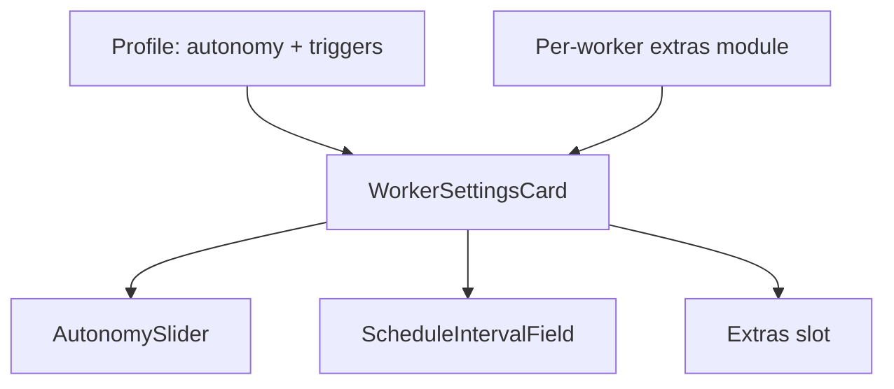

# AlertZero Worker settings POC

**Do not merge.** Sketch of how Worker settings can be shared, constrained per Worker, or unique — without a kitchen-sink schema or `if (worker.id === …)` in the common UI.

## Problems

1. **Shared settings** — e.g. a schedule interval used by more than one Worker, but not all (Triage has none; AD and Rule Tuning do).
2. **Same setting, different availability** — autonomy is one scale (`manual` / `assisted` / `supervised`) but AD only offers two of those levels.
3. **Unique settings** — AD has fields no other Worker has. At 5–10 Workers × 5–10 unique fields, optional siblings on one `WorkerSettings` object will not scale.

## Approach

Keep a **common shell**. Declare **shared capabilities** on a per-Worker profile. Put **unique fields** in a nested `extras` bag owned by that Worker.

The card never switches on `worker.id`. It renders from what the API projects.



## Case 1 — Shared settings / triggers

Triggers are independent. A Worker may allow manual, scheduled, or both. The interval is a user setting **only** when scheduled is allowed.

```ts
triggers: { manual: true }                                           // Triage
triggers: { scheduled: { defaultInterval: '24h' } }                   // AD
triggers: { manual: true, scheduled: { defaultInterval: '2h' } }      // Rule Tuning
```

`scheduleInterval` on the payload ⇒ show the interval control. Presence means “scheduled is allowed”, not “manual is not”.

## Case 2 — Shared setting, per-Worker allow-list

One enum, one meaning. Availability is per Worker.

```ts
autonomy: { allowed: ['manual', 'supervised'], default: 'manual' }  // AD
autonomy: { allowed: ['manual', 'assisted', 'supervised'], default: 'manual' }  // others
```

Projected as `allowedAutonomyLevels`. The slider takes that list. A PATCH of `assisted` on AD is rejected.

## Case 3 — Unique settings

Do not add AD fields to the top-level profile or `WorkerSettings`. Nest them:

```ts
WorkerSettings {
  autonomy
  allowedAutonomyLevels
  allowedTriggers
  scheduleInterval?          // shared capability
  extras?: { candidateLimit } // unique; omitted when the Worker has none
}
```

| Layer | Owns |
| --- | --- |
| Common factory / card | Autonomy, triggers, extras **slot** |
| `workers/extras/attack_discovery.ts` | AD defaults, parse, patch, unknown-key reject |
| `worker_settings_extras/attack_discovery.tsx` | AD-only UI |

The next unique Worker is one extras module + one registry entry. The common factory does not name the new fields.

## What this is not

- Not a generic form renderer (descriptors later, if most extras are standard controls).
- Not a per-Worker settings page — one card, one slot.
- Not production-ready (tests not updated; draft / don’t merge).
