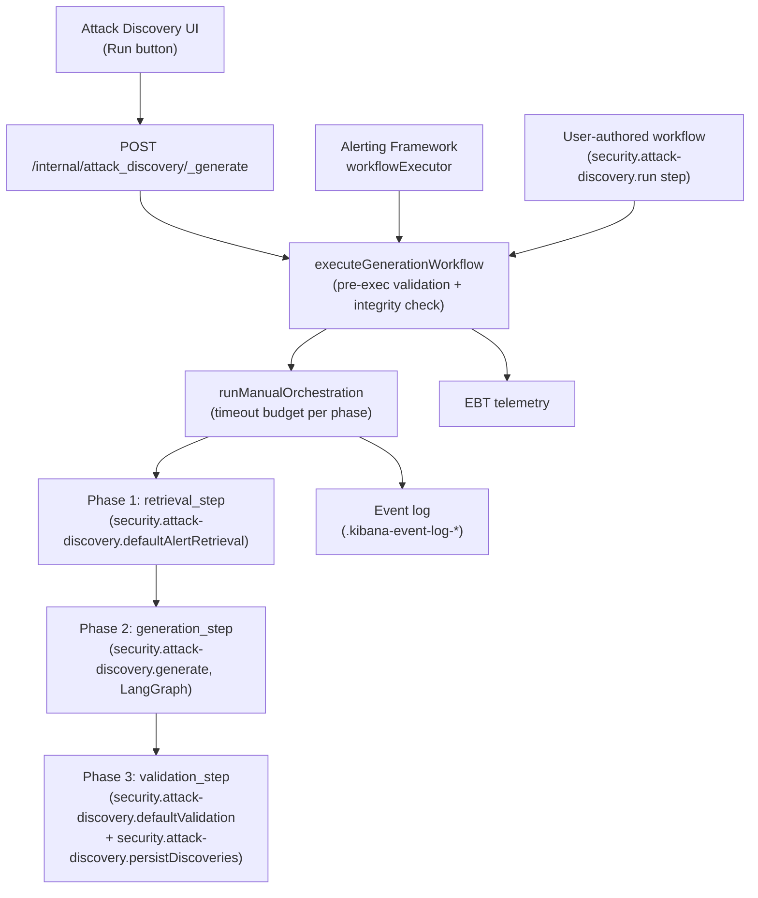
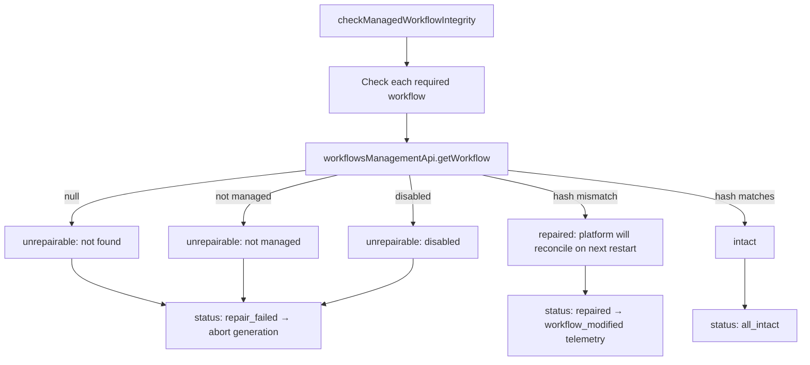
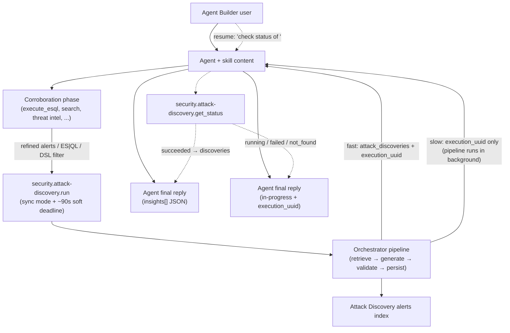
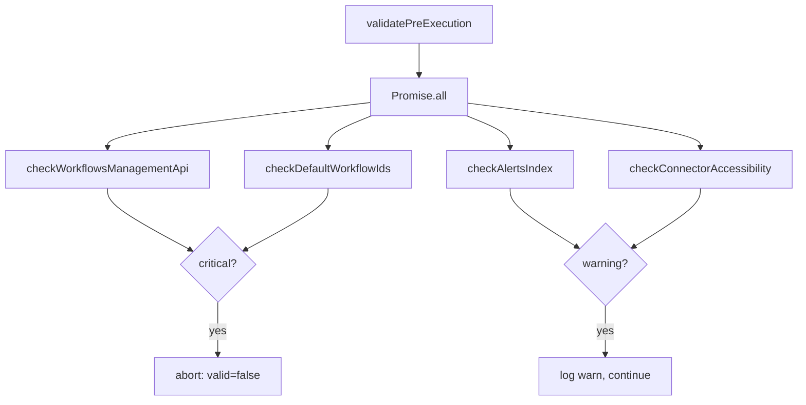
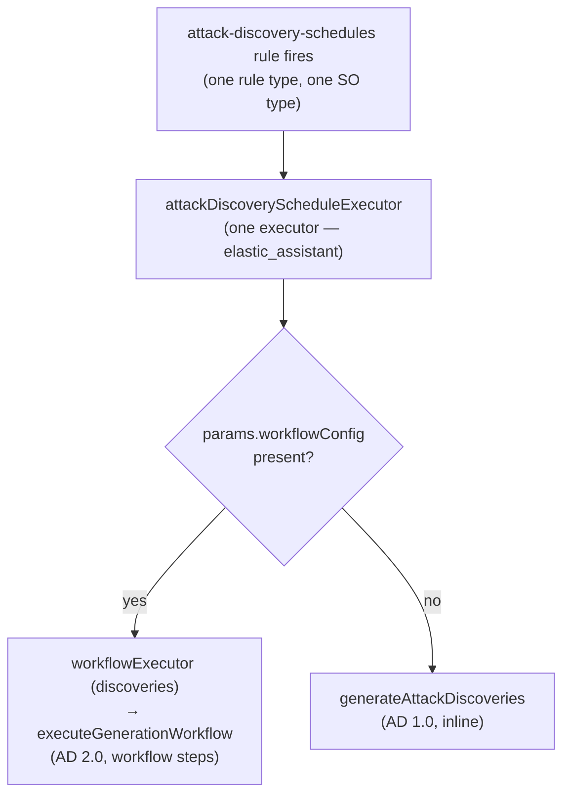
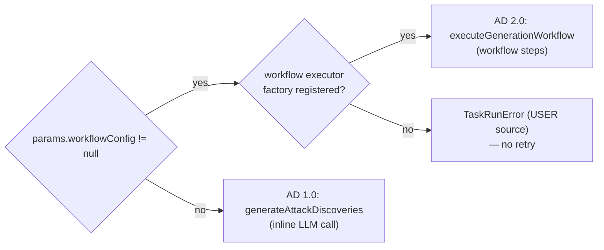

# Discoveries Plugin

Attack Discovery 2.0 decouples the generation pipeline from the monolithic `elastic_assistant` endpoint and runs each phase (alert retrieval → generation → validation → persistence) as a Kibana Workflows step. The **Alerting Framework** owns scheduling, alert persistence, and action execution (with full throttling/frequency support); the **Workflows engine** owns only the generation pipeline.

This plugin lets users:

- Optimize the alert context provided to Attack Discovery via user-defined workflows and agents.
- Post-process generations via workflows and agents to enrich, validate, and reject discoveries before they are promoted to attacks.

This README is the architecture reference for AD 2.0. Read top-to-bottom for the full picture, or jump to any section via the TOC below.

## Table of contents

1. [Status & Feature Flag](#status--feature-flag)
2. [Quick start for new contributors](#quick-start-for-new-contributors)
3. [Overview](#overview)
4. [System workflow definitions](#system-workflow-definitions)
5. [Workflow Steps reference](#workflow-steps-reference)
6. [Anonymization Boundary](#anonymization-boundary)
7. [Modes of Execution](#modes-of-execution)
8. [Internal APIs](#internal-apis)
9. [Using the `security.attack-discovery.run` Step](#using-the-securityattack-discoveryrun-step)
10. [Attack Discovery Generator Skill](#attack-discovery-generator-skill)
11. [Event Logging](#event-logging)
12. [Observability & Debugging](#observability--debugging)
13. [Scheduling](#scheduling)
14. [Schedules & the feature flag](#schedules--the-feature-flag)
15. [Dependencies](#dependencies)
16. [Testing](#testing)
17. [Architecture Decision Records (appendix)](#architecture-decision-records-appendix)
18. [Glossary](#glossary)

## Status & Feature Flag

The whole feature is gated behind `securitySolution.attackDiscoveryWorkflowsEnabled` (default **OFF**). With the flag OFF every PR preserves existing behavior exactly — the public `elastic_assistant` API surface is unchanged, no new routes accept requests, no workflow steps register, and no managed-workflow integrity check or pre-execution validation runs.

Enable in `kibana.dev.yml`:

```yaml
feature_flags.overrides:
  securitySolution.attackDiscoveryWorkflowsEnabled: true
```

## Quick start for new contributors

### 1. Enable the feature flag

See the YAML block above.

### 2. Where the code lives

| Surface | Path |
|---|---|
| This plugin | [`x-pack/solutions/security/plugins/discoveries/`](.) |
| Shared server logic (LangGraph, event logging, telemetry definitions) | [`@kbn/discoveries`](../../packages/kbn-discoveries/) |
| OpenAPI schemas + generated types | [`@kbn/discoveries-schemas`](../../packages/kbn-discoveries-schemas/) |
| System workflow definitions (the live source-of-truth — five inline YAML strings) | [`@kbn/workflows/managed/definitions/discoveries.ts`](../../../../../src/platform/packages/shared/kbn-workflows/managed/definitions/discoveries.ts) |
| Plugin-side managed-workflow install + integrity check | [`server/managed_workflows/`](server/managed_workflows/) |
| Workflow step common definitions | [`common/step_types/`](common/step_types/) |
| Workflow step server handlers | [`server/workflows/steps/`](server/workflows/steps/) |
| Step registration | [`server/workflows/register_workflow_steps.ts`](server/workflows/register_workflow_steps.ts) |
| UI hook (frontend entry to `_generate`) | [`use_attack_discovery`](../security_solution/public/attack_discovery/pages/use_attack_discovery/) |

### 3. Run the example workflow

The **Security - Attack discovery - Run example** workflow is the recommended way to desk-test the pipeline end-to-end.

1. Start Kibana and Elasticsearch (`yarn es snapshot --license trial`, then `yarn start`).
2. Navigate to **http://localhost:5601/app/workflows**.
3. Managed workflows are hidden from the list view by default — go directly to:
   `http://localhost:5601/app/workflows/system-attack-discovery-run-example`
4. Click **Test Workflow** and choose the **Manual** trigger.
5. Paste a JSON body. All inputs are optional — the minimum runs with the configured default AI connector:
   ```json
   {}
   ```
   To target a specific connector, add `connector_id` to override the configured default:
   ```json
   { "connector_id": "<your-connector-id>" }
   ```
6. Click **Run** and inspect the per-step inputs/outputs.

To list available connector IDs:

```bash
curl -s -u elastic:changeme 'http://localhost:5601/api/actions/connectors' | jq '.[] | {id, name}'
```

More invocation patterns are documented in [Using the `security.attack-discovery.run` Step](#using-the-securityattack-discoveryrun-step).

## Overview

Attack Discovery 2.0 has three entry paths, all of which converge on the same generation function (`executeGenerationWorkflow`):

1. **Ad hoc (UI)** — the user clicks **Run** in the Attack Discovery UI. The frontend posts to `POST /internal/attack_discovery/_generate`.
2. **Scheduled** — an Alerting Framework rule fires on its configured cadence. The registered `workflowExecutor` rule executor invokes `executeGenerationWorkflow` directly. (New to AD 2.0 and easy to misread — see [What `Alerting Framework workflowExecutor` means](#what-alerting-framework-workflowexecutor-means).)
3. **User-authored workflow** — a workflow includes `security.attack-discovery.run` as a step. The step handler calls `executeGenerationWorkflow` internally.

`executeGenerationWorkflow` (in [`@kbn/discoveries`](../../packages/kbn-discoveries/impl/attack_discovery/generation/execute_generation_workflow.ts)) is the single shared entry point. It runs **pre-execution validation** and a **managed-workflow integrity check**, then delegates to [`runManualOrchestration`](../../packages/kbn-discoveries/impl/attack_discovery/generation/run_manual_orchestration/index.ts), which chains the three phases with timeout budgets.



### Packages and plugins

```
┌────────────────────────────────────────────────────────────────────┐
│  @kbn/discoveries Package (server-only)                            │
│  - LangGraph execution logic (graphs, orchestration)               │
│  - executeGenerationWorkflow + runManualOrchestration              │
│  - Event logging utilities (shared with elastic_assistant)         │
│  - Hallucination detection, anonymization, schedule transforms     │
│  - Telemetry event definitions (EBT)                               │
└────────────────────────────────────────────────────────────────────┘
┌────────────────────────────────────────────────────────────────────┐
│  @kbn/discoveries-schemas Package (shared-common)                  │
│  - OpenAPI schemas (.schema.yaml)                                  │
│  - Generated TypeScript types and Zod (v3) validators (.gen.ts)    │
└────────────────────────────────────────────────────────────────────┘
                               │
                               ▼
┌──────────────────────────────────────────────────────────────────────┐
│  discoveries Plugin                                                  │
│  ┌────────────────────────────────────────────────────────────────┐  │
│  │  Internal APIs (FF-gated):                                     │  │
│  │  - POST /internal/attack_discovery/_generate                   │  │
│  │  - Pipeline data + tracking routes                             │  │
│  │  - Default ES|QL query route                                   │  │
│  │  - Schedule CRUD (create/find/get/update/delete/enable/disable)│  │
│  └────────────────────────────────────────────────────────────────┘  │
│  ┌────────────────────────────────────────────────────────────────┐  │
│  │  Workflow Step handlers (5):                                   │  │
│  │  - security.attack-discovery.defaultAlertRetrieval             │  │
│  │  - security.attack-discovery.generate (with event logging)     │  │
│  │  - security.attack-discovery.defaultValidation                 │  │
│  │  - security.attack-discovery.persistDiscoveries                │  │
│  │  - security.attack-discovery.run (full pipeline in one step)   │  │
│  └────────────────────────────────────────────────────────────────┘  │
│  ┌────────────────────────────────────────────────────────────────┐  │
│  │  Managed workflows wiring:                                     │  │
│  │  - installStatic: installs the 5 system-… workflows globally   │  │
│  │  - checkManagedWorkflowIntegrity: pre-execution introspection  │  │
│  └────────────────────────────────────────────────────────────────┘  │
└──────────────────────────────────────────────────────────────────────┘
```

The discoveries plugin owns the **step handlers**; the **workflow definitions** that consume those steps are platform-managed and live in `@kbn/workflows`. See [System workflow definitions](#system-workflow-definitions).

### Why this architecture (vs. AD 1.0)

The current Attack Discovery 1.0 pipeline is a monolithic public-API route ([POST /api/attack_discovery/_generate](https://www.elastic.co/docs/api/doc/kibana/operation/operation-postattackdiscoverygenerate)) that retrieves alerts, invokes the LLM, validates results, and writes alerts inline. AD 2.0 decomposes that into Kibana Workflow steps so that:

- Each phase is **observable** in the Workflows app (per-step inputs/outputs/timing).
- Each phase is **customizable** by pointing at a different workflow ID.
- Steps are **composable** as reusable building blocks in user-authored workflows.
- The ad-hoc, scheduled, and user-workflow execution paths share the **same code path**.

### Persistence model: the persist step is the single authority

The `security.attack-discovery.persistDiscoveries` step is the single persistence authority across all three paths. It echoes the discoveries it was handed into a `discoveries_to_persist` output. **Ad-hoc and the `run` step own their own I/O via the step** (the step writes to the ad-hoc index). **Scheduled rules invoke the step only for that handover** — the step does no I/O for scheduled runs; it hands the discoveries up via `discoveries_to_persist`, and the scheduled executor reports exactly that handover to the Alerting Framework (which owns scheduled persistence). If a validation workflow never invokes the persist step — or hands it an empty array — nothing is persisted (a noop, logged at WARN). Details: [Persist-step handover](#persist-step-handover-legacy-reporting-vs-workflow-handover) and the [requirement-to-test map](#requirement-to-test-map-persist-step-handover).

## System workflow definitions

The pipeline executes five system-managed workflows. All five are declared as **inline YAML strings** in a single TS file ([`kbn-workflows/managed/definitions/discoveries.ts`](../../../../../src/platform/packages/shared/kbn-workflows/managed/definitions/discoveries.ts)) — that file is the **live source-of-truth**. Do not edit the `server/workflows/definitions/*.workflow.yaml` files in this plugin; they are legacy artifacts and are not loaded at runtime.

| System workflow ID | Purpose | Exported constant (same file) |
|---|---|---|
| `system-attack-discovery-alert-retrieval` | Default DSL/ES\|QL alert retrieval phase | `ATTACK_DISCOVERY_ALERT_RETRIEVAL_WORKFLOW` |
| `system-attack-discovery-generation` | LangGraph generation phase | `ATTACK_DISCOVERY_GENERATION_WORKFLOW` |
| `system-attack-discovery-validate` | Default validation (hallucination detection) + persistence | `ATTACK_DISCOVERY_VALIDATE_WORKFLOW` |
| `system-attack-discovery-run-example` *(example)* | Ready-made `security.attack-discovery.run` template | `ATTACK_DISCOVERY_RUN_EXAMPLE_WORKFLOW` |
| `system-attack-discovery-custom-validation-example` *(example)* | Custom validation workflow template | `ATTACK_DISCOVERY_CUSTOM_VALIDATION_EXAMPLE_WORKFLOW` |

All five carry the same management metadata:

```ts
management: {
  enablement: 'enforced',   // cannot be disabled by users
  lifecycle: 'static',      // no user edits
  versionStrategy: 'auto',  // platform upgrades to latest version on restart
}
```

Install is invoked by the plugin via [`installStatic`](server/managed_workflows/install_static.ts), which loops over `AD_WORKFLOW_IDS` and asks `workflowsExtensions.initManagedWorkflowsClient('discoveries')` to install each one into the global workflow space. Reconciliation, version upgrades, and orphan cleanup are owned by the platform's managed-workflow framework — not by this plugin.

**Navigation note.** Managed workflows are hidden from the Workflows UI list view by default. Navigate directly by URL, e.g.:

- `http://localhost:5601/app/workflows/system-attack-discovery-generation`
- `http://localhost:5601/app/workflows/system-attack-discovery-run-example`

The AD-side [`checkManagedWorkflowIntegrity`](server/managed_workflows/check_managed_workflow_integrity.ts) introspects platform state on every generation request and reports diagnostic outcomes — it does **not** perform restoration. A hash mismatch means the platform will reconcile on the next restart.



| Outcome | Meaning | Pipeline |
|---------|---------|----------|
| `all_intact` | All required managed workflows are present, enabled, and current | Continues |
| `repaired` | One or more workflows have drifted; `workflow_modified` telemetry emitted; platform will reconcile on next restart | Continues |
| `repair_failed` | One or more required managed workflows are missing, unmanaged, or disabled | **Aborted** — `generation-failed` event written with error reason |

## Workflow Steps reference

The plugin registers five workflow step handlers (see [`server/workflows/register_workflow_steps.ts`](server/workflows/register_workflow_steps.ts)). Per-step contracts (input/output schemas, anonymization flow, failure modes, "adding a new step" checklist) are in the [workflow steps README](server/workflows/steps/README.md).

| Step Type ID | Purpose | Inputs (summary) | Outputs (summary) |
|---|---|---|---|
| `security.attack-discovery.defaultAlertRetrieval` | Retrieves and anonymizes alerts (DSL or ES\|QL) | `alertsIndexPattern`, `anonymizationFields`, `apiConfig`, `filter`, `size`, `start`/`end` | `alerts`, `anonymizedAlerts`, `replacements`, `apiConfig`, `connectorName`, `alertsContextCount` |
| `security.attack-discovery.generate` | Generates attack discoveries from anonymized alerts via LangGraph | `alerts` (string[]), `apiConfig`, `replacements`, `size` | `attack_discoveries`, `execution_uuid`, `replacements` |
| `security.attack-discovery.defaultValidation` | Hallucination detection + deduplication | `attackDiscoveries`, `anonymizedAlerts`, `apiConfig`, `connectorName`, `generationUuid`, `alertsContextCount`, `replacements` | `validated_discoveries`, `filtered_count`, `filter_reason` |
| `security.attack-discovery.persistDiscoveries` | Persists validated discoveries to the AD data store | (as above) | `persisted_discoveries`, `duplicates_dropped_count`, `discoveries_to_persist` (echo of input — the handover) |
| `security.attack-discovery.run` | Runs the full pipeline (retrieve → generate → validate → persist) as a single step | `connector_id` (optional — defaults to `genAiSettings:defaultAIConnector` → inference fallback), `alert_retrieval_mode`, `mode`, `alerts` (optional), `size`, `start`/`end`, `filter`, `esql_query` | `attack_discoveries`, `execution_uuid`, `alerts_context_count`, `discovery_count` |

Common (cross-runtime) step definitions live in [`common/step_types/`](common/step_types/); server-side handlers live in [`server/workflows/steps/`](server/workflows/steps/).

All step schemas are defined inline using **`@kbn/zod/v4`** per the Workflows platform requirement. Auto-generated v3 schemas (used for REST route validation) **must never** be cast to v4 — `v4` enums carry a `.values` property that `v3` lacks, so a runtime cast surfaces as `TypeError: Cannot read properties of undefined (reading 'values')` in the Workflows UI.

## Anonymization Boundary

```mermaid
flowchart LR
  ES["Elasticsearch<br/>raw alerts"] --> RET["defaultAlertRetrieval<br/>step"]
  RET -->|anonymized string[]| GEN["generate step<br/>(LangGraph)"]
  RET -->|replacements map| RM[(replacements<br/>map)]
  GEN --> VAL["defaultValidation"]
  VAL --> PER["persistDiscoveries"]
  RM -.->|de-anonymize<br/>on display only| UI["Attack Discovery UI"]
  GEN -.->|excluded| RUN["security.attack-discovery.run<br/>output"]
```

The anonymization boundary sits at the **alert retrieval** step. Everything upstream (raw Elasticsearch alerts) is real data; everything downstream operates on anonymized strings. The `replacements` map is the only bridge between the two worlds — and it is **deliberately excluded by the output schema** of `security.attack-discovery.run` so user-authored workflows cannot inadvertently log or forward the de-anonymization key to external systems.

The `generate` step's input contract is `alerts: string[]` (anonymized strings), not structured alert objects — making it impossible to accidentally pass raw alert objects to the LLM.

The `defaultAlertRetrieval` step ensures the `_id` field is always present in the anonymization configuration. Downstream steps use real alert IDs for hallucination detection — IDs are allowed but not anonymized.

## Modes of Execution

All three modes converge on `executeGenerationWorkflow` and share the same step pipeline. Differences are only in how the call is initiated and how results are returned.

### 1. Ad Hoc (Interactive UI)

The user clicks **Run** in the Attack Discovery UI. The [`useAttackDiscovery`](../security_solution/public/attack_discovery/pages/use_attack_discovery/) hook calls `POST /internal/attack_discovery/_generate`, which fires the pipeline asynchronously and returns an `execution_uuid`. Results appear in the UI as they complete via the generations polling API. See [Internal APIs](#internal-apis).

### 2. Scheduled (Alerting Framework `workflowExecutor`)

An Alerting Framework rule fires on a configured cadence (e.g., every hour). The `workflowExecutor` registered with the Alerting Framework ([`server/lib/schedules/workflow_executor/`](server/lib/schedules/workflow_executor/)) invokes the same `executeGenerationWorkflow` function as the ad-hoc path. Full throttling and frequency controls are enforced by the Alerting Framework. Schedule CRUD is exposed through the internal Schedule APIs, and tag-based isolation keeps internal-API schedules separate from legacy public-API schedules. See [Scheduling](#scheduling).

### 3. The `security.attack-discovery.run` Step (User-Authored Workflows)

A user-authored workflow includes `security.attack-discovery.run` as a step. This is the composability path: the step can receive pre-retrieved alerts from upstream steps, customize retrieval mode, and return discoveries to downstream steps. The full pipeline (retrieve → generate → validate → persist) runs inside the step in either sync mode (returns discoveries inline) or async mode (returns `execution_uuid` immediately).

See [Using the `security.attack-discovery.run` Step](#using-the-securityattack-discoveryrun-step) for a full guide.

## Internal APIs

All internal routes are FF-gated (`assertWorkflowsEnabled`) and use **`asCurrentUser` only** — never `asInternalUser`. Privilege escalation is impossible because every ES query inherits the authenticated request's permissions.

### POST /internal/attack_discovery/_generate

Kicks off the orchestrated pipeline (retrieve → generate → validate → persist) asynchronously and returns an execution UUID for tracking. Returns 404 when `securitySolution.attackDiscoveryWorkflowsEnabled` is OFF.

**Request:**
```typescript
{
  alerts_index_pattern: string,
  api_config: ApiConfig,
  filter?: Record<string, unknown>,
  start?: string,
  end?: string,
  replacements?: Replacements,
  size?: number,
  workflow_config?: {
    default_alert_retrieval_mode?: 'custom_query' | 'disabled' | 'esql',
    alert_retrieval_workflow_ids?: string[],
    validation_workflow_id?: string
  }
}
```

**Response:**
```typescript
{ execution_uuid: string }
```

### GET /internal/attack_discovery/attack_discovery/queries/esql/default

Returns the space-aware default ES|QL query for alert retrieval — the same query pre-populated in the Attack Discovery settings flyout when ES|QL retrieval mode is selected. The query includes a `KEEP` clause scoped to the anonymization fields active in the current space.

**Response:**
```typescript
{ query: string }
```

### GET /internal/attack_discovery/executions/{execution_id}/tracking

Returns the workflow execution tracking data for a given `execution_id` — the IDs of the alert retrieval, generation, and validation workflow runs logged by the orchestrator. Used by the UI to link from an execution UUID to specific workflow run IDs for deep-linking into the Workflows app. Returns `404` when the execution has not yet been indexed into the event log.

**Path parameters:** `execution_id: string`

**Response:**
```typescript
{
  alert_retrieval: Array<{ workflow_id: string; workflow_run_id: string }> | null,
  generation: { workflow_id: string; workflow_run_id: string } | null,
  validation: { workflow_id: string; workflow_run_id: string } | null
}
```

### GET /internal/attack_discovery/workflow/{workflow_id}/execution/{execution_id}

Returns the full pipeline data for a generation run: alert retrieval results, combined alerts, generation output, validated discoveries, and per-workflow execution tracking. This is the primary data source for the Execution Details flyout in the Attack Discovery UI.

The optional `generation_workflow_run_id` query parameter is a client-supplied fallback for early polling before the event-log entry for the generation phase has been indexed — the client provides the run ID it received from `POST /internal/attack_discovery/_generate` and the server uses it to fetch generation data directly.

**Path parameters:**
```
workflow_id: string      // The orchestrator workflow ID
execution_id: string     // The execution UUID from _generate
```

**Query parameters:**
```
generation_workflow_run_id?: string  // Client fallback run ID for early polling
```

**Response:**
```typescript
{
  alert_retrieval: Array<{
    alerts: string[],
    alerts_context_count: number | null,
    extraction_strategy: string,
    workflow_id: string,
    workflow_run_id: string
  }> | null,
  combined_alerts: { alerts: string[]; alerts_context_count: number } | null,
  diagnostics_context?: DiagnosticsContext,
  generation: PipelineGenerationData | null,
  validated_discoveries: AttackDiscoveryApiAlert[] | null,
  workflow_executions_tracking: {
    alert_retrieval: Array<{ workflow_id: string; workflow_run_id: string }> | null,
    generation: { workflow_id: string; workflow_run_id: string } | null,
    validation: { workflow_id: string; workflow_run_id: string } | null
  }
}
```

### Schedule CRUD routes

The full schedule API surface is documented under [Scheduling → Schedule-Related Internal APIs](#schedule-related-internal-apis).

## Using the `security.attack-discovery.run` Step

The `security.attack-discovery.run` step is the recommended entry point for triggering Attack Discovery from a user-authored workflow. **All inputs are optional** — every field has a sensible default, including the LLM connector.

The **Security - Attack discovery - Run example** workflow (`system-attack-discovery-run-example`, declared inline in [`kbn-workflows/managed/definitions/discoveries.ts`](../../../../../src/platform/packages/shared/kbn-workflows/managed/definitions/discoveries.ts)) is a ready-made workflow that exposes all inputs and is ideal for desk-testing or as a starting template.

### Connector resolution

`connector_id` is optional. When it is omitted, the step resolves the connector server-side in this order:

1. **`genAiSettings:defaultAIConnector`** — the configured default AI connector (read via request-scoped `uiSettings`). The `NO_DEFAULT_CONNECTOR` sentinel and empty values are treated as unset.
2. **`inference.getDefaultConnector`** — the platform default inference connector, used as a fallback when no default AI connector is configured.

If neither source yields a connector, the step fails with a clear error asking the caller to configure a default or provide `connector_id`. Workflow-engine surfaces (the run step and the example workflow) have no agent execution context, so they always use this server-side resolution. Pass an explicit `connector_id` to override the configured default. The examples below include `connector_id` to show the override; drop it to use the configured default.

### Quick Start (Minimal Input)

Retrieve the 100 most recent security alerts and generate discoveries using all defaults (including the configured default AI connector):

```json
{}
```

- `connector_id` defaults to the configured default AI connector (`genAiSettings:defaultAIConnector` → inference fallback)
- `alert_retrieval_mode` defaults to `custom_query`
- `size` defaults to `100`
- `mode` defaults to `sync`
- Response includes `attack_discoveries` inline

### Retrieval Modes

#### `custom_query` — DSL query with overrides (sync)

Scope retrieval to a specific time range and alert severity:

```json
{
  "connector_id": "<your-connector-id>",
  "alert_retrieval_mode": "custom_query",
  "size": 25,
  "start": "now-72h",
  "end": "now",
  "filter": {
    "term": { "kibana.alert.severity": "critical" }
  }
}
```

#### `esql` — ES|QL query (sync)

```json
{
  "connector_id": "<your-connector-id>",
  "alert_retrieval_mode": "esql",
  "esql_query": "FROM .alerts-security.alerts-default | WHERE kibana.alert.severity == \"critical\" | LIMIT 50"
}
```

#### ES|QL + custom retrieval workflow (sync)

Merge ES|QL results with output from a custom alert retrieval workflow (parallel execution):

```json
{
  "connector_id": "<your-connector-id>",
  "alert_retrieval_mode": "esql",
  "esql_query": "FROM .alerts-security.alerts-default | WHERE kibana.alert.severity == \"high\" | LIMIT 30",
  "alert_retrieval_workflow_ids": ["<your-retrieval-workflow-id>"]
}
```

Results from both sources are merged before generation.

#### `provided` — Pre-retrieved alerts (auto-detected)

Pass alerts directly via the `alerts` input. The step **auto-detects** that alerts are provided and sets `alert_retrieval_mode` to `provided`, skipping all retrieval:

```json
{
  "connector_id": "<your-connector-id>",
  "alerts": [
    "Alert 1: Unusual process execution on host web-prod-01. Process: cmd.exe spawned by iis.exe.",
    "Alert 2: Lateral movement detected. User admin logged in from 10.0.0.5 to 10.0.0.23 via PsExec.",
    "Alert 3: Privilege escalation attempt. User admin added to Domain Admins group."
  ]
}
```

This is the **primary composability pattern**: an upstream workflow step populates `alerts`; the `security.attack-discovery.run` step generates discoveries without re-querying Elasticsearch.

In a workflow YAML:

```yaml
- name: run_attack_discovery
  type: security.attack-discovery.run
  with:
    alerts: ${{ steps.my_retrieval_step.output.alerts }}
    connector_id: ${{ inputs.connector_id }}
```

#### `custom_only` — Custom retrieval workflows only

Skips the built-in retrieval and uses **only** results from `alert_retrieval_workflow_ids`.

### Async Mode

#### Async, all defaults

Fire the pipeline without waiting. Returns `execution_uuid` immediately; discoveries are written to Elasticsearch in the background:

```json
{
  "connector_id": "<your-connector-id>",
  "mode": "async"
}
```

- Response body contains `execution_uuid` (no `attack_discoveries` field)
- Check results via the Attack Discovery UI or `GET /api/attack_discovery/generations`

#### Async with retrieval overrides

```json
{
  "connector_id": "<your-connector-id>",
  "mode": "async",
  "alert_retrieval_mode": "custom_query",
  "size": 50,
  "start": "now-48h",
  "end": "now"
}
```

### Security note on `security.attack-discovery.run` output

The `replacements` map is **excluded by the step's output schema** — not just by the handler. A workflow that invokes `run` receives discoveries but cannot access the de-anonymization key. This prevents user-authored workflows from inadvertently logging or forwarding the replacements to external systems.

### Troubleshooting

| Problem | Solution |
|---------|----------|
| Workflow not found at `/app/workflows/system-attack-discovery-run-example` | Restart Kibana to trigger platform reconciliation of managed workflows |
| `connector_id` not found | Run the connector list `curl` command in [Quick start](#3-run-the-example-workflow) |
| `provided` mode not auto-detected | Confirm `alerts` is a non-empty array of strings; explicit `alert_retrieval_mode` overrides auto-detection |
| Async results not appearing | Wait 30–60 seconds; check the Attack Discovery UI; search logs for the `execution_uuid` |

## Attack Discovery Generator Skill

`attack-discovery-generator` is one of three Agent Builder skills registered by this plugin (alongside `alert-retrieval-builder` and `workflow-troubleshooting`). It is the analyst-facing front door to AD 2.0: rather than asking the user to compose a workflow or call `_generate` directly, the skill lets the agent gather and corroborate evidence with whatever tools it has, then delegates the generation pipeline to `security.attack-discovery.run`.

Definition: [`server/skills/attack_discovery_generator_skill.ts`](server/skills/attack_discovery_generator_skill.ts). Registration: [`server/skills/register_skills.ts`](server/skills/register_skills.ts).

### What it does

The skill registers a single Agent Builder skill that supports two modes:

1. **Loads the analyst prompt** — same "world-class cyber security analyst" framing used by the LangGraph generate node, plus stricter rules layered on top: a Validation Standard ("when in doubt, discard"), a default-to-split independent-evaluation rule, and Entity Correlation Hygiene guidance that calls out service accounts, shared infrastructure, and same-tactic-different-host coincidence as **not** sufficient correlation evidence.
2. **Tells the agent to corroborate before deciding** — the skill content intentionally does not enumerate which tools to use. It instructs the agent to *enumerate the tools available in this conversation* and call those that gather supporting evidence (threat hunting, threat intelligence, entity context, knowledge base, etc.). The skill exposes a small set of platform tools (`execute_esql`, `generate_esql`, `search`, `get_document_by_id`, `get_index_mapping`, `get_workflow_execution_status`) plus the inline `get_default_esql_query` and `security.attack-discovery.get_status` tools, but other tools active in the session are also fair game.
3. **Mode A — Generate**: once the agent has corroborated, it invokes `security.attack-discovery.run` per [ADR-012](#adr-012--agent-builder-uses-run-in-sync-mode-with-a-soft-deadline). The pipeline handles anonymization, LangGraph generation, hallucination detection, validation, and persistence to the Attack Discovery alerts index. Sync mode races a ~90s soft deadline against the 120s Agent Builder workflow-tool ceiling — fast generations return discoveries inline; slower generations return only an `execution_uuid` and the agent hands off cleanly with an in-progress acknowledgement.
4. **Mode B — Status-only**: when the user supplies an `execution_uuid` (or asks about a previously-started generation), the agent calls `security.attack-discovery.get_status` and emits the insights JSON if the run has succeeded, reports progress with the active phase if still running, or reports the failure cleanly. No new generation is started.
5. **Persists discoveries through the shared pipeline** — discoveries are written through the same `defaultValidation` + `persistDiscoveries` chain used by every other execution path (so they appear in the AD UI and via `GET /api/attack_discovery/generations`), regardless of which mode emitted them in the agent reply.

### How it works



#### Mode-selection decision tree (in order of preference)

The skill teaches the agent to pick the `security.attack-discovery.run` mode that matches the evidence it just gathered, without re-doing retrieval inside the agent:

1. Agent gathered specific candidate alerts during corroboration (via ES|QL, search, or threat hunting) → `provided` mode (`alerts: string[]`). This is the preferred path: the agent controls exactly which evidence goes into the pipeline.
2. Agent narrowed retrieval into an ES|QL filter → `esql` mode (`esql_query`). Combined with `alert_retrieval_workflow_ids` when the user has custom retrieval workflows to merge in parallel.
3. User explicitly asked to invoke a custom retrieval workflow with no built-in query → `custom_only` mode with `alert_retrieval_workflow_ids`.
4. No alerts gathered and no ES|QL query → `custom_query` mode with **explicit** `size`, `start`, and `end` values. The skill explicitly forbids omitting these and relying on server defaults.

⛔ The skill explicitly forbids bare connector-ID-only invocations (`{ "connector_id": "..." }`) because they rely on server-side defaults that do not reflect the investigation context.

Sync mode is the default and the only mode the skill actively instructs the agent to use, per [ADR-012](#adr-012--agent-builder-uses-run-in-sync-mode-with-a-soft-deadline). The run step's executor races the pipeline against `ATTACK_DISCOVERY_RUN_SOFT_DEADLINE_MS` (90s) so the wrapping Agent Builder workflow tool — which itself caps at 120s — always gets a clean response well inside its window. When the soft deadline wins, only `execution_uuid` is returned; the pipeline keeps running in the background and the agent resumes via `security.attack-discovery.get_status` when the user asks for status.

#### Connector resolution

The Agent Builder tool resolves the LLM connector from the **agent's selected model**, not from a server-side platform default. When `connector_id` is omitted, the tool awaits `context.modelProvider.getDefaultModel()` and uses the resulting `connector.connectorId` — the full-fidelity connector the agent execution already selected (per-request override → `genAiSettings` default → fallback), so no Agent Builder context-shape change is needed. Passing `connector_id` overrides the agent's selected connector. If neither yields a connector, the tool returns the existing "no LLM connector available" error result. This differs from the workflow-engine run step, which has no agent execution context and instead resolves `genAiSettings:defaultAIConnector` (with an inference fallback) server-side — see [Connector resolution](#connector-resolution) under the run-step guide.

#### Anonymization boundary

The skill's corroboration tools operate on **raw** data with the user's RBAC. Anything passed into `security.attack-discovery.run` is anonymized inside the pipeline before the LLM sees it. The skill content makes this explicit so the agent does not pass real (un-anonymized) values into `provided` mode — that input is contractually `string[]` of *anonymized* alert text. See [Anonymization Boundary](#anonymization-boundary).

#### Output handling

The skill prompt branches on which outcome is in hand:

- **Inline discoveries** (Mode A fast path, or Mode B `status: succeeded`): the agent acknowledges the run completed (referencing the `execution_uuid` so the operator can find the execution in the Workflows app and the AD UI), emits the insights JSON envelope inline, provides a per-chain narrative, and reports "no chains met the validation standard" rather than fabricating chains when the pipeline returned none.
  ```json
  { "insights": [ { "title": "...", "alertIds": [...], "detailsMarkdown": "...", "summaryMarkdown": "...", "entitySummaryMarkdown": "...", "mitreAttackTactics": [...] } ] }
  ```
- **In-progress** (Mode A slow path, or Mode B `status: running`): the agent does **not** emit the insights JSON. It writes a short status response with the `execution_uuid`, the active pipeline phase (when known), and a pointer to `/app/security/attack_discovery`. It offers to check status again on the next user prompt.
- **Failure** (Mode B `status: failed` or `not_found`): the agent does not emit the insights JSON. It reports the error message and phase (failed) or that the execution_uuid was not found.

### Core implementation decisions

#### 1. Reuse `attackDiscoveryPrompts` constants instead of duplicating

The skill imports `MITRE_ATTACK_TACTICS`, `SYNTAX`, `GOOD_SYNTAX_EXAMPLES`, `BAD_SYNTAX_EXAMPLES`, the `ATTACK_DISCOVERY_GENERATION_*` field-description strings, and `ATTACK_DISCOVERY_DEFAULT` / `ATTACK_DISCOVERY_REFINE` directly from [`server/lib/prompt/local_prompt_object/attack_discovery_prompts.ts`](server/lib/prompt/local_prompt_object/attack_discovery_prompts.ts). Three reasons it must, and one it doesn't:

| Concern | Why reuse is load-bearing |
|---------|---------------------------|
| **Inline `insights[]` output contract** | The user-supplied skill spec demands the agent emit JSON in the schema shape inside its final reply. That envelope is the AD discovery schema with the top-level key renamed to `insights`. The agent cannot conform without seeing the schema. |
| **Field-syntax preservation** | The pipeline-produced `details_markdown` contains `{{ host.name web-prod-01 }}` placeholders. Without the syntax block in the skill content, models will "helpfully" expand them to `web-prod-01` and break downstream UI rendering. The constants are a guard against well-intentioned mangling, not generation. |
| **Agent-side regeneration on the refinement path** | The skill's stricter rules (default-to-split, entity correlation hygiene, validation standard) can lead the agent to filter, split, or merge discoveries that the pipeline returned. Once it does that, it emits a chain the pipeline didn't produce — meaning the agent must conform to the schema, the MITRE enum, and the field syntax on its own. |
| *Not* load-bearing: per-field description strings (`ATTACK_DISCOVERY_GENERATION_DETAILS_MARKDOWN` etc.) | These were authored for the LangGraph generate prompt. The agent doesn't need them to forward what `run` returned. Embedding them in the skill content adds tokens without behavioral benefit, but keeps a single source of truth across both the LangGraph and the skill. The decision to keep them is alignment-driven, not necessity. |

The two reference-content blocks (`ATTACK_DISCOVERY_DEFAULT` and `ATTACK_DISCOVERY_REFINE`) are included as referenced content (not embedded directly in `content`) so the agent can consult them on demand for cross-reference, while the skill's stricter rules in `content` take precedence where the two differ.

#### 2. Delegate generation rather than reimplement it

The agent does **not** call the LLM connector directly to produce discoveries. It always routes generation through `security.attack-discovery.run`. This preserves four guarantees that the orchestrator owns:

- **Anonymization** at the alert-retrieval boundary — the agent never sees raw alert content reach the LLM.
- **Hallucination detection** in the validation step — the agent's discoveries pass the same filter as UI/scheduled runs.
- **Persistence** with `replacements` excluded by schema — see [ADR-010](#adr-010--anonymization-boundary-at-defaultalertretrieval) and [ADR-011](#adr-011--replacements-map-flow-per-step).
- **Event log + EBT telemetry** — agent-driven runs are observable through the same `executionUuid` plumbing as every other run.

If the skill called the LLM directly, none of these guarantees would hold and we would have a second, parallel generation path to maintain.

#### 3. Vague tool guidance instead of a hard-coded tool list

The skill content does not name specific threat-intel, hunting, or entity-context tool ids. It instructs the agent to *enumerate available tools* and *choose those relevant to evidence-gathering*. Two reasons:

- **Tools change at deployment time.** Customers register their own tools (MCP, custom connectors, knowledge bases). A hard-coded list would either miss them or block out unavailable defaults.
- **The validation standard is principle-driven, not procedure-driven.** The skill cares whether the chain has corroborated evidence, not which tool produced it.

The `getRegistryTools` list (six platform-core tools) is the minimum the skill *guarantees* will be available; the agent can use anything else it can see.

#### 4. Reuse the existing `get_default_esql_query` inline tool

Rather than create a new inline tool, the skill calls `getDefaultEsqlQueryTool()` — the same tool used by `alert-retrieval-builder`. This keeps anonymization-field-aware default ES|QL behavior consistent across both skills and avoids a second copy of the space-specific KEEP-clause logic.

#### 5. Registration alongside the existing two skills, FF-gated by the plugin

The skill is registered in [`register_skills.ts`](server/skills/register_skills.ts) unconditionally — the FF gate sits one level up at the plugin's setup site (the same gate that controls every other surface in this plugin). When the FF is OFF the discoveries plugin's setup short-circuits, so the skill is never registered and Agent Builder users do not see it.

### Verification

Skill-only Jest run:

```bash
node scripts/jest --coverage x-pack/solutions/security/plugins/discoveries/server/skills
```

Desk test (FF ON):

1. Open Agent Builder, start a conversation.
2. Prompt: *"Find any active attack chains in my environment and explain the evidence."*
3. Verify the agent calls corroboration tools (e.g., `execute_esql` against `.alerts-security.alerts-default`) before invoking `security.attack-discovery.run`.
4. Verify it invokes `security.attack-discovery.run` in sync mode and receives `attack_discoveries` inline.
5. Verify the agent's final reply contains an `insights[]` JSON envelope and a narrative.
6. Open the Attack Discovery UI and confirm the persisted alerts appear (full pipeline ran).
7. `grep "Orchestration summary" /tmp/kibana.log` to confirm the same `executionUuid` was logged.

## Event Logging

The `security.attack-discovery.generate` workflow step (and the orchestrator's per-phase boundaries) emit events to the Elasticsearch event log for generation tracking. These events enable:

- **Generation status tracking** — monitor workflow execution progress
- **Metrics collection** — track alert counts, discovery counts, and duration
- **UI integration** — workflow-generated discoveries appear in the Attack Discovery UI
- **API integration** — events are queryable via `GET /api/attack_discovery/generations`

### Privacy contract

Event log entries carry only metadata: `execution_uuid`, phase, outcome, duration, sanitized error reason. Specifically, **no event field carries**: alert content, query content, user identifiers (beyond `user.name`), connector credentials.

**Caveat — `providedAlerts` legacy path.** [`writeAttackDiscoveryEvent`](../../packages/kbn-discoveries/impl/attack_discovery/persistence/event_logging/write_attack_discovery_event.ts) currently includes `providedAlerts: string[]` (anonymized alert strings) in `event.reference` for the `provided` retrieval mode. This was moved verbatim from `elastic_assistant` when the package was extracted and is tracked for tightening. Until that change ships, treat the event log as carrying anonymized alert text in that branch.

### Event types

1. **`generation-started`** — emitted when generation begins
2. **`generation-succeeded`** — emitted on successful completion with metrics
3. **`generation-failed`** — emitted on error with failure reason
4. Per-phase variants: **`alert-retrieval-*`**, **`generate-step-*`**, **`validation-*`**

### Event structure

```typescript
{
  '@timestamp': string,
  event: {
    action: 'generation-started' | 'generation-succeeded' | 'generation-failed' | ...,
    dataset: string,  // Connector ID
    duration?: number,  // Duration in nanoseconds
    end?: string,
    outcome?: 'success' | 'failure',
    provider: 'securitySolution.attackDiscovery',
    reason?: string,  // Sanitized failure reason; truncated to MAX_LENGTH
    reference?: string,  // JSON-encoded execution metadata
    start?: string
  },
  kibana: {
    alert: {
      rule: {
        consumer: 'siem',
        execution: {
          metrics?: { alert_counts: { active?: number, new?: number } },
          status?: string,
          uuid: string  // Execution UUID (ties events together)
        }
      }
    },
    space_ids: [string]
  },
  message: string,
  tags: ['securitySolution', 'attackDiscovery'],
  user: { name: string }
}
```

### Shared event logging utilities

Event logging utilities are shared between `discoveries` and `elastic_assistant` plugins via the `@kbn/discoveries` package:

- `writeAttackDiscoveryEvent` — writes events to the event log
- `getDurationNanoseconds` — calculates duration in nanoseconds
- Event action constants — `ATTACK_DISCOVERY_EVENT_LOG_ACTION_*`

This eliminates code duplication and ensures consistent event structure across both the public API and workflow-based generation.

### EBT telemetry

In addition to the event log (which records per-run state), three EBT events report fleet-wide metrics. The full event catalog and KQL examples are in the [telemetry README](../../packages/kbn-discoveries/impl/lib/telemetry/README.md). Privacy constraints, in summary:

- No event field carries query content, alert content, alert rule names, user-defined workflow names, user identifiers, or connector credentials. Only enums, counts, durations, and IDs.
- New fields are `snake_case`. Pre-existing camelCase fields on shared `attack_discovery_success/error` events are retained as-is.
- Every augmented field on shared events is `optional: true`; legacy events that omit them still validate when the FF is OFF.

## Observability & Debugging

Attack Discovery produces four categories of observable artifacts. Together they let you trace any single execution end-to-end:

| Artifact | Where | Default level | Purpose |
|----------|-------|---------------|---------|
| **Server logs** | Kibana log output | INFO | Execution summary, startup health, pre-execution validation |
| **Event log entries** | `.kibana-event-log-*` index | — | Generation tracking via `GET /api/attack_discovery/generations` |
| **Workflow execution details** | Workflows app UI | — | Per-step status, inputs/outputs, timing |
| **EBT telemetry** | Elastic analytics pipeline | — | Fleet-wide success/error/misconfiguration/step-failure metrics |

### Tracing a single execution with `executionUuid`

Every generation run is assigned a unique `executionUuid` (UUIDv4). The traced logger prefixes **all** log messages for that run with `[execution: {uuid}]`, making it easy to filter logs for a single execution:

```
[2026-03-09T10:30:00.000Z][INFO ][plugins.discoveries] [execution: abc-123-def] Orchestration summary [succeeded] in 12345ms | alerts: 50, discoveries: 3
```

To filter for a specific execution:

```bash
grep "execution: abc-123-def" /tmp/kibana.log
```

The same `executionUuid` appears in:
- Server log messages (via the `[execution: {uuid}]` prefix)
- Event log entries (as `kibana.alert.rule.execution.uuid`)
- EBT telemetry events (as `execution_uuid` on `attack_discovery_step_failure`)
- The API response from `POST /internal/attack_discovery/_generate`

### INFO-level execution summary

After every orchestration run (success or failure), a single INFO-level summary is logged. This summary mirrors the Workflow Execution Details UI and is available with default logging settings:

```
[execution: abc-123-def] Orchestration summary [succeeded] in 12345ms | alerts: 50, discoveries: 3
  retrieval: succeeded (4500ms) [system-attack-discovery-alert-retrieval] /app/workflows/system-attack-discovery-alert-retrieval?tab=executions&executionId=ret-run-id
  generation: succeeded (6000ms) [system-attack-discovery-generation] /app/workflows/system-attack-discovery-generation?tab=executions&executionId=gen-run-id
  validation: succeeded (1800ms) [system-attack-discovery-validate] /app/workflows/system-attack-discovery-validate?tab=executions&executionId=val-run-id
```

Each line includes step status, duration, the system workflow that was executed, and a clickable path to the Workflows app execution details page. On failure, the failed step includes the error message.

### DEBUG-level health checks

Before each orchestration step, a DEBUG-level health check logs the preconditions. These have **zero cost** when debug logging is off (lazy evaluation via `logger.debug(() => ...)`).

**Enable debug logging** in `kibana.dev.yml`:

```yaml
logging:
  loggers:
    - name: plugins.discoveries
      level: debug
```

| Step | Preconditions checked |
|------|-----------------------|
| **retrieval** | `alertsIndexPattern`, `anonymizationFieldCount`, `connectorId`, `customWorkflowIds`, `defaultAlertRetrievalWorkflowId`, `retrievalMode` |
| **generation** | `alertCount`, `connectorId`, `generationWorkflowId` |
| **validation** | `defaultValidationWorkflowId`, `discoveryCount`, `persist`, `validationWorkflowId` |

### Pre-execution validation

`executeGenerationWorkflow` runs four pre-execution checks concurrently (`Promise.all`) before the pipeline starts:



| Check | Severity | Message |
|-------|----------|---------|
| WorkflowsManagement API | Critical | `WorkflowsManagement API is not available; cannot execute workflows` |
| Default workflow IDs | Critical | `Default workflows could not be resolved; cannot execute workflows` |
| Alerts index existence | Warning | `Alerts index '{pattern}' does not exist` |
| Connector accessibility | Warning | `Connector '{id}' is not accessible: {error}` |

Critical issues (WorkflowsManagement API unavailable, default workflow IDs unresolvable) abort the pipeline. Warnings (alerts index missing, connector unreachable) are logged but execution proceeds — and they emit `attack_discovery_misconfiguration` EBT events for fleet-wide visibility. See [telemetry README](../../packages/kbn-discoveries/impl/lib/telemetry/README.md).

### Verifying the feature flag

If a UI surface or route appears missing or returns 404, the feature flag may be off:

```bash
# 1. Hit the route and confirm 404 vs 200
curl -s -u elastic:changeme -H 'kbn-xsrf: true' \
  -X POST 'http://localhost:5601/internal/attack_discovery/_generate' \
  -H 'Content-Type: application/json' -d '{}'
# 404 → FF is OFF; 4xx with validation → FF is ON

# 2. Check server logs for the startup health check
grep -a 'Startup health check' /tmp/kibana.log | head -10
```

### Querying the event log

The event log lives in `.kibana-event-log-*`. To find all events for a specific execution:

```
event.provider : "securitySolution.attackDiscovery" and kibana.alert.rule.execution.uuid : "abc-123-def"
```

To find recent failures across all executions:

```
event.provider : "securitySolution.attackDiscovery" and event.outcome : "failure"
```

### Three-path failure runbooks

| Symptom | Likely cause | Where to look |
|---------|--------------|---------------|
| UI shows 404 on `_generate` | FF is OFF | Verify `securitySolution.attackDiscoveryWorkflowsEnabled` in `kibana.dev.yml`; check startup health check in server logs |
| Orchestrator times out (10 min budget exceeded) | Stuck LLM call or slow retrieval | Workflows app → execution details → identify which phase exceeded its sub-budget; check connector accessibility |
| Pipeline aborts with `repair_failed` | A required managed workflow is missing, unmanaged, or disabled | Server log around `checkManagedWorkflowIntegrity`; navigate to `http://localhost:5601/app/workflows/system-attack-discovery-generation` and confirm the workflow exists and is enabled; restart Kibana to trigger platform reconciliation |
| Schedule fires but no discoveries appear | Tag-based isolation drift | Confirm the schedule was created via the internal API (carries the `attack-discovery-schedule` tag); compare with `find` / `get` route output |
| EBT events missing from analytics | Either FF is OFF or `core.analytics` is unavailable | Verify FF; check `core.analytics.registerEventType` calls in `discoveries/server/plugin.ts` |

### Startup health check

When the plugin starts, it logs the result of a startup health check:

- **Success** (INFO): `Startup health check passed: workflow steps registered, WorkflowsManagement API available`
- **Failure** (WARN): `Startup health check found issues: {issue1}; {issue2}`

Possible issues:
- `Workflow steps were not registered`
- `WorkflowsManagement API is not available`

### Workflow integrity verification

Before the pipeline starts, the system verifies the integrity of the AD managed workflows by introspecting platform state. The AD workflows are registered as global `system-…` managed workflows; the platform (not the AD plugin) owns reconciliation, version-based upgrade (`versionStrategy: 'auto'`), and orphan cleanup.

The AD-side `checkManagedWorkflowIntegrity` function checks each workflow's presence, managed status, enabled state, and definition hash. It reports diagnostic outcomes but does not perform restoration — a hash mismatch means the platform will reconcile on the next restart.

**Error visibility:**

| Scenario | Log level | Telemetry |
|----------|-----------|-----------|
| All intact | DEBUG | None |
| Definition hash mismatch (platform will reconcile on restart) | DEBUG | `workflow_modified` per workflow |
| Workflow missing / unmanaged / disabled | ERROR | None (execution aborted before telemetry) |

**Key implementation files:**

- Platform-introspection integrity check — [`server/managed_workflows/check_managed_workflow_integrity.ts`](server/managed_workflows/check_managed_workflow_integrity.ts)
- Managed workflow registry definitions — [`kbn-workflows/managed/definitions/discoveries.ts`](../../../../../src/platform/packages/shared/kbn-workflows/managed/definitions/discoveries.ts)
- Execution integration — [`@kbn/discoveries` `verify_workflow_integrity/`](../../packages/kbn-discoveries/impl/attack_discovery/generation/verify_workflow_integrity/)

### UI form validation

The Attack Discovery settings flyout performs async runtime checks when workflow settings change:

- **Workflow existence** — verifies selected custom alert retrieval and validation workflows exist
- **Workflow enabled** — verifies selected workflows are enabled

Issues are displayed in the validation callout:
- **Errors** (red/danger) — configuration will definitely fail (e.g., no retrieval method selected)
- **Warnings** (yellow/warning) — configuration may have issues (e.g., workflow not found, workflow disabled)

### Troubleshooting walkthrough

**Scenario**: A user reports that Attack Discovery shows "0 new attacks discovered."

1. **Check the execution summary** in the Kibana server log (INFO level, no config changes needed):

   ```bash
   grep "Orchestration summary" /tmp/kibana.log | tail -5
   ```

   Look for the most recent execution. The summary shows which step failed and how long each step took.

2. **Follow the workflow link** from the execution summary to view detailed inputs/outputs in the Workflows app.

3. **Check for pre-execution warnings** (also INFO/WARN level):

   ```bash
   grep "Pre-execution validation" /tmp/kibana.log | tail -5
   ```

   Common issues: alerts index doesn't exist, connector not accessible.

4. **Enable DEBUG logging** for deeper investigation (see [DEBUG-level health checks](#debug-level-health-checks)). Health checks before each step reveal the exact preconditions.

5. **Check EBT telemetry** for fleet-wide patterns — see the [telemetry README](../../packages/kbn-discoveries/impl/lib/telemetry/README.md) for `attack_discovery_misconfiguration` and `attack_discovery_step_failure` events.

## Scheduling

Scheduling is always Alerting-Framework-backed regardless of the feature flag state. The Alerting Framework owns scheduling, alert persistence, and action execution (with full throttling/frequency support); the Workflows engine owns only the generation pipeline. The native scheduling features of Workflows will eventually replace the public Attack Discovery [create schedule](https://www.elastic.co/docs/api/doc/kibana/operation/operation-createattackdiscoveryschedules) API.

### Components

- **Schedule SO** — alerting-framework rule saved object. No migrations on existing AD SOs; new schedules carry the `workflowConfig` field additively.
- **`workflow_executor`** — the Alerting Framework rule executor (in [`server/lib/schedules/workflow_executor/`](server/lib/schedules/workflow_executor/)); delegates to `executeGenerationWorkflow` instead of inline generation. Runs in the authenticated user's context (`asCurrentUser`), not internal user.
- **`create_schedule_data_client`** — factory that hands the tag-based filter to `AttackDiscoveryScheduleDataClient` from `@kbn/attack-discovery-schedules-common`. Uses `applyTags: [ATTACK_DISCOVERY_SCHEDULE_TAG]` on writes and `filterTags: { includeTags: [...] }` on reads.

### Tag-based isolation contract

Internal-API and public-API schedules are bidirectionally isolated:

| Caller | Sees | Cannot see |
|--------|------|------------|
| Public API user (legacy) | Schedules created via the public API | Workflow-tagged schedules |
| Internal API user (workflows on) | Workflow-tagged schedules | Public/legacy schedules |

The boundary depends on legacy schedules **never** carrying the `attack-discovery-schedule` tag — that invariant lives in `elastic_assistant` and is verified by the Scout API tests in [test/scout/api/](test/scout/api/README.md).

### Action throttling and frequency

Action throttling and frequency settings continue to work because they are owned by the Alerting Framework, not by the Workflows engine. New action settings on workflow-tagged schedules behave identically to settings on legacy schedules.

### Schedule-related internal APIs

The following internal routes expose schedule CRUD operations for the workflow-backed scheduling path. All routes are FF-gated (`assertWorkflowsEnabled`) and use **`asCurrentUser` only** — privilege escalation via `asInternalUser` is never used. Every read and write is filtered to schedules carrying the `attack-discovery-schedule` tag.

**Privileges:**
- Read routes (`GET`): `[ATTACK_DISCOVERY_API_ACTION_ALL, ALERTS_API_READ]`
- Write routes (`POST`/`PUT`/`DELETE`): `[ATTACK_DISCOVERY_API_ACTION_UPDATE_ATTACK_DISCOVERY_SCHEDULE, ATTACK_DISCOVERY_API_ACTION_ALL, ALERTS_API_READ]`

#### POST /internal/attack_discovery/schedules

Creates a new workflow-tagged attack discovery schedule. The schedule is registered with the Alerting Framework and tagged `attack-discovery-schedule` for isolation from legacy public-API schedules.

**Request:**
```typescript
{
  name: string,
  enabled?: boolean,
  params: {
    alerts_index_pattern: string,
    api_config: {
      connector_id: string,
      action_type_id: string,
      default_system_prompt_id?: string,
      provider?: string,
      model?: string,
      name?: string
    },
    size: number,
    start?: string,
    end?: string,
    filters?: unknown[],
    query?: { query: string | object; language: string },
    combined_filter?: object,
    workflow_config?: {
      alert_retrieval_workflow_ids?: string[],
      alert_retrieval_mode?: 'custom_only' | 'esql' | 'custom_query',
      esql_query?: string,
      validation_workflow_id?: string
    }
  },
  schedule: { interval: string },
  actions?: ScheduleAction[]
}
```

**Response:** `AttackDiscoverySchedule` — the full schedule object including `id`, `created_at`, `updated_at`, `enabled`, `last_execution`, etc.

#### GET /internal/attack_discovery/schedules/_find

Returns a paginated list of workflow-tagged attack discovery schedules visible to the current user.

**Query parameters:**
```
page?: number           // Page number (default: 1)
per_page?: number       // Results per page (default: 10)
sort_field?: string
sort_direction?: 'asc' | 'desc'
```

**Response:**
```typescript
{
  data: AttackDiscoverySchedule[],
  page: number,
  per_page: number,
  total: number
}
```

#### GET /internal/attack_discovery/schedules/{id}

Returns a single workflow-tagged schedule by ID.

**Path parameters:** `id: string`

**Response:** `AttackDiscoverySchedule`

#### PUT /internal/attack_discovery/schedules/{id}

Replaces the mutable fields of an existing workflow-tagged schedule. The `params`, `schedule`, `actions`, and `name` fields are all updated atomically; the existing `workflow_config` inside `params` is used as the baseline and merged with the incoming update.

**Path parameters:** `id: string`

**Request:**
```typescript
{
  name: string,
  params: AttackDiscoveryScheduleParams,  // same shape as POST body params field
  schedule: { interval: string },
  actions: ScheduleAction[]
}
```

**Response:** `AttackDiscoverySchedule`

#### DELETE /internal/attack_discovery/schedules/{id}

Permanently deletes a workflow-tagged schedule from the Alerting Framework.

**Path parameters:** `id: string`

**Response:** `{ id: string }`

#### POST /internal/attack_discovery/schedules/{id}/_enable

Enables a workflow-tagged schedule so the Alerting Framework begins firing it on its configured cadence.

**Path parameters:** `id: string`

**Response:** `{ id: string }`

#### POST /internal/attack_discovery/schedules/{id}/_disable

Disables a workflow-tagged schedule without deleting it. The schedule remains in the Alerting Framework but will not fire until re-enabled.

**Path parameters:** `id: string`

**Response:** `{ id: string }`

## Schedules & the feature flag

The [Scheduling](#scheduling) section above describes the moving parts (schedule SO, `workflow_executor`, data client, tag-based isolation). This section answers the questions that come up when the `securitySolution.attackDiscoveryWorkflowsEnabled` feature flag (FF) is toggled on a running system: **what is shared with AD 1.0, what AD 2.0 adds, how the Alerting Framework chooses an executor, and the exact visibility/execution guarantees** (with the Jest tests that lock them in).

> **One sentence to anchor everything below:** scheduling is *always* Alerting-Framework-backed; the FF and the workflow path change only **how a schedule generates discoveries** and **which CRUD surface manages it** — never the rule type, the saved object, or who owns cadence/persistence/throttling.

### What `Alerting Framework workflowExecutor` means

This term appears early in the [Overview](#overview) and is easy to misread by anyone familiar with AD 1.0 schedules. It does **not** mean "the Workflows engine runs the schedule." Three facts disambiguate it:

1. **There is exactly one alerting rule type** — `attack-discovery-schedules`, registered by `elastic_assistant` ([`register_schedule/definition.ts`](../elastic_assistant/server/lib/attack_discovery/schedules/register_schedule/definition.ts)). AD 2.0 did **not** add a second rule type or saved-object type.
2. **There is exactly one rule executor** — `attackDiscoveryScheduleExecutor` ([`register_schedule/executor.ts`](../elastic_assistant/server/lib/attack_discovery/schedules/register_schedule/executor.ts)). When the rule fires, this function decides — at runtime, from the rule's own params — which generation path to take.
3. **The `workflowExecutor` is the AD 2.0 branch of that executor**, not a Workflows-engine primitive. It is a factory the **discoveries** plugin hands to `elastic_assistant` during setup ([`discoveries/server/plugin.ts`](server/plugin.ts) → `registerAttackDiscoveryWorkflowExecutor`). The factory runs [`workflowExecutor`](server/lib/schedules/workflow_executor/index.ts), which calls the same `executeGenerationWorkflow` shared by the UI and the `run` step. Only the **generation pipeline** runs as workflow steps; the **Alerting Framework still owns scheduling, persistence, and action throttling**.



### What stays the same vs. what's new

| Concern | AD 1.0 (untagged / legacy) | AD 2.0 (workflow-tagged) | Where |
|---|---|---|---|
| Alerting rule type & saved object | `attack-discovery-schedules` | **same** (no migration; `workflowConfig` is additive) | [`register_schedule/definition.ts`](../elastic_assistant/server/lib/attack_discovery/schedules/register_schedule/definition.ts) |
| Owner of cadence, persistence, action throttling/frequency | Alerting Framework | **same** | [Scheduling → Action throttling](#action-throttling-and-frequency) |
| Rule executor entry point | `attackDiscoveryScheduleExecutor` | **same** function, different branch | [`register_schedule/executor.ts`](../elastic_assistant/server/lib/attack_discovery/schedules/register_schedule/executor.ts) |
| Generation engine | inline `generateAttackDiscoveries` | `executeGenerationWorkflow` (workflow steps) | [`workflow_executor/index.ts`](server/lib/schedules/workflow_executor/index.ts) |
| `params.workflowConfig` | absent | **new, additive** — the dispatch key | [`workflow_executor/index.ts`](server/lib/schedules/workflow_executor/index.ts) |
| `attack-discovery-schedule` tag | never present | **new** — applied on every internal-API write | [`create_schedule_data_client/index.ts`](server/lib/schedules/create_schedule_data_client/index.ts) |
| CRUD surface | public `elastic_assistant` API | **new** FF-gated internal routes | [Schedule-related internal APIs](#schedule-related-internal-apis) |
| Read visibility filter | excludes tagged schedules | **no include filter** (surfaces all) | [`create_schedule_data_client/index.ts`](server/lib/schedules/create_schedule_data_client/index.ts) |

**New concepts introduced for AD 2.0** (none of which existed in the AD 1.0 schedules implementation):

- **`workflowConfig` rule param** — an additive field on the existing rule SO that both (a) selects retrieval/validation workflows and (b) acts as the executor's dispatch key.
- **Executor-factory handshake** — `discoveries` registers a `workflowExecutor` factory with `elastic_assistant` at setup; `elastic_assistant` owns the rule type and calls back into `discoveries` only for workflow-configured schedules.
- **Tag-based isolation** — the `attack-discovery-schedule` tag plus asymmetric read filters (legacy excludes it; internal includes everything). See [ADR-014](#adr-014--tag-based-schedule-isolation).

### How the Alerting Framework branches (FF vs. non-FF)

The branch is keyed on the **data** (`params.workflowConfig`), **not** on the feature flag:



Two consequences that surprise people:

- **The FF does not gate execution.** `securitySolution.attackDiscoveryWorkflowsEnabled` gates the **internal CRUD routes** (via `assertWorkflowsEnabled` — [`server/lib/assert_workflows_enabled/index.ts`](server/lib/assert_workflows_enabled/index.ts)) and the UI. The `workflowExecutor` factory is registered during the discoveries plugin's `setup()` **gated by `elasticAssistant` presence, not the FF** ([`discoveries/server/plugin.ts`](server/plugin.ts)). So a schedule that already carries `workflowConfig` runs through the workflow path **even if the FF is later turned off** — the rule simply keeps firing on its Alerting-Framework cadence.
- **This is exactly what makes mutation a one-way street.** Once a schedule is edited under the internal API it gains both the `workflowConfig` param (→ workflow execution) and the `attack-discovery-schedule` tag (→ hidden from the legacy view). It cannot silently fall back to AD 1.0 behavior, which is the desired guarantee (see C3 below).

### Persist-step handover: legacy reporting vs. workflow handover

Both branches end at the Alerting Framework's `alertsClient.report`, but they differ in **what** is reported and **how** the discoveries travel there. The legacy branch reports the raw generation output inline; the workflow branch reports the persist-step **handover** (`discoveries_to_persist`) — the transformed/validated discoveries the persist step was handed. The branch point is the same line for both; the dispatch key is `workflowConfig` (not the FF — see above).

| Stage | Legacy branch (`workflowConfig` absent) | Workflow branch (`workflowConfig` present) |
|---|---|---|
| Branch point | [`register_schedule/executor.ts`](../elastic_assistant/server/lib/attack_discovery/schedules/register_schedule/executor.ts) L76 `if (workflowConfig != null)` — falls through to the inline path | same line → `workflowExecutorFactory(options)` (L87) |
| Generation engine | inline `generateAttackDiscoveries` ([`executor.ts`](../elastic_assistant/server/lib/attack_discovery/schedules/register_schedule/executor.ts) L132) | `executeGenerationWorkflow` (workflow steps), driven by [`workflow_executor/index.ts`](server/lib/schedules/workflow_executor/index.ts) |
| What is reported | the **raw** generated `attackDiscoveries` | the persist-step **handover** `discoveries_to_persist` (transformed/validated, not raw) |
| Handover carrier | n/a (in-memory generation output) | persist output `discoveries_to_persist` ([`get_persist_discoveries_step_definition.ts`](server/workflows/steps/persist_discoveries_step/get_persist_discoveries_step_definition.ts) L66/L78/L154) → `extractDiscoveriesToPersist` ([`invoke_validation_workflow.ts`](../../packages/kbn-discoveries/impl/attack_discovery/generation/invoke_validation_workflow.ts) L350) → `ValidationResult.discoveriesToPersist` → [`workflow_executor/index.ts`](server/lib/schedules/workflow_executor/index.ts) L199 |
| Write to Alerting Framework | `alertsClient.report` ([`executor.ts`](../elastic_assistant/server/lib/attack_discovery/schedules/register_schedule/executor.ts) L233) | `alertsClient.report` ([`workflow_executor/index.ts`](server/lib/schedules/workflow_executor/index.ts) L242) |
| Empty / absent handover | n/a | **noop + WARN** ([`workflow_executor/index.ts`](server/lib/schedules/workflow_executor/index.ts) L204-210) — nothing reported, no `setAlertData`, no `updateAlertsWithAttackIds` |

### Gotchas (persist-step handover)

- **Scheduled + a custom validation workflow that omits the persist step now persists nothing.** This is a behavioral change from AD 1.0, where the scheduled path always reported the raw generation output. Intended: noop + WARN ([`workflow_executor/index.ts`](server/lib/schedules/workflow_executor/index.ts) L204-210). A custom validation workflow **MUST** invoke `security.attack-discovery.persistDiscoveries` for its discoveries to reach the Alerting Framework.
- **Destructive custom transforms can corrupt anonymized placeholders.** The handover markdown still carries anonymized `{{ field value }}` placeholder tokens, and `replacements` is keyed to those exact tokens. A custom transform that rewrites `details_markdown` / `summary_markdown` can break the token↔replacement match, so de-anonymization on display silently fails. (The scheduled executor still sources `replacements` from the generation result, not from the transformed handover.)
- **`alert_ids` must be preserved by custom transforms.** Source-alert linkage and `updateAlertsWithAttackIds` ([`workflow_executor/index.ts`](server/lib/schedules/workflow_executor/index.ts) L293) depend on each discovery's `alert_ids`. A transform that drops or rewrites them breaks the alert→attack back-reference.
- **Dedup identity is content-derived.** `generateAttackDiscoveryAlertHash` hashes discovery content, so a transformed discovery gets a **new** identity (expected). The default validation workflow leaves surviving discoveries unchanged, so there is no dedup regression on the default path.
- **The pipeline-data UI stays consistent.** The Execution Details flyout reads the persist step **input** (`attack_discoveries`) for scheduled runs ([`get_scheduled_input_discoveries`](server/routes/get/pipeline_data/helpers/extract_pipeline_validation_data/helpers/get_scheduled_input_discoveries/index.ts)), which equals the handover — so what the UI shows and what the Alerting Framework persists stay in agreement.

### Visibility & execution rules (constraints)

The table encodes the guarantees a user can rely on as the FF is toggled. "Legacy view" = the public `elastic_assistant` find API (and the UI when the FF is OFF); "internal view" = the FF-gated internal find API (and the UI when the FF is ON).

| # | Scenario | Expected result | Covered by (Jest) |
|---|---|---|---|
| **C1** | A schedule **created while the FF was OFF** (untagged) is viewed in the **legacy** view | Visible — and stays visible forever. The legacy data client only ever *excludes* tagged schedules; it never hides untagged ones. | legacy client wiring: [`request_context_factory.ts`](../elastic_assistant/server/routes/request_context_factory.ts); exclude-filter behavior: [`data_client/index.test.ts`](../../packages/kbn-attack-discovery-schedules-common/impl/data_client/index.test.ts) (`"...exclude tag filter when filterTags.excludeTags is set"`); route: [`public/get/find.test.ts`](../elastic_assistant/server/routes/attack_discovery/schedules/public/get/find.test.ts) |
| **C2** | That same untagged schedule is viewed in the **internal** view (FF ON) | Visible. The internal client sets **no** `includeTags` filter, so it surfaces both its own tagged rules **and** untagged legacy rules. | [`create_schedule_data_client/index.test.ts`](server/lib/schedules/create_schedule_data_client/index.test.ts) (`"does not set a filterTags include filter so the internal API surfaces both its own and legacy (untagged) schedules"`); route: [`find_schedules.test.ts`](server/routes/get/schedules/find_schedules.test.ts) |
| **C3 (visibility)** | An untagged schedule is **mutated under the internal API (FF ON)** | It **adopts** the `attack-discovery-schedule` tag (existing tags preserved + merged + de-duplicated) and therefore **leaves** the legacy view — a one-way street. | tag merge: [`data_client/index.test.ts`](../../packages/kbn-attack-discovery-schedules-common/impl/data_client/index.test.ts) (`"merges existing tags with applyTags additively"`, `"deduplicates tags..."`); route: [`update_schedule.test.ts`](server/routes/put/schedules/update_schedule.test.ts) |
| **C3 (execution)** | The same mutation persists `workflowConfig` (existing config used as baseline) | The schedule now **executes via the workflow path** regardless of FF state, because the executor dispatches on `workflowConfig` presence. It "behaves" exactly like an FF-ON-created schedule. | baseline merge: [`transform_update_props_from_api/index.test.ts`](../../packages/kbn-discoveries/impl/lib/schedules/transforms/transform_update_props_from_api/index.test.ts); dispatch: [`executor.test.ts`](../elastic_assistant/server/lib/attack_discovery/schedules/register_schedule/executor.test.ts) (`"...when workflowConfig is present but executor factory returns undefined"`); factory registration: [`plugin.test.ts`](server/plugin.test.ts) |
| **Invariant** | Legacy/public-API code path must **never** write the `attack-discovery-schedule` tag | If it ever did, C1 would break (legacy schedules would hide themselves). Enforced in `elastic_assistant` and verified end-to-end. | Scout API tests: [test/scout/api/](test/scout/api/README.md) |

The net effect across C1–C3: **a schedule created with the FF off never disappears on its own** (C1 + C2), but **the moment a user edits it under the FF, it becomes a workflow schedule for good** (C3) — visibility and execution move together, so the running schedule always reflects the user's most recent intent.

## Dependencies

- `@kbn/workflows-plugin` — Workflow engine (required)
- `@kbn/discoveries` — Shared server-side business logic and event logging utilities
- `@kbn/discoveries-schemas` — OpenAPI-generated types and Zod (v3) validators for route validation
- `@kbn/attack-discovery-schedules-common` — Shared schedule infrastructure (data client, transforms, field map)
- `@kbn/actions-plugin` — Connector execution (required)
- `@kbn/alerting-plugin` — Schedule rule registration (required)
- `@kbn/event-log-plugin` — Event logging for generation tracking (required)
- `@kbn/security-plugin` — User authentication (required)
- `@kbn/spaces-plugin` — Space ID resolution (optional)
- `@kbn/elastic-assistant-plugin` — Optional executor registration for scheduled workflow execution

## Testing

Run the four required Jest jobs:

```bash
node scripts/jest --coverage x-pack/solutions/security/packages/kbn-discoveries
node scripts/jest --coverage x-pack/solutions/security/plugins/discoveries
node scripts/jest --coverage x-pack/solutions/security/plugins/elastic_assistant
node scripts/jest --coverage x-pack/solutions/security/plugins/security_solution/public/attack_discovery
```

Type check (scoped):

```bash
node scripts/type_check --project x-pack/solutions/security/plugins/discoveries/tsconfig.json
```

Scout API tests for internal schedule routes are documented in [test/scout/api/README.md](test/scout/api/README.md).

### Requirement-to-test map (persist-step handover)

The persist-step handover model (epic `kibana-j4y`) encodes requirements R1–R4 plus the empty/no-persist cases as unit tests:

| Requirement / scenario | Behavior | Locked in by (Jest) |
|---|---|---|
| **R1** — no persist step ⇒ noop + WARN | A validation workflow that never invokes the persist step persists nothing; the handover defaults to `[]` and a WARN is logged. | [`invoke_validation_workflow.test.ts`](../../packages/kbn-discoveries/impl/attack_discovery/generation/invoke_validation_workflow.test.ts) (`defaults discoveriesToPersist to an empty array when no persist step ran (R1)`, `logs a warning when no persist step ran (R1)`); [`workflow_executor/index.test.ts`](server/lib/schedules/workflow_executor/index.test.ts) (`does not call alertsClient.report when the handover is empty`/`absent`, `logs a warning when the handover is empty`/`absent`) |
| **R2** — only the handed discoveries are persisted (persist input == handover) | The persist step echoes exactly its input `attack_discoveries` as `discoveries_to_persist`. | [`get_persist_discoveries_step_definition.test.ts`](server/workflows/steps/persist_discoveries_step/get_persist_discoveries_step_definition.test.ts) (`echoes the input attack_discoveries as discoveries_to_persist`, `echoes the input attack_discoveries as discoveries_to_persist for scheduled executions`) |
| **R3** — ad-hoc & run step persist via the step; run step inline output == handover | The `run` step's sync output sets `attack_discoveries` to the handover (`discoveriesToPersist`), not the raw generation output. | [`get_run_step_definition.test.ts`](server/workflows/steps/run_step/get_run_step_definition.test.ts) (`returns the persist handover discoveries instead of raw generation output`) |
| **R4** — scheduled reports the handover (not raw generation) | The scheduled executor reports the transformed handover to `alertsClient`, never raw generation discoveries absent from the handover. | [`workflow_executor/index.test.ts`](server/lib/schedules/workflow_executor/index.test.ts) (`reports the persist handover discoveries instead of raw generation output`, `does not report raw generation discoveries that are absent from the handover`) |
| **Empty input** — empty array handed to persist ⇒ empty handover / noop | An empty input echoes `[]`; the run step returns `[]`; the scheduled executor reports nothing. | [`get_persist_discoveries_step_definition.test.ts`](server/workflows/steps/persist_discoveries_step/get_persist_discoveries_step_definition.test.ts) (`echoes the empty input as discoveries_to_persist`); [`get_run_step_definition.test.ts`](server/workflows/steps/run_step/get_run_step_definition.test.ts) (`returns an empty array when the handover is empty`/`absent`); [`workflow_executor/index.test.ts`](server/lib/schedules/workflow_executor/index.test.ts) (`does not call alertsClient.report when the handover is empty`/`absent`) |
| **Passthrough** — handover rides `ValidationResult` onto the orchestration outcome | The validation step surfaces `discoveriesToPersist` on the outcome consumed by the scheduled executor and the run step. | [`validation_step/index.test.ts`](../../packages/kbn-discoveries/impl/attack_discovery/generation/run_manual_orchestration/steps/validation_step/index.test.ts) (`passes discoveriesToPersist through onto the outcome`) |

## Architecture Decision Records (appendix)

The records below preserve the historical rationale behind each load-bearing design choice. Each record uses the **Context** / **Decision** / **Consequence** structure.

### ADR-001 — Adopt Kibana Workflows for the generation pipeline

**Context.** Attack Discovery 1.0 was a monolithic endpoint: one HTTP handler retrieved alerts, invoked the LLM, validated results, and persisted discoveries — all inline. This made the pipeline opaque to operators and impossible to customize without forking the plugin.

**Decision.** Decompose the pipeline into Kibana Workflows steps. Register `defaultAlertRetrieval`, `generate`, `defaultValidation`, `persistDiscoveries`, and `run` as first-class workflow steps under the `security.attack-discovery.*` namespace.

**Consequence.** Four capabilities the monolithic approach could not provide:
1. **Observability** — each phase shows per-step status / inputs / outputs / timing in the Workflows app, no DEBUG logging required.
2. **Customizability** — users replace any phase by pointing at a different workflow ID.
3. **Composability** — workflow steps are reusable building blocks. The `security.attack-discovery.generate` step can appear in a user-authored workflow alongside custom pre/post-processing, with data threaded via Liquid expressions.
4. **Scheduling** — the same `executeGenerationWorkflow` powers both the interactive `_generate` endpoint and the alerting-framework scheduler, eliminating separate code paths.

### ADR-002 — Two-tier step registration model

**Context.** Some parts of the pipeline (orchestration, event logging, pre-execution validation, integrity verification) are implementation details; others (`run`, `defaultAlertRetrieval`, `generate`, `defaultValidation`, `persistDiscoveries`) need to appear in the Workflows step catalog so users can compose them in YAML.

**Decision.** Maintain two tiers:
- **User-facing** steps are registered in `plugin.setup()` and appear in the catalog. Their schemas are part of the public contract.
- **Internal** helpers stay as plain functions. Not registered as steps.

**Consequence.** The step catalog stays minimal and intentional. Internal helpers can change shape freely without breaking user-authored workflows.

### ADR-003 — Provide a `run` step alongside the four phase steps

**Context.** The four phase steps (retrieval, generate, validation, persist) require a workflow author to thread intermediate data via Liquid expressions — non-trivial boilerplate.

**Decision.** Add `security.attack-discovery.run` as a single step that internally executes the full pipeline and exposes a minimal input surface (every input is optional — `connector_id` defaults to the configured default AI connector when omitted).

**Consequence.** Dramatically reduces the surface area a workflow author must understand. Advanced users who need to inject custom logic between phases can still compose the individual steps directly. The `run` step is the recommended entry point for Agent Builder integrations.

### ADR-004 — `run` step takes optional `connector_id`, not `api_config`

**Context.** Every connector already knows its own action type. Requiring callers to provide both `action_type_id` and `connector_id` is redundant and error-prone. Beyond that, Attack Discovery should not depend on a caller always supplying a connector, nor on any Agent Builder-specific connector primitive — the connector should resolve from the execution context or platform defaults.

**Decision.** Take an optional `connector_id`; resolve the action type from the connector at runtime. When `connector_id` is omitted, resolve a default based on the surface: the **workflow-engine run step** (no agent context) reads `genAiSettings:defaultAIConnector` with an `inference.getDefaultConnector` fallback; the **Agent Builder tool** resolves the agent's selected model via `context.modelProvider.getDefaultModel()`. An explicit `connector_id` overrides either default.

**Consequence.** Simpler input contract; one less field for callers to get wrong; callers can omit the connector entirely and rely on the configured default. Attack Discovery ships its connector handling with no dependency on an Agent Builder connector-shape change — the only AB-owned file the AD stack touches is `allow_lists.ts` (skill-ID registration).

### ADR-005 — `run` does not internally call `workflow.execute`

**Context.** An alternative design would have the `run` step call `workflow.execute` to invoke an existing generation workflow internally.

**Decision.** Reject. The `run` step handler calls `executeGenerationWorkflow` directly (which in turn calls `runManualOrchestration`) — composing phase functions in-process instead of nesting workflow executions.

**Consequence.** Avoids three problems:
1. **Timeout nesting** — a step executing a workflow creates a nested timeout boundary; the outer timeout must be strictly greater than the inner, fragile to reason about.
2. **Observability gap** — the inner workflow execution would appear as a single opaque step, losing per-phase visibility.
3. **Error propagation** — failures in the inner workflow must be unwrapped and re-thrown with context, adding complexity without benefit.

### ADR-006 — Sync/async mode on the `run` step

**Context.** Existing `_generate` endpoint is async because LLM generation can take minutes and HTTP requests should not block that long. Agent Builder tools and workflow steps that compose AD need the result inline.

**Decision.** Support both modes via a `mode` enum input on the `run` step (`sync` blocks until completion; `async` returns `execution_uuid` immediately). The underlying pipeline logic is identical — only the response envelope differs.

**Consequence.** Single code path for both call patterns. Sync mode unblocks Agent Builder; async mode preserves the existing event-log polling contract for the UI.

### ADR-007 — `_generate` endpoint stays async

**Context.** Generation routinely takes 2–5 minutes. Kibana's default idle socket timeout is 2 minutes.

**Decision.** Keep `POST /internal/attack_discovery/_generate` async — it returns `execution_uuid`, not discoveries.

**Consequence.** Five structural reasons:
1. **HTTP timeout budget** — extending the route handler timeout to 10 minutes risks proxy/load-balancer timeouts in production.
2. **UI responsiveness** — the UI shows a loading state with progress messages immediately after the request returns. Sync would freeze.
3. **Event log contract** — the UI polls `GET /api/attack_discovery/generations` for status; multiple browser tabs and the scheduler can observe the same execution.
4. **Retry safety** — if the browser disconnects, the pipeline still runs server-side to completion.
5. **Scheduling parity** — the alerting-framework scheduler invokes the same `executeGenerationWorkflow`. A sync `_generate` would need a separate code path.

### ADR-008 — Layered timeout architecture (10-min total budget)

**Context.** Generation spans three workflow executions (retrieval, generation, validation), each with its own timeout. The HTTP layer also has a timeout. Connector calls have a timeout per call.

**Decision.** Each layer's timeout is strictly less than or equal to the layer above it. The HTTP route handler timeout is the outermost boundary; individual LLM calls are the innermost.

```mermaid
gantt
    title Attack Discovery Timeout Budget (10 min total)
    dateFormat X
    axisFormat %M:%S

    section HTTP Layer
    Route handler idle socket   :a1, 0, 600

    section Workflow Layer
    Alert retrieval (5 min max)  :a2, 0, 300
    Generation (10 min max)      :a3, 300, 600
    Validation (2 min max)       :a4, 600, 720

    section LLM Layer
    Connector timeout per call   :a5, 300, 540
```



**Consequence.** Timeouts propagate inside-out: a slow LLM call triggers a connector timeout, which triggers a step failure, which `runManualOrchestration` catches and reports — rather than the HTTP connection silently closing.

### ADR-009 — `string[]` alert contract on `generate`

**Context.** The generation step needs alerts, but raw alert objects carry PII fields that must never reach the LLM.

**Decision.** The `security.attack-discovery.generate` step's input schema is `alerts: z.array(z.string()).min(1)` — anonymized strings only.

**Consequence.** Three security properties:
1. **Anonymization enforcement** — by the time alerts reach `generate`, they have already been anonymized by `defaultAlertRetrieval`.
2. **Schema simplicity** — a `string[]` schema cannot carry nested fields that might leak sensitive data.
3. **Liquid expression safety** — Liquid filters cannot inadvertently expose nested fields.

### ADR-010 — Anonymization boundary at `defaultAlertRetrieval`

**Context.** Raw alerts carry PII. The LLM and downstream consumers must operate on anonymized data only. There must also be a way to de-anonymize on display.

**Decision.** The boundary sits at `security.attack-discovery.defaultAlertRetrieval`. Output is `alerts: string[]` (anonymized) plus a `replacements` map (anonymized token → real value). The `_id` field is always present in the anonymization config so downstream hallucination detection can use real alert IDs.

**Consequence.** The `replacements` map is the only bridge between anonymized and real data. It is **excluded by the output schema** of `security.attack-discovery.run` so user-authored workflows cannot inadvertently log or forward the de-anonymization key.

### ADR-011 — `replacements` map flow per step

**Context.** The `replacements` map is sensitive. We need explicit, auditable rules for when each step receives or returns it.

**Decision.**

| Step | Receives | Returns |
|------|----------|---------|
| `security.attack-discovery.defaultAlertRetrieval` | Optional initial replacements | Updated replacements (new tokens from anonymization) |
| `security.attack-discovery.generate` | Replacements from retrieval | Updated replacements (LLM may create new mappings) |
| `security.attack-discovery.defaultValidation` | Replacements from generation | Not in output (consumed internally for hallucination check) |
| `security.attack-discovery.persistDiscoveries` | Replacements from generation | Not in output (consumed internally for de-anonymized persistence) |
| `security.attack-discovery.run` | Optional initial replacements | **Excluded from output** (security boundary) |

**Consequence.** No path lets a user-authored workflow downstream of `run` see the `replacements` map.

### ADR-012 — Agent Builder uses `run` in sync mode with a soft deadline

**Context.** Agent Builder tools execute as part of a larger agent conversation. The agent needs the result inline to formulate its response. The Agent Builder workflow tool that wraps `security.attack-discovery.run` waits up to `WAIT_FOR_COMPLETION_TIMEOUT_SEC = 120s` for the workflow to complete. Real Attack Discovery generations frequently exceed two minutes, but the run step itself has a 10-minute internal timeout. Without intervention, the wrapping AB tool would hit its own timeout and return only a workflow execution ID — useless for an AD-specific resume path. Async-mode polling is not the current Agent Builder pattern (`platform.core.get_workflow_execution_status` explicitly tells agents not to auto-poll within a turn).

**Decision.** Agent Builder integrations call `security.attack-discovery.run` in **sync mode**. The run step's executor races the generation pipeline against a hard-coded `ATTACK_DISCOVERY_RUN_SOFT_DEADLINE_MS = 90s` soft deadline (≈30s of headroom under the 120s AB ceiling). If the pipeline finishes first, the step returns the full sync output (`attack_discoveries`, `execution_uuid`, `alerts_context_count`, `discovery_count`). If the soft deadline wins, the step returns `{ execution_uuid }` only and lets the underlying pipeline keep running in the background. The agent skill exposes a dedicated `security.attack-discovery.get_status` tool so the user can resume by `execution_uuid` on a subsequent prompt.

**Consequence.** The AB workflow tool always receives a clean response well inside its 120s window — it never times out. Fast generations return inline discoveries (today's behavior). Slow generations return a clean `execution_uuid` handoff; the agent acknowledges the in-progress state, the pipeline persists discoveries automatically when complete, and the user can ask for status to resume. The agent never sees the `replacements` map (excluded by schema).

### ADR-013 — SHA-256 integrity verification of required default workflows *(superseded)*

> **Superseded by the system-workflows framework migration.** The AD plugin migrated to platform-managed `system-…` workflows. The platform now owns reconciliation, version-based upgrade (`versionStrategy: 'auto'`), and orphan cleanup. The AD-side `checkManagedWorkflowIntegrity` function introspects platform state and reports diagnostic outcomes; it does not perform restoration. This ADR is preserved as historical context for why the `WorkflowIntegrityResult` outcomes table (`all_intact` / `repaired` / `repair_failed`) exists.

**Context.** Default workflows are essential for the pipeline to function. If they are deleted or modified, the pipeline silently breaks. We needed a self-healing mechanism that did not block startup.

**Decision (original, since superseded).** On every generation request, verify the integrity of the required default workflows by SHA-256 hashing the stored YAML and comparing against the bundled YAML hash. If the workflow is missing or the hash differs, restore from bundled YAML. If restore fails, abort with `repair_failed`.

**Consequence.** Self-healing without compromising the integrity guarantee. Whitespace-only diffs trigger drift detection (intentional — they may represent tampering). Today's equivalent: `checkManagedWorkflowIntegrity` reports drift via the same outcome enum and emits `workflow_modified` telemetry; the platform reconciles on the next restart.

### ADR-014 — Tag-based schedule isolation

**Context.** Internal-API and public-API schedules must coexist in the same `alert` SO type without leaking across the boundary. We chose not to introduce a new SO type because that would require migrations.

**Decision.** Tag every internal-API-created schedule with `attack-discovery-schedule`. Apply a tag filter on every read AND write through the schedule data client.

**Consequence.** Bidirectional isolation: legacy schedule users never see workflow-created schedules; internal API users only see workflow-tagged schedules. The invariant depends on legacy code never accidentally writing the tag — that responsibility lives in `elastic_assistant` and is verified by the Scout API tests in [test/scout/api/](test/scout/api/README.md).

## Glossary

| Term | Definition |
|------|------------|
| **Three execution paths** | Ad-hoc (UI), Scheduled (Alerting Framework `workflowExecutor`), `security.attack-discovery.run` step (user-authored workflow) |
| **Five workflow steps** | `security.attack-discovery.defaultAlertRetrieval`, `security.attack-discovery.generate`, `security.attack-discovery.defaultValidation`, `security.attack-discovery.persistDiscoveries`, `security.attack-discovery.run` |
| **Five system workflows** | `system-attack-discovery-alert-retrieval`, `system-attack-discovery-generation`, `system-attack-discovery-validate`, `system-attack-discovery-run-example`, `system-attack-discovery-custom-validation-example` — declared inline in [`kbn-workflows/managed/definitions/discoveries.ts`](../../../../../src/platform/packages/shared/kbn-workflows/managed/definitions/discoveries.ts) |
| **Feature flag** | `securitySolution.attackDiscoveryWorkflowsEnabled` (default OFF) |
| **`assertWorkflowsEnabled`** | FF gate helper; returns 404 from internal routes when the FF is OFF |
| **`@kbn/zod/v4` requirement** | Workflow step schemas use `@kbn/zod/v4` (NOT v3) per the Workflows platform contract; v3 schemas (REST route validation) must never be cast to v4 |
| **Connector resolution** | `connector_id` is optional everywhere. The workflow-engine run step resolves `genAiSettings:defaultAIConnector` (→ `inference.getDefaultConnector` fallback) server-side; the Agent Builder tool resolves the agent's selected model via `context.modelProvider.getDefaultModel()`. An explicit `connector_id` overrides either default. No Agent Builder connector-shape dependency — the AD stack touches only `allow_lists.ts` in that package |
| **Anonymization boundary** | Alert retrieval transforms raw alerts → anonymized `string[]` + `replacements` map; `replacements` de-anonymizes only on display and is excluded from `security.attack-discovery.run` output |
| **`replacements` map** | `Record<string, string>` mapping anonymized tokens (e.g., `"SRVHQMWPN001"`) back to real values (e.g., `"dc01.example.com"`) |
| **Tag-based isolation** | Internal-API schedules carry the `attack-discovery-schedule` tag; reads filter on it; legacy/public-API schedules carry no tag |
| **Managed workflow integrity check** | Pre-execution platform-introspection of the AD managed workflows via `checkManagedWorkflowIntegrity`; platform reconciles drift on restart; abort on `repair_failed` (missing/unmanaged/disabled required workflow) |
| **`executionUuid`** | UUIDv4 unique to each generation run; appears in server log prefix `[execution: {uuid}]`, event-log entries, EBT events, and the `_generate` API response |
| **`executeGenerationWorkflow`** | Single entry function shared by all three execution paths; runs pre-execution validation + integrity check then delegates to `runManualOrchestration` |
| **`runManualOrchestration`** | Chains the three pipeline phases (retrieval → generation → validation+persistence) with timeout budgets and error handling |
| **Event log privacy contract** | No alert / query / user / connector content; only `execution_uuid`, phase, outcome, sanitized reason, duration. Caveat: `providedAlerts` (anonymized strings) flows into `event.reference` for the legacy provided path |
| **EBT privacy contract** | snake_case for new fields; no user content / query / alerts / identifiers; legacy camelCase fields retained on shared events |
| **Pre-execution validation** | Four concurrent checks (WorkflowsManagement API, default workflow IDs, alerts index, connector accessibility); critical failures abort, warnings log + emit `attack_discovery_misconfiguration` EBT |
