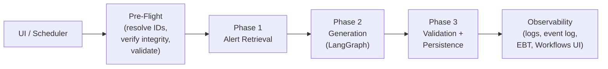

# Attack Discovery 2.0 Workflows Integration: PR Stack Plan

> This document drives the code review and later the creation of a stacked PR series for the `attack_discovery_workflows_integration` feature branch.
>
> **Guiding principle**: Each PR in the stack MUST be independently mergeable without impacting production. The feature flag `securitySolution.attackDiscoveryWorkflowsEnabled` gates all new behavior.

---

## Branch Summary

- **Feature branch**: `attack_discovery_workflows_integration`
- **Feature commits**: 5 (ff51c50d25ac..HEAD)
- **Scope**: ~1,006 files changed, ~125k insertions, ~2.6k deletions
- **New packages**: 3 (`kbn-discoveries`, `kbn-discoveries-schemas`, `kbn-attack-discovery-schedules-common`)
- **New plugin**: 1 (`discoveries`)
- **Modified plugins**: `elastic_assistant`, `security_solution` (public + server), workflows platform plugins (registrations only)

---

## PR Stack

### PR 1: Feature Flag + Shared Packages + elastic_assistant Refactor

**Goal**: Extract shared logic from `elastic_assistant` into reusable packages and prove zero regression when the feature flag is OFF.

<details>
<summary><strong>Commit Message</strong></summary>

## [Security Solution] [Attack Discovery] Extract shared packages and refactor elastic_assistant

This PR extracts shared server-side logic from `elastic_assistant` into three new reusable packages, preparing the codebase for the upcoming Attack Discovery Workflows integration. All existing behavior is unchanged — this is a pure structural refactor with no new features.

The extraction enables both the existing `elastic_assistant` plugin and the upcoming `discoveries` plugin to share LangGraph execution logic, event logging utilities, schedule infrastructure, and API type definitions without duplication.

### Feature Flag

Introduces `securitySolution.attackDiscoveryWorkflowsEnabled` (default: `false`). No behavior changes when the flag is OFF — this PR only defines it.

```yaml
feature_flags.overrides:
  securitySolution.attackDiscoveryWorkflowsEnabled: true
```

### New Packages

| Package | Purpose |
|---------|---------|
| `@kbn/discoveries` | Shared server-side logic: LangGraph graphs, event logging utilities, hallucination detection, anonymization, schedule transforms, telemetry definitions. Consumed by both `elastic_assistant` and the upcoming `discoveries` plugin. |
| `@kbn/discoveries-schemas` | OpenAPI schemas (`.schema.yaml`), generated TypeScript types, and Zod validators for route validation. |
| `@kbn/attack-discovery-schedules-common` | Shared schedule infrastructure: data client, field map, transforms. Extracted from `elastic_assistant` to keep things DRY. |

### What Moved

| From (`elastic_assistant`) | To | Notes |
|---|---|---|
| `server/lib/attack_discovery/graphs/` | `@kbn/discoveries` `impl/attack_discovery/graphs/` | LangGraph graph, hallucination detection, anonymization |
| `server/lib/attack_discovery/persistence/event_logging/` | `@kbn/discoveries` `impl/attack_discovery/persistence/event_logging/` | Event logging utilities |
| `server/lib/attack_discovery/schedules/` | `@kbn/attack-discovery-schedules-common` | Data client, field map, transforms |
| `server/lib/defend_insights/graphs/` | `@kbn/discoveries` `impl/defend_insights/graphs/` | Defend insights graph (code move, no logic changes) |

`elastic_assistant` now imports from the shared packages instead of local files. All existing public API routes, defend insights functionality, and schedule behavior are unchanged.

### Defend Insights Migration

The defend insights graph code is relocated from `elastic_assistant` to `@kbn/discoveries`. This is a pure code move with import path updates — no logic changes. The `@elastic/security-defend-workflows` team expects this migration.

</details>

**Scope**:
- Feature flag definition: `securitySolution.attackDiscoveryWorkflowsEnabled`
- `@kbn/discoveries` package: LangGraph execution logic, event logging utilities, hallucination detection, anonymization, schedule transforms, telemetry event definitions (moved from `elastic_assistant`)
- `@kbn/discoveries-schemas` package: OpenAPI schemas, generated TypeScript types, Zod validators
- `@kbn/attack-discovery-schedules-common` package: data client, field map, transforms, schedule params (moved from `elastic_assistant`)
- `x-pack/solutions/security/packages/features/` updates (action constants, privilege analysis tests)
- `x-pack/platform/packages/shared/kbn-elastic-assistant-common/` schema additions (generation, schedules)
- All corresponding deletions from `elastic_assistant` (graph code, schedule data client, field maps, defend insights graphs)
- `elastic_assistant` re-consumption of the shared packages
- Build config: `tsconfig.base.json`, `tsconfig.refs.json`, `kbn-ts-projects/config-paths.json`, `package.json`

**Review objectives** (from review.md):
- [G1] Attack discovery + schedules work when FF is OFF
- [G2] Defend insights still works (graph code moved but re-consumed)
- [G4] All of the above for serverless
- [G7] One function per file with unit tests
- [G10] No accidental artifacts (API keys, cursor/claude configs)
- [G13] No core Kibana platform modifications (only registrations)

**Review checklist**:
- [ ] `elastic_assistant` imports from `@kbn/discoveries` and `@kbn/attack-discovery-schedules-common` instead of deleted local files
- [ ] Defend insights graph is intact and invoked the same way
- [ ] All existing public API routes in `elastic_assistant` are unchanged in behavior
- [ ] No new exports leak workflow-only types into the public API
- [ ] Feature flag default is `false`
- [ ] Build passes: `yarn kbn bootstrap`, type check, lint
- [ ] Existing jest tests in `elastic_assistant` pass without modification (or are updated to use new import paths only)

---

### PR 2: Discoveries Plugin Scaffold + Workflow Step Registration

**Goal**: Introduce the `discoveries` plugin with lifecycle setup/start, workflow step registration, and default workflow definitions.

<details>
<summary><strong>Commit Message</strong></summary>

## [Security Solution] [Attack Discovery] Add discoveries plugin with workflow step registration

This PR introduces the `discoveries` plugin, which implements the Attack Discovery Workflows integration. The plugin registers five workflow steps at `setup()` and creates six default workflow definitions at `start()`.

The plugin is gated by the `securitySolution.attackDiscoveryWorkflowsEnabled` feature flag. When the flag is OFF, the plugin performs no work and has zero side effects.

```yaml
feature_flags.overrides:
  securitySolution.attackDiscoveryWorkflowsEnabled: true
```

### Workflow Steps

| Step Type ID | Category | Purpose |
|---|---|---|
| `attack-discovery.defaultAlertRetrieval` | Elasticsearch | Retrieves and anonymizes alerts using query DSL or ES\|QL |
| `attack-discovery.generate` | AI | Generates attack discoveries from pre-retrieved alerts via LangGraph; emits event log entries |
| `attack-discovery.defaultValidation` | Kibana | Validates discoveries with hallucination detection and deduplication |
| `attack-discovery.persistDiscoveries` | Kibana | Persists validated discoveries to the Attack Discovery data store |
| `attack-discovery.run` | AI | High-level entry point: runs the full pipeline as a single step (sync or async) |

Steps use `@kbn/zod/v4` inline schemas (not generated v3 schemas) per the Workflows platform requirement. Each step has a common definition in `common/step_types/` shared between server registration and the step catalog UI.

### Default Workflow Definitions

| Workflow YAML | Purpose |
|---------------|---------|
| `default_attack_discovery_alert_retrieval` | Default alert retrieval (query DSL) — _required_ |
| `attack_discovery_generation` | Generation via LangGraph — _required_ |
| `attack_discovery_validate` | Validation + persistence — _required_ |
| `attack_discovery_custom_validation_example` | Example: custom validation with Liquid sort filter |
| `attack_discovery_run_example` | Example: full pipeline in one step |

### Platform Registrations

- `approved_step_definitions.ts`: 6 `attack-discovery.*` step entries (+24 lines)
- `agent-builder allow_lists.ts`: `'attack-discovery-alert-retrieval-builder'` skill (+1 line)
- `agent-builder type_definition.ts`: `'attack-discovery'` directory entry (+2 lines)

### Plugin Lifecycle

1. **`setup()`**: Registers 5 workflow steps via `tryRegisterStep` (with error tracking via `StepRegistrationResult`)
2. **`start()`**: Registers default workflow definitions per space, runs startup health check

</details>

**Scope**:
- `x-pack/solutions/security/plugins/discoveries/` plugin scaffold (`kibana.jsonc`, `plugin.ts`, `types.ts`, `index.ts`)
- `common/step_types/` — 5 common step definitions (using `@kbn/zod/v4` inline schemas)
- `server/workflows/register_workflow_steps.ts` — step registration with `tryRegisterStep` error tracking (`StepRegistrationResult`)
- `server/workflows/steps/` — 5 step handler implementations:
  - `default_alert_retrieval_step/`
  - `generate_step/`
  - `default_validation_step/`
  - `persist_discoveries_step/`
  - `run_step/`
- `server/workflows/definitions/` — 5 bundled YAML workflow definitions (3 required + 2 examples)
- `server/workflows/register_default_workflows.ts` — default workflow registration per space
- `server/workflows/helpers/` — `get_bundled_yaml_entries/`, `read_bundled_workflow_yaml/`, `resolve_connector_details/`
- Platform registrations:
  - `workflows_extensions/test/scout/api/fixtures/approved_step_definitions.ts` (6 new step hashes)
  - `agent-builder-server/allow_lists.ts` (new skill allowlist entry)
  - `agent-builder-server/skills/type_definition.ts` (new directory structure)

**Review objectives**:
- [G1] Plugin only activates when FF is ON; zero side effects when OFF
- [G5] All new internal routes use `snake_case`
- [G7] One function per file with unit tests
- [G8] Most functions are pure, no side effects
- [G9] No unnecessary mutation (no push/pop, prefer map/reduce)
- [G13] Platform changes are registrations ONLY — no behavioral modifications to workflows engine, agent builder, or management service
- [S1] Artifact creation at plugin lifecycle setup/start

**Review checklist**:
- [ ] Plugin `setup()` registers steps; `start()` registers default workflows and runs startup health check
- [ ] Step schemas use `@kbn/zod/v4` (NOT v3 from generated schemas) per `workflows_zod_version.md`
- [ ] `tryRegisterStep` handles failures gracefully and reports `StepRegistrationResult`
- [ ] Default workflow YAMLs are valid and reference correct step type IDs
- [ ] Bundled YAML hash utility correctly computes SHA-256 and caches
- [ ] Plugin `kibana.jsonc` declares correct required/optional dependencies
- [ ] All step handler implementations delegate to helpers (not monolithic handlers)

---

### PR 3: Internal API Routes + ES|QL Mode

**Goal**: Implement the internal HTTP API surface for the discoveries plugin, including ES|QL-based alert retrieval as an alternative to query DSL.

<details>
<summary><strong>Commit Message</strong></summary>

## [Security Solution] [Attack Discovery] Add internal API routes and ES|QL alert retrieval mode

This PR implements the internal HTTP API surface for the `discoveries` plugin and adds ES|QL-based alert retrieval as an alternative to the default query DSL mode.

All routes are gated by the `attackDiscoveryWorkflowsEnabled` feature flag and return 404 when the flag is OFF. Every route uses `asCurrentUser` for Elasticsearch operations and matches the existing Attack Discovery RBAC privileges.

```yaml
feature_flags.overrides:
  securitySolution.attackDiscoveryWorkflowsEnabled: true
```

### Internal APIs

| Method | Route | Purpose |
|--------|-------|---------|
| POST | `/internal/attack_discovery/_generate` | Kicks off the orchestrated pipeline asynchronously; returns `execution_uuid` |
| POST | `/internal/attack_discovery/_validate` | Validates and persists generated discoveries |
| POST | `/internal/attack_discovery/_generate/workflow` | Generates a custom alert retrieval workflow via AI |
| GET | `/internal/attack_discovery/pipeline_data` | Returns pipeline execution data for the monitoring UI |
| GET | `/internal/attack_discovery/execution_tracking` | Returns workflow execution tracking data |
| GET | `/internal/attack_discovery/default_esql_query` | Returns the default ES\|QL query for alert retrieval |
| — | Schedule CRUD (create/find/get/update/delete/enable/disable) | Full schedule management via internal routes |

### Schedule API Isolation

Internal schedules use a bidirectional tag strategy: `applyTags` tags every write with `attack-discovery-schedule`, and `filterTags` restricts reads to only that tag. This ensures the internal API never surfaces schedules created by the public API (and vice versa). This isolation is a data safety measure — cross-API mutation would cause silent data loss because the public API's update path performs full parameter replacement without `workflowConfig`.

### ES|QL Alert Retrieval

The `default_esql_query` route returns a pre-built ES|QL query that replicates the behavior of the default DSL query (open/acknowledged alerts, sorted by risk score, excluding building blocks). The ES|QL mode is available as a `default_alert_retrieval_mode` option alongside `custom_query` and `disabled`.

</details>

**Scope**:
- `server/routes/index.ts` — route registration
- `POST /internal/attack_discovery/_generate` (`server/routes/post/generate/post_generate.ts`)
  - Helpers: `get_inferred_prebuilt_step_types/`
- `POST /internal/attack_discovery/_validate` (`server/routes/post/validate/post_validate.ts`)
  - Helpers: `bulk_response_helpers`, `get_ids_query`, `get_markdown_fields`, `is_missing_required_fields`, `transform_*`, `validate_attack_discoveries`
- `POST /internal/attack_discovery/_generate/workflow` (`server/routes/post/generate_workflow/post_generate_workflow.ts`)
  - Helpers: `build_skill_configuration_overrides/`, `extract_workflow_yaml/`, `generate_workflow_with_retries/`, `invoke_agent/`, `validate_workflow_yaml/`
- Schedule CRUD routes (`server/routes/post/schedules/`, `server/routes/get/schedules/`, `server/routes/put/schedules/`, `server/routes/delete/schedules/`)
- `GET /internal/attack_discovery/action_triggered_generations` (`server/routes/get/action_triggered_generations/`)
- `GET /internal/attack_discovery/execution_tracking` (`server/routes/get/execution_tracking/`)
- `GET /internal/attack_discovery/pipeline_data` (`server/routes/get/pipeline_data/`)
  - Helpers: `compute_combined_alerts/`, `extract_pipeline_alert_data/`, `extract_pipeline_generation_data/`, `extract_pipeline_validation_data/`, `get_workflow_executions_tracking/`
- `GET /internal/attack_discovery/default_esql_query` (`server/routes/get/default_esql_query/`)
- `@kbn/discoveries` `impl/lib/build_default_esql_query/` — default ES|QL query generation
- `common/step_types/` — `esql` mode in `default_alert_retrieval_mode` enum
- UI: `use_fetch_default_esql_query/` hook
- `server/lib/schedules/` — schedule data client, workflow executor, constants
- `server/lib/helpers/get_space_id/`

**Review objectives**:
- [G5] All routes use `snake_case` in request/response bodies and URL parameters
- [G7] One function per file with unit tests
- [G8] Pure functions where possible
- [G11] Resilient against failures
- [G12] Users can recover from failures without contacting support
- [S7] Tracing failures via execution UUID in logs
- [S8] Routes throw when FF is disabled
- [S9] Routes execute in context of authenticated user, not super user
- [S11] No privilege escalation possible from routes
- [S12] RBAC has same semantics as existing Attack Discovery RBAC
- [S13] ES clients execute in context of authenticated user
- [S23] ESQL mode is correct when FF is ON

**Review checklist**:
- [ ] Every route handler checks `attackDiscoveryWorkflowsEnabled` and returns 404/403 when OFF
- [ ] Route security config uses `requiredPrivileges` matching existing AD RBAC
- [ ] `request.body` / `response.body` field names are all `snake_case`
- [ ] URL path parameters are all `snake_case`
- [ ] ES client is obtained from `context.core.elasticsearch.client.asCurrentUser` (not `asInternalUser`)
- [ ] `_generate` is async (returns `execution_uuid`, not discoveries)
- [ ] `_validate` validates discoveries and persists them
- [ ] Schedule routes do not expose schedules created by the legacy API (and vice versa)
- [ ] Error responses include structured error information for UI recovery
- [ ] Each route handler file has a corresponding `.test.ts`
- [ ] ES|QL query generation produces valid ES|QL
- [ ] Default ES|QL query route returns expected format
- [ ] ESQL mode retrieves alerts correctly via workflow step
- [ ] Example ESQL workflow YAML is valid and functional

---

### PR 4: Orchestration Pipeline + Event Logging + Pre-Execution Validation

**Goal**: Wire up the 3-phase orchestrated pipeline (retrieve -> generate -> validate) with full observability.

<details>
<summary><strong>Commit Message</strong></summary>

## [Security Solution] [Attack Discovery] Wire up orchestrated pipeline with event logging and pre-execution validation

This PR wires up the three-phase orchestrated pipeline that replaces the monolithic generation endpoint. Each generation run is assigned a unique `executionUuid` that appears in server logs, event log entries, EBT telemetry, and the API response — enabling end-to-end tracing.

```yaml
feature_flags.overrides:
  securitySolution.attackDiscoveryWorkflowsEnabled: true
```

### Execution Flow



### Orchestration

`executeOrchestratorWorkflow` composes three sequential workflow executions:

1. **Alert Retrieval**: Runs the configured retrieval workflow (default DSL, ES|QL, or custom)
2. **Generation**: Runs the generation workflow with LangGraph, emitting `generation-started`/`generation-succeeded`/`generation-failed` events to the Elasticsearch event log
3. **Validation + Persistence**: Validates discoveries (hallucination detection, deduplication) and persists to the Attack Discovery index

Each phase failure is caught, logged with the execution UUID, and reported in the execution summary.

### Event Logging

| Event | When | Key Fields |
|-------|------|------------|
| `generation-started` | Pipeline begins | `execution_uuid`, `alerts_context_count` |
| `generation-succeeded` | Pipeline completes | `execution_uuid`, `duration_ns`, `discoveries_count` |
| `generation-failed` | Pipeline fails | `execution_uuid`, `error_reason` |

Events are written to `.kibana-event-log-*` and queryable via `GET /api/attack_discovery/generations`.

### Pre-Execution Validation

Before the pipeline starts, concurrent checks validate all preconditions:

| Check | Severity | Behavior |
|-------|----------|----------|
| WorkflowsManagement API available | Critical | Aborts pipeline |
| Default workflow IDs resolvable | Critical | Aborts pipeline |
| Alerts index exists | Warning | Logs warning, continues |
| Connector accessible | Warning | Logs warning, continues |

### Observability

- **Traced logger**: All log messages prefixed with `[execution: {uuid}]` for single-execution filtering
- **INFO summary**: Logged after every run with per-step status, timing, and Workflows app links
- **DEBUG health checks**: Lazy-evaluated precondition logging before each step (zero cost when off)

</details>

**Scope**:
- Orchestration logic in `@kbn/discoveries`:
  - `impl/attack_discovery/generation/` — orchestrator, alert retrieval invocation, generation workflow, validation workflow
  - `impl/attack_discovery/generation/verify_workflow_integrity/` — SHA-256 hash comparison, self-healing gateway
- Event logging:
  - `impl/attack_discovery/persistence/event_logging/` — `writeAttackDiscoveryEvent`, event action constants, duration helpers
  - Generate step event emission (`generation-started`, `generation-succeeded`, `generation-failed`)
- Pre-execution validation:
  - `validate_pre_execution/` — concurrent checks (API availability, default workflow IDs, alerts index, connector)
- Traced logger:
  - `impl/lib/create_traced_logger/` — `[execution: {uuid}]` prefix
- Health checks:
  - `server/lib/startup_health_check/`
  - `impl/lib/log_health_check/` — per-step precondition logging
- Execution summary:
  - INFO-level orchestration summary with per-step status, timing, workflow links

**Review objectives**:
- [G11] Resilient against failures (pre-execution validation catches misconfigurations before pipeline starts)
- [G12] Users can recover (clear error messages, self-healing)
- [S5] Self-healing for damaged/missing workflows
- [S7] Tracing via execution UUID in all log levels
- [S17] Self-healing works in default and non-default spaces when workflows manually modified
- [S18] Self-healing works when workflows manually deleted
- [S19] Self-healing works when workflows manually disabled
- [S21] Correctness of new event log entries

**Review checklist**:
- [ ] `executeOrchestratorWorkflow` composes retrieval -> generation -> validation phases
- [ ] Each phase failure is caught and logged with execution UUID
- [ ] `verifyWorkflowIntegrity` computes SHA-256, compares against bundled hashes, repairs if needed
- [ ] Repair emits `workflow_modified` telemetry per repaired workflow
- [ ] Repair failure aborts pipeline with `generation-failed` event
- [ ] Pre-execution validation runs all checks concurrently
- [ ] Critical issues abort; warnings allow continuation
- [ ] Event log entries match the schema documented in README.md
- [ ] Traced logger uses lazy evaluation: `logger.debug(() => ...)` not `logger.debug(...)`
- [ ] Startup health check runs in `plugin.start()` and logs result
- [ ] INFO summary logged after every orchestration run (success or failure)

---

### PR 5: Telemetry (EBT Events)

**Goal**: Add fleet-wide telemetry for misconfigurations, step failures, schedule actions, and UI interactions.

<details>
<summary><strong>Commit Message</strong></summary>

## [Security Solution] [Attack Discovery] Add EBT telemetry for workflow execution

This PR adds Event-Based Telemetry (EBT) events for the Attack Discovery Workflows feature, providing fleet-wide visibility into execution outcomes, configuration problems, and UI engagement.

All new EBT fields use `snake_case`. Existing telemetry events (`attack_discovery_success`, `attack_discovery_error`) are augmented with workflow-specific fields but their existing camelCase fields are retained as-is to avoid breaking the shared schema with `elastic_assistant`.

### Server-Side Events

| Event | Purpose | Key Fields |
|-------|---------|------------|
| `attack_discovery_misconfiguration` | Configuration problems (missing index, bad connector, etc.) | `misconfiguration_type`, `space_id`, `workflow_id` |
| `attack_discovery_step_failure` | Per-step pipeline failures | `step`, `error_category`, `duration_ms`, `execution_uuid` |
| `attack_discovery_schedule_action` | Schedule lifecycle operations | `action`, `has_actions`, `interval` |

Events from the workflows path are distinguishable via `execution_mode: 'workflow'` on the shared `attack_discovery_success`/`attack_discovery_error` event types (absent on legacy).

### Client-Side Events

| Event | Purpose |
|-------|---------|
| `Attack Discovery Settings Saved` | Captures retrieval mode, workflow count, validation choices |
| `Attack Discovery Generation Started` | Distinguishes workflow vs legacy execution mode |
| `Attack Discovery Edit With AI Clicked` | Tracks AI-assisted ES\|QL editing usage |
| `Attack Discovery Pipeline Step Inspected` | Tracks execution monitoring engagement |
| _(+ 16 more settings/schedule/execution events)_ | Full list in client-side telemetry README |

All events avoid collecting user-defined names, query content, alert data, or user identifiers. Only anonymous metadata (counts, modes, boolean flags, enum values) is captured.

</details>

**Scope**:
- `@kbn/discoveries` telemetry:
  - `impl/lib/telemetry/` — `report_step_failure/`, `report_misconfiguration/`, `report_schedule_action/`
- `security_solution` telemetry:
  - `public/common/lib/telemetry/events/attack_discovery/` — EBT event definitions, types, README
  - `public/common/lib/telemetry/events/telemetry_events.ts` — registration
  - `public/common/lib/telemetry/types.ts` — type extensions

**Review objectives**:
- [G6] All new telemetry event definitions use `snake_case` (existing camelCase not refactored)
- [G10] No accidental artifacts

**Review checklist**:
- [ ] `attack_discovery_misconfiguration` event fields are `snake_case`
- [ ] `attack_discovery_step_failure` event fields are `snake_case`
- [ ] `attack_discovery_schedule_action` event fields are `snake_case`
- [ ] Existing telemetry events are NOT modified
- [ ] Telemetry README accurately documents all new events
- [ ] Events include `execution_uuid` for correlation
- [ ] Client-side events capture only anonymous metadata (no PII, query content, or alert data)

---

### PR 6: UI — Workflow Configuration (Settings Flyout)

**Goal**: Add workflow configuration UI to the Attack Discovery settings flyout.

<details>
<summary><strong>Commit Message</strong></summary>

## [Security Solution] [Attack Discovery] Add workflow configuration UI to settings flyout

This PR adds workflow configuration options to the Attack Discovery settings flyout, enabling users to customize alert retrieval, select custom workflows, edit retrieval queries with AI, and manage generation schedules — all when the feature flag is enabled. When the flag is OFF, the settings flyout renders the existing experience unchanged.

```yaml
feature_flags.overrides:
  securitySolution.attackDiscoveryWorkflowsEnabled: true
```

### New Settings

- **Alert retrieval mode**: query DSL (default), ES|QL, or custom workflow — with a query builder, date range picker, and alert preview panel
- **Custom workflow picker**: select custom alert retrieval and validation workflows with async existence/enabled validation
- **Edit with AI**: opens the Agent Builder sidebar with the user's current ES|QL query as an attachment; changes sync back in real time via a dual-path model (explicit tool call + attachment fallback)
- **Validation panel**: select a custom validation workflow or use the default; async checks display errors (red) vs warnings (yellow)

### Schedule Management

Full schedule lifecycle via the settings flyout:
- **Create flyout**: name, interval, connector, notification actions
- **Details flyout**: view/edit existing schedules
- **Schedules table**: list, enable, disable, delete schedules

### Async Validation

When workflow settings change, the UI performs async runtime checks:
- Verifies selected custom workflows exist and are enabled
- Displays errors (configuration will fail) vs warnings (configuration may have issues) in the validation callout

</details>

**Scope**:
- `security_solution/public/attack_discovery/pages/settings_flyout/`:
  - `workflow_configuration/` — main configuration panel
  - `workflow_configuration/edit_with_ai/` — AI-assisted workflow editing
  - `workflow_configuration/local_storage/` — persistent user preferences
  - `workflow_configuration/validation_panel/` — async workflow validation (existence, enabled checks)
  - `alert_selection/` — query-based alert filtering with preview
    - `alert_selection_query/`, `alert_selection_range/`, `preview_tab/`
    - `get_alert_summary_esql_query/`, `get_alerts_preview_esql_query/`
    - `get_alert_summary_lens_attributes/`
    - `connector_field/`
  - `workflow_picker/` — workflow selection UI
  - `workflow_option_renderers/` — custom option rendering
  - Schedule management:
    - `schedule/create_flyout/`, `schedule/details_flyout/`, `schedule/schedules_table/`, `schedule/edit_form/`
- Hooks: `use_schedule_view`, `use_settings_view`, `use_tabs_view`

**Review objectives**:
- [S3] Edit with AI feature/skill
- [S6] Workflow execution status monitoring (settings side)
- [S22] Query builder mode correct when FF off
- [S22b] Query builder mode correct when FF on
- [S26] Anonymization works when FF off
- [S27] Anonymization works when FF on

**Review checklist**:
- [ ] Settings flyout conditionally renders workflow configuration only when FF is ON
- [ ] When FF is OFF, existing settings UI is unchanged
- [ ] Alert selection query builder works in both FF states
- [ ] Workflow picker validates selected workflows asynchronously
- [ ] Validation panel shows errors (red) vs warnings (yellow) correctly
- [ ] Edit with AI uses the Agent Builder skill correctly
- [ ] Schedule CRUD flows work end-to-end via settings UI
- [ ] Custom validation workflows are selectable
- [ ] Custom alert retrieval workflows are selectable
- [ ] All new components have unit tests

---

### PR 7: UI — Workflow Execution Monitoring + Details Flyout

**Goal**: Add real-time workflow execution monitoring and detailed inspection UI.

<details>
<summary><strong>Commit Message</strong></summary>

## [Security Solution] [Attack Discovery] Add workflow execution monitoring and details flyout

This PR adds real-time workflow execution monitoring to the Attack Discovery UI, including a live progress display, pipeline data cards, per-step inspection, failure classification, and AI-assisted troubleshooting.

When the feature flag is OFF, the loading callout renders the legacy experience unchanged.

```yaml
feature_flags.overrides:
  securitySolution.attackDiscoveryWorkflowsEnabled: true
```

### Execution Monitoring

- **Loading callout**: Live timer showing elapsed time during generation, with pipeline data cards displaying alert and discovery counts as they arrive
- **Loading messages**: Contextual success messages composed from pipeline data

### Execution Details Flyout

- **Per-step inspection**: View inputs, outputs, status, and timing for each pipeline step (alert retrieval, generation, validation)
- **Step data modal**: Serialized step input/output inspection with alert summary
- **Failure classification**: Categorizes errors into actionable categories (connector error, timeout, validation error, workflow error, unknown)
- **Troubleshoot with AI**: Opens Agent Builder with diagnostic context pre-attached for AI-assisted root cause analysis
- **Diagnostic report**: Environment context, error details, and workflow execution metadata

### Workflow Links

Links in the execution details flyout point to the specific workflow run in the Workflows app, matching the URLs logged in the server-side execution summary.

### Generation History

Generation history view showing past executions with status, timing, and discovery counts.

</details>

**Scope**:
- `pages/hooks/use_workflow_execution_details/` — execution tracking hook system
  - `build_stub_workflow_execution/` (with timing, status, output helpers)
  - `get_step_status_from_events/`
  - `helpers/` (aggregation, lookup, step execution building)
- `pages/hooks/use_pipeline_data/` — pipeline data processing
- `pages/hooks/use_workflow_tracking/` — workflow event tracking
- `pages/loading_callout/` — loading state with live feedback
  - `live_timer/` — elapsed time display
  - `pipeline_data_cards/` — pipeline metrics visualization
  - `loading_messages/` — success message composition
- `pages/loading_callout/workflow_execution_details_flyout/` — detailed inspection
  - `diagnostic_report/` — diagnostic data display
  - `inspect_diagnostic_report_flyout/` — nested inspection
  - `failure_actions/` — recovery action buttons
  - `troubleshoot_with_ai/` — AI-assisted troubleshooting
  - `classify_error_category/`, `classify_failure/`
  - `get_environment_context/`, `sanitize_error_message/`
  - `group_steps_by_phase/`
- `pages/loading_callout/step_data_modal/` — step execution inspection
  - `workflow_alerts_summary_line/`
- `pages/results/history/` — generation history
- `pages/results/attack_discovery_panel/panel_header/primary_interactions/badges/shared_badge/`

**Review objectives**:
- [S4] Troubleshoot with AI skill
- [S6] Workflow execution status monitoring
- [S20] Troubleshoot with AI feature works
- [S25] Inspect features of workflow execution details are correct
- [S28] Links in workflow execution details flyout go to the workflow that was run

**Review checklist**:
- [ ] Execution monitoring only appears when FF is ON
- [ ] When FF is OFF, loading callout renders the legacy experience
- [ ] Workflow execution details flyout links point to correct workflow run URLs
- [ ] Step data modal correctly serializes and displays step inputs/outputs
- [ ] Failure classification produces actionable categories
- [ ] Troubleshoot with AI correctly invokes the Agent Builder conversation
- [ ] Diagnostic report includes all relevant environment context
- [ ] Pipeline data cards show correct alert/discovery counts
- [ ] Live timer updates in real-time during execution
- [ ] All new hooks and components have unit tests

---

### PR 8: Skills (Edit with AI + Troubleshoot with AI)

**Goal**: Register Agent Builder skills for workflow editing and troubleshooting.

<details>
<summary><strong>Commit Message</strong></summary>

## [Security Solution] [Attack Discovery] Register Agent Builder skills for workflow editing and troubleshooting

This PR registers two Agent Builder skills that enhance the Attack Discovery workflow experience:

```yaml
feature_flags.overrides:
  securitySolution.attackDiscoveryWorkflowsEnabled: true
```

### Skills

| Skill | Purpose |
|-------|---------|
| `alert-retrieval-builder` | Generates custom alert retrieval workflow YAML via an LLM agent. The user describes their alert selection criteria in natural language, and the skill produces a valid workflow YAML that can be used as a custom retrieval workflow. |
| `workflow-troubleshooting` | Diagnoses workflow execution failures using diagnostic context. When a generation fails, the user can click "Troubleshoot with AI" in the execution details flyout, which opens Agent Builder with a diagnostic report pre-attached (environment context, error details, step inputs/outputs). |

### Implementation

- `server/skills/register_skills.ts` — conditional registration (FF gated)
- `server/skills/alert_retrieval_builder_skill.ts` — alert retrieval skill definition with tool implementations
- `server/skills/workflow_troubleshooting_skill.ts` — troubleshooting skill definition
- `server/skills/tools/` — skill tool implementations
- `server/agent_builder/attachments/diagnostic_report/` — diagnostic attachment for troubleshooting context

Skills only register when the feature flag is ON. Registration failures are handled gracefully.

</details>

**Scope**:
- `server/skills/register_skills.ts` — skill registration
- `server/skills/alert_retrieval_builder_skill.ts` — alert retrieval workflow editing skill
- `server/skills/workflow_troubleshooting_skill.ts` — troubleshooting skill
- `server/skills/tools/` — skill tool implementations
- `server/agent_builder/attachments/diagnostic_report/` — diagnostic attachment for troubleshooting

**Review objectives**:
- [S3] Edit with AI feature/skill
- [S4] Troubleshoot with AI skill
- [S20] Troubleshoot with AI feature works

**Review checklist**:
- [ ] Skills only register when FF is ON
- [ ] Skills have correct permission requirements
- [ ] Alert retrieval builder produces valid workflow YAML
- [ ] Troubleshooting skill has access to diagnostic context
- [ ] Skill registration failures are handled gracefully

---

### PR 9: Self-Healing + Workflow Integrity Verification

**Goal**: Implement automatic detection and repair of damaged/missing/disabled workflows.

<details>
<summary><strong>Commit Message</strong></summary>

## [Security Solution] [Attack Discovery] Add self-healing workflow integrity verification

This PR implements automatic detection and repair of the 3 required default workflows (alert retrieval, generation, validation). Before each generation run, the system verifies workflow integrity via SHA-256 hash comparison against bundled definitions. If any workflow has been deleted or modified, it is automatically restored. If restoration fails, the pipeline aborts with a clear error.

### Algorithm

Runs in parallel for all 3 required workflows:

1. Fetch each workflow from Elasticsearch via the Workflows Management API
2. **If missing**: re-create from the bundled YAML definition
3. **If present**: compute SHA-256 hash and compare against the bundled hash
4. **If hashes match**: no action (`all_intact`)
5. **If hashes differ**: overwrite with bundled YAML (`repaired`)
6. **If restore fails**: record as `unrepairableError`

### Outcomes

| Status | Meaning | Pipeline |
|--------|---------|----------|
| `all_intact` | All 3 workflows match bundled definitions | Continues |
| `repaired` | One or more workflows were restored; `workflow_modified` telemetry emitted per workflow | Continues |
| `repair_failed` | One or more workflows could not be restored | **Aborted** — `generation-failed` event with error reason |

### Observability

| Scenario | Log Level | Telemetry |
|----------|-----------|-----------|
| All intact | DEBUG | None |
| Modified, restoration succeeds | INFO | `workflow_modified` per workflow |
| Missing, re-creation succeeds | ERROR (detection) + INFO (success) | `workflow_modified` per workflow |
| Repair fails | ERROR | None (execution aborted) |

The bundled YAML hash utility reads the 3 required YAML files from disk at first access, computes SHA-256 hashes (Node.js `crypto`), and caches results (bundled files are immutable at runtime).

</details>

**Scope**:
- `server/lib/workflow_initialization/` — service interface + implementation
- `server/lib/workflow_initialization/verify_and_repair_workflows/` — verify-and-repair logic
- `@kbn/discoveries` `impl/attack_discovery/generation/verify_workflow_integrity/` — execution integration
- `server/workflows/helpers/get_bundled_yaml_entries/` — bundled YAML hash utility (SHA-256)

**Review objectives**:
- [S5] Self-healing for damaged/missing workflows
- [S17] Self-healing works in default and non-default spaces when workflows manually modified
- [S18] Self-healing works when workflows manually deleted
- [S19] Self-healing works when workflows manually disabled
- [G11] Resilient against failures
- [G12] Users can recover without contacting support

**Review checklist**:
- [ ] SHA-256 hash comparison against bundled YAML is correct
- [ ] Missing workflows are re-created from bundled definitions
- [ ] Modified workflows are overwritten with bundled definitions
- [ ] Disabled workflows are re-enabled (or handled appropriately)
- [ ] Repair failures are logged and abort the pipeline cleanly
- [ ] `workflow_modified` telemetry emitted per repaired workflow
- [ ] Self-healing runs in the correct space context
- [ ] Hash cache is invalidated appropriately (bundled files are immutable at runtime)
- [ ] Concurrent repair attempts are safe (no race conditions)

---

### PR 10: Schedule Integration (Workflows-Based Scheduling)

**Goal**: Integrate workflow-based generation with the Alerting Framework scheduler.

<details>
<summary><strong>Commit Message</strong></summary>

## [Security Solution] [Attack Discovery] Integrate workflow-based generation with alerting-framework scheduling

This PR connects the workflow-based generation pipeline to the Alerting Framework scheduler, completing the hybrid scheduling architecture. The Alerting Framework owns scheduling, alert persistence, and action execution (with full throttling/frequency support). The Workflows engine owns only the generation pipeline.

### Hybrid Architecture

```
┌───────────────────────────────┐     ┌────────────────────────────────┐
│  Alerting Framework           │     │  Workflows Engine               │
│  - Scheduling (Task Manager)  │     │  - Generation pipeline          │
│  - Alert persistence (AAD)    │ ──► │  - Alert retrieval              │
│  - Action execution           │     │  - LangGraph generation         │
│  - Throttling/frequency       │     │  - Validation + persistence     │
└───────────────────────────────┘     └────────────────────────────────┘
```

### Changes

- **Workflow executor** (`server/lib/schedules/workflow_executor/`): Delegates to the orchestration pipeline (`executeGenerationWorkflow`) instead of inline generation logic. Runs in the context of the authenticated user.
- **Schedule data client** (`server/lib/schedules/create_schedule_data_client/`): Uses tag-based filtering to isolate internal schedules from public API schedules.
- **`elastic_assistant` updates**: Schedule registration (`register_schedule/definition.ts`, `register_schedule/executor.ts`) updated to coexist with the workflow executor.
- **`@kbn/attack-discovery-schedules-common` transforms**: Extended with `workflowConfig` support for schedule create/update operations.

### Isolation

The internal schedule API tags every schedule with `attack-discovery-schedule` and filters reads to only that tag. The public API applies no tags. This bidirectional isolation ensures:
- FF OFF: legacy schedule users never see workflow-created schedules
- FF ON: legacy schedule users still never see workflow-created schedules
- Internal API users only see their own schedules

</details>

**Scope**:
- `server/lib/schedules/workflow_executor/` — schedule executor using workflows
- `server/lib/schedules/create_schedule_data_client/` — schedule data client
- `elastic_assistant` schedule registration updates (`register_schedule/definition.ts`, `register_schedule/executor.ts`)
- `@kbn/attack-discovery-schedules-common` transforms for workflow config

**Review objectives**:
- [S14] FF OFF: schedule API users do NOT see schedules created by new API
- [S15] FF ON: schedule API users also do NOT see schedules created by new API
- [S10] Workflows always execute in context of authenticated user
- [G3] Existing schedule public APIs behave the same when FF is ON

**Review checklist**:
- [ ] Workflow executor invokes the orchestration pipeline (not the legacy graph)
- [ ] Schedule data client correctly filters by source (legacy vs. workflows)
- [ ] Authenticated user context is preserved through scheduled execution
- [ ] Schedule actions (email, webhook, etc.) work through the alerting framework
- [ ] Schedule CRUD operations are isolated between legacy and workflows APIs

---

## Cross-Cutting Review Objectives

These objectives apply to ALL PRs in the stack:

| ID | Objective | Applies to |
|----|-----------|------------|
| G1 | AD + schedules work when FF OFF | All PRs |
| G2 | Defend insights unaffected | PR 1 |
| G3 | Existing public APIs unchanged when FF ON | PR 1, 3, 10 |
| G4 | All above true for serverless | All PRs |
| G5 | New routes use `snake_case` | PR 3 |
| G6 | New telemetry uses `snake_case` | PR 5 |
| G7 | One function per file with tests | All PRs |
| G8 | Pure functions, no side effects | All PRs |
| G9 | No unnecessary mutation | All PRs |
| G10 | No accidental artifacts | All PRs |
| G11 | Resilient against failures | PR 3, 4, 9 |
| G12 | Users can recover without support | PR 4, 7, 9 |
| G13 | Platform changes are registrations only | PR 2 |

| ID | Specific Item | PR |
|----|--------------|-----|
| S1 | Plugin lifecycle artifact creation | PR 2 |
| S2 | Health checks | PR 4 |
| S3 | Edit with AI | PR 6, 8 |
| S4 | Troubleshoot with AI | PR 7, 8 |
| S5 | Self-healing | PR 9 |
| S6 | Execution status monitoring | PR 7 |
| S7 | Tracing via execution UUID | PR 4 |
| S8 | Routes throw when FF disabled | PR 3 |
| S9 | Routes use authenticated user context | PR 3 |
| S10 | Workflows use authenticated user context | PR 3, 10 |
| S11 | No privilege escalation | PR 3 |
| S12 | RBAC matches existing AD RBAC | PR 3 |
| S13 | ES clients use authenticated user | PR 3 |
| S14 | FF OFF: legacy schedules isolated | PR 10 |
| S15 | FF ON: legacy schedules still isolated | PR 10 |
| S16 | Alerts and Attacks Alignment not broken | All PRs |
| S17 | Self-healing: modified workflows | PR 9 |
| S18 | Self-healing: deleted workflows | PR 9 |
| S19 | Self-healing: disabled workflows | PR 9 |
| S20 | Troubleshoot with AI works | PR 7, 8 |
| S21 | Event log entries correct | PR 4 |
| S22 | Query builder correct when FF off | PR 6 |
| S22b | Query builder correct when FF on | PR 6 |
| S23 | ESQL mode correct when FF on | PR 3 |
| S24 | Example run workflow correct | PR 2 |
| S25 | Inspect features correct | PR 7 |
| S26 | Anonymization correct when FF off | PR 6 |
| S27 | Anonymization correct when FF on | PR 6 |
| S28 | Flyout links go to correct workflow | PR 7 |

---

## Dependency Graph

```
PR 1 (Shared Packages + elastic_assistant Refactor)
 ├── PR 2 (Plugin Scaffold + Step Registration)
 │    ├── PR 3 (Internal API Routes + ES|QL Mode)
 │    │    ├── PR 4 (Orchestration + Event Logging)
 │    │    │    ├── PR 9 (Self-Healing)
 │    │    │    └── PR 10 (Schedule Integration)
 │    │    └── PR 8 (Skills)
 │    └── PR 5 (Telemetry)
 ├── PR 6 (UI: Workflow Configuration)
 └── PR 7 (UI: Execution Monitoring)
```

**Parallelizable**:
- PR 5, 6, 7 can be developed in parallel after PR 2
- PR 8 can be developed in parallel after PR 3
- PR 9 and PR 10 can be developed in parallel after PR 4

---

## Merge Strategy

1. **PRs 1-2**: Safe for immediate merge to serverless — they add packages and a disabled-by-default plugin
2. **PRs 3-5**: Safe once the plugin scaffold is merged — routes are gated by FF
3. **PRs 6-7**: UI changes gated by FF — safe for merge after PR 2
4. **PRs 8-10**: Specialized features — merge after their dependencies

---

## Risk Assessment

| Risk | Mitigation | PRs |
|------|-----------|-----|
| Shared package extraction breaks existing behavior | PR 1 review focuses on import path changes only; all existing tests must pass | PR 1 |
| Defend insights regression | Explicit test coverage for defend insights graphs | PR 1 |
| New plugin side effects when FF OFF | Plugin setup/start gated by FF check; startup health check is defensive | PR 2 |
| Route privilege escalation | All routes use `asCurrentUser`; RBAC matches existing AD privileges | PR 3 |
| Self-healing race conditions | Verify-and-repair runs synchronously per request; concurrent requests are safe because repair is idempotent | PR 9 |
| Schedule isolation leak | Schedule data client filters by source field; cross-API queries return empty | PR 10 |
| Serverless differences | Workflows engine availability varies; pre-execution validation handles gracefully | PR 4 |
