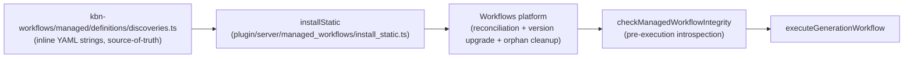
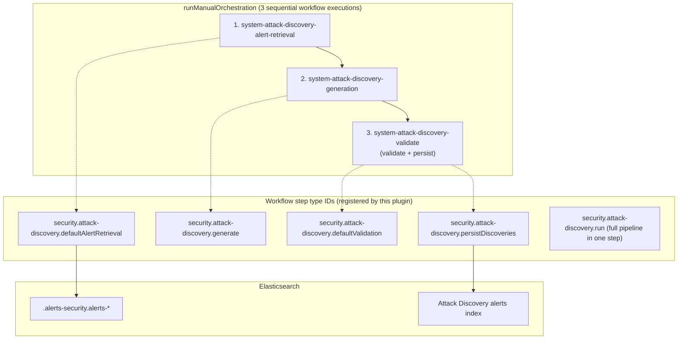

# Attack Discovery Workflow Definitions

> **Heads-up — the `.workflow.yaml` files in this directory are no longer the source-of-truth at runtime.**
>
> The five Attack Discovery system workflows are now declared as **inline YAML strings** in a single TS file: [`src/platform/packages/shared/kbn-workflows/managed/definitions/discoveries.ts`](../../../../../../../../src/platform/packages/shared/kbn-workflows/managed/definitions/discoveries.ts). That file is loaded by the platform's managed-workflow framework via [`installStatic`](../../managed_workflows/install_static.ts) and is what users see in the Workflows app.
>
> The local `.workflow.yaml` files in this directory remain as **reference / desk-test fixtures** that mirror (or used to mirror) the live definitions; do not edit them expecting runtime behavior to change. Tests under [`test/`](test/) use their own fixtures.

This document is a workflow-authoring reference: per-step data contracts, the workflow IDs the orchestrator looks up, and Liquid patterns that show up in user-authored workflows.

## How the system workflows are loaded



- `installStatic` loops over `AD_WORKFLOW_IDS` and asks the platform to install each one into the global workflow space.
- The platform owns reconciliation, version-based upgrade (`versionStrategy: 'auto'`), and orphan cleanup.
- The AD plugin's [`checkManagedWorkflowIntegrity`](../../managed_workflows/check_managed_workflow_integrity.ts) introspects platform state on every generation request and reports a diagnostic outcome — it does **not** perform restoration itself. A hash mismatch means the platform will reconcile on the next restart.

See the plugin's [System workflow definitions](../../../README.md#system-workflow-definitions) and [Observability & Debugging > Workflow integrity verification](../../../README.md#workflow-integrity-verification) sections for the full picture.

## Generation pipeline architecture

The internal `POST /internal/attack_discovery/_generate` endpoint, the Alerting Framework `workflowExecutor`, and the `security.attack-discovery.run` step all converge on `executeGenerationWorkflow`, which delegates to `runManualOrchestration`. That orchestrator chains three sub-workflow executions:



The system workflows above are the **definitions** the orchestrator invokes; the step type IDs in the right-hand column are the **handlers** registered by this plugin in [`register_workflow_steps.ts`](../register_workflow_steps.ts).

## Workflow IDs and their definitions

The five Attack Discovery system workflows. Constants are exported from `@kbn/workflows/managed`. All five live as inline YAML strings in [`kbn-workflows/managed/definitions/discoveries.ts`](../../../../../../../../src/platform/packages/shared/kbn-workflows/managed/definitions/discoveries.ts).

| Constant | Workflow ID | Purpose |
|----------|-------------|---------|
| `ATTACK_DISCOVERY_ALERT_RETRIEVAL_WORKFLOW_ID` | `system-attack-discovery-alert-retrieval` | Default alert retrieval (DSL/ES\|QL); Phase 1 of the pipeline |
| `ATTACK_DISCOVERY_GENERATION_WORKFLOW_ID` | `system-attack-discovery-generation` | LangGraph generation; Phase 2 of the pipeline |
| `ATTACK_DISCOVERY_VALIDATE_WORKFLOW_ID` | `system-attack-discovery-validate` | Hallucination detection + persistence; Phase 3 of the pipeline |
| `ATTACK_DISCOVERY_RUN_EXAMPLE_WORKFLOW_ID` | `system-attack-discovery-run-example` | Ready-made `security.attack-discovery.run` template (desk-test starting point) |
| `ATTACK_DISCOVERY_CUSTOM_VALIDATION_EXAMPLE_WORKFLOW_ID` | `system-attack-discovery-custom-validation-example` | Custom validation example (validate → `data.map` transform → persist) |

**Navigation note.** Managed workflows are hidden from the Workflows UI list view by default. Open them directly by URL, e.g. `http://localhost:5601/app/workflows/system-attack-discovery-generation`.

## Per-step data contracts

The five step handlers register their schemas inline via `@kbn/zod/v4`. Full schemas (input + output) live in [`common/step_types/`](../../../common/step_types/) and their server handlers in [`steps/`](../steps/). The summary tables below match the registered schemas.

### `security.attack-discovery.defaultAlertRetrieval`

Retrieves and anonymizes alerts (DSL or ES|QL).

| Input | Type | Required | Notes |
|------|------|----------|-------|
| `alertsIndexPattern` | string | ✅ | Alert index pattern (e.g., `.alerts-security.alerts-default`) |
| `anonymizationFields` | array | ✅ | Per-field anonymization config; `_id` is always present |
| `apiConfig` | JSON string | ✅ | Only `connector_id` is required; `action_type_id` is resolved at runtime when omitted |
| `filter` | JSON string | ❌ | Query filter |
| `size` | number | ❌ | Max alerts to retrieve (default `150`) |
| `start`, `end` | string | ❌ | Time range (e.g., `now-24h` / `now`) |

| Output | Type | Notes |
|------|------|-------|
| `alerts` | string[] | Anonymized strings (LLM input) |
| `anonymized_alerts` | Document[] | Anonymized alert documents (for hallucination detection) |
| `replacements` | `Record<string, string>` | Anonymization map; **never** leaves the pipeline via `security.attack-discovery.run` output |
| `api_config` | ApiConfig | Pass-through |
| `connector_name` | string | Resolved from `connector_id` when not provided |
| `alerts_context_count` | number | Count of alerts retrieved |

### `security.attack-discovery.generate`

Generates Attack discoveries via the LangGraph generation node.

| Input | Type | Required | Notes |
|------|------|----------|-------|
| `additional_alerts` | string[] | ❌ | Pre-retrieved anonymized alerts (default `[]`) |
| `api_config` | object | ✅ | Only `connector_id` required |
| `replacements` | object | ❌ | Initial anonymization replacements |

| Output | Type | Notes |
|------|------|-------|
| `attack_discoveries` | array | Generated discoveries |
| `execution_uuid` | string | UUIDv4 for tracing across logs, event log, and EBT |
| `replacements` | object | Updated replacements (LLM may create new mappings) |
| `alerts_context_count` | number | Count of alerts analyzed |

### `security.attack-discovery.defaultValidation`

Hallucination detection + deduplication.

| Input | Type | Required | Notes |
|------|------|----------|-------|
| `attackDiscoveries` | array | ✅ | Discoveries from `generate` |
| `anonymizedAlerts` | array | ✅ | Documents from `defaultAlertRetrieval` |
| `apiConfig` | JSON string | ✅ | Only `connector_id` required |
| `connectorName` | string | ❌ | Resolved from connector_id when omitted |
| `generationUuid` | string | ✅ | Execution UUID |
| `alertsContextCount` | number | ✅ | Count from retrieval |
| `replacements` | JSON string | ❌ | From generation |
| `enableFieldRendering` | boolean | ❌ | Default `true` |
| `withReplacements` | boolean | ❌ | Default `false` |

| Output | Type | Notes |
|------|------|-------|
| `validated_discoveries` | `AttackDiscoveryApiAlert[]` | Validated discoveries |
| `filtered_count` | number | Count of discoveries dropped during validation |
| `filter_reason` | string | Reason for filtering (when applicable) |

### `security.attack-discovery.persistDiscoveries`

Persists validated discoveries to the Attack Discovery alerts index. Invoked from inside the validation workflow.

| Output | Type | Notes |
|------|------|-------|
| `persisted_discoveries` | array | Persisted records |
| `duplicates_dropped_count` | number | Discoveries dropped as duplicates |

### `security.attack-discovery.run`

Runs the full pipeline (retrieve → generate → validate → persist) as a single step. `connector_id` is the only required input. See the plugin README's [Using the `security.attack-discovery.run` Step](../../../README.md#using-the-securityattack-discoveryrun-step) for usage patterns.

The output schema **excludes the `replacements` map** so user-authored workflows downstream of `run` cannot inadvertently log or forward the de-anonymization key.

## Data flow between steps (orchestrator pipeline)

```
┌──────────────────────────┐
│  Alert Retrieval         │
│                          │
│  Input:                  │
│  - alertsIndexPattern    │
│  - anonymizationFields   │
│  - apiConfig (only       │
│    connector_id req)     │
│  - filter, size, etc.    │
│                          │
│  Output:                 │
│  - alerts (string[])     │
│  - anonymized_alerts     │
│  - replacements          │
│  - api_config            │
│  - connector_name        │
│  - alerts_context_count  │
└──────────┬───────────────┘
           │
           ▼
┌──────────────────────────┐
│     Generation           │
│                          │
│  Input:                  │
│  - alerts                │◄── from retrieval.output.alerts
│  - api_config            │◄── from retrieval.output.api_config
│  - replacements          │◄── from retrieval.output.replacements
│                          │
│  Output:                 │
│  - attack_discoveries    │
│  - execution_uuid        │
│  - replacements          │
└──────────┬───────────────┘
           │
           ▼
┌──────────────────────────┐
│  Validation + Persist    │
│                          │
│  Input:                  │
│  - attack_discoveries    │◄── from generation.output.attack_discoveries
│  - anonymized_alerts     │◄── from retrieval.output.anonymized_alerts
│  - api_config            │◄── from retrieval.output.api_config
│  - connector_name        │◄── from retrieval.output.connector_name (optional)
│  - generation_uuid       │◄── from generation.output.execution_uuid
│  - alerts_context_count  │◄── from retrieval.output.alerts_context_count
│  - replacements          │◄── from generation.output.replacements
│                          │
│  Output:                 │
│  - validated_discoveries │
└──────────────────────────┘
```

## TypeScript types

```typescript
// API Configuration
interface ApiConfig {
  action_type_id?: string; // Optional — resolved from connector_id at runtime
  connector_id: string;    // Connector UUID (only required field)
  model?: string;          // Optional model name
}

// Anonymization Field Configuration
interface AnonymizationField {
  id: string;              // Unique field identifier
  field: string;           // Field path (e.g., 'host.name')
  allowed: boolean;        // Whether field is allowed in output
  anonymized: boolean;     // Whether to anonymize this field
}

// Attack Discovery Output
interface AttackDiscovery {
  id: string;
  title: string;
  alertIds: string[];
  timestamp: string;
  detailsMarkdown: string;
  summaryMarkdown: string;
  entitySummaryMarkdown?: string;
  mitreAttackTactics?: string[];
}

// Replacements Map
type Replacements = Record<string, string>;
// Example: { "SRVHQMWPN001": "dc01.example.com" }
```

## Liquid filter patterns

User-authored workflows use [Liquid](https://shopify.github.io/liquid/) expressions to thread data between steps. Several patterns are especially relevant for Attack Discovery workflows.

### The `| json` filter (alert format conversion)

The `security.attack-discovery.generate` step accepts alerts as `string[]` — each element is an anonymized text representation of an alert. When composing workflows that retrieve alerts from a different source (e.g., an ES|QL query step), the raw output may be structured data (objects, arrays of arrays, etc.). The `| json` Liquid filter converts structured data to a JSON string, enabling format conversion between steps with incompatible types.

**Example** — Converting ES|QL query output to a JSON string for downstream processing:

```yaml
steps:
  - name: query_alerts
    type: elasticsearch.esql.query
    with:
      query: "FROM .alerts-security.alerts-default | LIMIT 10"

  - name: format_alerts
    type: transform
    with:
      data: '${{ steps.query_alerts.output.values | json }}'
```

The `| json` filter serializes the value to a JSON string. This is the inverse of the `| parse_json` filter (where available). Use it when a downstream step expects a string representation of structured data.

### The `data.map` step (per-field transformation)

The custom validation example workflow (`system-attack-discovery-custom-validation-example`) demonstrates using a `data.map` step to iterate over validated discoveries and apply Liquid filters to individual fields. This is more powerful than a single Liquid filter on the entire array because each field can be transformed independently.

```yaml
- name: transform_discoveries
  type: data.map
  items: ${{ steps.validate_discoveries.output.validated_discoveries }}
  with:
    fields:
      alert_ids: ${{ item.alert_ids }}
      details_markdown: ${{ item.details_markdown | upcase }}
      entity_summary_markdown: ${{ item.entity_summary_markdown | upcase }}
      id: ${{ item.id }}
      mitre_attack_tactics: ${{ item.mitre_attack_tactics }}
      summary_markdown: ${{ item.summary_markdown | upcase }}
      timestamp: ${{ item.timestamp }}
      title: ${{ item.title | upcase }}
```

The `items` expression binds the array to iterate, and `item` is the loop variable for each element. Replace `| upcase` with any Liquid transformation (truncation, custom labelling, etc.). The step output (`steps.transform_discoveries.output`) is passed directly to `persistDiscoveries` as `attack_discoveries`. See the `ATTACK_DISCOVERY_CUSTOM_VALIDATION_EXAMPLE_WORKFLOW` constant in [`discoveries.ts`](../../../../../../../../src/platform/packages/shared/kbn-workflows/managed/definitions/discoveries.ts) for the complete example.

### The `| sort` filter (reordering step outputs)

The `| sort` Liquid filter reorders an array by a named field:

```yaml
attack_discoveries: '${{ steps.validate_discoveries.output.validated_discoveries | sort: "title" }}'
```

This is a lightweight alternative to `data.map` when you only need to reorder (not reshape) the array.

### The `| size` filter (counting elements)

The generation workflow uses `| size` to count the number of alerts passed as input:

```yaml
outputs:
  - name: alerts_context_count
    value: ${{ inputs.additional_alerts | size }}
```

## Debugging with execution tracing

Every generation run is assigned a unique `executionUuid`. The traced logger prefixes **all** log messages for that run with `[execution: {uuid}]`, allowing you to filter logs for a single execution across all three pipeline steps.

```
[plugins.discoveries] [execution: abc-123-def] Health check [retrieval]: ...
[plugins.discoveries] [execution: abc-123-def] Health check [generation]: ...
[plugins.discoveries] [execution: abc-123-def] Orchestration summary [succeeded] in 12345ms | ...
```

Filter for a specific execution:

```bash
grep "execution: abc-123-def" /tmp/kibana.log
```

The same `executionUuid` links log messages to event log entries (`kibana.alert.rule.execution.uuid`) and the API response from `POST /internal/attack_discovery/_generate`.

### INFO-level execution summary (default logging)

After every orchestration run, a single INFO-level summary is logged automatically:

```
[execution: abc-123-def] Orchestration summary [succeeded] in 12345ms | alerts: 50, discoveries: 3
  retrieval: succeeded (4500ms) [system-attack-discovery-alert-retrieval] /app/workflows/system-attack-discovery-alert-retrieval?tab=executions&executionId=ret-run-id
  generation: succeeded (6000ms) [system-attack-discovery-generation] /app/workflows/system-attack-discovery-generation?tab=executions&executionId=gen-run-id
  validation: succeeded (1800ms) [system-attack-discovery-validate] /app/workflows/system-attack-discovery-validate?tab=executions&executionId=val-run-id
```

On failure, the summary shows which step failed:

```
[execution: abc-123-def] Orchestration summary [failed] in 6500ms | alerts: 50, discoveries: 0
  retrieval: succeeded (4500ms) [system-attack-discovery-alert-retrieval] /app/workflows/...
  generation: failed (2000ms) error="Request timed out after 10m"
  validation: not started
```

### DEBUG-level health checks

Before each orchestration step, a DEBUG-level health check logs the preconditions. These use lazy evaluation (`logger.debug(() => ...)`) so they have zero cost when debug logging is off.

Enable debug logging in `kibana.dev.yml`:

```yaml
logging:
  loggers:
    - name: plugins.discoveries
      level: debug
```

Format:

```
[execution: {uuid}] Health check [{step}]: key1=value1, key2=value2
```

Preconditions verified per step:

| Step | Preconditions | What to look for |
|------|---------------|------------------|
| **retrieval** | `alertsIndexPattern`, `anonymizationFieldCount`, `connectorId`, `customWorkflowIds`, `defaultAlertRetrievalWorkflowId`, `retrievalMode` | `anonymizationFieldCount=0` means no anonymization fields configured; `retrievalMode` should match your intent |
| **generation** | `alertCount`, `connectorId`, `generationWorkflowId` | `alertCount=0` means no alerts were retrieved — check time range and filters |
| **validation** | `defaultValidationWorkflowId`, `discoveryCount`, `persist`, `validationWorkflowId` | `discoveryCount=0` means the LLM found no attack patterns in the alerts |

Example (retrieval step):

```
[execution: abc-123-def] Health check [retrieval]: alertsIndexPattern=".alerts-security.alerts-default", anonymizationFieldCount=140, connectorId="my-connector-id", customWorkflowIds=[], defaultAlertRetrievalWorkflowId="system-attack-discovery-alert-retrieval", retrievalMode="custom_query"
```

### Troubleshooting common issues

| Symptom | Where to look | Resolution |
|---------|---------------|------------|
| "0 new attacks discovered" | Execution summary — check if retrieval step returned `alerts: 0` | Verify alert time range, index pattern, and filters |
| Pipeline never starts | Pre-execution validation warnings (WARN level) | Check connector accessibility and alerts index existence |
| Pipeline aborts with `repair_failed` | Server log around `checkManagedWorkflowIntegrity` | Confirm the required `system-attack-discovery-*` workflow exists, is managed, and is enabled; restart Kibana to trigger platform reconciliation |
| Startup warnings | Startup health check (INFO/WARN level) | Ensure workflow steps registered and `WorkflowsManagement` API is available |
| Specific step failure | Execution summary — step line shows `failed` with error message | Follow the workflow link to inspect inputs/outputs in the Workflows app |
| Fleet-wide patterns | EBT telemetry events | See [Telemetry README](../../../../../packages/kbn-discoveries/impl/lib/telemetry/README.md) for `attack_discovery_misconfiguration` and `attack_discovery_step_failure` |

## See also

- [Plugin README](../../../README.md) — architecture overview, API documentation, ADRs
- [Workflow Steps README](../steps/README.md) — per-step contract details, "adding a new step" checklist
- [Telemetry README](../../../../../packages/kbn-discoveries/impl/lib/telemetry/README.md) — EBT event catalog and KQL examples
- [System workflow source-of-truth](../../../../../../../../src/platform/packages/shared/kbn-workflows/managed/definitions/discoveries.ts) — the inline YAML definitions loaded at runtime
