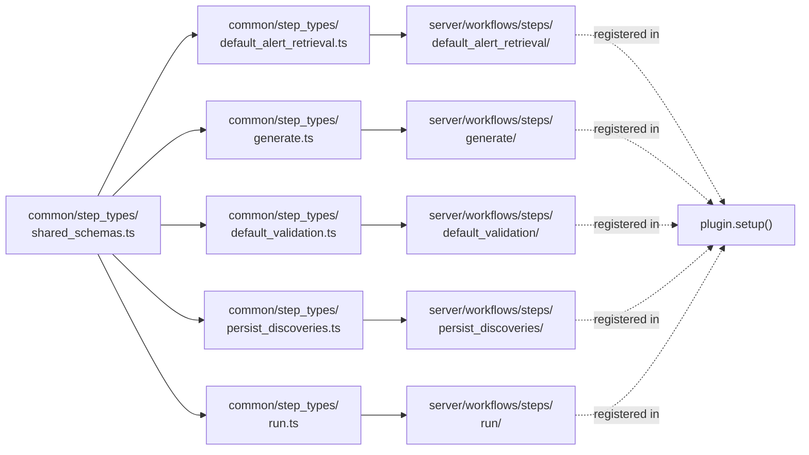

# Attack Discovery Workflow Steps

This document is the contract reference for the five Attack Discovery workflow steps: schema source, anonymization-boundary flow, per-step justification (why a step instead of a REST endpoint), failure modes, and the checklist for adding a new step.

For the system-level architecture (three execution paths, the orchestrator, security surfaces, etc.), see the canonical [discoveries plugin README](../../../README.md).

## Schema source: `@kbn/zod/v4` (NOT v3)

> **Workflow step schemas MUST use `@kbn/zod/v4`.** Auto-generated REST schemas use `@kbn/zod` v3, which has incompatible internal structures (v4 enums carry `.values`; v3 enums do not). Casting v3 schemas to v4 only changes TypeScript types, not runtime behavior — and surfaces at runtime as `TypeError: Cannot read properties of undefined (reading 'values')` in the Workflows UI.

This is a platform-level requirement of the Workflows engine; the rule applies to every workflow step in Kibana, not just Attack Discovery.

### Correct pattern

```typescript
import { z } from '@kbn/zod/v4';
import type { CommonStepDefinition } from '@kbn/workflows-extensions/common';

export const MyStepInputSchema = z.object({
  type: z.enum(['option_a', 'option_b']),
  config: z.object({ field: z.string() }),
});

export const MyStepOutputSchema = z.object({ result: z.string() });

export const MyStepCommonDefinition: CommonStepDefinition<
  typeof MyStepInputSchema,
  typeof MyStepOutputSchema
> = {
  id: 'my.step',
  inputSchema: MyStepInputSchema,
  outputSchema: MyStepOutputSchema,
};
```

### Anti-pattern (causes runtime errors)

```typescript
// ⛔ DO NOT DO THIS — v3 schemas cast to v4 break at runtime
import type { z as zV4 } from '@kbn/zod/v4';
import { GeneratedSchema } from '@kbn/discoveries-schemas'; // v3

const toV4Schema = <T>(schema: unknown): zV4.ZodType<T> =>
  schema as zV4.ZodType<T>; // ⛔ unsafe cast; runtime fails
```

## Overview

Attack Discovery registers **five** workflow step types. Each step is a server-side `createServerStepDefinition` backed by a shared common definition in `common/step_types/`.

| Step Type ID | Category | Status |
|---|---|---|
| `attack-discovery.defaultAlertRetrieval` | Elasticsearch | Implemented |
| `attack-discovery.generate` | AI | Implemented |
| `attack-discovery.defaultValidation` | Kibana | Implemented |
| `attack-discovery.persistDiscoveries` | Kibana | Implemented |
| `attack-discovery.run` | AI | Implemented |

## Anonymization-boundary contract per step

The anonymization boundary sits at `defaultAlertRetrieval`. Everything downstream operates on anonymized strings; the `replacements` map is the only bridge back to real values and is **excluded by the output schema** of `attack-discovery.run` so user-authored workflows cannot inadvertently log or forward the de-anonymization key.

| Step | Input | Output | `replacements` flow |
|---|---|---|---|
| `defaultAlertRetrieval` | DSL filter / ES\|QL query | `string[]` (anonymized) + `replacements` | **produced** |
| `generate` | `string[]` (anonymized strings only) | `attack_discoveries` | passes through |
| `defaultValidation` | `attack_discoveries` | validation result | not in output (consumed internally for hallucination check) |
| `persistDiscoveries` | validated discoveries + `replacements` | persisted IDs | consumed (de-anonymize on display) |
| `run` | retrieval + gen + validate config | discoveries (no `replacements`) | **excluded by output schema** |

The `generate` step's input contract is `alerts: z.array(z.string()).min(1)` — anonymized strings only. A `string[]` schema cannot carry nested fields that might leak sensitive data, and Liquid filters cannot inadvertently expose nested fields between steps.

## Step-definition wiring



## Why Steps Instead of REST Endpoints

All five steps share the same fundamental justification for being workflow steps rather than REST endpoints:

1. **Composability**: Steps can be wired together in user-authored YAML workflows via Liquid expressions. A REST endpoint requires the caller to handle HTTP, authentication, error mapping, and response parsing — none of which are necessary when data flows between steps within a single workflow execution.
2. **Observability**: Each step execution is visible in the Workflows app with inputs, outputs, timing, and status. A REST call from within a workflow would appear as an opaque HTTP request with no structured observability.
3. **Timeout management**: The workflow engine manages step timeouts (`timeout` field in YAML). A REST call would need its own timeout handling, creating a nested timeout problem.
4. **Authentication propagation**: Steps inherit the workflow execution's authentication context via `context.contextManager.getFakeRequest()`. A REST call would need to forward credentials explicitly.
5. **Abort signal propagation**: The workflow engine passes an `AbortSignal` to each step (`context.abortSignal`). Steps can cancel long-running operations (e.g., LLM calls) when the workflow is cancelled. REST endpoints cannot receive abort signals from the workflow engine.

---

## Step 1: `attack-discovery.defaultAlertRetrieval`

### Purpose

Retrieves security alerts from Elasticsearch and anonymizes sensitive fields, producing `string[]` alert representations suitable for LLM consumption.

### Consumer

- **Default pipeline**: The `_generate` endpoint's orchestrator invokes the `default-attack-discovery-alert-retrieval` workflow, which contains this step.
- **Scheduled generation**: The `workflowExecutor` invokes the same pipeline for alerting-framework-based schedules.

### User Pattern

```yaml
steps:
  - name: retrieve_alerts
    type: attack-discovery.defaultAlertRetrieval
    timeout: '5m'
    with:
      alerts_index_pattern: .alerts-security.alerts-default
      anonymization_fields: ${{ inputs.anonymization_fields }}
      api_config: ${{ inputs.api_config }}
      size: 150
```

### Why Not a REST Endpoint

Beyond the shared reasons above, alert retrieval has a specific justification: the **anonymization fields** are user-configurable and stored in a Kibana saved object index. A REST endpoint would need to accept these as a request parameter (bloating the API surface) or fetch them internally (removing configurability). As a step, the orchestrator fetches anonymization fields once and passes them as input, keeping the step stateless and testable.

Additionally, the step supports two retrieval modes — DSL query and ES|QL query — selected by the presence of the `esql_query` input. This modal behavior is natural for a step (the workflow decides which inputs to provide) but awkward for a REST endpoint (which would need a mode parameter or two separate endpoints).

### Inputs/Outputs Summary

| Direction | Key Fields |
|-----------|------------|
| **Input** | `alerts_index_pattern`, `anonymization_fields`, `api_config`, `esql_query` (optional), `filter`, `size`, `start`/`end`, `replacements` |
| **Output** | `alerts` (string[]), `anonymized_alerts` (Document[]), `replacements`, `api_config`, `connector_name`, `alerts_context_count` |

---

## Step 2: `attack-discovery.generate`

### Purpose

Invokes the LangGraph-based generation graph with pre-retrieved anonymized alerts to produce attack discovery objects.

### Consumer

- **Default pipeline**: The `attack-discovery-generation` workflow contains this step, invoked by the orchestrator after alert retrieval.
- **Custom workflows**: Advanced users can compose this step with custom retrieval logic.

### User Pattern

```yaml
steps:
  - name: generate
    type: attack-discovery.generate
    timeout: '10m'
    with:
      alerts: ${{ steps.retrieve.output.alerts }}
      api_config: ${{ inputs.api_config }}
      replacements: ${{ steps.retrieve.output.replacements }}
      type: attack_discovery
```

### Why Not a REST Endpoint

The generation step wraps LangGraph execution, which is long-running (2–10 minutes) and benefits from the workflow engine's abort signal propagation. If generation were a REST endpoint called from within a workflow, cancelling the parent workflow would not cancel the in-flight LLM calls — the HTTP request would continue to completion, wasting LLM tokens and compute.

The step also needs access to `actionsClient` (for connector execution), `savedObjectsClient`, and `esClient` — all of which require a scoped request. The workflow execution context provides this via `getFakeRequest()`. A REST endpoint would need to re-authenticate, adding latency and complexity.

The `_generate/graph` endpoint (now removed) was the REST-endpoint equivalent of this step. It was removed precisely because it produced orphaned results and bypassed validation — problems that do not exist when generation is a composable step.

### Inputs/Outputs Summary

| Direction | Key Fields |
|-----------|------------|
| **Input** | `alerts` (string[], min 1), `api_config`, `replacements`, `size`, `type` |
| **Output** | `attack_discoveries` (AttackDiscovery[] or null), `execution_uuid`, `replacements` |

---

## Step 3: `attack-discovery.defaultValidation`

### Purpose

Performs hallucination detection (verifying that alert IDs referenced in discoveries actually exist) and deduplication against previously persisted discoveries.

### Consumer

- **Default pipeline**: The `attack-discovery-validate` workflow's first step.
- **Custom validation workflows**: Users can create workflows that add custom filtering logic before or after this step.

### User Pattern

```yaml
steps:
  - name: validate
    type: attack-discovery.defaultValidation
    with:
      attack_discoveries: ${{ steps.generate.output.attack_discoveries }}
      api_config: ${{ inputs.api_config }}
      connector_name: ${{ inputs.connector_name }}
      generation_uuid: ${{ steps.generate.output.execution_uuid }}
      replacements: ${{ steps.generate.output.replacements }}
```

### Why Not a REST Endpoint

Validation requires an Elasticsearch query to check whether referenced alert IDs exist — a server-side operation that needs the current user's permissions. As a step, it inherits the execution context's authentication. As a REST endpoint, it would need to be called with the user's credentials, and the caller would need to serialize and send the full list of attack discoveries over HTTP — potentially a large payload.

More importantly, validation is a **mid-pipeline operation** that feeds directly into persistence. The tight coupling between "validate → persist" is natural in a workflow (one step's output flows to the next) but awkward across REST calls (the caller must receive validated results, then POST them to a persist endpoint).

The `_validate` REST endpoint exists for backward compatibility but is not used by the workflow pipeline. Workflows use this step directly.

### Inputs/Outputs Summary

| Direction | Key Fields |
|-----------|------------|
| **Input** | `attack_discoveries`, `api_config`, `connector_name`, `generation_uuid`, `replacements`, `alerts_index_pattern` (optional) |
| **Output** | `validated_discoveries`, `filtered_count`, `filter_reason` (optional) |

---

## Step 4: `attack-discovery.persistDiscoveries`

### Purpose

Writes validated attack discoveries to the ad-hoc Attack Discovery data store as alert documents, with deduplication against existing discoveries in the same space.

### Consumer

- **Default pipeline**: The `attack-discovery-validate` workflow's second step (after validation).
- **Scheduled generation**: The `workflowExecutor` persists via the alerting framework's `alertsClient` instead, but uses the same underlying `validateAttackDiscoveries` function for deduplication logic.

### User Pattern

```yaml
steps:
  - name: persist
    type: attack-discovery.persistDiscoveries
    with:
      attack_discoveries: ${{ steps.validate.output.validated_discoveries }}
      anonymized_alerts: ${{ inputs.anonymized_alerts }}
      api_config: ${{ inputs.api_config }}
      connector_name: ${{ inputs.connector_name }}
      generation_uuid: ${{ inputs.generation_uuid }}
      alerts_context_count: ${{ inputs.alerts_context_count }}
```

### Why Not a REST Endpoint

Persistence writes to the Attack Discovery alerts index using the ad-hoc `IRuleDataClient`. This client is plugin-internal and not exposed via any public API. A REST endpoint would need to wrap this client, creating a new API surface for a single consumer.

As a step, persistence also benefits from the workflow's authentication context to resolve the space ID and authenticated user — both required for correct index targeting and audit logging. A REST endpoint would duplicate this resolution logic.

The step also handles deduplication by querying the existing index for matching discoveries. Performing this check and the subsequent write atomically (within a single step execution) avoids race conditions that could arise if dedup-check and write were separate HTTP calls.

### Inputs/Outputs Summary

| Direction | Key Fields |
|-----------|------------|
| **Input** | `attack_discoveries`, `anonymized_alerts`, `api_config`, `connector_name`, `generation_uuid`, `alerts_context_count`, `replacements`, `enable_field_rendering`, `with_replacements` |
| **Output** | `persisted_discoveries`, `duplicates_dropped_count` |

---

## Step 5: `attack-discovery.run`

### Purpose

Executes the full Attack Discovery pipeline (retrieval → generation → validation → persistence) as a single step. Supports both sync mode (returns discoveries inline) and async mode (returns `execution_uuid` immediately).

### Consumer

- **Agent Builder tools**: Need inline results from a single step invocation (sync mode).
- **Simplified workflows**: Users who want full AD capability without composing four steps.
- **Automation scripts**: External systems that invoke workflows and need a simple interface.

### User Pattern

```yaml
steps:
  - name: discover
    type: attack-discovery.run
    with:
      connector_id: ${{ inputs.connector_id }}
```

Or with custom pre-retrieved alerts:

```yaml
steps:
  - name: discover
    type: attack-discovery.run
    with:
      connector_id: ${{ inputs.connector_id }}
      alerts: ${{ steps.custom_retrieval.output.alerts }}
      alert_retrieval_mode: provided
```

### Why Not a REST Endpoint

The `_generate` endpoint is the REST equivalent for async mode, and it remains available. The `run` step exists because:

1. **Sync mode cannot be a REST endpoint**: Blocking an HTTP connection for 2–10 minutes is not viable in production (proxy timeouts, browser disconnects). Within a workflow, the step can block as long as its `timeout` allows because the workflow engine manages the execution lifecycle.
2. **Input simplification**: As a step, `run` resolves defaults (anonymization fields, connector name, alerts index pattern) from the execution context. A REST endpoint would need all of these as request parameters.
3. **Output security**: The step deliberately excludes the replacements map from its output (see Architecture Decisions in the plugin README). A REST endpoint returning discoveries would need a separate mechanism to suppress sensitive data.
4. **Composition**: A workflow can use `run` as one step among many. For example, a workflow could run Attack Discovery, then pass results to a `notify` step — all within a single workflow definition.

### Inputs/Outputs Summary

| Direction | Key Fields |
|-----------|------------|
| **Input** | `connector_id` (required), `alert_retrieval_mode` (enum: `custom_query`\|`disabled`\|`esql`\|`provided`, default `sync`), `mode` (enum: `async`\|`sync`, default `sync`), `alerts` (string[], optional pre-retrieved), `size`, `start`/`end`, `filter`, `esql_query`, `alert_retrieval_workflow_ids`, `validation_workflow_id`, `additional_context` |
| **Output** | `attack_discoveries` (nullable array), `execution_uuid`, `alerts_context_count`, `discovery_count` |

---

## Common Definition Pattern

Every step follows the same structural pattern:

```
common/step_types/<step_name>.ts        → StepTypeId, InputSchema, OutputSchema, CommonDefinition
server/workflows/steps/<step_name>/     → getXxxStepDefinition() wrapping CommonDefinition with handler
```

The common definition is a `CommonStepDefinition<TInput, TOutput>` that includes:

- `id`: Step type identifier (e.g., `attack-discovery.generate`)
- `category`: `StepCategory.Elasticsearch | StepCategory.Ai | StepCategory.Kibana`
- `label`: Human-readable name for the step catalog UI
- `description`: One-sentence description
- `inputSchema`: Zod schema defining the step's input contract (`@kbn/zod/v4`)
- `outputSchema`: Zod schema defining the step's output contract (`@kbn/zod/v4`)

This separation ensures that schema changes are reflected in both the step catalog and the server-side handler, and that input/output validation is enforced by the workflow engine before the handler executes.

## Failure modes

| Symptom | Likely cause | Where to look |
|---------|--------------|---------------|
| Step missing from the Workflows step catalog | Plugin scaffold did not register it (or FF is OFF) | `plugin.setup()` step registration; verify `securitySolution.attackDiscoveryWorkflowsEnabled: true` |
| `TypeError: Cannot read properties of undefined (reading 'values')` in Workflows UI | v3-zod schema cast to v4 | Check the step's `common/step_types/` file imports `from '@kbn/zod/v4'` directly, not via a v3 cast |
| Step times out | Step's `timeout` value (in YAML) too short relative to LLM/connector latency | Workflow YAML; LLM connector configuration; the layered timeout architecture in the canonical README |
| Step cancellation does not stop in-flight LLM calls | Handler ignores the `AbortSignal` from the workflow context | `context.abortSignal` must be threaded into the `actionsClient`/`getFakeRequest()` call |
| Anonymized alerts appear with raw PII | Step receives raw alert objects (not `string[]`) | Verify the upstream step's output schema is `string[]`; never accept structured alert objects in `generate` |
| Validation returns 0 valid discoveries | Hallucination detection rejected all of them (alert IDs in discoveries don't match retrieved alerts) | Check `defaultAlertRetrieval` output's anonymization config includes `_id` |
| Schema mismatch at the step boundary | Handler returns a shape the `outputSchema` rejects | Workflow engine surfaces a validation error before the next step starts; fix the handler or schema |

## Adding a new step

1. **Create the common definition** in [`common/step_types/<step_name>.ts`](../../../common/step_types/):
   - `import { z } from '@kbn/zod/v4'` — never v3
   - Export `MyStepInputSchema`, `MyStepOutputSchema`, `MyStepCommonDefinition: CommonStepDefinition<...>`
   - `id` follows the `attack-discovery.<verb>` convention
2. **Create the server handler** in [`server/workflows/steps/<step_name>/`](.):
   - `helpers/<helper_name>/index.ts` + `helpers/<helper_name>/index.test.ts` for any non-trivial helper (per `identity.md` layout rule)
   - Wrap with `createServerStepDefinition(MyStepCommonDefinition, handler)`
   - Use `context.contextManager.getFakeRequest()` to inherit the workflow execution's auth scope; never use `asInternalUser`
   - Thread `context.abortSignal` into any long-running call (LLM, connector, ES query)
3. **Register the step** in [`plugin.setup()`](../../plugin.ts) via `tryRegisterStep` (which records `StepRegistrationResult` for the startup health check).
4. **Write Jest unit tests** alongside the handler. Run with `node scripts/jest --coverage <path-to-step>`.
5. **If the step joins a default workflow YAML**, update the bundled YAML and the integrity manifest (PR 9 self-healing verifies the YAML byte-stably; whitespace-only diffs trigger drift detection).
6. **Add a row to the canonical [discoveries plugin README](../../../README.md) Workflow Steps reference table.**
7. **Update this README's anonymization-boundary table** if the step receives or produces `replacements`.
