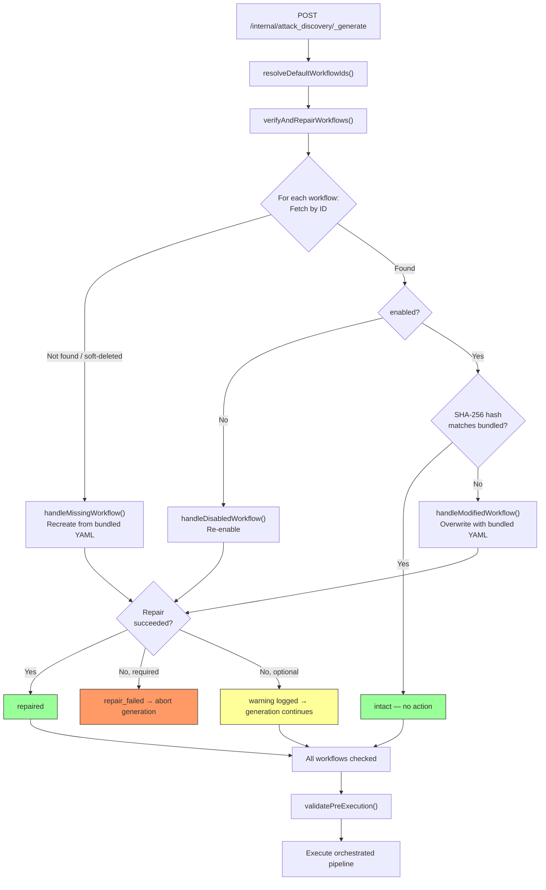

# System Workflow Workarounds

## Background

The Attack Discovery 2.0 Workflows Integration ships **6 bundled workflows** (3 required, 3 optional/example) and **6 custom step types** as part of the `discoveries` plugin. These workflows are essential for Attack Discovery to function correctly.

The Kibana Workflows platform does not yet have a first-class concept of **managed** or **system** workflows — bundled workflows are stored identically to user-created ones and are fully mutable via the Workflows UI and API. This means users can edit, disable, or delete workflows that Attack Discovery depends on, silently breaking the feature.

To ship Attack Discovery 2.0 without waiting for platform support, we implemented **plugin-side workarounds** that approximate managed workflow behavior. This document describes those workarounds and maps them to the platform requirements defined in the [managed workflows feature request](#feature-request-reference).

---

## Workaround Systems

### 1. WorkflowInitializationService (Lazy Per-Space Provisioning)

A singleton service that ensures bundled workflows exist in each Kibana space. It runs **lazily on the first request** to a space (not on space creation), and:

- Calls `registerDefaultWorkflows()` to create all 6 bundled workflows from YAML definitions
- Caches initialization results per space to avoid redundant provisioning
- Implements **exponential backoff** on failure (30s → 2min → 4min → 8min, etc.)
- Eagerly initializes the `default` space when any non-default space is first accessed

**Limitation:** Provisioning is request-triggered, not event-driven. Workflows won't exist in a space until the first Attack Discovery request is made there.

### 2. Self-Healing Gateway (Verify-and-Repair)

Before **every generation request**, a self-healing gate runs between workflow ID resolution and pre-execution validation. It verifies that stored workflows match their bundled definitions and repairs any drift:

| Scenario | Detection | Repair Action |
|----------|-----------|---------------|
| **Workflow modified** | SHA-256 hash of stored YAML ≠ bundled hash | Overwrite with bundled YAML |
| **Workflow deleted** (soft-delete) | `getWorkflowsByIds()` returns empty array | Recreate from bundled YAML |
| **Workflow disabled** | `enabled === false` | Re-enable via `updateWorkflow({ enabled: true })` |
| **Workflow missing** | Not found in space | Create from bundled YAML |

Required workflow repair failures **abort generation**. Optional workflow failures are logged as warnings and generation continues.

### 3. Tag-Based Discovery

Without deterministic IDs, the plugin discovers its bundled workflows by searching for unique tags (e.g., `discoveries:attackDiscovery:generation`). This adds query overhead compared to direct ID lookup but provides a reliable discovery mechanism.

---

## Self-Healing Flow

### Repair Outcomes

| Status | Meaning | Pipeline Effect | Telemetry |
|--------|---------|-----------------|-----------|
| `all_intact` | All workflows match bundled definitions | Continues | None |
| `repaired` | One or more workflows restored | Continues | `workflow_modified` event per workflow |
| `repair_failed` | Required workflow(s) could not be restored | **Aborted** with `generation-failed` event | None (pipeline aborted) |

---

## Requirements Mapping

The table below maps each requirement from the managed workflows feature request to the workaround implemented (if any) in the `discoveries` plugin.

| # | Requirement | Priority | Workaround Status | Workaround Description |
|---|-------------|----------|-------------------|------------------------|
| **R1** | Managed/system workflow flag | P0 | **Partial** | No `managed` flag exists. Self-healing treats bundled workflows as immutable by reverting any user changes before each generation run. |
| **R2** | Server-side enforcement of read-only | P0 | **Partial** | No API-level enforcement (users can still call `PUT`/`DELETE` on bundled workflows). Changes are reverted reactively by the self-healing gate on the next generation request, not proactively blocked. |
| **R3** | UI enforcement + indication | P1 | **No workaround** — deferred to platform | Bundled workflows appear identical to user workflows in the Workflows UI. No visual distinction, and edit/delete actions are fully available. |
| **R4** | Plugin-level bundled workflow registration API | P1 | **Yes** | `WorkflowInitializationService` + `registerDefaultWorkflows()` implements plugin-level provisioning from bundled YAML definitions, with per-space caching, retry/backoff, and cache invalidation on repair. |
| **R5** | Automatic provisioning for new spaces | P1 | **Partial** | Provisioning is lazy (triggered on first request to a space), not event-driven on space creation. Also eagerly initializes the `default` space alongside non-default spaces. Workflows won't exist in a space until first use. |
| **R6** | Deterministic IDs for bundled workflows | P2 | **No workaround** — deferred to platform | IDs are auto-generated. Plugin discovers workflows via tag-based search, adding query overhead and complexity. |
| **R7** | Version/hash tracking for bundled workflows | P2 | **Yes** | SHA-256 hashes are computed from bundled YAML at first access and cached. Stored workflow YAML is hashed and compared against the bundled hash to detect drift without full string comparison. |
| **R8** | Clone managed workflows into user-owned | P1 | **No workaround** — deferred to platform | The existing clone API works but has no `managed` concept to distinguish the clone from the original. |
| **R9** | Privileged update path for managed workflows | P1 | **Yes** | Self-healing serves as the upgrade path: when a plugin ships updated bundled YAML, the hash mismatch triggers an overwrite on the next generation request, effectively applying the update. |
| **R10** | Prevent disable of managed workflows | P2 | **Yes** | The G1 self-healing fix (commit `ccbc1888`) detects disabled workflows (`enabled === false`) and re-enables them before generation. Disabled state is reverted reactively, not prevented. |

### Summary

- **Fully addressed (4):** R4, R7, R9, R10
- **Partially addressed (3):** R1, R2, R5
- **Not addressed (3):** R3, R6, R8

All workarounds are **reactive** (detect-and-repair) rather than **preventive** (block-and-reject). This means there is always a window between a user's mutation and the next generation request where the system is in a degraded state. A first-class managed workflow concept from the platform would eliminate this window and the plugin-side complexity entirely.

---

## References

### READMEs

- [Plugin README — Self-Healing section](./README.md) — Algorithm, outcomes table, error visibility matrix
- [Workflow Definitions README](./server/workflows/definitions/readme.md) — Bundled workflow definitions and self-healing cross-reference
- [Workflow Steps README](./server/workflows/steps/README.md) — All 6 step types with inputs/outputs

### Key Implementation Files

| File | Purpose |
|------|---------|
| `server/lib/workflow_initialization/index.ts` | `WorkflowInitializationService` — lazy per-space provisioning with retry/backoff |
| `server/lib/workflow_initialization/verify_and_repair_workflows/index.ts` | Self-healing: detect drift, re-enable, recreate, overwrite |
| `server/workflows/helpers/get_bundled_yaml_entries/index.ts` | Load bundled YAML files and compute SHA-256 hashes |
| `@kbn/discoveries` `impl/attack_discovery/generation/verify_workflow_integrity/index.ts` | Integration point: calls verify-and-repair, handles telemetry |
| `@kbn/discoveries` `impl/attack_discovery/generation/execute_generation_workflow.ts` | Execution flow: invokes self-healing gate before pipeline |

### Commits

- [`ccbc1888`](https://github.com/elastic/kibana/commit/ccbc1888fcf27a16d2a30abd029248c643e198eb) — Fix self-healing gaps G1 (disabled detection), G2 (soft-delete handling), G6 (optional workflow coverage)
- [`fc37af65`](https://github.com/elastic/kibana/commit/fc37af65c3a5a609efa97bbb4bfe0709936fe0ff) — Document self-healing algorithm, run/notify steps, and execution flow in READMEs
