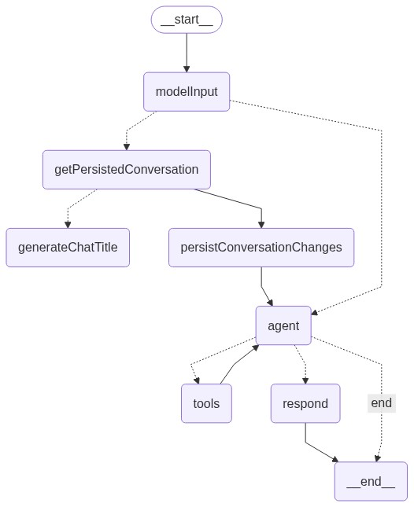
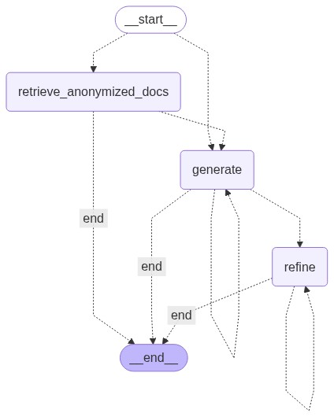

# Elastic AI Assistant

This plugin implements server APIs for the `Elastic AI Assistant`. Furthermore, it registers the `Elastic Assistant` in the navigation bar.

For further UI components, see `x-pack/platform/packages/shared/kbn-elastic-assistant`.

## Maintainers

Maintained by the Security Solution team

## Graph structure

### Default Assistant graph



### Default Attack discovery graph



### Default Defend insights graph


## Alert Investigation Pipeline

> **Status:** Spike / Proof-of-concept (see [security-team#16339](https://github.com/elastic/security-team/issues/16339))
>
> **Feature Flag:** `elasticAssistant.alertInvestigationPipelineEnabled` (disabled by default)

The pipeline automates the flow from raw security alerts to organized investigation cases with Attack Discovery. It lives under `server/lib/attack_discovery/pipeline/`.

### Enabling the Pipeline

This feature is experimental and disabled by default. To enable it, add to your `kibana.yml`:

```yaml
xpack.feature_flags.overrides:
  elasticAssistant.alertInvestigationPipelineEnabled: true
```

After enabling, restart Kibana and navigate to: http://localhost:5601/app/alert-investigation-pipeline

### Architecture

```
Unprocessed Alerts
        │
        ▼
┌─────────────────┐
│  Deduplication   │  Hash + Jaccard similarity clustering (Union-Find)
└────────┬────────┘
         ▼
┌─────────────────┐
│ Entity Extraction│  30+ ECS fields → 13 observable types
└────────┬────────┘
         ▼
┌─────────────────┐
│  Case Matching   │  Weighted entity overlap scoring against open cases
└────────┬────────┘
         ▼
┌──────────────────────────┐
│ Alert ↔ Case Attachment  │  Attach alerts to matched or new cases
└────────┬─────────────────┘
         ▼
┌─────────────────┐
│ Incremental AD   │  Delta-based Attack Discovery per case
└─────────────────┘
```

### Deduplication Strategy

**Current (Phase 1)**: Jaccard similarity (lexical matching)
- Fast, deterministic, works in all deployments
- No ML node required, zero cost
- Handles exact/near-exact duplicates effectively (~85% accuracy)

**Future (Phase 2)**: ELSER semantic embeddings (tracked in [security-team#16415](https://github.com/elastic/security-team/issues/16415))
- Semantic understanding of alert content
- Handles encoded commands, randomized filenames, different log sources
- Expected +15-30% improvement in dedup rate
- Requires ML node with ELSER deployed

### Execution Models

The pipeline supports **two execution paths**:

#### 1. Direct API Route (Recommended for Phase 1)
- **Route**: `POST /internal/elastic_assistant/alert_investigation/_run`
- **Implements**: All 6 stages (fetch → dedup → extract → match → AD → tag)
- **Status**: ✅ **Fully functional** (ready to use)
- **Use when**: Immediate production use, full pipeline execution

#### 2. Elastic Workflows (Future)
- **Workflow ID**: `security.alertInvestigationPipeline`
- **Steps**: 6 registered workflow steps (can be composed in Workflows UI)
- **Status**: ⚠️ **Partial** - Steps 1-3 functional, Steps 4-6 require Kibana context not available in workflow handlers
- **Limitation**: Workflow steps don't have access to Cases API, Request context needed for case attachment
- **Roadmap**: Tracked in [platform#XXXXX](link) - Add Kibana services to workflow context
- **Use when**: Workflow context platform gap is resolved

### Pipeline Stages

| Stage | Module | Status | Description |
|-------|--------|--------|-------------|
| **1. Fetch** | `workflow_steps/` | ✅ Full | Queries `.alerts-security.alerts-default` for unprocessed alerts |
| **2. Deduplicate** | `deduplication/` | ✅ Full | Jaccard similarity clustering (Phase 1); ELSER planned for [#16415](link) |
| **3. Extract entities** | `entity_extraction/` | ✅ Full | Maps 30+ ECS fields → 13 observable types with validation |
| **4. Match to cases** | `case_matching/` | ✅ Route / ⚠️ Workflow | Entity overlap scoring with inverted index (O(n×k) optimization) |
| **5. Incremental AD** | `case_integration/` | ✅ Route / ⚠️ Workflow | Delta-based Attack Discovery per affected case |
| **6. Tag processed** | `workflow_steps/` | ✅ Full | Marks alerts to prevent re-processing |

**Status Legend:**
- ✅ **Full** = Works in both routes and workflows
- ✅ **Route** = Works in API routes
- ⚠️ **Workflow** = Scaffold only (needs platform context)

### API Routes (Recommended Path)

#### Run Complete Pipeline

```bash
POST /internal/elastic_assistant/alert_investigation/_run
```

Body:
```json
{
  "dry_run": false,
  "max_alerts": 500,
  "lookback_minutes": 15,
  "similarity_threshold": 0.85
}
```

**Response:**
```json
{
  "status": "complete",
  "alertsProcessed": 47,
  "alertsDeduplicated": 12,
  "deduplicationRate": 0.26,
  "leaderAlerts": 35,
  "entitiesExtracted": 284,
  "entityBreakdown": {
    "ipv4": 89,
    "hostname": 47,
    "user": 35,
    "process": 58,
    "file_hash": 23,
    "url": 12,
    "domain": 20
  },
  "clusters": [
    { "leaderId": "alert-1", "memberCount": 3 },
    { "leaderId": "alert-5", "memberCount": 2 }
  ]
}
```

#### Trigger Incremental AD for Case

```bash
POST /internal/elastic_assistant/alert_investigation/case/{caseId}/_trigger_ad
```

Body:
```json
{
  "alert_ids": ["alert-id-1", "alert-id-2", "alert-id-3"]
}
```

**Response:**
```json
{
  "caseId": "case-123",
  "triggered": true,
  "deltaAlerts": 3,
  "totalAlerts": 15,
  "previouslyProcessed": 12
}
```

### Elastic Workflows Integration

The pipeline registers **6 workflow step definitions** that can be composed in the Elastic Workflows UI:

| Step ID | Status | Description | Input | Output |
|---------|--------|-------------|-------|--------|
| `security.fetchUnprocessedAlerts` | ✅ Full | Fetch unprocessed alerts | `index_pattern`, `max_alerts`, `lookback_minutes` | `alert_ids[]`, `total_alerts` |
| `security.deduplicateAlerts` | ✅ Full | Deduplicate by Jaccard similarity | `alert_ids[]`, `threshold` | `leader_alert_ids[]`, `dedup_rate` |
| `security.extractEntities` | ✅ Full | Extract & validate entities | `alert_ids[]` | `entities[]`, `total_entities` |
| `security.matchAndAttachAlertsToCases` | ⚠️ Scaffold | Match to cases (needs Cases API) | `entities[]`, `leader_alert_ids[]` | `affected_case_ids[]` |
| `security.triggerIncrementalAd` | ⚠️ Scaffold | Trigger AD (needs AD function) | `affected_case_ids[]` | `ad_triggered`, `ad_results[]` |
| `security.tagProcessedAlerts` | ✅ Full | Tag alerts as processed | `alert_ids[]` | `tagged_count` |

**Workflow Execution:**

```yaml
# Example workflow definition (when platform gap resolved)
name: Alert Investigation Pipeline
trigger:
  schedule: "*/15 * * * *"  # Every 15 minutes

steps:
  - id: fetch
    type: security.fetchUnprocessedAlerts
    config:
      max_alerts: 500
      lookback_minutes: 15

  - id: dedup
    type: security.deduplicateAlerts
    config:
      alert_ids: "${steps.fetch.output.alert_ids}"
      similarity_threshold: 0.85

  - id: extract
    type: security.extractEntities
    config:
      alert_ids: "${steps.dedup.output.leader_alert_ids}"

  # Steps 4-6 require Cases API context (not yet available in workflows)
  # Use API route for full E2E execution until platform gap resolved
```

**Platform Gap:**
- Workflow step handlers receive only `context.contextManager.getScopedEsClient()`
- Case attachment needs: Cases API, Request context, SavedObjects client
- **Tracked in**: platform#XXXXX (Add Kibana service dependencies to workflow context)

**Current workaround**: Use API route `/alert_investigation/_run` for full E2E execution

### Configuration

All stages are independently toggleable via `PipelineConfig`. Defaults:

| Setting | Default | Description |
|---------|---------|-------------|
| `intervalMinutes` | `15` | Lookback window for fetching alerts |
| `deduplication.similarityThreshold` | `0.85` | Jaccard similarity threshold for clustering |
| `caseMatching.strategy` | `weighted` | Scoring strategy (`strict`, `relaxed`, `weighted`, `temporal`) |
| `caseMatching.matchThreshold` | `0.3` | Minimum score to match an alert to a case |
| `caseMatching.weights.ip` | `1.0` | Weight for IP entity matches |
| `caseMatching.weights.hostname` | `0.8` | Weight for hostname matches |
| `caseMatching.weights.user` | `0.7` | Weight for user matches |
| `caseMatching.weights.fileHash` | `1.0` | Weight for file hash matches |
| `caseMatching.temporalDecayDays` | `30` | Days after which case recency score decays to 0.1 |
| `incrementalAd.minNewAlerts` | `2` | Minimum new alerts before triggering incremental AD |

### Key design decisions

- **Observable type key mapping**: The pipeline uses bare keys (`ipv4`, `user`, `process`) internally, while the Cases plugin expects prefixed keys (`observable-type-ipv4`). Bidirectional mappings in `orchestrator.ts` and `case_matcher.ts` handle the translation.
- **Processed alert tracking**: Uses a dedicated hidden index (`.security-ad-processed-alerts-{spaceId}`) with optimistic concurrency control (`if_seq_no`/`if_primary_term`) and 3 retries for conflict resolution.
- **Deduplication**: Two-pass approach — exact hash match first, then Jaccard similarity within same-rule/same-host groups — using a Union-Find data structure for transitive clustering.
- **Building block exclusion**: Building block alerts (sub-alerts from certain rule types) are filtered out at fetch time across all entry points (orchestrator, route handler, workflow step).

### UI Dashboard

**Accessing the dashboard:**

1. Start Kibana: `yarn start`
2. Navigate to **"Security" → "Alert Investigation Pipeline (Spike)"** in the Kibana nav
3. **OR** directly visit: `http://localhost:5601/app/alert-investigation-pipeline`

**Dashboard features:**
- Real-time health monitoring (`healthy` / `degraded` / `unhealthy`)
- Performance metrics (success rate, avg duration, consecutive failures)
- Pipeline statistics (alerts processed, cases matched/created, AD triggered)
- Configuration UI (update thresholds, strategies, triggers)

**Screenshot after local testing:**
- See `docs/screenshots/` for demo walkthrough visuals

### Known limitations

- Hardcoded to `.alerts-security.alerts-default` index (default space only)
- Case matching limited to 100 most recently updated open cases
- Direct bulk writes to alert documents bypass the alerting framework
- UI dashboard is basic — production would need RBAC, i18n, error boundaries

## Development

### Generate graph structure

To generate the graph structure, run `yarn draw-graph` from the plugin directory.
The graphs will be generated in the `docs/img` directory of the plugin.

### Testing

**Unit tests:**

To run the tests for this plugin, run `node scripts/jest --watch x-pack/solutions/security/plugins/elastic_assistant/jest.config.js --coverage` from the Kibana root directory.

**Scout E2E tests (Pipeline Dashboard):**

```bash
# Run pipeline dashboard E2E tests
node scripts/scout run-tests \
  --arch stateful \
  --config x-pack/solutions/security/plugins/elastic_assistant/test/scout_ui/scout.config.ts \
  --testFiles "test/scout_ui/pipeline/alert_investigation_pipeline.spec.ts"
```

**Coverage:**
- ✅ Navigate to dashboard via Kibana nav
- ✅ Health status displays correctly
- ✅ Metrics load and render
- ✅ Refresh action works
- ✅ Error states handled gracefully
- ✅ No console errors on load
