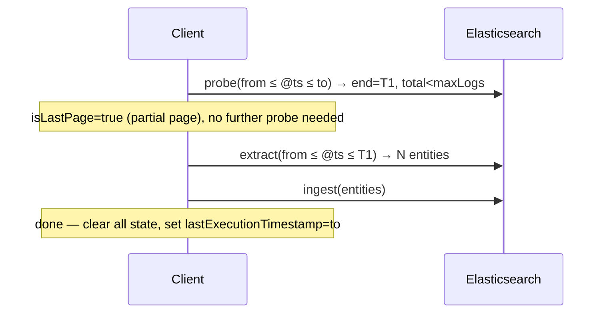
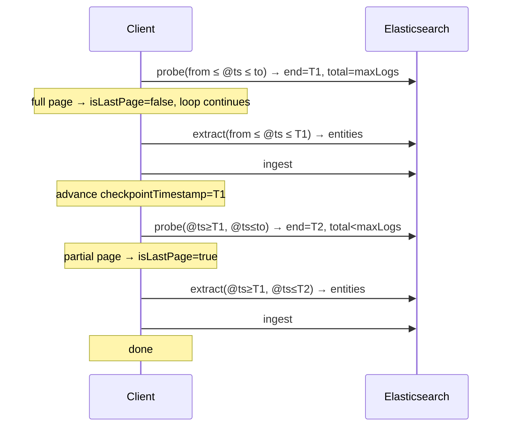
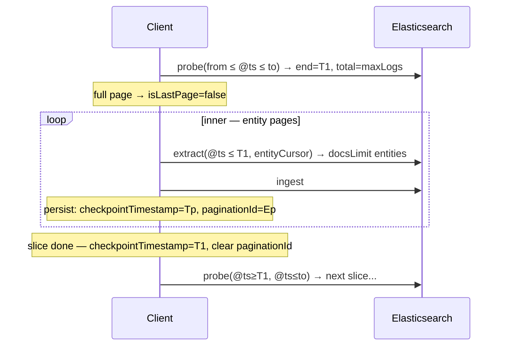
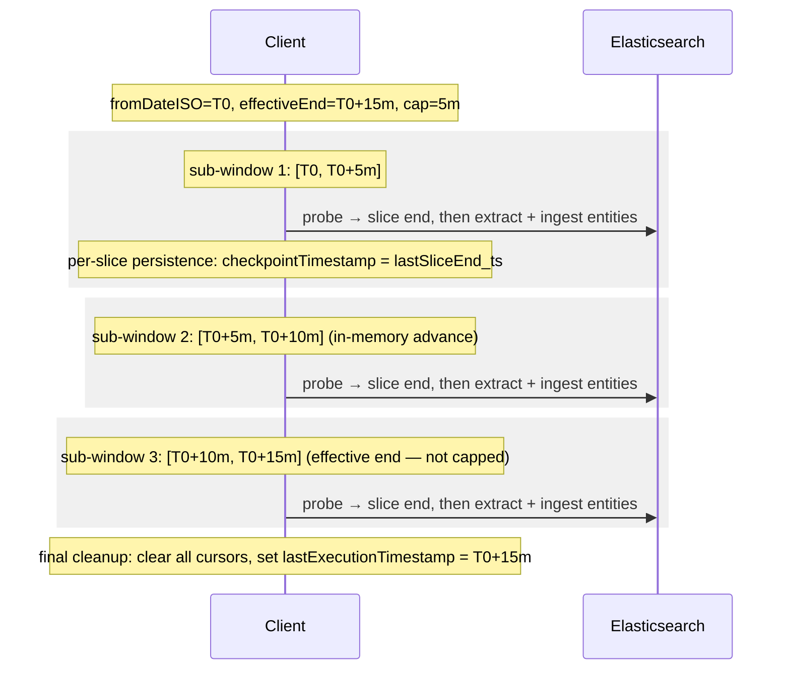
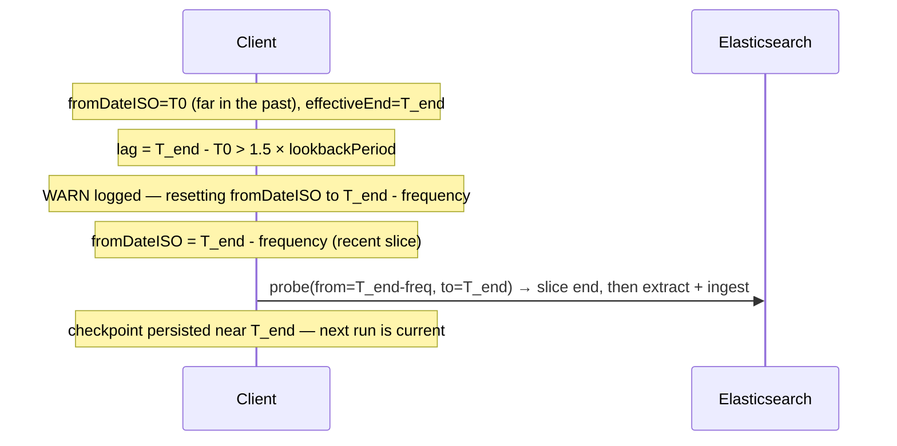
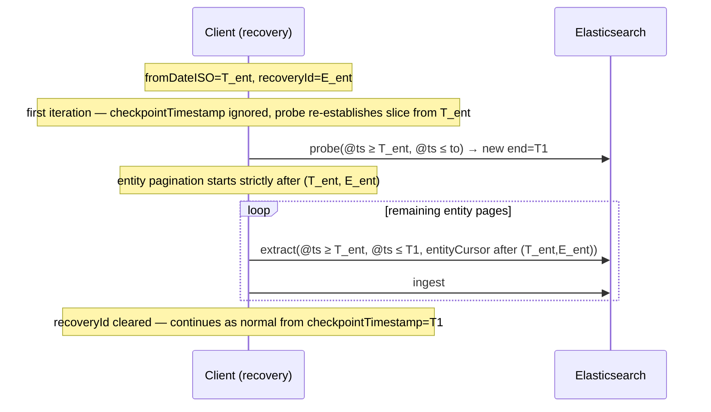
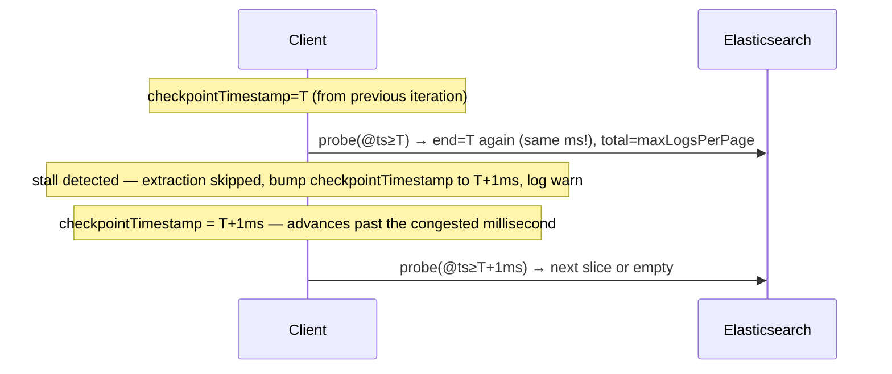
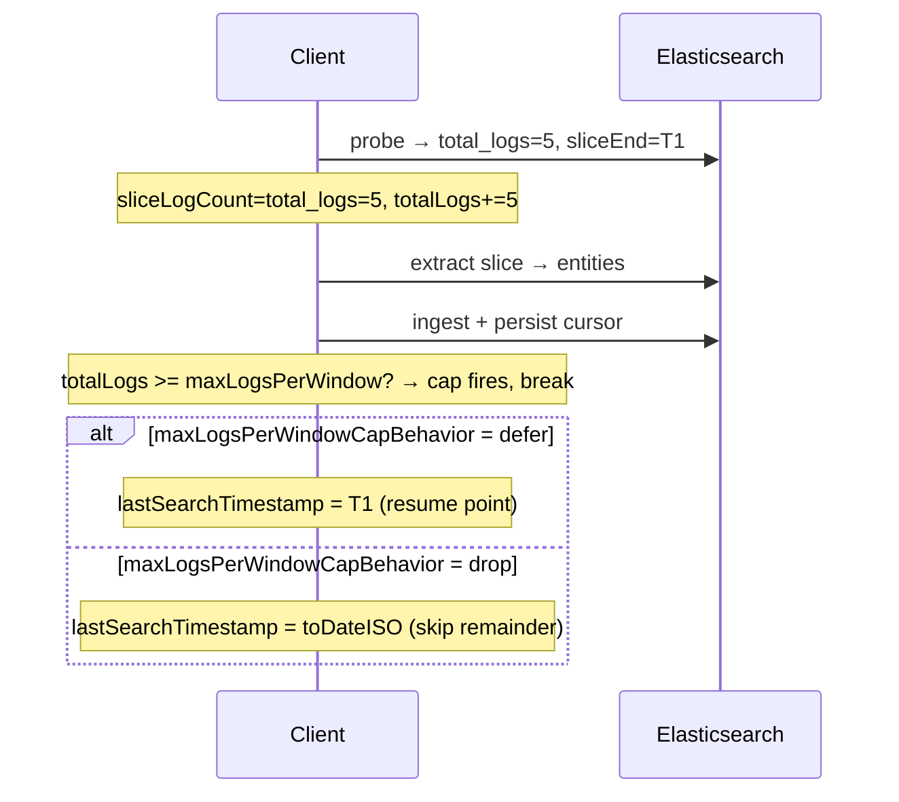

# Logs Extraction Pagination

Three nested loops process raw log documents into aggregated entity rows.

**Window cap outer loop**: When the gap between `fromDateISO` and the effective window end (`now - delay`) exceeds `maxTimeWindowSize + GRACE_PERIOD` (default `15m + 30s`), the run processes the time range as a sequence of capped `[fromSub, toSub]` sub-windows of width `maxTimeWindowSize`, advancing within a single execution until the effective end is reached. Sub-windows are an in-memory iteration concept — the saved-object schema is unaware of them. Crash recovery uses the per-slice persistence emitted by the inner outer-loop (last `checkpointTimestamp` written).  Manual `specificWindow` / `windowOverride` runs bypass capping and run as a single pass.

**Outer loop — log slices**: Each iteration runs a **boundary probe** (`buildLogPaginationCursorProbeEsql`) to locate the inclusive end of the next raw-log slice. The probe sorts by `@timestamp ASC`, caps at `maxLogsPerPage` via `LIMIT`, then aggregates `MAX(@timestamp)` and `COUNT(*)`. Because `COUNT(*)` is computed after `LIMIT`, `total_logs ≤ maxLogsPerPage`. A partial page (`total_logs < maxLogsPerPage`) signals the last slice; a full page (`total_logs = maxLogsPerPage`) means more slices may follow.

**Inner loop — entity pages**: Each log slice is processed via `buildLogsExtractionEsqlQuery`. Results are paginated by `(FirstSeenLogInPage, UntypedId)` up to `docsLimit` entities per query.

---

## Cursors

| Cursor | Persisted field | Semantics |
|--------|----------------|-----------|
| **Checkpoint** | `checkpointTimestamp` | Dual-purpose: (1) `fromDateISO` lower bound for the window on recovery; (2) inclusive `@timestamp >=` lower bound fed to the next probe after the first iteration. Set to the slice-end timestamp after each completed slice. Cleared to `null` when the full run completes. |
| **Entity cursor** | `paginationId` | Untyped entity ID of the last ingested entity page. Set mid-inner-loop; cleared when the slice completes. Used with `checkpointTimestamp` as the entity-level resume cursor `(checkpointTimestamp, paginationId)`. |

`checkpointTimestamp` is applied as an inclusive lower bound:
```
@timestamp >= TO_DATETIME(checkpointTimestamp)
```

The base time-window filter also uses `@timestamp >= fromDateISO` (inclusive). After the first outer-loop iteration, `checkpointTimestamp` tightens this bound to the previously completed slice end.

The boundary is inclusive, which means the slice-end document is re-processed on the next iteration. This is safe because all aggregations (`TOP`, `LAST`, `MIN`, `MV_UNION`) are idempotent.

---

## Happy path: single log page, single entity page

All logs fit in one slice; all entities fit in one page.



---

## Happy path: multiple log pages, one entity page each

Logs exceed `maxLogsPerPage`. Each slice produces fewer than `docsLimit` entities.



After each slice, `checkpointTimestamp` advances to the slice end (`@timestamp >= T`). The slice-end doc may be re-processed on the next probe, but aggregations are idempotent so this is safe.

---

## Happy path: multiple log pages, multiple entity pages

Entity count within a slice exceeds `docsLimit`, requiring inner iterations. State is persisted after each entity page in case of interruption.



If the process crashes mid inner-loop, `paginationId` is set in the saved state. The next run enters recovery (see below).

---

## Lagging environment: multiple sub-windows in one run

When `effectiveWindowEnd - fromDateISO > maxTimeWindowSize + GRACE_PERIOD`, the time range is processed as a sequence of capped sub-windows within a single `extractLogs` run. Each sub-window runs the existing slice/entity loops to completion. Persistence between sub-windows is whatever the inner outer-loop already wrote (per-slice `checkpointTimestamp`); no extra checkpoint round-trip is added.



If the process is aborted between sub-windows, recovery resumes from the last persisted slice end (`checkpointTimestamp` set by the inner outer-loop after the most recently completed slice) — not from a sub-window boundary. The next run re-establishes its own sub-window cap from that resume point.

---

## Lag cutoff circuit breaker

When queries are consistently slow (e.g., large index, high ingest rate, under-sized ES cluster), each run may process less wall-clock data than real-time advances. The engine falls progressively further behind `now - delay`. Sub-window capping bounds per-query cost but does not help catchup — it just slices an ever-growing backlog into fixed-size pieces.

The lag cutoff is a circuit breaker applied **before** the sub-window loop begins. If the computed `fromDateISO` is more than `1.5 × lookbackPeriod` before `effectiveWindowEnd`, the engine is so far behind that it cannot catch up. Rather than continuing to work through stale data, the window start is reset to `effectiveWindowEnd - frequency` — a single, frequency-sized slice of recent data.

| Condition | Action |
|-----------|--------|
| `lag ≤ 1.5 × lookbackPeriod` | Normal operation; window unchanged. |
| `lag > 1.5 × lookbackPeriod` | `fromDateISO` reset to `effectiveWindowEnd - frequency`; skipped range dropped; WARN logged. |

After the cycle, the checkpoint is persisted at or near the frequency-sized window's end. The next run starts from there, naturally within the real-time window.

The WARN log includes: original `from`, new `from`, `effectiveEnd`, `lagMs`, and `droppedMs` for observability.



**What is dropped**: all data between the original `fromDateISO` and `effectiveWindowEnd - frequency`. This is an explicit trade-off: maintaining real-time coverage is preferred over eventually processing old backlog data that would never catch up anyway.

**Manual override runs are exempt**: `specificWindow` / `windowOverride` calls supply explicit bounds and bypass the cutoff entirely (same as the sub-window cap).

---

## Recovery

A crash mid-entity-page leaves the following state on disk:

| Field | Value | Meaning |
|-------|-------|---------|
| `checkpointTimestamp` | `T_ent` | `MIN(@timestamp)` of logs in the last processed entity page; doubles as the inclusive probe lower bound on the next run |
| `paginationId` | `E_ent` | untyped ID of the last ingested entity |

On the next run `fromDateISO = T_ent` and `recoveryId = E_ent`.



The entity-level pagination WHERE uses `> T_ent OR (= T_ent AND untypedId > E_ent)` — entities already ingested before the crash are skipped; the slice is re-established from `T_ent` inclusive.

A crash *between* sub-windows is indistinguishable from a crash at a slice boundary: the most recently persisted state is `checkpointTimestamp = lastSliceEnd_ts` (from the inner outer-loop's per-slice `advanceEngineStateAfterLogPageCompletes`). The next run reads that as `fromDateISO` and re-establishes the sub-window cap from there — re-fetching the slice-boundary doc itself, which is harmless under the idempotent aggregations (`TOP`, `LAST`, `MIN`, `MV_UNION`).

---

## Edge cases

### Cap interaction with `specificWindow` / `windowOverride`

When a manual window is supplied (admin-triggered API call), the sub-window cap is bypassed and the supplied bounds are processed in a single pass via the existing slice/entity loops. State is not advanced — the user explicitly picked the bounds, and we do not silently shorten or shift them.

### Timestamp collision at a slice boundary

The log-slice cursor is timestamp-only (`@timestamp >= T`). Documents sharing the same millisecond are processed in undefined order, and the slice boundary is inclusive so the slice-end document is re-processed on the next iteration. Re-processing is safe because all aggregations (`TOP`, `LAST`, `MIN`, `MV_UNION`) are idempotent.

**Timestamp stall detection**: If more than `maxLogsPerPage` documents share a single millisecond, successive slices would all end at the same timestamp and the outer loop would make no progress. The client detects this condition (same slice-end timestamp as the previous slice start, full page) and bumps the cursor forward by 1ms without running entity extraction, emitting a `warn` log. Documents at the surplus millisecond beyond `maxLogsPerPage` are dropped.



### Full page (`total_logs == maxLogsPerPage`)

When the probe returns `total_logs == maxLogsPerPage` the slice is marked `isLastPage = false` — a full page means more documents may follow. Only a partial page (`total_logs < maxLogsPerPage`) signals the last slice. Because `total_logs` is `COUNT(*)` computed **after** `LIMIT maxLogsPerPage`, it never exceeds `maxLogsPerPage`.

---

## Volume cap

Two independent knobs bound how much work a single run does:

| Knob | Purpose |
|------|---------|
| `maxLogsPerPage` | Upper bound on raw log docs in **one slice** (probe `LIMIT`). |
| `maxLogsPerWindow` | Upper bound on raw log docs across **the entire run**. 0 = disabled. |

### Why logs, not entities

`maxLogsPerWindow` caps **raw log documents scanned**, not entity rows produced. Entities are aggregated outputs (one entity per unique `entity.id`) and can be far fewer than the logs they summarise. Capping on entities would allow unbounded log scanning, which is what operators want to prevent.

### How the cap is computed

After each probe the slice's log count is derived and accumulated:

```
sliceLogCount = probe.total_logs   // always ≤ maxLogsPerPage (COUNT(*) after LIMIT)
totalLogs    += sliceLogCount      // runs across all slices in the window
```

The cap fires **after** the slice's entity pages are ingested and state is persisted:

```
if maxLogsPerWindow > 0 && totalLogs >= maxLogsPerWindow:
    logsCapApplied = true
    break
```

This ensures every slice that starts is fully processed before stopping.



### Across sub-windows (lagging environments)

When the time range is split into sub-windows (see [Lagging environment](#lagging-environment-multiple-sub-windows-in-one-run)), the remaining budget shrinks across sub-windows:

```
remainingCap = maxLogsPerWindow - totalLogsAcrossSubWindows
```

Each sub-window receives `remainingCap` as its own `maxLogsPerWindow`. The cap fires in the first sub-window that exhausts the budget.

### Defer vs drop on cap

| `maxLogsPerWindowCapBehavior` | `lastSearchTimestamp` returned | Next run behaviour |
|---|---|---|
| `defer` | Slice end where cap fired | Resumes from cursor; processes remaining logs |
| `drop` | `toDateISO` (window end) | Cursor advances past uncapped logs; they are skipped |

### Disabling the cap

`maxLogsPerWindow = 0` disables the cap entirely — the per-slice check is skipped and the run processes all logs in the window.
