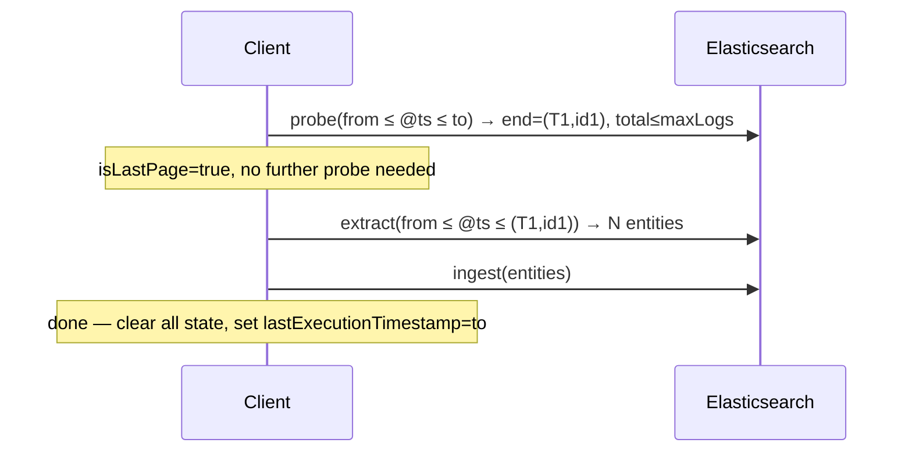
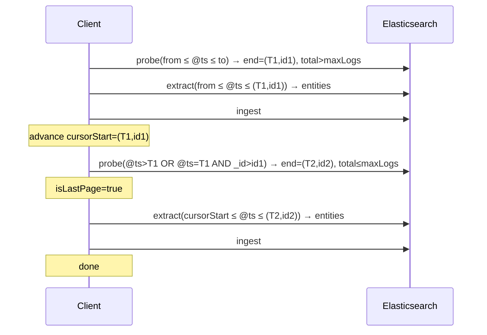
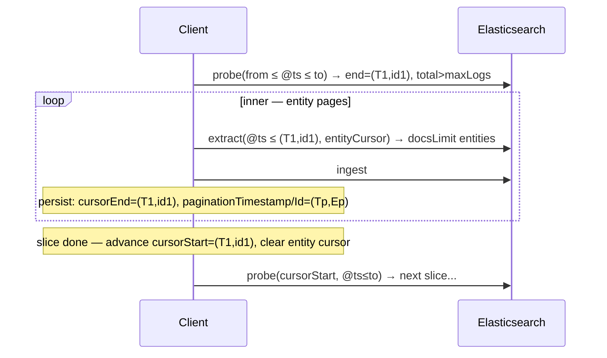
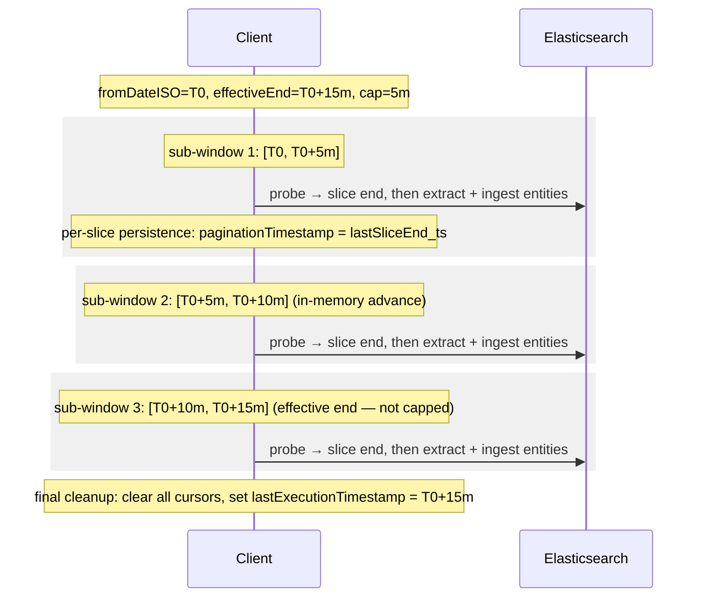
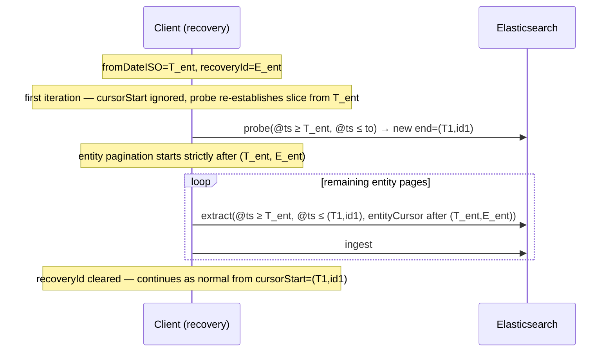
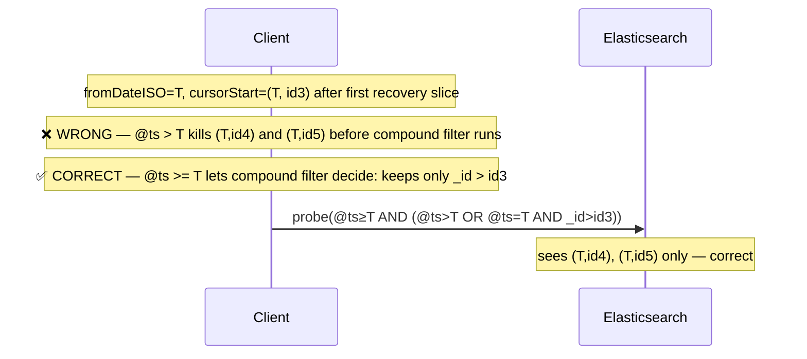
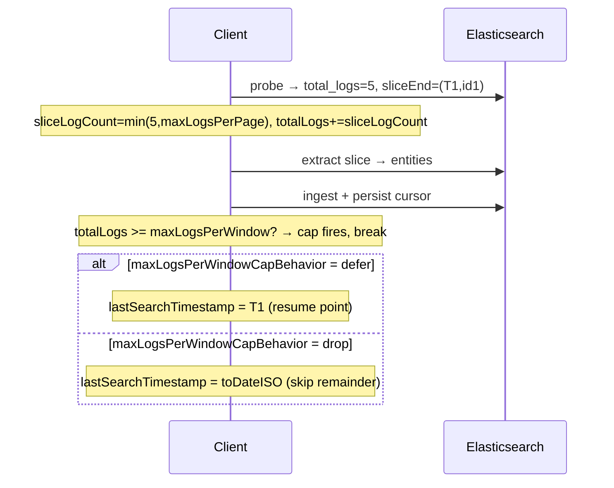

# Logs Extraction Pagination

Three nested loops process raw log documents into aggregated entity rows.

**Window cap outer loop**: When the gap between `fromDateISO` and the effective window end (`now - delay`) exceeds `maxTimeWindowSize + GRACE_PERIOD` (default `15m + 30s`), the run processes the time range as a sequence of capped `[fromSub, toSub]` sub-windows of width `maxTimeWindowSize`, advancing within a single execution until the effective end is reached. Sub-windows are an in-memory iteration concept — the saved-object schema is unaware of them. Crash recovery uses the per-slice persistence emitted by the inner outer-loop (last `paginationTimestamp` / `checkpointTimestamp` written). Manual `specificWindow` / `windowOverride` runs bypass capping and run as a single pass.

**Outer loop — log slices**: Each iteration runs a **boundary probe** (`buildLogPaginationCursorProbeEsql`) to locate the inclusive end of the next raw-log slice (up to `maxLogsPerPage` documents, sorted by `@timestamp ASC, _id ASC`). The probe returns `total_logs` (count before `LIMIT`) so the client knows when the window is exhausted.

**Inner loop — entity pages**: Each log slice is processed via `buildLogsExtractionEsqlQuery`. Results are paginated by `(FirstSeenLogInPage, UntypedId)` up to `docsLimit` entities per query.

---

## Cursors

| Cursor | Persisted fields | Semantics |
|--------|-----------------|-----------|
| **Log slice start** | `logsPageCursorStartTimestamp/Id` | Exclusive compound lower bound `(@timestamp, _id)` for the next probe. Set to the previous slice end after completing all entity pages. Doubles as the resume point on crash mid-run — no separate sub-window checkpoint is persisted. |
| **Log slice end** | `logsPageCursorEndTimestamp/Id` | Inclusive upper bound for the current slice. Set by the probe; cleared when the slice is fully processed. |
| **Entity cursor** | `paginationTimestamp/Id` | `(FirstSeenLogInPage, UntypedId)` of the last ingested entity page. Cleared when a slice finishes. |

`logsPageCursorStart` is a **compound** exclusive bound applied as:
```
(@timestamp > T) OR (@timestamp = T AND _id > id)
```

The time-window base filter always uses `@timestamp >= fromDateISO` (inclusive). The compound cursor owns the exclusive lower bound — never the time-window filter.

---

## Happy path: single log page, single entity page

All logs fit in one slice; all entities fit in one page.



---

## Happy path: multiple log pages, one entity page each

Logs exceed `maxLogsPerPage`. Each slice produces fewer than `docsLimit` entities.



After each slice, `logsPageCursorStart` advances to the slice end. The next probe's compound filter starts strictly after that document.

---

## Happy path: multiple log pages, multiple entity pages

Entity count within a slice exceeds `docsLimit`, requiring inner iterations. State is persisted after each entity page in case of interruption.



If the process crashes mid inner-loop, `paginationId` is set in the saved state. The next run enters recovery (see below).

---

## Lagging environment: multiple sub-windows in one run

When `effectiveWindowEnd - fromDateISO > maxTimeWindowSize + GRACE_PERIOD`, the time range is processed as a sequence of capped sub-windows within a single `extractLogs` run. Each sub-window runs the existing slice/entity loops to completion. Persistence between sub-windows is whatever the inner outer-loop already wrote (per-slice `paginationTimestamp`); no extra checkpoint round-trip is added.



If the process is aborted between sub-windows, recovery resumes from the last persisted slice end (`paginationTimestamp` set by the inner outer-loop after the most recently completed slice) — not from a sub-window boundary. The next run re-establishes its own sub-window cap from that resume point.

---

## Recovery

A crash mid-entity-page leaves the following state on disk:

| Field | Value | Meaning |
|-------|-------|---------|
| `paginationTimestamp` | `T_ent` | `MIN(@timestamp)` of logs in the last processed entity page |
| `paginationId` | `E_ent` | untyped ID of the last ingested entity |
| `logsPageCursorEnd` | `(T_end, id_end)` | inclusive end of the interrupted slice |
| `logsPageCursorStart` | `(T_start, id_start)` | exclusive start of the interrupted slice |

On the next run `fromDateISO = T_ent` and `recoveryId = E_ent`.



The entity-level pagination WHERE uses `> T_ent OR (= T_ent AND untypedId > E_ent)` — entities already ingested before the crash are skipped; the slice is re-established from `T_ent` inclusive.

A crash *between* sub-windows is indistinguishable from a crash at a slice boundary: the most recently persisted state is `paginationTimestamp = lastSliceEnd_ts` (from the inner outer-loop's per-slice `advanceEngineStateAfterLogPageCompletes`). The next run reads that as `fromDateISO` and re-establishes the sub-window cap from there — re-fetching the slice-boundary doc itself, which is harmless under the idempotent aggregations (`TOP`, `LAST`, `MIN`, `MV_UNION`).

---

## Edge cases

### Cap interaction with `specificWindow` / `windowOverride`

When a manual window is supplied (admin-triggered API call), the sub-window cap is bypassed and the supplied bounds are processed in a single pass via the existing slice/entity loops. State is not advanced — the user explicitly picked the bounds, and we do not silently shorten or shift them.

### Timestamp collision at a slice boundary

The compound cursor `(@timestamp = T AND _id > id)` is essential when multiple documents share the same millisecond timestamp. If the base time-window filter used `@timestamp > fromDateISO` (exclusive) and `fromDateISO == T`, all same-timestamp documents would be discarded before the compound filter could apply — permanently losing them.

**Scenario**: recovery where all remaining logs share timestamp `T_ent`.



This is why the base filter is always `>=` and the compound cursor owns exclusion entirely.

### Exact full page (`total_logs == maxLogsPerPage`)

When the probe returns `total_logs == maxLogsPerPage` the slice is marked `isLastPage = true` and no further probe is issued. This is correct: `total_logs` is the `INLINE STATS count(*)` computed before the `LIMIT`, so an exactly full count means the window is exhausted by this slice.

---

## Volume cap

Two independent knobs bound how much work a single run does:

| Knob | Purpose |
|------|---------|
| `maxLogsPerPage` | Upper bound on raw log docs in **one slice** (probe `LIMIT`). |
| `maxLogsPerWindow` | Upper bound on raw log docs across **the entire run**. 0 = disabled. |

### Why logs, not entities

`maxLogsPerWindow` caps **raw log documents scanned**, not entity rows produced. Entities are aggregated outputs (one entity per unique `entity.id`) and can be far fewer than the logs they summarise. Capping on entities would allow unbounded log scanning, which is what operators want to prevent.

### How the cap is computed

After each probe the slice's log count is derived and accumulated:

```
sliceLogCount = min(probe.total_logs, maxLogsPerPage)
totalLogs    += sliceLogCount   // runs across all slices in the window
```

The cap fires **after** the slice's entity pages are ingested and state is persisted:

```
if maxLogsPerWindow > 0 && totalLogs >= maxLogsPerWindow:
    logsCapApplied = true
    break
```

This ensures every slice that starts is fully processed before stopping.



### Across sub-windows (lagging environments)

When the time range is split into sub-windows (see [Lagging environment](#lagging-environment-multiple-sub-windows-in-one-run)), the remaining budget shrinks across sub-windows:

```
remainingCap = maxLogsPerWindow - totalLogsAcrossSubWindows
```

Each sub-window receives `remainingCap` as its own `maxLogsPerWindow`. The cap fires in the first sub-window that exhausts the budget.

### Defer vs drop on cap

| `maxLogsPerWindowCapBehavior` | `lastSearchTimestamp` returned | Next run behaviour |
|---|---|---|
| `defer` | Slice end where cap fired | Resumes from cursor; processes remaining logs |
| `drop` | `toDateISO` (window end) | Cursor advances past uncapped logs; they are skipped |

### Disabling the cap

`maxLogsPerWindow = 0` disables the cap entirely — the per-slice check is skipped and the run processes all logs in the window.
