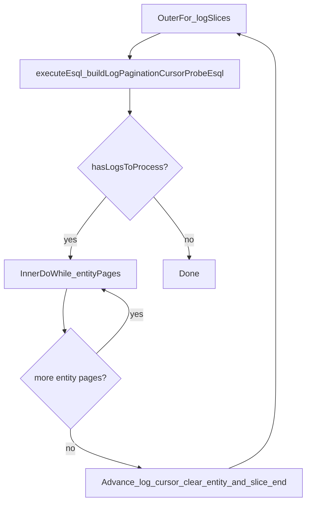
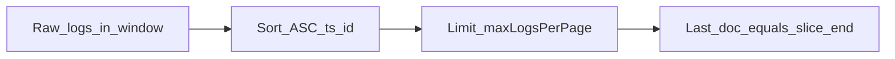

# Logs extraction pagination

This document describes how **local** (LOOKUP-based) logs extraction paginates through raw log documents and through **aggregated entity** rows. The client runs a **boundary** ESQL on every outer (log-slice) iteration: there is no “skip probe” path. The **first** log slice in a new `extractLogs` run does not apply a persisted `logsPageCursorStart` to the boundary query (the slice is re-established from the time window only); later outer iterations in the same run use the advanced cursor from the previous slice.

For **CCS** (remote-only) extraction, this plugin intentionally keeps the simpler **entity-pagination-only** loop; the same *ideas* (bounding raw scans, compound cursors) apply if that path is extended later.

---

## Why two levels?

1. **Raw logs** arrive in time order. The pipeline applies `STATS … BY entity`, then (for local extraction) `LOOKUP JOIN` against the latest entities index. Scanning an entire lookback window in one query can be expensive and memory-heavy.

2. **Log-slice pagination** caps how many raw documents (sorted by `@timestamp`, then `_id`) participate in one bounded pass. The slice width is controlled by **`maxLogsPerPage`** (global config, default in `LOG_EXTRACTION_MAX_LOGS_PER_PAGE_DEFAULT`).

3. **Entity pagination** caps how many **aggregated** entity rows are returned per ESQL execute (`docsLimit` / `LIMIT` after `STATS`, possibly after post-LOOKUP filter). Cursors use metadata fields (`entity.EngineMetadata.FirstSeenLogInPage`, `entity.EngineMetadata.UntypedId`) via `buildPaginationSection` and `extractMainPaginationParams` (`MAIN_EXTRACTION_PAGINATION_FIELDS` in `logs_extraction_query_builder.ts`).

Together: **outer loop** = advance log slices; **inner loop** = entity pages inside the current slice.

---

## Terms

| Term | Meaning |
|------|--------|
| **Log slice** | Raw documents whose composite key `(@timestamp, _id)` lies in the half-open interval after `logsPageCursorStart` through **inclusive** `logsPageCursorEnd`, within the extraction time window. |
| **Log cursor (start / lower)** | `logsPageCursorStartTimestamp` / `logsPageCursorStartId` — exclusive lower bound for the next raw-doc scan (or end of the previous slice). |
| **Slice end (upper)** | `logsPageCursorEndTimestamp` / `logsPageCursorEndId` — inclusive upper bound for the current slice; produced by the boundary query. |
| **Entity page** | One batch of up to `docsLimit` entity rows after `STATS` (and after post-LOOKUP `WHERE` when defined). |
| **Entity cursor** | `paginationTimestamp` / `paginationId` — tie-break cursor for the next entity page inside the **current** slice. |

---

## Persisted state (`EngineLogExtractionState`)

| Field(s) | Role |
|----------|------|
| `logsPageCursorStartTimestamp`, `logsPageCursorStartId` | After finishing entity pages for a slice, the cursor is advanced to the slice end so the next boundary query continues after that document. |
| `logsPageCursorEndTimestamp`, `logsPageCursorEndId` | Inclusive end of the current slice; set after a successful **boundary** query; cleared when moving to the next slice. |
| `paginationTimestamp`, `paginationId` | Entity pagination inside the current slice; cleared when the slice is complete. |
| `lastExecutionTimestamp` | Updated when a **full** extraction run completes successfully (not `specificWindow`); anchors the next scheduled window with delay. |
| Recovery | If `paginationId` is present from a previous run, it is passed once as `recoveryId` to the first bounded extraction query (inclusive lower time bound) and the first boundary ESQL, then cleared. |

`specificWindow` (force APIs / manual runs) **does not** persist `logExtractionState` updates from the loop.

---

## Control flow (local)

### Ordering of raw documents

Boundary ESQL applies **`INLINE STATS total_logs = count(*)`** on the full filtered set **before** `LIMIT` (so `total_logs` is how many raw rows remain in the window from the probe). It then sorts ascending by `@timestamp`, `_id`, keeps the first `maxLogsPerPage` rows, and takes the **last** of that batch (sort descending, `LIMIT 1`) as the **inclusive** slice end for the bounded extraction WHERE clause. If `total_logs` **≤** `maxLogsPerPage`, this slice exhausts the window (including an exactly full last page); the client can finish without issuing another boundary query.

---

## ESQL touchpoints

| Piece | File / symbol |
|-------|----------------|
| Probe WHERE (time window, EUID filter, optional log lower bound) | `buildLogPageProbeSourceClause` |
| Bounded WHERE (+ inclusive slice end) | `buildExtractionSourceClause` when `logsPageCursorEnd` is set |
| Log pagination cursor probe (slice end + `total_logs`) | `buildLogPaginationCursorProbeEsql`, `parseLogPaginationCursorRow`, `interpretLogPaginationCursorRows` (`log_pagination_probe_query_builder.ts`) |
| Full local extraction query | `buildLogsExtractionEsqlQuery` |
| Entity page cursors | `buildPaginationSection`, `extractPaginationParams` / `extractMainPaginationParams` |
| Remaining-doc count (API) | `buildRemainingLogsCountQuery` — uses probe clause + `STATS COUNT` |

---

## Operational notes

- **Abort**: an `AbortController` may be passed; the client registers a debug listener on `abort`; queries should respect cancellation via the ES client.
- **Failures**: errors propagate; partially updated `logExtractionState` may be left on disk for retry (same as before).
- **Successful run**: `extractLogs` clears all pagination and log-slice fields and sets `lastExecutionTimestamp` when not a manual window.
