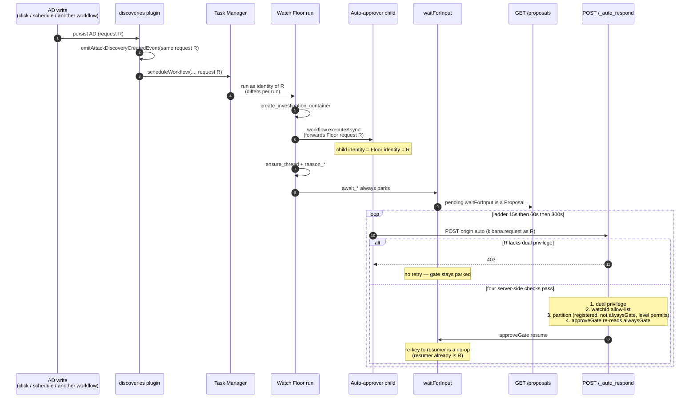

# PND plugin (`@kbn/pnd-plugin`)

Project **AlertZero** (formerly NotDaybreak; the plugin id, the package name and the `/app/pnd`
route deliberately keep their `pnd` spelling — see [Naming](#naming)) is the Security **Watch**
surface: a standalone `/app/pnd` app with a Watch catalog, an investigation queue, an Agent Builder
chat embed, and a set of managed Watch workflows. This epic (`kibana-idjb`) made **one lane real,
end to end, against live data**: an Attack Discovery 2.0 alert is created, the Watch Floor Worker
wakes up, it opens an Agent Builder investigation conversation, the investigating agent's own
verdict decides whether this is an incident, a HITL gate opens the incident, a containment gate
closes the incident, a Post-Incident Watch drafts a detection-rule tuning, and a final HITL gate
applies it to a real detection rule.

## Naming

Two programme decisions landed on 2026-08-25 and this README follows both.

**[D22] The product is AlertZero**, one word, replacing the NotDaybreak codename. It is **not**
"Alert Zero" (two words) — that is the pre-existing 9.5 queue-to-zero concept, and the programme
glossary keeps them distinct. The rename is scoped by the glossary's own rule: the codename is
*"retired for prose and UI; technical identifiers … intentionally keep their historical naming"*.
So every `pnd` identifier stays exactly as it is — `@kbn/pnd-plugin`, `@kbn/pnd-common`, the plugin
id `pnd`, `xpack.pnd.*`, `/app/pnd`, `/internal/pnd/*`, the `xpack.pnd.*` i18n message ids, the
`system-security-watch-*` managed workflow ids, and `pnd.incidentClosed`. Renaming a managed
workflow id in particular is a delete-and-install that abandons every parked run.

One further carve-out is deliberate: **`PND_AUTO_RESPOND_RATIONALE_PREFIX` still says `PND`**. It is
a stored audit value, not display copy — `deriveAnsweredBy` parses it with `startsWith`, so changing
it would orphan attribution on every already-answered gate.

**[D21] "Watch Orchestrator" is a concept, not a workflow.** A Watch is a *group of Workers tagged
as the same Watch* plus a UI configurator; a **Worker** is an Elastic Workflow that owns its own
triggers and holds the HITL gates on the Proposals it surfaces. D21 supersedes D10. PND's code
already behaved this way — each watch workflow owns its trigger, and the Post-Incident Watch
subscribes to a signal rather than being parented — so this was a vocabulary change, not a
behavioural one. `workflow.execute*` inside a Worker is still allowed as *domain* sequencing, which
is what the Watch Floor does when it invokes the Deep Watch.

**Historical quotations keep the original word.** Where this README quotes a dated programme
document, a meeting note or retired UI copy, "Orchestrator" and "NotDaybreak" are left standing:
rewriting a quotation would falsify the record.

The point of the thin slice is to prove the architecture on today's Workflows + Agent Builder
platform **without changing anything owned by `@elastic/workflows-eng` or `@elastic/workchat-eng`**.
Registering triggers and installing managed workflows are calls into those contracts, which is
allowed; editing their source is not.

Two epics followed. Epic 2 (`kibana-2r6y`) built the browser surfaces on those routes. Epic 3
(`kibana-z7xi`) added the fourth `[Thread]` conversation kind paired 1:1 with every HITL proposal,
real Agent Builder attachments, the grouping paradigm on the Brief, and **the tuning proposal
actually surfacing in the UI** — which it never had before. Phase 4 is no longer theoretical: the
Post-Incident Watch has been driven to `await_apply_tuning` and an approval has written a real detection
rule (see [Is phase 4 real?](#is-phase-4-real)). Both epics kept the same rule: zero Agent Builder
changes, zero Workflows *engine* changes.

A fourth pass followed those three, and it is the one to read the change log for: rather than adding a
surface, it **removed one of two**. By the time it started, upstream had shipped its own investigation
queue and detail page ([#284440](https://github.com/elastic/kibana/pull/284440)) over the same ground
this branch already covered, so the work was re-integration rather than construction — one queue
component, one proposals contract, one detail surface — decided by a written rule rather than case by
case. That rule, the three collapses, and every deletion with the dated design artifact that authorised
it are in
[The alignment rule, and what round 3 re-integrated](#the-alignment-rule-and-what-round-3-re-integrated).
⚠️ **Read it before proposing that any deleted file be restored.**

This README is the architecture reference for PND, modeled on the Attack Discovery 2.0 README
([`x-pack/solutions/security/plugins/discoveries/README.md`](../../plugins/discoveries/README.md)).
Read top-to-bottom for the full picture, or jump via the TOC.

> **The single most common cause of "nothing happens": the per-space Advanced Setting
> `securitySolution:enableAttackDiscoveryWorkflows` defaults to `false`.** With it off, the
> Attack Discovery UI silently runs **AD 1.0**, which PND is deliberately not integrated with, so
> `security.attackDiscoveryCreated` never fires and every AD-derived PND surface is legitimately
> empty. Assert this setting is `true` in the space **before** diagnosing anything. See the
> [Enablement matrix](#enablement-matrix).

## Table of contents

1. [Overview + runtime path](#overview--runtime-path)
2. [Enablement matrix](#enablement-matrix)
3. [Attack Discovery 2.0 scope boundary and the write-path table](#attack-discovery-20-scope-boundary-and-the-write-path-table)
4. [Object model (and the Proposal-as-`waitForInput` deviation)](#object-model-and-the-proposal-as-waitforinput-deviation)
5. [The gate registry](#the-gate-registry)
6. [Conversation id derivation](#conversation-id-derivation)
7. [Conversations, threads, HITL steps, and the Proposal lifecycle](#conversations-threads-hitl-steps-and-the-proposal-lifecycle)
8. [Autonomy](#autonomy)
9. [Internal APIs](#internal-apis)
10. [Managed Watch workflows](#managed-watch-workflows)
11. [The alignment rule, and what round 3 re-integrated](#the-alignment-rule-and-what-round-3-re-integrated)
12. [Register: platform gaps, stubs, and deliberate divergences](#register-platform-gaps-stubs-and-deliberate-divergences)
13. [The 2026-08-14 Detection Watch sync](#the-2026-08-14-detection-watch-sync)
14. [The 2026-08-17 Experience/UX sync (decisions 1–9)](#the-2026-08-17-experienceux-sync-decisions-19)
15. [Programme decisions absorbed (2026-08-19, 2026-08-11 and 2026-08-10)](#programme-decisions-absorbed-2026-08-11-and-2026-08-10)
16. [Security model (S1–S11)](#security-model-s1s11)
17. [Debugging](#debugging)
18. [Architecture Decision Records (appendix)](#architecture-decision-records-appendix)
19. [Naming: the code says `thread`, the UI says "sub-investigation"](#naming-the-code-says-thread-the-ui-says-sub-investigation)
20. [Glossary](#glossary)
21. [Outreach](#outreach)
22. [Where to land changes](#where-to-land-changes)
23. [Development](#development)

## Overview + runtime path

PND does not own a generation pipeline. It **subscribes to a signal** (`security.attackDiscoveryCreated`,
emitted by the `discoveries` plugin), drives a four-phase lifecycle through two managed Watch
workflows and four `waitForInput` HITL gates, emits two signals of its own
(`pnd.incidentClosed` and `security.detectionChangeSignal`) on containment, and exposes everything a
UI needs as `/internal/pnd/*` routes.

```
Attack Discovery 2.0 generation  (any of 4 invocation methods; see the write-path table)
   │
   └─ emit  security.attackDiscoveryCreated   [NEW — discoveries emit sites B + C]
        │     payload = { attack-discovery alert id, alertIds, riskScore?, generationUuid, spaceId }
        │     PND maps that producer field to `correlationId` at the first route call
        │     (id + non-sensitive metadata ONLY — no AD narrative; see S6)
        │     The emit carries the SAME request that performed the AD write, so the Floor
        │     run's identity is whoever clicked Generate, or the AD schedule's key, or
        │     another workflow's — it differs per run ([ADR-017](#adr-017)).
        │
        └─ system-security-watch-floor  (installed in the global '*' space; matches via includeGlobal:true)
             │
             ├─ Phase 1  Signal Triage
             │     derive_ids      → GET /internal/pnd/conversations/_derive  (UUIDv5 ids + AD markdown)
             │     (no autonomy read — the YAML never branches on the dial)
             │
             ├─ Phase 2  Investigation
             │     create_investigation_container → POST /api/agent_builder/conversations
             │                            (title `[Investigation] …`; minted BEFORE the first gate)
             │     arm_auto_approver_open_investigation → workflow.executeAsync
             │                            (forwards this run's request; [ADR-017](#adr-017))
             │     ensure_thread_open_investigation → POST /internal/pnd/threads/_ensure
             │     reason_open_investigation         (data.set — the card body; must be the gate's
             │                                        timestamp predecessor; register #12)
             │     [gate] await_open_investigation      (ALWAYS parks — no if ancestor)
             │     investigate       → workflow.execute  system-security-watch-deep
             │                            (worker conversation; returns { isIncident, rationale, proposal })
             │     assess_investigation  (an `if` on steps.investigate.output.isIncident,
             │                            OR'd with the xpack.pnd.demo.forceIncident override in front)
             │       else: emit_coverage_gap → POST /internal/pnd/signals/_detection_change
             │             not_an_incident   (workflow.output — terminates)
             │     arm_auto_approver_promote_incident → workflow.executeAsync
             │     ensure_thread_promote_incident → POST /internal/pnd/threads/_ensure
             │     [gate] await_promote_incident        (ALWAYS parks)
             │     open_incident         → ai.agent (Incident conversation at incidentConversationId;
             │                            title `[Incident] …`; sibling of the investigation via
             │                            promotedFrom, not a child)
             │
             └─ Phase 3  Incident Response
                   ensure_thread_incident_contained → POST /internal/pnd/threads/_ensure
                   [gate] await_incident_contained      (alwaysGate — parks at every level; never armed)
                   │
                   └─ _respond emits independently (Promise.allSettled):
                        ├─ pnd.incidentClosed on an **approved** containment only
                        │    — the lifecycle FACT: "an incident closed" (D14/P3)
                        │    payload = { correlationId, incidentConversationId, spaceId, watchId }
                        │    ⚠️ deliberately has NO subscriber (see the register row)
                        │
                        └─ security.detectionChangeSignal at every Floor HITL terminal
                             (dismissal at open-investigation or promote-incident, and either
                             decision at containment) — the CLAIM: "there is a coverage gap here"
                             payload = { evidenceRefs[{kind,id}], gapDescription, sourceRunId,
                                         sourceWatchId, spaceId, tactics }
                             │  (gapDescription is the analyst's or worker's rationale, clipped;
                             │   tactics come from the AD doc over _find?ids= as the caller. No LLM.)
                             │
                             └─ system-security-watch-post-incident   [NEW 5th managed Watch]
                                  │  trigger condition allow-lists the 4 producer watches (ADR-014)
                                  │
                                  └─ Phase 4  Post-Incident Follow-on
                                        set_correlation_id  (data.set — projects the attack discovery
                                                                  id out of evidenceRefs, once, for the
                                                                  six steps that key on it)
                                        draft_tuning   → ai.agent (drafts a detection-rule tuning)
                                        ensure_thread_apply_tuning → POST /internal/pnd/threads/_ensure
                                        reason_apply_tuning   (the four label-anchored JSON facts the UI
                                                               parses back out; see register #24)
                                        [gate] await_apply_tuning  (alwaysGate — parks at every level)
                                        tuning_applied → workflow.output   (there is deliberately NO apply
                                                         step here: the rule PATCH happens from the PND UI
                                                         in the approving USER's context — see S2/ADR-008)
```

Every HITL gate is preceded by an `ensure_thread_*` `kibana.request` step, so by the time a proposal
is visible in the queue its `[Thread]` conversation already exists with its three attachments
([ADR-012](#adr-012)). Each carries `on-failure: { continue: true }`, so a thread failure can never
abort a watch, and each sits **before** its `reason_*` step rather than next to its gate — that
ordering looks misplaced and is load-bearing (register `#12`). The two Floor gates that auto-approval
may answer also arm `system-security-watch-auto-approver` immediately before `ensure_thread_*`, never
between `reason_*` and `await_*`. The investigation container is minted **before** the first gate
parks, so an investigation thread is never an orphan.

Three new triggers, all security-owned:

- `security.attackDiscoveryCreated` — registered and emitted in `discoveries`. It stays **generic**
  and knows nothing about PND.
- `pnd.incidentClosed` — registered and emitted in `pnd`. It is the literal implementation of
  project-daybreak **D14/P3** ("an incident is a subscribable signal"), and it says exactly that and
  nothing more: *an incident closed*, carrying ids alone. It has **no subscriber**, deliberately —
  see the register row and [ADR-014](#adr-014).
- `security.detectionChangeSignal` — the cross-watch **coverage-gap** contract, registered in `pnd`
  and defined in `@kbn/pnd-common` because any watch may produce one and Rule Creation consumes it.
  PND emits it from the Floor's investigation terminals (a HITL dismissal, a not-an-incident
  verdict, or containment) beside `pnd.incidentClosed` (containment approval only), and
  `system-security-watch-post-incident` subscribes to it ([ADR-014](#adr-014)).

The last two emit from the same place and are **not** one signal with more fields. `pnd.incidentClosed`
is a lifecycle **fact**; `security.detectionChangeSignal` is a **claim** ("there is a coverage gap
here") that carries the analyst's own gap description, the incident's ATT&CK tactics and refs to the
evidence. Keeping them separate is what lets the claim carry a gap description without the lifecycle
fact inheriting one, and leaves a subscribable close event for a consumer that wants the fact without
the claim.

#### What the coverage-gap contract guarantees a consumer

A watch that finds a coverage gap and a watch that decides what to do about it are different watches,
usually owned by different teams. Four properties make that hand-off workable, and each is a
deliberate constraint rather than an accident of the first implementation:

1. **The claim is deterministic.** A consumer never has to read an incident narrative and infer
   whether a gap was found. The signal either arrives or it does not, and **no LLM is involved
   anywhere in its construction** — every field is either an id already in hand or a projection of a
   document the caller can read (`resolveAttackDiscoveryTactics`, S3). Parsing prose to recover a
   verdict the producer already knew is the failure mode this exists to remove.
2. **The producer does not decide the remedy.** `ruleRef` and `technique` are both **deliberately
   omitted** at emit time: *the rule to tune is chosen downstream from the discovery's constituent
   alerts, not asserted here.* The contract carries one signal covering both downstream branches, so
   the consumer owns the tune-an-existing-rule versus create-a-new-one decision entirely.
3. **It carries refs, not evidence.** `evidenceRefs` is a generic **kinded array**, never an
   Attack-Discovery-shaped field, and the subscriber fetches the narrative itself, as the caller (D7).
   That is what lets a producer with no attack discovery anywhere in its path — a hunt finding, say —
   raise the same claim through the same envelope without the shape changing.
4. **A gap and an incident are different things.** The claim is split from `pnd.incidentClosed`
   precisely because an incident does not imply a gap, and a gap does not imply an incident. They
   were only ever one signal by accident.

⚠️ **Tradeoff, kibana-tjil.20.** The claim is no longer gated on containment approval. It fires at
every Floor terminal that carries a rationale: a dismissal at `await_open_investigation` or
`await_promote_incident`, either decision at `await_incident_contained`, and the YAML
`not_an_incident` branch (via `POST /internal/pnd/signals/_detection_change`). `pnd.incidentClosed`
stays gated on containment approval — a declined containment is not an incident closing.

There is **no worker-level gap verdict**. Adding `isCoverageGap` beside Deep Watch's `{ isIncident,
rationale, proposal }` is an LLM-behaviour change that needs prompt work and evaluation across the
three models. Until that exists, the emit is deterministic by path: every concluded investigation is
treated as a coverage-gap claim, and `gapDescription` is the analyst's or worker's own rationale
(clipped, never summarised, never invented). A dismissed false-positive and a genuine undetected
technique currently look the same at emit time. Do not read that as a measured gap verdict.

The gates never resume on their own. A user (the queue, or `curl`)
`POST`s to `/internal/pnd/proposals/{sourceId}/_respond`, which resumes the pending `waitForInput`
step via `resumeWorkflowExecution`. Auto-approval is the same resume, from
`POST /internal/pnd/proposals/_auto_respond`: the per-run auto-approver child posts `origin: 'auto'`,
and raising the dial mid-flight posts `origin: 'dial'`. A scheduled global workflow still cannot
carry this run's identity — that is [ADR-017](#adr-017), on the identity leg alone.

### Packages and plugins

| Surface | Path |
|---|---|
| This plugin | [`x-pack/solutions/security/plugins/pnd/`](.) |
| Shared vocabulary, contracts, catalogs, fixtures | [`@kbn/pnd-common`](../../packages/kbn-pnd-common/) |
| Managed Watch workflow definitions (inline YAML, source of truth at runtime) | [`kbn-workflows/managed/definitions/pnd/`](../../../../../src/platform/packages/shared/kbn-workflows/managed/definitions/pnd/) |
| The trigger PND subscribes to | [`discoveries/common/workflow_triggers/attack_discovery_created/`](../discoveries/common/workflow_triggers/attack_discovery_created/) |

`@kbn/pnd-common` is the shared package both the server and the browser import. It holds the
conversation-id derivation, the gate registry, the 14-row phase catalog, the five watch tiers, all
route-path and trigger-id constants, the autonomy uiSettings/privilege ids, and the zod + OpenAPI
contracts for every internal route. It uses an **explicit export allow-list** in `index.ts` (never
`export *`), so the optimizer can tree-shake it out of the page-load bundle — which is also why
consumers must import from the **package root** and never reach into `impl/`.

## Enablement matrix

Four switches gate this feature. **Lead with the AD 2.0 scope boundary** (below) and the fact that
the per-space setting defaults to `false`: those two facts explain almost every "nothing happens".

| Switch | Where | Default | What breaks when it is off / wrong |
|---|---|---|---|
| `xpack.pnd.enabled` | `kibana.yml` / `config/kibana.dev.yml` | `false` | The whole plugin. No `/app/pnd`, no `/internal/pnd/*` routes, no Kibana feature/privileges, the managed-workflow **owner** is not registered so `installStatic` no-ops and orphan cleanup prunes any previously installed PND watches. See [When disabled](#when-disabled). |
| `securitySolution.attackDiscoveryWorkflowsEnabled` | `feature_flags.overrides` | `true` | Attack Discovery **2.0** itself. With it off, AD 2.0 internal routes 404 and no discovery is ever generated through the 2.0 pipeline, so `security.attackDiscoveryCreated` cannot fire. This is the `discoveries` plugin's own flag. |
| `securitySolution:enableAttackDiscoveryWorkflows` | per-space Advanced Setting (`security_solution/server/ui_settings.ts`) | **`false`** | Which AD implementation the space runs. **Off (the default) → the AD UI silently falls back to AD 1.0 (`elastic_assistant`), which PND is deliberately not integrated with, so PND sees nothing.** This is correct behavior, not a bug. It reads as a bug to anyone who has not read this section. |
| `xpack.pnd.ui.useMockData` | `kibana.yml` / `config/kibana.dev.yml` | **`false`** (live) | Whether the pre-existing Watch catalog and investigation routes serve fixtures. **The internal routes this epic added are live-only and ignore the flag.** Set `true` only to render the older UI without a running stack. |

To enable everything for local development:

```yaml
xpack.pnd.enabled: true
feature_flags.overrides:
  securitySolution.attackDiscoveryWorkflowsEnabled: true
# and, per space, set securitySolution:enableAttackDiscoveryWorkflows: true
# in Stack Management → Advanced Settings (it is a UI setting, not a yml key).
```

### `useMockData: false` is now the safe default

Earlier the PND README warned against `useMockData: false` outside local development, because the
live Watch catalog projected through Workflows Management **without** threading the caller's
`KibanaRequest`, so managed/execution reads were authorized only at the PND route boundary and not
inside the Workflows calls themselves. Bead `kibana-idjb.18` closed that gap: the caller's request is
threaded into [`watch_workflows_management_client.ts`](server/services/watches/watch_workflows_management_client.ts),
which authorizes managed reads (`getWorkflows` / `getWorkflow`) against `request.authzResult` and
down-scopes managed-execution enrichment to the caller's `readManagedExecution` privilege (see
[`services/watches/workflows_read_authz.ts`](server/services/watches/workflows_read_authz.ts)). So
request-scoped Workflows authz now lives inside the projection, which is what makes live projection
the correct default. Execution privileges are declared as `extendedPrivileges` (surfaced in
`request.authzResult`) rather than gated at the route, so recent-run enrichment simply omits itself
when the caller lacks them instead of 403-ing the whole read.

The request threading used to pass through a separate `watch_workflow_projection_service.ts`.
#284009 deleted that file and folded it into
[`services/watches/watches_service.ts`](server/services/watches/watches_service.ts), which is now the
single seam routes read and write watches through. Nothing about the authz story changed; only the
file that carries it did.

### AD-2.0-not-enabled empty state

Because the per-space setting defaults off, the list routes (`/internal/pnd/proposals`,
`/internal/pnd/runs`, `/internal/pnd/conversations`) stamp a discriminable response header
**`x-pnd-attack-discovery-workflows-enabled: 'true' | 'false'`** and short-circuit to an empty body
when the setting is `false`. The signal is **fail-open**: a uiSettings read error assumes enabled,
so a transient hiccup never suppresses a populated queue. Epic 2's empty state must name the setting
explicitly so an empty queue is not mistaken for a bug.

<a id="when-disabled"></a>
### When disabled (`xpack.pnd.enabled: false`) — no production pollution

| Surface | Behavior |
|---|---|
| HTTP `/internal/pnd/*` | Not registered |
| Kibana feature / privileges | Not registered |
| Browser app `/app/pnd` | Not registered (nav links to `pnd` / `pnd:*` are removed by chrome) |
| Managed workflow **owner** | Not registered (`registerManagedWorkflowOwner` skipped) |
| Managed Watch **install** | Not called (`installStatic` no-ops) |
| Leftover installed watches | Global Workflows orphan cleanup removes docs whose owner is unregistered |
| `security.attackDiscoveryCreated` trigger | Still **registered** by `discoveries` (that registration is gated on `discoveries` config, not on PND); it simply has no PND subscriber |

The only always-on cost of the soft flag is the tiny public plugin entry bundle; it registers
nothing when disabled.

## Attack Discovery 2.0 scope boundary and the write-path table

**This is the highest-value section for a new contributor.** PND integrates with Attack Discovery
**2.0** (the `discoveries` plugin) and explicitly does **not** integrate with Attack Discovery
**1.0** (the legacy implementation in `elastic_assistant`). That is a hard scope boundary, not a
phasing decision. The two implementations write to the same physical indices through entirely
separate code, so integrating with 1.0 would mean editing `elastic_assistant`, which this epic never
does (no manifest change, no emit site, no tsconfig reference).

There are **five** AD write paths and they are structurally disjoint:

| Implementation | Write path | Integrated? |
|---|---|---|
| **AD 2.0 ad-hoc** — `validateAttackDiscoveries` via the `security.attack-discovery.persistDiscoveries` step (`discoveries`) | **Path B** | ✅ Yes |
| **AD 2.0 scheduled** — `alertsClient.report` in `discoveries/server/lib/schedules/workflow_executor/index.ts` | **Path C** | ✅ Yes |
| AD 1.0 ad-hoc — `createAttackDiscoveryAlerts` (`elastic_assistant`) | Path A | ⛔ No |
| AD 1.0 scheduled — `register_schedule/executor.ts` (`elastic_assistant`) | Path D | ⛔ No |
| Dev data-generator routes | Path E | ⛔ No |

### All four AD 2.0 invocation methods are covered by exactly two emit sites

With AD 2.0 enabled (feature flag ON **and** the per-space setting ON), every official way to
generate a discovery is covered:

| # | AD 2.0 invocation method | Reaches | Emit site |
|---|---|---|---|
| 1 | **Ad hoc** from the AD UI → `POST /internal/attack_discovery/_generate` → `runManualOrchestration` → `validate.yaml` | Path B | **B** |
| 2 | **Scheduled** (AD 2.0 schedule, `params.workflowConfig != null` → dispatched to the discoveries executor) | Path C | **C** |
| 3 | **`security.attack-discovery.run` workflow step** — sync and async both call the same `executeGenerationWorkflow` | Path B | **B** |
| 4 | **Agent Builder conversation** via the `run_attack_discovery_tool` | Path B | **B** |

Paths B and C are **mutually exclusive by design**: the persist step deliberately no-ops for
scheduled runs, so no discovery is ever emitted twice.

The two emit sites, both inside `discoveries` (bead `kibana-idjb.5`):

| Site | File | Covers |
|---|---|---|
| **B** | `server/workflows/steps/persist_discoveries_step/get_persist_discoveries_step_definition.ts`, right after `validateAttackDiscoveries` returns | methods 1, 3, 4 |
| **C** | `server/lib/schedules/workflow_executor/index.ts`, inside `attackDiscoveries.map` | method 2 |

Both call the shared, **never-throws** helper
[`server/workflows/emit_attack_discovery_created_event`](../discoveries/server/workflows/emit_attack_discovery_created_event/),
so a workflows failure can never fail AD persistence. The event fires **once per net-new
discovery**, gated on the same workflows flag + per-space setting AD 2.0 itself checks. Two gotchas
the emit sites handle:

- **Risk score on Path B.** The ad-hoc transform did not surface `risk_score` even though the
  document carries it. `kibana-idjb.5` added it to the transform, so `riskScore` is available for
  gate conditions on both paths.
- **Path C is a staging call.** `alertsClient.report` only stages; the alerting framework can still
  drop the alert. An event emitted there means "reported", not "durably written".

### The trigger definition

Registered by `discoveries` in `server/plugin.ts` setup (bead `kibana-idjb.3`). Exports at
[`discoveries/common/workflow_triggers/attack_discovery_created/`](../discoveries/common/workflow_triggers/attack_discovery_created/):

| Export | What |
|---|---|
| `AttackDiscoveryCreatedTriggerId` | `'security.attackDiscoveryCreated'` |
| `attackDiscoveryCreatedEventSchema` | **strict** zod object, id/metadata only (S6 guard) |
| `AttackDiscoveryCreatedEvent` | producer contract in `plugins/discoveries` — PND maps the alert id to `correlationId` |
| `attackDiscoveryCreatedTriggerCommonDefinition` | `tech_preview` |

Trigger registration is **setup-only and synchronous**, and the feature flag is not readable in
setup, so it is gated on `config.enabled` (like `registerOwner`), not the FF-based step-loader
pattern. Registering is inert while the flag is OFF. The new trigger ids
(`security.attackDiscoveryCreated`, `pnd.incidentClosed`, `security.detectionChangeSignal`) must be
**flagged to `@elastic/workflows-eng` in the PR** — the `approved_trigger_definitions.ts` Scout test
is `describe.skip`, so nothing mechanically blocks a new trigger id, but the social gate remains.

## Object model (and the Proposal-as-`waitForInput` deviation)

The project-daybreak
[object model](https://github.com/elastic/project-alertzero/blob/main/docs/daybreak-watches-object-model.md)
locks these entities: a **Watch** subscribes to signals and drives a lifecycle; an **Investigation**
and an **Incident** are Agent Builder conversations; a **Proposal** is a *child Conversation*
(`template_id: proposal`, `parentConversationId`, its own `events[]`, HITL via `waitFor*` on
`proposal.status`).

`@kbn/pnd-common` deliberately carries **no** `TEMPLATE_ID_*` constants. `TEMPLATE_ID_INVESTIGATION`,
`TEMPLATE_ID_PROPOSAL`, `TEMPLATE_ID_INCIDENT` and `TEMPLATE_IDS` existed for the mock investigations
lane and were deleted with it; the retired fixtures were their only consumers and `TEMPLATE_IDS` never
had one. The comment that replaced them in
[`constants.ts`](../../packages/kbn-pnd-common/constants.ts) asks that they not be reintroduced, and
asks in particular that no `TEMPLATE_ID_TUNING` be added: `template_id` is a discriminated-union type
tag, not a classification field, and the generated schemas already declare it as `z.literal(...)` on
each entity, so a parallel constant is redundant by construction. A rule tuning is already covered by
the locked model as a `Proposal` in the `tune` bucket (`RecommendedAction`).

### The deviation: proposals are pending `waitForInput` steps, not child Conversations

**This thin slice does not create Proposal conversations.** A proposal is a pending `waitForInput`
step in a Watch workflow, projected into the UI by `GET /internal/pnd/proposals`. This is a
**deliberate, reportable deviation** from the locked object model, and it belongs here and in a note
to the WG, not buried in code.

Rationale: a Proposal conversation buys nothing the slice exercises (there is no proposal-level chat
and no independent `events[]`), and each one would cost a second `ai.agent` round-trip per gate. The
projection keeps the same **shape** (id, evidence, rationale, status, assignee-able), so promoting to
real child conversations later is purely additive: swap the projection source, keep the contract.

> **Read this alongside
> [Conversations, threads, HITL steps, and the Proposal lifecycle](#conversations-threads-hitl-steps-and-the-proposal-lifecycle).**
> Epic 3 narrowed this deviation considerably: every Proposal now *does* have a real Agent Builder
> conversation paired 1:1 with it — its `[Thread]` — so proposal-level chat exists. What is still
> projected rather than stored is the Proposal **row** (a card), not the conversation. The deviation is
> about *containment*, not about the absence of a conversation.
>
> ⚠️ **And on 2026-08-14 the object model itself moved, in this implementation's direction.**
> [PR #123](https://github.com/elastic/project-daybreak/pull/123) merged, confirming that a Proposal
> conversation is **created** at the gate rather than a Worker thread being relabelled into one — which
> is exactly what `ensure_thread_*` does — and the same document already sanctions projecting the queue
> from parked gates: *"the home page can be projected equivalently from pending gates or from pending
> Proposal conversations."* So the heading above is now historical: what it calls "the deviation" is
> two narrower things — an unwritable `template_id` (`#3`) and a projected row — none of which is
> *the absence of a Proposal conversation*. Parentage is still recovered on read, but that is no
> longer a numbered divergence: [ADR-017](#adr-017) and the [parentage fold](#the-thread-list-is-flat-parentage-is-recovered-on-read)
> record it as decision 5's correlation-id direction, and register `#27` is closed. Register
> `#15`, [ADR-006](#adr-006) and
> [contradiction 1](#three-upstream-contradictions-reported-rather-than-resolved--two-since-answered)
> carry the rest; this section is left in place because the reasoning that produced the shape is still the
> reason the shape is right.
>
> **Three-layer copy split (keep these from collapsing into one rename).** Aug 19
> [project-daybreak #137](https://github.com/elastic/project-daybreak/pull/137) decision 10: a
> proposal is *"only a template wrapper"* — the missing primitive is an **actionable item** that
> behaves like an attachment (register `#69`, out of scope). PND's implementation is a parked-gate
> **projection that stores nothing**. User-facing copy says **"action(s)"**, never "proposal(s)".
> `Proposal` stays in code identifiers and in upstream route paths.

### How a pending gate carries its metadata

`waitForInput`'s `with.schema` is a **closed** zod object that silently strips unknown keys, so gate
metadata can never ride on the YAML. It comes from three carriers instead:

| What | Carrier |
|---|---|
| **Static** — gate id, bucket, reversibility, always-gate, phase-catalog row | The [gate registry](#the-gate-registry) constant map, keyed by `(workflowId, stepId)`. Type-safe, immune to YAML drift. |
| **Dynamic** — AD id, conversation ids | `getWorkflowExecution(runId, spaceId).context.event`. Execution `context` is persisted but `dynamic: false` and unmapped, so this is a retrieve-then-filter, never a term query. |
| **Rationale** — why this proposal exists | A `data.set` step emitting `output.reasoning` immediately **inside** each gate branch. The reasoning predecessor is chosen by timestamp order (greatest `finishedAt <= wait.startedAt`), so it must be the last step to finish before the gate; keeping it inside the branch guarantees that. |

Every gate schema also carries a required `rationale: { type: string }` (mandatory, non-empty),
which combined with `hitl.respondedBy` / `respondedAt` (stamped server-side by `markStepAsResponded`)
is the audit trail. "Modify" in the UI means editing the resume payload before submitting, not a
separate decision kind.

## The gate registry

Source of truth:
[`@kbn/pnd-common/impl/proposals/gate_registry`](../../packages/kbn-pnd-common/impl/proposals/gate_registry/index.ts).
The four gates map 1:1 onto `RECOMMENDED_ACTIONS` (the queue's four KPI tiles) and onto the four-phase
catalog gate rows. The queue offers **three** grouping modes (group-by-type default, plus type+thread
and thread); `role` and `parentKind` still say which container a parked gate hangs under.
`create_investigation_container` mints the investigation **before** `await_open_investigation` parks,
so that gate's thread has a parent from the start (register `#46` now covers only uncorrelated runs).

| Gate `stepId` | Owning workflow | Bucket | Reversible | `alwaysGate` | Autonomy behavior |
|---|---|---|---|---|---|
| `await_open_investigation` | `system-security-watch-floor` | `investigate` | ✅ yes | no | **Always parks.** `_auto_respond` approves at Assisted (reversible) and Supervised |
| `await_promote_incident` | `system-security-watch-floor` | `escalate` | ❌ no | no | **Always parks.** `_auto_respond` approves at Supervised only |
| `await_incident_contained` | `system-security-watch-floor` | `contain` | ❌ no | **✅ yes** | **Always parks** — no autonomy level auto-approves it (D15 invariant) |
| `await_apply_tuning` | `system-security-watch-post-incident` | `tune` | ❌ no | **✅ yes** | **Always parks** — no autonomy level auto-approves it |

Each definition also carries the three fields epic 3 added for threads (D2 / [ADR-013](#adr-013)),
plus `getGateDefinitionByGateId(gateId)` for the surfaces that hold a short gate id rather than a
`(workflowId, stepId)` pair:

| Gate `gateId` | `role` | `parentKind` | `threadAgentKind` |
|---|---|---|---|
| `open_investigation` | `container` | `investigation` | `investigation` |
| `promote_incident` | `container` | `incident` | `incident` |
| `incident_contained` | `proposal_thread` | `incident` | `incident` |
| `apply_tuning` | `worker_thread` | `incident` | **`tuning`** |

- `role` type-checks project-daybreak's "there are exactly two containers" rule: only the two gates
  that *open* a container are `container`. The investigation container is minted before its gate
  parks; `promote_incident` still fires before the incident conversation exists, and that incident
  is a **sibling** via `promotedFrom`, not a child.
- `parentKind` is **recovered on read, never stored** — the thread list is flat.
- `threadAgentKind` names which of the **three** installed agents answers the thread; there is no
  fourth agent (D3). `apply_tuning` is the only row where `parentKind` and `threadAgentKind` diverge.
- A `waitForInput` step id passed where a `gateId` is expected, or any unregistered id, resolves to
  `undefined` — the whole registry derives fail-closed.
- **`workflowId` is the only field that names the watch a gate belongs to.** Nothing else in PND —
  no conversation id, no proposal source id, no phase-catalog row — is derived from it, which is why
  moving the whole Attack Discovery lane onto the Watch Floor cost exactly the three edits in the
  first column above ([ADR-015](#adr-015)).

`resolveAutoAcceptableGates(level)` and `isGateAutoAcceptable(workflowId, stepId, level)` are
**fail-closed by construction**:

- level 1 (Manual): none
- level 2 (Assisted): only `reversible` gates
- level 3 (Supervised): all gates **except** those flagged `alwaysGate`
- any level outside `1..3`, or any `(workflowId, stepId)` not in the registry: never auto-acceptable

Two independent enforcement layers (defense in depth), and a third that doubles the second:

1. **In the YAML, structurally.** No gate anywhere has an `if` ancestor. The YAML never reads
   autonomy. There is no auto-accept branch to reach, so a raised level cannot skip a gate at
   entry — it can only answer a gate that already parked.
2. **In `_auto_respond`** (`server/routes/post/proposals/auto_respond_to_proposals.ts`),
   `partitionAutoRespondableGates` re-reads `alwaysGate` from the registry and refuses those gates
   unconditionally, independent of level (S5).
3. **In `approveGate`** (`server/routes/post/proposals/helpers/approve_gate`), a compensating
   re-read of `alwaysGate` / `autoApproveResponse` immediately before the resume (S5-b). The
   partition helper is on the primary path, so it can no longer serve as the only check.

> **Contract note:** autonomy is evaluated server-side at approval time from live space-scoped
> uiSettings. A `kibana.request` step's `output` **is** the parsed response body, but nothing in
> the Floor or Post-Incident YAML reads `GET /internal/pnd/autonomy` any more — that route still
> exists for the dial UI. `waitForInput`'s `.output.response.*` is the correct shape for
> reading a gate's decision.

## Conversation id derivation

Source of truth:
[`@kbn/pnd-common/impl/conversations/derive_conversation_ids`](../../packages/kbn-pnd-common/impl/conversations/derive_conversation_ids/index.ts).

```ts
// Three alert-keyed namespaces — one conversation per Attack Discovery alert, per lifecycle phase.
investigationConversationId = uuidv5(correlationId, PND_INVESTIGATION_NAMESPACE)
incidentConversationId      = uuidv5(correlationId, PND_INCIDENT_NAMESPACE)
tuningConversationId        = uuidv5(correlationId, PND_TUNING_NAMESPACE)

// One gate-keyed namespace (D1 / ADR-012) — one thread per HITL proposal, so an alert has one per
// registered gate rather than one in total. Returns undefined (never an id) when the alert id is
// blank or the gate is not in PND_GATE_REGISTRY.
threadConversationId = uuidv5(`${correlationId}:${gateId}`, PND_THREAD_NAMESPACE)

// Fifth namespace (C5) — one specialist worker conversation per (alert, worker workflow). Deep
// Watch is the only registered worker today. Fail-closed outside PND_WORKER_WORKFLOW_IDS.
workerConversationId = uuidv5(`${correlationId}:${workerWorkflowId}`, PND_WORKER_NAMESPACE)
```

The gate id is the **suffix**, not the prefix, and that choice is load-bearing: `gateId` comes from a
closed registry and no member contains a `:`, so the segment after the final `:` is always exactly
the gate id, and an alert id that itself contains `:` can never produce an ambiguous split. The
prefix form would put the unbounded, externally supplied value in the position that has to be
recovered. The worker hash uses the same suffix ordering.

So an Attack Discovery alert has **eight** PND-derived conversation ids: three alert-keyed, one
per gate, plus one Deep Watch worker. That set is the unit of currency for two things —
`buildPndConversations` intersects it with the caller's Agent Builder conversations, and the S11
guard admits nothing outside it — and both call the same derivation, so they cannot disagree.

**`correlationId` *is* decision 5's correlation id.** Aug 19
[project-daybreak #137](https://github.com/elastic/project-daybreak/pull/137) decision 5 endorses
correlation ids over hard link pointers. PND reads the attack-discovery alert id off
`security.attackDiscoveryCreated` (a producer field; another plugin's contract) and maps it
to `correlationId` at the first PND route call. The UUIDv5 derivation is the direction the
programme chose, not a workaround awaiting native parentage.

**1:1 thin-slice divergence.** Decision 7 of the same PR says incident↔investigation is
many-to-many. PND keys every derived id on a single Attack Discovery alert id, so the thin slice is
strictly one investigation, one incident, and one `promotedFrom` pointer, all from the same key.
Changing that would break `deriveConversationIds`, `promotedFrom`, and `parentOf`. Recorded, not
widened.

**Why UUIDv5, and not the AD alert hash:** `POST /converse` **hard-validates conversation ids as
UUIDs** (`agent_builder/server/routes/chat.ts`), so a non-UUID id can be created (the `ai.agent`
step does not validate) but can **never be replied to**. An AD alert id is not a UUID. UUIDv5 gives
three properties at once:

- **Chattable** — the output is a valid UUID, so the analyst can reply.
- **Deterministic** — re-triggering the same AD reuses the same conversation (idempotent), and PND
  can compute the expected id set for a space's AD alerts and intersect it with the Agent Builder
  conversation list, so **no title convention and no Agent Builder change** is needed. Conversations
  have no tags/metadata, and `title` is mapped `types.text` — analysed, so there is no exact-term
  title filter either (register `#21`). Id derivation is the only filter that works.
- **Classifiable** — `getPndConversationKind(id, adIds)` re-derives the alert-keyed id set and
  reports `'investigation' | 'incident' | 'tuning'`, which is how the UI badges a conversation. The
  kind is a **rendered badge from the namespace**, never stored. PND surfaces carry **no type
  badges** (Aug 18 declutter); nesting position carries the parent/child distinction. Agent Builder
  cannot nest or badge, so Floor YAML stamps `[Investigation]` / `[Incident]` prefixes at mint/rename
  (version 16) and `stripKindTitlePrefix` in `buildPndConversations` strips them at the PND
  projection boundary — two surfaces, two mechanisms. Threads are classified separately, by
  `buildPndConversations`, because they are keyed on a pair rather than on the alert id alone.

Liquid has no `uuid5`, so the Watch Floor's first step (`derive_ids`) calls
`GET /internal/pnd/conversations/_derive`, which returns the three alert-keyed ids **and** the
rendered AD markdown (reusing `getAttackDiscoveryMarkdown` from `@kbn/elastic-assistant-common`),
keeping the trigger payload thin (S6). It deliberately does **not** return thread ids: threads come
from `_ensure`, and the surfaces that need to recognise one call
`deriveAllThreadConversationIds(adId)` themselves.

> All five namespace constants (`PND_INVESTIGATION_NAMESPACE`, `PND_INCIDENT_NAMESPACE`,
> `PND_TUNING_NAMESPACE`, `PND_THREAD_NAMESPACE`, `PND_WORKER_NAMESPACE`) are **fixed forever**,
> and the four that predate the fifth are pinned byte-for-byte by literals in `index.test.ts`.
> Changing any of them silently repoints every conversation to a new id and orphans the existing
> ones. The fifth is additive: adding it left the four pre-existing ids byte-for-byte identical.

### Conversation visibility is all-or-nothing (S7)

Conversations default to private-to-creator (`buildReadAccessFilter`). The creator is the workflow's
identity (whoever's request scheduled this run — it differs per run; see [ADR-017](#adr-017)), so a
**different** analyst working the queue could not read the
investigation. The only lever `ai.agent` exposes is `public-conversation: true` → `access_mode:
Public`, readable by **everyone in the space**. There is no scoped middle ground. The POC ships
`public-conversation: true` and flags this to the Conversation Support WG.

## Conversations, threads, HITL steps, and the Proposal lifecycle

This section is the one to read before touching a conversation, a gate, or a proposal card. It maps
project-daybreak [PR #107](https://github.com/elastic/project-daybreak/pull/107) (D16 + D17) onto what
PND actually builds out of Agent Builder and Workflows primitives.

### The shape PR #107 locks

- There are exactly **two containers**: an **investigation** and an **incident**. Nothing else is a
  container, ever.
- A **Proposal is a card, never a container.** It has no children, no tabs of its own, and no
  independent lifecycle beyond accepted/dismissed.
- Every Proposal has exactly **one thread**, and every thread belongs to exactly one Proposal.

PND type-checks the first rule with `PndGateDefinition.role` (only `container` gates open a
container) and gets the third one for free: the S10 duplicate-proposal dedupe key is *already*
`(correlationId, gateId)`, which is byte-for-byte the thread key. "One row per Proposal" and
"one thread per Proposal" are therefore the same guarantee read twice, not two mechanisms that have to
be kept in sync. That is why the dedupe key and the thread key are deliberately left as two readings
of one key rather than collapsed into one.

### The four conversation kinds

| Kind | Keyed on | Count per AD alert | Badge color | Who writes the title |
|---|---|---|---|---|
| `investigation` | alert id | 1 | phase color | the watch (`create_investigation_container`), `[Investigation]` prefix for Agent Builder; PND strips it |
| `incident` | alert id | 1 | phase color | the watch (`rename_incident`), `[Incident]` prefix for Agent Builder; PND strips it |
| `tuning` | alert id | 1 | phase color | the watch (`rename_tuning`), from the AD title alone (no kind tag) |
| **`thread`** | **(alert id, gate id)** | **one per registered gate** | **`neutral`** | **the agent — no PND prefix, ever** |

`thread` is `neutral` rather than a fourth phase color on purpose: a thread is paired with a
*proposal*, not with a phase. It is also the only color left that is valid for both `EuiBadge` and
`EuiButton` once the three phases have taken `warning`/`primary`/`accent`, so a fifth kind would have
to take `success` or `danger` — both of which already carry a status meaning. That is a real
constraint on any future kind.

**Two title-prefix conventions, two surfaces, and they must not be collapsed.**

- **PND's own surfaces — no type badges, no prefixes** (Aug 18 declutter). Nesting position carries
  the parent/child distinction. The pre-existing `conversation_kind_badge` is not the answer here;
  `ConversationRow` still renders one but is unused on the live chats/queue surfaces
  (`ThreadGroupCard` replaced it).
- **Agent Builder — `[Investigation]` / `[Incident]` prefixes.** A surface PND cannot put nesting
  or badges on, and one the declutter does not govern. Floor YAML stamps them at mint/rename
  (version 16). `stripKindTitlePrefix` in `buildPndConversations` strips them at the PND
  conversations projection boundary, so PND titles stay unprefixed. `attackDiscoveryTitle` from
  `_derive` stays unprefixed for prompts, attachments, and threads. Tuning still has no kind tag
  (post-incident).

`[Thread]` was never ours to write. There was never a step that stamped it and there could not have
been. A thread's title is written by the **agent**, PND is forbidden to call `_rename` (D9), and as of
`kibana-phf4.2` it does not even ship a route that could (register [`#23`](#b-stubs--todos),
[ADR-016](#adr-016)). `[Thread]` appears in this README only as shorthand for the kind, never as a
string any code emits. Anyone grepping for it in the source will find nothing, and that absence is
correct.

So a thread's title is agent-written. Observed titles are things like `SRVWIN07 Investigation Assessment` and
`Decision on Opening Investigation: OneNote mshta Payload Execution`. The seed message's **first
line** is therefore the only influence PND has over it, which is why that line leads with the
decision the gate is asking for rather than with a programme name (kibana-phf4.16) — influence, not
control, so the tests pin the line and never the title. So `kind: 'thread'` is the only
discriminator, and the only thing distinguishing two threads on the *same* Attack Discovery is the
**gate** — which is why every surface that renders a thread renders its gate label
(`getGateDefinitionByGateId`, fail-closed) and none of them key off a title convention.

The type that names a kind and the enum that renders one are deliberately **different**:
`PndConversationKind` (`@kbn/pnd-common`) stays `investigation | incident | tuning`, because it does
double duty as `threadAgentKind` and there is no fourth agent. The fourth *badge* comes from the route
contract's own `kind` enum in `conversation.gen.ts`, alongside an optional `gateId` present only when
`kind === 'thread'`. Browser code that indexes a `Record` keyed by the presented kinds narrows through
the exported `isPndConversationKindName` guard — `kind in counts` does **not** narrow the key — and
`PND_CONVERSATION_KINDS` is declared
`as const satisfies ReadonlyArray<PndConversation['kind']>` so a contract rename fails the type check
at that boundary rather than silently dropping a pill.

### The thread list is flat; parentage is recovered on read

Nothing stores a parent. `parentOf` is a read-time fold over `correlationId` + `kind` +
`gateId` and `PND_GATE_REGISTRY.parentKind`
([`impl/conversations/parent_of`](../../packages/kbn-pnd-common/impl/conversations/parent_of/index.ts)):

```
parentOf(c) =
  container kind (investigation | incident) → no value
  thread                                    → deriveConversationIds(adId)[registry[gateId].parentKind]
                                              relation: 'thread'
  tuning (today's worker conversation)      → investigation, relation: 'worker'
```

The incident is a **sibling**, not a child (Aug 19 decisions 1–3). `promotedFrom` points **upwards**
at the originating investigation; the investigation does not know about its incidents. Carry-over
renders by **traversing** that id at read time — never by copying
([`impl/conversations/promoted_from`](../../packages/kbn-pnd-common/impl/conversations/promoted_from/index.ts)).

`kibana-tjil.8` / C4 mints the investigation container **before** the first gate parks, so an
investigation thread is never an orphan. An orphan is now a genuine error with no visual
representation — register `#27`'s justification is retired. `promote_incident` still fires before
the incident conversation exists; that window is why the incident's upward link is `promotedFrom`
rather than `parentOf`.

**Aim at [#284458](https://github.com/elastic/kibana/pull/284458), do not build on it.** The three
asks — `parent_conversation_id` on the public create body, relation values beyond `subagent`, and a
list API that can **include** children — are for `@elastic/workchat-eng`. That PR cannot be built on:
its create route still accepts **no** `parent_conversation_id`; its list client **hides** children
(`must_not exists parent_conversation_id`); its only relation is `subagent`. Decision 5's
correlation-id fold is the chosen direction, not a stopgap until that PR lands.

`gateId` is the only correlation on the wire; any surface that wants `role` / `parentKind` /
`threadAgentKind` / `recommendedAction` calls `getGateDefinitionByGateId(gateId)` locally.

### Threads are materialised eagerly, by the workflow, when the gate parks

[#285128](https://github.com/elastic/kibana/pull/285128) shipped `POST /api/agent_builder/conversations`
(`since: '9.6.0'`), which accepts a client-supplied UUID `conversation_id`, a `title`, `agent_id`,
and `access_control`. Registers `#19` and `#20` are closed: a conversation **can** be created empty,
and there **is** a create route. `_ensure` mints via that route — no LLM turn, which retires
ADR-012's one-turn-per-proposal cost and the seeded-turn prompt-injection surface. `rename_investigation`
is deleted; the title is set at creation.

`POST /internal/pnd/threads/_ensure` does this:

1. **Pre-read** the deterministic id (`client.get`) — the idempotency check.
2. **Create** via `POST /api/agent_builder/conversations` as one of the three installed agents,
   chosen by the gate's `threadAgentKind`, with `conversation_id` set to the derived thread id,
   a server-built title, and `access_control: { access_mode: 'public' }`. The route body is
   `{ correlationId, gateId }` and nothing else, so no client-supplied prompt text can
   reach an LLM through it.
3. **Create three `type: 'text'` attachments** with deterministic ids: `pnd-attack-discovery`,
   `pnd-proposed-change`, `pnd-backtest-comparison`.

`access_mode: 'public'` is easy to miss and load-bearing: Agent Builder conversations default to
private, and `buildPndConversations` intersects the **caller's** conversations with the derived id
set, so a private thread would be visible only to whoever the workflow ran as and invisible to every
analyst, **with no error anywhere**. It is the HTTP spelling of the `public-conversation: true` flag
the watch YAMLs already set on the containers (S7).

Idempotency is a pre-read plus a per-registration in-flight map plus a post-failure re-read —
deliberately **not** a deterministic `execution_id`, because that document persists, so every retry
would 400 forever. The platform-side half comes free: a duplicate attachment id answers 409 and the
count stays at three. A first-time thread is a create-route hop, not an LLM turn; the idempotent
re-run is a pre-read hit.

**Accepted cost, chosen deliberately over lazy creation:** every pending proposal already has a
thread, paid whether or not anyone opens it. Lazy creation cannot promise that ([ADR-012](#adr-012)).
The LLM-turn cost that ADR originally accepted is retired; the eagerness decision is not.

### Attachments are real, and the agents cannot read them

PND both **creates** attachments (`_ensure`, above) and **lists** them, through
`GET /internal/pnd/conversations/{conversationId}/attachments`, a guarded proxy over the public Agent
Builder attachments API called as the caller. The lifecycle flyout's Attachments **section** renders
that list per thread.

The asymmetry to keep in mind: the PND agents keep `NO_TOOLS` this round, so those three attachments
are visible to the **analyst** and unreadable by the **agent** (register `#22`). Granting
`attachment_list` / `attachment_read` / `attachment_diff` is deliberate future work.

### Where a proposal is rendered

| Surface | Path | What it shows |
|---|---|---|
| The queue at `/` | `public/pages/conversations` (page) + `public/components/conversation_queue` (live groups) + `public/components/queue` (shared primitives: `QueueRow`, `ThreadGroupCard`, `TypeSection`, `GroupControl`) | three grouping modes (type default, type+thread, thread); four clickable pending-count KPI tiles that show zeroes **when a filter is active** and hide when the queue is genuinely empty; watch chips; a `Resolved` section holding the answered gates. User copy says **action(s)** |
| Lifecycle flyout | `public/components/lifecycle_flyout` | **two** tabs — Overview and Timeline — with the active tab in `?lifecycleTab=`. Overview is four sections: the fields-table summary, Attachments, Review tuning and Lifecycle (`sections/`), each carrying `data-test-subj="pndLifecycleSection-{id}"` |
| Chats | `public/pages/chats` | two paged nested groups (incidents first, investigations below); four `EuiStat` KPI tiles (no trend arrows) in `pndChatsKpiSlot`; no type badges — nesting position carries the distinction |

Seven things to know before editing these surfaces:

- **The queue groups by *investigation*, and the four categories are the KPI tiles.** Decision 7 of the
  2026-08-17 Experience/UX sync: *"Queue is grouped by investigation for MVP (this is the main designed
  view). Grouping by type/thread is least-prioritized / post-MVP; revisit with time or user testing."*
  `groupProposalsByInvestigation` (`components/conversation_queue/helpers/`) lifts the rows out of the
  route's *sparse*, action-bucketed payload and regroups them by the discovery id that identifies their
  investigation, with one group for the proposals that have none yet (register `#46`). The route's own
  four buckets are unchanged, and `groupProposalsByAction` moved **down to the KPI tiles**
  (`pages/conversations/components/proposal_kpi_tiles/helpers/`) with its last caller — that is where
  D11's "all four phases, always, including the zeroes" lives now. `CONVERSATION_QUEUE_CATEGORIES`
  (`@kbn/pnd-common`) still orders them, and still must be imported rather than restated:
  `RECOMMENDED_ACTIONS` happens to be in the same order today, which is exactly why a second
  hand-written literal would survive review and then silently diverge. (`kibana-phf4.30` deleted
  `PROPOSAL_SECTION_ORDER` and `BUCKET_COLOR`, our copies of that array and of
  `CONVERSATION_CATEGORY_COLORS`.) The prototype's three-mode `Group by:` switch
  (`QueueGroupControl`) is deliberately **not** ported — D7 deprioritizes the alternatives, so shipping
  the switch would put the designed view behind a menu.
- **Every group renders open**, and they are **controlled** (`forceState`) rather than `initialIsOpen`.
  A group exists because it has rows, so there is no empty-group state; what `forceState` buys is the
  refetch case — `initialIsOpen` is read at mount only, so a group a poll has just added would inherit
  nothing, and a HITL gate could sit behind a header reading "1 approval". The analyst's own collapse
  still wins over the data. Anything collapsible over polled data should copy that.
- **The order is one rule applied twice.** `comparePendingProposals` sorts by risk score (D5, from the
  page's single `discovery-context` read), then the `CONVERSATION_QUEUE_CATEGORIES` phase, then age, then
  `sourceId` — and a *group's* position is its leading row's, so the riskiest investigation leads and
  the most consequential gate inside it leads. The `sourceId` tiebreaker is what makes the order total,
  so a poll cannot reshuffle the queue under the analyst's cursor.
- **The record of answered gates is a section, not an overlay.** `ResolvedSection`
  (`pages/conversations/components/resolved_section`) renders `GET /internal/pnd/proposals/history` as compact
  single-line rows below the queue, capped at `RESOLVED_PREVIEW_COUNT` with a *Show more*
  button. It is deliberately **outside** the queue's `PndQueryState`: a queue that is empty *because*
  everything has been answered is exactly when the record is the only thing worth drawing. The queue's
  watch chip and blast-radius chip narrow it too — the page passes both through
  `filterGroupsByWatch` and `filterGroupsByEntity` — because a record that ignored the host the analyst
  just filtered to would be answering a different question.
- **Never register a second `queryFn` under an existing react-query key.** Several surfaces read the
  same cache entry — the flyout's summary section, its Timeline tab and its Lifecycle section all
  derive from one `usePndExecution` entry, and the tuning surfaces read the shared proposals-list cache. A second
  writer on an existing key silently empties one of them. New hooks either read the existing cache or
  use a new key.
- **Tuning evidence has exactly one merge point.** `PndProposalRow` carries no `change`, `ruleId` or
  `ruleName`, so the flyout's Review tuning section and `TuningApprovalDialog` would disagree about what is
  being authorized if each recovered them separately. Both go through
  `components/lifecycle_flyout/helpers/resolve_tuning_evidence`, which merges the row with
  `parseTuningProposal` in one fixed order and **reports which carrier was used**
  (`'anchored' | 'legacy' | 'none'`) rather than presenting prose-recovered values as the workflow's
  own output.

`ConversationCard` publishes `data-source-id`, so a surface can join a rendered card back to the pending
gate it came from without re-deriving `workflowId:workflowRunId:stepExecutionId` in the browser.
And a note for anyone writing an empty-state test: a **watch chip cannot** produce the "no matches"
state on its own, because the chip set is derived from the rows, so any chip always leaves at least one
row. That state is reachable only when a filter outlives its rows — answer the filtered watch's last
gate, and the refetch returns a queue without that watch while the total is still non-zero.

### The Lifecycle section's phase catalog: fourteen rows, and the twelve that left

[`PHASE_CATALOG`](../../packages/kbn-pnd-common/impl/lifecycle/phase_catalog/index.ts) is
**14 entries** — ten lifecycle steps plus one row per HITL gate — of which **12 are `live`** (eight
steps and all four gates) and two are `upstream`, performed by Attack Discovery before PND runs.
`PHASE_LIVENESS` has deliberately no third member: *a row that nothing performs is not in this
catalog.*

It was 26 rows until bead `kibana-phf4.12`, which **deleted** the twelve marked `not_in_slice` —
`1.4`, `2.2`–`2.5`, `3.1`–`3.4`, `4.1`, `4.5`, `4.6` — rather than renumbering them. A catalog row is
a promise that something is observable, and twelve rows that could only ever render "not implemented"
cost more to read than they explained. The sixth non-watch definition,
`system-security-lifecycle-stub`, went with them: it existed only to give those rows a `data.set` step
to deep-link to (see [Managed Watch workflows](#managed-watch-workflows)).

**Numbering went with them too**, and that is the part most likely to be "fixed" back. Keeping `1.1`,
`1.2`, `1.3`, `2.1`, `2.6` … reads as missing work; renumbering contiguously would assert that these
ten rows are the whole lifecycle *and* make our `2.3` mean something different from the source page's
`2.3` for anyone holding both documents. Dropping the field asserts neither: `id` carries identity and
array order carries sequence. ⚠️ The `id` **slugs** still spell the old digits (`step-2-6`), so read
the label, not the slug — our `step-2-6` is `assess_investigation`, the Watch's own true/false-positive
verdict, which is a fraction of what the page's `2.6` asks for.

**Provenance, because it bounds how much the tab can be trusted as a spec.** The four phases and their
step counts come from `docs-site/user-workflows/attack-discovery-investigation.html` in
`elastic/project-daybreak`, dated **2026-07-31**, with **one commit and never revised** since. Phases
2, 3 and 4 still match its step counts (7 / 5 / 6). The two `upstream` rows keep the page's own labels
verbatim — *Signals correlated* and *Narrative scored & ranked* — and lost only their stub deep link.

**What the page asks for and this slice does not model at all**, deliberately absent rather than
stubbed: its `2.3` threat-intel enrichment, `2.4` forensic data requested, `2.5` binary analysis and
`4.1` IOC extraction have no representation here, and its `2.6` *Hypotheses synthesized* (competing
explanations with evidence for and against each, confidence scored) survives only as the binary
verdict named above. These are real requirements. The twelve rows we deleted were specified nowhere —
which is the whole difference, and the reason one sentence serves better than twelve rows.

**Two places that page is now superseded**, both of which the code already resolves correctly:

- **The investigation opens on its own.** The page's phase 1 is tagged **Always Automatic**, and its
  `1.4` *Investigation created* reads *"A durable investigation record is always opened from the
  triage output. No analyst action required."* — with `2.1` *Investigation opened* restating it in
  phase 2, attributed to Daybreak rather than to the analyst. We gate it instead:
  `await_open_investigation` parks at `manual`, because the 2026-08-10 Watch Floor AD WG's Manual is
  *"no next steps, no actions taken"* with the user *"approving each step"*, and that note is the
  newer artifact. The page's reading survives at `assisted`, where the gate auto-accepts because it is
  the one `reversible` gate in the registry. (`1.4` is also one of the twelve rows `.12` deleted, so
  the claim now has no row in the tab at all.)
- Its Supervised definition reads that **high-risk actions remain gated**, which **agrees with D15
  against** the 2026-08-10 note's description of Supervised (attacks running through post-incident
  follow-on with after-the-fact review). Two artifacts and a Product decision on one side, one meeting
  note on the other — see register [`#44`](#c-deliberate-divergences) and
  [the three upstream contradictions](#programme-decisions-absorbed-2026-08-11-and-2026-08-10).

## Autonomy

The three-level autonomy dial (names, descriptions, rendering) **already shipped** in epic
`kibana-j7zx`; reuse `WATCH_AUTONOMY_LEVELS` from `@kbn/pnd-common` for the levels themselves and
`AUTONOMY_LEVEL_NAMES`, `AUTONOMY_LEVEL_DESCRIPTIONS` and `autonomyLevelName()` from
[`public/pages/watches/settings_translations.ts`](public/pages/watches/settings_translations.ts) for
the copy. [`components/autonomy_slider.tsx`](public/pages/watches/components/autonomy_slider.tsx)
renders them. This epic added **persistence and enforcement**.

The three levels are **named**, not numbered: `manual | assisted | supervised`. There is no ordinal
`1|2|3` scale anywhere any more — not in the uiSetting value, not on the wire, not in the YAML, not in
the UI. `WATCH_AUTONOMY_LEVELS` is ordered, and the slider derives its position from
`indexOf(level)`, but that index is a rendering detail and never leaves the component.

| Level | Meaning |
|---|---|
| `manual` | Nothing runs on its own. The Watch drafts actions and every one of them waits for review. |
| `assisted` | Routine, reversible actions run on their own. Anything consequential is staged and waits for approval. |
| `supervised` | The Watch acts within its allow-list and tells you afterwards. Consequential actions still gate. |

The table says **actions**, deliberately, and the shipped copy does too. See the
[three-layer copy split](#the-deviation-proposals-are-pending-waitforinput-steps-not-child-conversations):
object model (template wrapper) / PND implementation (parked-gate projection) / user copy ("action").
"Proposal" survives in code identifiers and upstream route paths. The dial governs which *actions* the
watch may take without a human. The older wording ("all proposals require confirmation") read as though
`manual` produced more proposals than `supervised` did, which is backwards: a lower level produces more
of them because fewer actions are permitted to proceed unattended. After this epic every gate **parks**
regardless of level; `_auto_respond` is what answers the ones the level permits, so a supervised run
still *surfaces* those actions for the ladder window (register `#28`, open item 2).

**`assisted` behaves exactly as the Watch Floor AD WG defines Assisted, and gets there by a different
rule.** The 2026-08-10 sync defines it as *"an attack is generated and the Watch Floor already moves it
into an investigation … but every step still requires the user's decision/approval"* — selection by
**first action**. PND selects by **reversibility**: `gatesAutoAcceptedAtLevel` auto-accepts every gate
flagged `reversible` at `assisted`, and every gate not flagged `alwaysGate` at `supervised`.
`await_open_investigation` is the only entry in `PND_GATE_REGISTRY` with `reversible: true`, so both
rules pick that one gate and the two descriptions are the same product. ⚠️ **That identity is a
property of today's registry, not an agreement about rules, and it ends the moment a second reversible
gate is added** — reversibility would auto-accept the new gate at `assisted` and first-action-only
would not. Worth knowing *before* adding one, because at that point `reversible` is either the right
selector or the wrong one, and the answer is a Product question rather than a code change. Our
`supervised` does **not** converge the same way; that one is register `#44` and an
[open question](#programme-decisions-absorbed-2026-08-11-and-2026-08-10).

Wherever the dial appears, the D15 invariant holds: **consequential actions always gate regardless
of level** (which is why two gates carry `alwaysGate`).

It is enforced in **three** places, and none of them is redundant — the structural layer
**strengthened** this epic, and the third is now doubled:

1. The two gates carry `alwaysGate` in `PND_GATE_REGISTRY`.
2. **No gate anywhere has an `if` ancestor.** The YAML never reads autonomy. There is no auto-accept
   branch to reach in the first place — a raised level cannot skip a gate at entry.
3. `_auto_respond` refuses them unconditionally at every level (`partitionAutoRespondableGates`,
   security finding S5), **and** `approveGate` independently re-reads `alwaysGate` /
   `autoApproveResponse` immediately before the resume (S5-b). The partition helper is on the
   primary path, so it can no longer serve as the only check.

All three read `alwaysGate` from the registry rather than restating it, and each is asserted by tests
rather than by this paragraph. Do not remove or weaken any of them.

There used to be a fourth, and losing it is a real cost rather than a tidy-up: the Watch settings page
could neither offer nor record a weaker requirement for those gates, and — the part that mattered to a
customer — it *said so* on screen. Bead `kibana-phf4.33` deleted that whole section per the 2026-08-10
design, which retires `kibana-phf4.14`. `PATCH /internal/pnd/watches/{watchId}` still refuses the write,
now unconditionally rather than per-gate, but nothing states the guarantee to a user any more. That is
register `#57`, and it is a question for design, not a gap to close by re-adding a settings table.

- **Storage:** one PND-registered, space-scoped, `readonly: true` uiSetting per system watch (5 keys),
  keyed `pnd:autonomy:<watchId>` (`buildWatchAutonomyUiSettingKey`). `readonly` keeps them out of the
  generic Advanced Settings editor.
- **Write:** `PUT /internal/pnd/autonomy`, gated on the dedicated `pnd_manage_autonomy` privilege
  (sub-feature `pndManageAutonomy`, `includeIn: 'none'`, grantable independently of `pnd all`). The
  handler authorizes on its own privilege, then writes server-side via
  `savedObjects.getUnsafeInternalClient().asScopedToNamespace(spaceId)` + `uiSettings.asScopedToClient`,
  bypassing the `manage_advanced_settings` (admin) requirement uiSettings writes normally carry (C11).
- **Read:** `GET /internal/pnd/autonomy`, a low-privilege route the dial UI calls. Response is
  **flat**: `{ watchId, autonomyLevel, autoAccept }`. The Floor and Post-Incident YAML no longer
  call it — autonomy is evaluated at approval time.
- **Raising the level mid-flight:** `POST /internal/pnd/proposals/_auto_respond` with `origin: 'dial'`
  resumes already-pending gates the new level permits. The per-run auto-approver posts the same
  route with `origin: 'auto'`. A scheduled workflow at plugin start has no user request, so it
  cannot carry this run's identity — that is the one-legged argument in [ADR-017](#adr-017).

### Arming and polling

The Floor does not auto-approve inline. It **arms** a child so parked gates can be answered the way
a human would. The child's identity is this run's identity, which **differs per run** — never a
fixed labelled user.



Four server-side checks, in order: (1) dual privilege (`pnd_autonomy_write` AND
`workflowsManagement:execute`); (2) `watchId` allow-listed against `SYSTEM_SECURITY_WATCH_IDS`;
(3) `partitionAutoRespondableGates` — registered gate, `alwaysGate` false, `autoApproveResponse`
present, current uiSettings level permits; (4) `approveGate` compensating re-read of `alwaysGate` /
`autoApproveResponse` immediately before `resumeWorkflowExecution`. Autonomy is always read from
live space-scoped uiSettings, never trusted from the body. A 403 is fail-closed: the ladder
declares `on-failure: { continue: true }` and **no retry**, because replaying the same identity
cannot grant a privilege it does not have. `executeAsync` forwarded the parent's request, so the
resume re-key (`scheduleImmediateResume` clones the resumer's API key) is a no-op.

The `alwaysGate` pair is never armed. `await_incident_contained` and `await_apply_tuning` park at
every level and stay parked until a human `_respond`s.

> **Trap (bead `kibana-idjb.7`):** for space-isolated internal-user SO/uiSettings writes, use
> `savedObjects.getUnsafeInternalClient().asScopedToNamespace(spaceId)`.
> `createInternalRepository().asScopedToNamespace()` is a **silent no-op** (no spaces extension) and
> leaks across spaces.

### The dial is the one control Watch settings does not batch

Since bead `kibana-phf4.21`, the Watch settings page is **draft-until-Save**: every edit accumulates
in a client-side draft, an unsaved-changes badge appears, and one `PATCH
/internal/pnd/watches/{watchId}` carries the whole page when the analyst presses Save. The plumbing
is three small pieces —
[`helpers/watch_settings_draft`](public/pages/watches/helpers/watch_settings_draft) (construction,
per-field setters, discard),
[`helpers/build_watch_settings_patch`](public/pages/watches/helpers/build_watch_settings_patch)
(draft + fetched settings → `UpdateWatchRequestBody`) and the
[`useWatchSettingsDraft`](public/pages/watches/hooks/use_watch_settings_draft) hook that wraps them.
`isDirty` is *defined* as "the built patch is non-empty" rather than as a separate deep-equal, so the
badge, Save's disabled state and the leave-confirm all read one diff and cannot disagree; a field
edited back to its fetched value un-dirties the page. Two fields left the draft in bead `.33`, with
the controls that fed them: `approvalGates` (the whole section is deleted, and the route now **rejects**
the field) and `skills` (the per-row toggle is deleted, so nothing can produce an edit — the route
field survives). Bead `.27` then hid **Scope & routing** (deferred post-MVP by the
2026-08-17 design, not rejected), which leaves `scopeRouting` in the draft and in the PATCH with no control
to produce an edit — so **Triggers is the only section a Save can carry today**, and
`setScopeRoutingSelection` is a setter with no caller by design rather than by neglect. The PATCH body keeps `skills` plural (maxItems 64) and the store still validates
**every** element before mutating any of it, so a rejected element lands nothing rather than half a
page (`.14`'s all-or-nothing contract, extended to batches). Leaving with a dirty draft prompts through the shared
[`@kbn/unsaved-changes-prompt`](../../../../../src/platform/packages/shared/kbn-unsaved-changes-prompt)
`useUnsavedChangesPrompt` — the #283525 roles-management idiom — not a bespoke PND modal, which is why
PND's Kibana services now carry `ScopedHistory`.

**Two controls are deliberately excluded from that draft, and the autonomy dial is the important
one.** Changing the level still writes immediately through `PUT /internal/pnd/autonomy` and then
`_auto_respond`s the gates the new level permits. Folding it into the draft would mean a single Save could
**resume parked HITL gates as a side effect**, batched together with a description edit — the
approval decision would ride along with cosmetic ones. It is also the field `PATCH` answers with a
400 (`#36`), so a draft could only ever collect an edit the server refuses. The dial therefore does
not make the page dirty and does not arm the leave-confirm. The `enabled` header switch is excluded
for the mirror-image reason: it is a real `updateWorkflow`, and it is how a responder stops a watch
mid-incident, so it must not wait behind a Save. Both exclusions carry a comment in
[`watch_detail.tsx`](public/pages/watches/watch_detail.tsx) saying why, and **five tests assert them**
rather than trusting the comment: moving the dial produces no `updateWatch` call, no badge and no
prompt; the switch produces an immediate `updateWatch({ enabled })` and no prompt.

Dirty tracking was **per field, not per row**, because `.14` left a row that was non-editable in one
column and editable in the next: an `alwaysGate` row's requirement select was disabled with its value
pinned to "Always", while its `approverRoleId` stayed editable (D15 governs *whether* a human
approves, not *who*). That row is gone with the Approval gates section (`.33`, register `#57`), and
with it the only place a rendered control disagreed with the draft underneath it — so the diff has no
pinned cell left to trip over. The rule it produced is still worth keeping if a partly-editable row
ever returns: **diff against the row, never against the rendered control**, or a pinned cell reports a
phantom edit on a page nobody touched.

## Internal APIs

All routes are `/internal`, versioned (`elastic-api-version: 1`), and take the **space from the
request**, never from a parameter. Contracts (zod + OpenAPI) live in `@kbn/pnd-common` (bead
`kibana-idjb.2`); regenerate with `yarn openapi:generate` in that package.

The table is the **complete** registered set — 26 rows against the 26 `register*Route(deps)` calls in
[`register_routes.ts`](server/routes/register_routes.ts) — because a partial route table is how a
reviewer comes to believe a surface has no server behind it. Rows marked
[#284440](https://github.com/elastic/kibana/pull/284440) are upstream's paths; round 3 kept every one of
them and replaced the mock behind one (see [the alignment rule](#the-alignment-rule-and-what-round-3-re-integrated)).

| Method + path | Purpose | Notes |
|---|---|---|
| `GET /internal/pnd/autonomy` | The Watch workflows' read path | Low privilege. Flat `{ watchId, autonomyLevel, autoAccept }`. |
| `PUT /internal/pnd/autonomy` | Persist an autonomy level — the **only** autonomy write path | `pnd_manage_autonomy`. `watchId` allow-listed against `SYSTEM_SECURITY_WATCH_IDS`; level validated `manual\|assisted\|supervised` **before** the key is built (S4). `PATCH /internal/pnd/watches/{watchId}` rejects `autonomyLevel` with 400 rather than offering a second path (register `#36`). |
| `PATCH /internal/pnd/watches/{watchId}` | Persist one Save from the Watch settings page | `pnd_write`. Body is **plural** — `skills` (maxItems 64) — so one draft-until-Save press carries the whole page (bead `kibana-phf4.21`); every element is validated **before** any of them mutates, so a rejected element lands nothing. Refuses `autonomyLevel` (register `#36`), `worker` (`#39`) and, since bead `kibana-phf4.33`, a non-empty `approvalGates` (`#57`) with 400 — an empty array says nothing about gates and stays a no-op. Settings other than `enabled` are mock-mode-only and answer 501 when `useMockData: false`. |
| `GET /internal/pnd/conversations/_derive` | UUIDv5 ids + rendered AD markdown | Resolves the AD **as the caller** (S3), 404 when not readable. The Watch Floor's first step. |
| `GET /internal/pnd/conversations` | Derived-id set ∩ Agent Builder list | Returns typed `PndConversation`s in all four kinds (`investigation` / `incident` / `tuning` / `thread`); a `thread` row also carries its `gateId`, plus recovered `parentConversationId` / `parentConversationRelation` and (on incidents) `promotedFrom`. Registers **eight** derived ids per AD alert (three alert-keyed, four threads, one Deep Watch worker). `kind` / `page` / `perPage` page each chat-page group independently; omit them for the unpaged set lifecycle still reads. Read by four surfaces on one react-query key — the chats page, the lifecycle view, the flyout's Attachments section, and the queue, which uses it to **name** an investigation group and for nothing else. |
| `POST /internal/pnd/threads/_ensure` | Materialise the `[Thread]` conversation for one proposal | `pnd_threads_write`. Body is `{ correlationId, gateId }` **only**; unknown properties are dropped rather than rejected, because a workflow `kibana.request` must never be 400ed for an extra field. Idempotent. |
| `POST /internal/pnd/signals/_detection_change` | Emit a coverage-gap claim for a concluded investigation that never parked a HITL gate | `pnd_proposals_respond`. Called by the Floor's `not_an_incident` branch with `continue: true`. Body `{ correlationId, gapDescription, sourceRunId }`; `sourceWatchId` is stamped as Watch Floor. Always 200 `{ emitted }`. |
| `GET /internal/pnd/conversations/{conversationId}/attachments` | List a conversation's Agent Builder attachments | `pnd_read`. A narrow projection, not a passthrough. |
| `GET /internal/pnd/proposals` | Pending gates grouped by bucket | Enriched from the gate registry + `context.event` + reasoning; deduped by `(adId, gateId)`, newest kept (S10). |
| `POST /internal/pnd/proposals/{sourceId}/_respond` | Resume a pending gate | Dual privilege; **workflow id re-derived from the persisted execution** and allow-listed to `PND_WATCH_WORKFLOW_IDS`; `stepId` must be a registered gate; always via `resumeWorkflowExecution` (S1). Emits `pnd.incidentClosed` on an **approved** containment only, and `security.detectionChangeSignal` at every Floor HITL terminal (a dismissal at open-investigation or promote-incident, and either decision at containment), independently and best-effort ([ADR-014](#adr-014)). |
| `POST /internal/pnd/proposals/_auto_respond` | Auto-accept pending gates the current uiSettings level permits | Dual privilege (`pnd_manage_autonomy` AND `workflowsManagement:execute`). Re-enforces `alwaysGate` in the partition helper **and** in `approveGate` (S5 / S5-b). Body `{ watchId, origin: 'auto' \| 'dial' }`; origin selects `pnd-autonomy-auto` / `pnd-autonomy-dial`. Payload from `gate.autoApproveResponse`. Replaces `_sweep`. |
| `GET /internal/pnd/runs` | Recent Watch runs (AD 2.0 "Generations" equivalent) | Closed `PndRunStatus` enum; `deepLinkPath = /{workflowId}?tab=executions&executionId={runId}`; filtered to caller-readable discoveries via `_find?ids=` (S3). **Dismissal is client-side only** (PND has no event writer): a documented divergence from AD Generations. |
| `GET /internal/pnd/executions/{correlationId}` | Four-phase projection | Always-complete **14-row** `PHASE_CATALOG` skeleton (10 step rows + 4 gate rows), aggregating Watch Floor + Post-Incident step executions via the shared `correlateExecutions` helper; the two `upstream` rows read `upstream`, unrun live rows `not_started`. Same AD-as-caller authz as `_derive` (S3). |
| `GET /internal/pnd/tuning/candidate-rules` | The distinct detection rules behind one discovery's constituent alerts — the menu `draft_tuning` chooses from instead of recalling a rule id (register `#24`) | `pnd_read`. The discovery resolves **as the caller** (S3) and an unreadable id is a **404, not an empty menu**, because an empty menu is a real answer here. The alert fan-out is refused above `PND_DISCOVERY_CONTEXT_MAX_ALERT_IDS` with a 400 raised *before* any query runs (a truncated menu would narrow the choice while the drafting step believed it saw every rule), and the distinct rules are capped by the aggregation's `terms` size at `PND_TUNING_CANDIDATE_RULES_MAX`. A genuine failure is a visible **500**, not `rules: []` — the opposite of `/discovery-context`, where an empty list is an absent overlay rather than a claim. Optional `ruleRef` filters to the DCS's rule; a `ruleRef` that matches nothing degrades to the **full** list rather than an empty one. |
| `POST /internal/pnd/tuning/{proposalId}/_apply` | Apply the drafted rule tuning | `PATCH /api/detection_engine/rules` executed **in the approving user's request context** (S2), gated on rules-all. Follows a `body.id \| rule_id` contract. A `query` change is applied only when a **re-fetch of the rule confirms its `type` is `query`**; any other type — and an unconfirmable one — is a 400 naming the field, never a partial patch. |
| `GET /internal/pnd/watches` | The Watch catalog | `pnd_read` **plus** Workflows' own `read` and `readManaged` in live mode, so PND cannot become a way around Workflows' managed-read authz. The two execution-read privileges are `extendedPrivileges`, not required: they never gate the route, they only let the projection down-scope run enrichment for a caller who cannot read executions ([`watch_route_security.ts`](server/routes/watches/watch_route_security.ts)). |
| `GET /internal/pnd/watches/{watchId}` | One watch plus its settings | Same authz as the list. |
| `GET /internal/pnd/workers` | The read-only Worker projection | Reprojected from the lanes' real `ai.agent` steps rather than from a seed (bead `kibana-phf4.6`). |
| `PATCH /internal/pnd/workers/{workerId}` | #284009's contract, kept | `pnd_write`. **400s** on the only field a UI could send, because a Worker is a projection with nothing to persist — register `#39`. |
| `GET /internal/pnd/skills` | The Skills catalog | `pnd_read`. Flagged stub content; the `enabled` flag is a real stored value. |
| `PATCH /internal/pnd/skills/{skillId}` | Toggle a skill | `pnd_write`. **Kept with no UI producer on purpose** — the 2026-08-10 declutter removed every control that would call it, and an attachment's `enabled` is a stored fact rather than a policy claim (register `#38`). |
| `GET /internal/pnd/investigations` | [#284440](https://github.com/elastic/kibana/pull/284440)'s list | `pnd_read`. **Fixtures-or-nothing**, and the one duplicate round 3 did not collapse: there is no live Investigation *object* to project, only a derived conversation (register `#45`). |
| `GET /internal/pnd/investigations/{id}` | #284440's single read | Same. |
| `GET /internal/pnd/investigations/{id}/proposals` | #284440's path, **made real in round 3** | `pnd_read`. Answered `[]` in live mode before bead `kibana-phf4.29`; now reads the same [`readPendingProposalRows`](server/routes/get/proposals/helpers/read_pending_proposal_rows/index.ts) projection `GET /internal/pnd/proposals` serves, filters it to the addressed investigation, and projects each row onto their `Proposal`. `{id}` accepts the AD alert id **or** the derived Investigation conversation id, matched by re-deriving forwards because UUIDv5 is one-way; an uncorrelated gate fails closed. Two paths, one pipe — register `#45`. |
| `GET /internal/pnd/proposals/history` | The Resolved section: gates that have been answered | `pnd_read`. Shares `ListProposalsResponse` rather than declaring its own contract; `answered_by` names `_auto_respond` where a gate was auto-responded rather than clicked. |
| `GET /internal/pnd/proposals/activity` | The 24-hour activity series behind the KPI tiles | `pnd_read`. The **one** `asInternalUser` read in `pnd/server`, behind four mandatory mitigations and a named source-scan test — register `#32` and [the `asInternalUser` read](#the-asinternaluser-read-of-workflows-step-executions). Fails as a **500**, never as a zero-filled series. |
| `GET /internal/pnd/discovery-context` | AD content for the queue's blast radius | `pnd_read`. Resolved as the caller (S3) and **degrades to `contexts: []`** rather than taking the primary read down with it. |

Three single-conversation routes are **absent by decision**, not by omission:
`GET /internal/pnd/conversations/{conversationId}`, its `DELETE`, and
`POST /internal/pnd/conversations/{conversationId}/_rename`. All three shipped S11-guarded in epic
`kibana-z7xi` and were retired in `kibana-phf4.2` with nothing having ever called them — see register
[`#23`](#b-stubs--todos) and [ADR-016](#adr-016). Four conversation routes remain, and each has a
caller: `_derive`, the list, `_ensure`, and `attachments`.

The widened `WatchWorkflowsManagementClient` (bead `kibana-idjb.4`) forwards
`listWaitingForInputSteps`, `resumeWorkflowExecution`, `getWorkflowExecutions(statuses)` and
`getWorkflowExecution(options)` (all already on `WorkflowsManagementApi`); it also exposes
`WatchWaitForInputListResult`. `RouteDependencies` exposes `getWorkflowsManagementClient` for the
proposals/runs/executions routes.

⚠️ **`listWaitingForInputSteps` is forwarded but deliberately unused** — it cannot see gates owned by
a global (`'*'`) managed watch, which is every PND watch. The HITL queue, the runs badge and `_auto_respond`
all go through `lib/list_pending_pnd_gates` instead; see **workaround 18**.

### The AD-content "call-as-caller" pattern (S3)

`_derive`, `/runs`, `/executions/{id}`, and the proposals list all resolve AD content **as the
calling user**, never `asInternalUser`. The reusable helper is
[`server/routes/get/conversations/helpers/scoped_self_get`](server/routes/get/conversations/helpers/scoped_self_get/):
`http.selfClient.asScoped(request).fetch(...)` (from `CoreStart.http`) calls
`GET /api/attack_discovery/_find?ids=<id>` as the user, which enforces
`ATTACK_DISCOVERY_API_ACTION_ALL`, `ALERTS_API_READ`, and the per-space index privileges, and returns
404 when empty. This depends only on the `@kbn/elastic-assistant-common` **shared package**, not on
the `elastic_assistant` **plugin**, so the AD 1.0 boundary is respected.

### Calling Agent Builder over the self client — five things that bite

Every PND hop into Agent Builder goes through `http.selfClient.asScoped(request).fetch` as the calling
user (D7). The shared helpers live in
[`server/routes/helpers/`](server/routes/helpers/) — `scoped_self_post`,
`get_agent_builder_conversation`, `list_agent_builder_attachments`, and `agent_builder_api` (every AB
path and version, in one place). Deliberately at `routes/helpers/` rather than under a per-method
tree, because both `get` and `post` routes need them.

`scoped_self_delete`, `rename_agent_builder_conversation` and `delete_agent_builder_conversation`
went with the three routes that were their only callers (register [`#23`](#b-stubs--todos),
[ADR-016](#adr-016)). `scoped_self_get` is deliberately **not** here — it lives under
`routes/get/conversations/helpers/`, because AD-as-caller (S3) is a different boundary from
Agent-Builder-as-caller (D7).

1. **Pass the body as an object, never `JSON.stringify`d.** The self client's `serializeBody`
   forwards a string body untouched and sets `content-type` only for a non-string one, so a
   pre-serialized body arrives as `text/plain` and the target route answers
   `400 [request body]: Invalid input: expected object, received string`. Unit tests that assert on a
   stringified body will happily pass while the live call 400s, so assert the object shape **and**
   `typeof body !== 'string'`.
2. **An `access: 'internal'` target needs `access: 'internal'` on the call.** Without it Core answers
   `400 … exists but is not available with the current configuration` before Agent Builder ever sees
   the request — which reads exactly like the route was never registered.
3. **AB's internal routes are unversioned.** `_rename`, `_mark_read` and `_set_pinned` are
   `router.post`, not `router.versioned.post`, so they must be called with **no**
   `elastic-api-version`. The public list/get/delete routes are versioned. Check
   `routes/conversations.ts` (public) versus `routes/internal/conversations.ts` (internal) before
   assuming a public path exists.
4. **`MAX_SELF_CALL_DEPTH = 4`.** The eager thread path is already workflow → `_ensure` → `/converse`
   at depth 3, plus the attachment POSTs. Budget it; do not add another hop.
5. **Responses are not validated on the way out.** Kibana does not check a response body against its
   declared contract, so every bound PND declares (`PndConversationAttachment` is a *narrow
   projection* of AB's `VersionedAttachment`, not a passthrough) has to be clipped in the projection
   or the bound is fiction. Read AB defensively: `getLatestVersion()` throws on an attachment with no
   `versions` array, and PND reads AB through an unvalidated fetch, so that shape is reachable.

## Managed Watch workflows

Owner plugin id: `pnd`. Ten managed definitions — six watches, the per-run auto-approver, plus #283488's three detection-rule
workers — declared as inline YAML strings in
[`kbn-workflows/managed/definitions/pnd/`](../../../../../src/platform/packages/shared/kbn-workflows/managed/definitions/pnd/)
(the file is the runtime source of truth). `install_static` installs **all of them** before `ready()`
by reading `PND_INSTALLABLE_WORKFLOW_IDS`; installing fewer than all before `ready()` orphans the rest
to cleanup.

⛔ `PND_INSTALLABLE_WORKFLOW_IDS` (what PND installs) is deliberately **not**
`PND_WATCH_WORKFLOW_IDS` / `SYSTEM_SECURITY_WATCH_IDS` (what `_respond` / `_auto_respond` may resume, and the
only guard on autonomy uiSettings key construction against an internal saved-objects client with no
SO-level authz). Installing a workflow grants nothing; resuming one runs its remaining steps under the
resumer's identity. The auto-approver is installable, catalog-invisible (`WORKER_VISIBILITY`), and
absent from the resume allow-list — `_auto_respond` resumes the *parent* watch, never the child.
`install_static.test.ts` pins the relationship in both directions.

| Watch id | Tier | Managed `version` | Role |
|---|---|---|---|
| `system-security-watch-floor` | floor | **16** | **Watch Floor Worker** (Phases 1–3). Always-park gates, mint-before-first-gate, Deep Watch worker, two arm steps, Agent Builder title prefixes |
| `system-security-watch-officer` | officer | 5 | Catalog stub |
| `system-security-watch-dark` | dark | 5 | Catalog stub |
| `system-security-watch-deep` | deep | **11** | **Invokable investigation worker** (inputs + `workflow.output` `{ isIncident, rationale, proposal }`); standalone `alert` + `manual` triggers survive |
| `system-security-watch-post-incident` | post-incident | **12** | **Post-Incident Watch** (Phase 4), the 5th tier; subscribes to `security.detectionChangeSignal` ([ADR-014](#adr-014)) |
| `system-security-watch-detection` | detection | 7 | Detection watch (#283488). ⚠️ **`manual` trigger only today** — its YAML declares no event trigger at all, so it does **not** subscribe to `security.detectionChangeSignal` and PND's post-incident watch is the signal's only consumer. The [2026-08-14 Detection Watch sync](#the-2026-08-14-detection-watch-sync) settles its MVP trigger as a custom event on incident **creation**, which is register `#63`'s divergence from our containment-time emit |

`kibana-phf4.12` retired the sixth non-watch definition, `system-security-lifecycle-stub`. It existed
only to give the twelve documented-but-unbuilt catalog rows a `data.set` step to link to; deleting
those rows deleted its reason to exist.

The three detection-rule **workers**, Deep Watch, and the auto-approver are installed alongside the watches but carry
`WORKER_VISIBILITY` and no `watch` selector, so they never render as a watch tier —
`watch_catalog.spec.ts` pins that. A Watch reaches a worker with `workflow.execute` / `executeAsync`:

| Worker id | Managed `version` | Called by |
|---|---|---|
| `system-security-watch-deep` | **11** | the Floor's `investigate` step (`workflow.execute`); also keeps standalone `alert` + `manual` triggers |
| `system-security-watch-auto-approver` | **1** | the Floor's two `arm_auto_approver_*` steps (`workflow.executeAsync`); bounded ladder POSTs `_auto_respond`; never itself resumed |
| `system-security-rule-tuning` | 9 | the Detection Watch, on its scheduled sweep |
| `system-security-rule-creation` | 7 | the Detection Watch, when a caller supplies an ATT&CK technique |
| `system-security-rule-preview` | **5** | both of the above, **and PND's own Post-Incident Watch** — twice per run, for the as-is and as-proposed backtests ([register `#31`](#c-deliberate-divergences)) |

`system-security-rule-preview` being shared is the reason PND's tuning proposal can carry a measured
before/after alert count without PND owning a preview path of its own. Its output contract is
unchanged (`{ succeeded, alert_count, preview_id, is_aborted, error_text }`), but as of
2026-08-19 **its input contract has a second mode, and PND's two call sites use it**, and its counting
step now tolerates a refresh race — see [Who composes the preview body](#who-composes-the-preview-body)
for both changes and why.

No watch ships with a non-default autonomy level. Every `pnd:autonomy:<watchId>` uiSetting registers
with `value: DEFAULT_AUTONOMY_LEVEL`, which is `WATCH_AUTONOMY_LEVELS[0]` — `manual`, the level that
auto-accepts nothing. The per-tier remap that shipped in `kibana-idjb.6` was expressed on the retired
ordinal scale and did not survive the conversion to named levels; a space that was seeded before the
conversion can still hold a literal `3`, and
[`server/lib/as_watch_autonomy_level`](server/lib/as_watch_autonomy_level/index.ts) reads it as
`manual` rather than clamping it to the highest level, because clamping would hand that space
Supervised autonomy on the strength of a stale value.

The lane's version history accrued under the Deep Watch's name: the Watch Floor rewrite (`5→6`), the
graceful-degradation fix (`6→7`, below), the epic-2 edits (`7→8`) and the eager `ensure_thread` steps
(`8→9`). `kibana-phf4.5` then swapped the two bodies and took **both** ends to 10 in one commit — Floor
`4→10` and Deep `9→10` — because `versionStrategy: 'auto'` re-applies only on an increase, so half a
swap is worse than none ([ADR-015](#adr-015)). Floor then went `10→11` when `kibana-phf4.16` retired
the stored `[Investigation]` / `[Incident]` title tags, so `rename_investigation` and `rename_incident`
write the attack discovery title alone.

The Post-Incident Watch reached 11 through phase-4 parity (`1→2`), `draft_tuning`'s `on-failure` handler
(`2→3`), the label-anchored tuning facts (`3→4`), `ensure_thread_apply_tuning` (`4→5`), the rename off
`system-security-watch-detection` (`5→6`), the trigger swap to `security.detectionChangeSignal`
(`6→7`, [ADR-014](#adr-014)), the tuning becoming a real query change with two backtests (`7→8`,
`kibana-phf4.11`), the retirement of the stored `[Tuning]` title tag (`8→9`, `kibana-phf4.16`) and the
display-name change from *Detection Watch* to *Post-Incident Watch* (`9→10`, `kibana-phf4.22`) — a bump
for a `name:` edit, because the rendered catalog label comes from the installed document — and the move
of preview-body composition into the shared worker (`10→11`, 2026-08-19,
[below](#who-composes-the-preview-body)).

Two of those bumps are worth naming because they fail silently without the bump. `6→7`: an un-bumped
edit would leave an installed stack subscribed to `pnd.incidentClosed`, which nothing has stopped
emitting, so Phase 4 would keep running off the lifecycle fact and every symptom would point at the
emit rather than at the install. `7→8`: the anchored labels moved (`Proposed change (…)` gained
`query`, and the two backtest count anchors are new), so an installed v7 parks rows whose labels the
current `parseTuningProposal` does not find and every card falls back to the legacy prose reader —
while the apply route already accepts `query`, which is the widened boundary with none of the review
flow that justifies widening it.

### Who composes the preview body

**2026-08-19.** The backtest measured the proposed query under **different time semantics than the rule
runs under**, and the fix moved preview-body composition out of the callers and into
`system-security-rule-preview` itself.

**The defect.** A rule's `timestamp_override` decides which field the detection engine matches
documents on. The two `preview_body` blocks in `watch_post_incident.yaml` hand-picked thirteen rule
fields and `timestamp_override` was not one of them, so both previews matched on `@timestamp` while the
rule being backtested matched on its override. For any rule whose documents are only visible through
that override — an Endpoint rule, anything where ingest lag matters — the approver read an alert count
the rule could never produce, presented as the measured effect of the change they were approving.

**This was inherited, not introduced.** The thirteen-field block was a field-for-field copy of the one
in #283488's `rule_tuning.yaml` — same fields, same order, same `{{ }}` vs `${{ }}` spellings — adopted
deliberately by `kibana-phf4.11` when it retired PND's own preview copy in favour of the shared worker.
So the omission is shared with the Detection Watch's own tuning lane, and the root cause is not a
missing field but **four hand-copied bodies composing the same thing in three files**.

**What changed.** `system-security-rule-preview` gained a second, additive input mode:
`{ rule, query_override, invocation_count, timeframe_end }` alongside the existing `preview_body`. A
`compose_preview_body` step builds the body from the rule when one is passed, and `preview_rule` reads
`${{ steps.compose_preview_body.output.preview_body | default: inputs.preview_body }}` — so a caller
that passes a literal body reaches the API with exactly the body it sent. PND's two call sites now pass
`rule: ${{ steps.fetch_tuning_rule.output }}` and differ **only** by `query_override`, which makes
"identical in every field but the query" structural rather than a property two thirteen-line blocks have
to maintain. `fetch_tuning_rule` stays: it validates the LLM-authored `ruleId`, supplies the
authoritative current query for the approver's diff, and supplies the `type == 'query'` guard.

**Three things in that design are load-bearing, and each has an obvious wrong version:**

- **The `timestamp_override` fallback is `'@timestamp'`, never `''`.**
  `create_security_rule_type_wrapper.ts` reads `timestampOverride ?? TIMESTAMP` — *nullish*, not falsy
  — so an empty string would become the primary timestamp field and the preview would query a field
  named `''`, breaking every rule *without* an override. `'@timestamp'` is provably identical to
  omitting the field: `TIMESTAMP` **is** `'@timestamp'`, so `primaryTimestamp === TIMESTAMP`,
  `secondaryTimestamp` is `undefined`, the runtime-field branch is false, and
  `aggregatableTimestampField` stays `'@timestamp'` with no runtime mappings.
- **It is an allow-list, not a passthrough, and `actions` / `enabled` / `throttle` are excluded.**
  `run_rule_preview.ts` builds the preview rule as `{ ...internalRule, enabled: true, actions:
  internalRule.actions }` with `shouldWriteAlerts: () => true`. Actions are not scheduled there — the
  rule type's executor is invoked directly, bypassing the task runner that schedules them — but "does
  not currently notify" is weaker than "cannot notify", and a backtest is where to insist on the
  stronger one. A passthrough is not expressible anyway: the engine has `data.set` and `data.parse` and
  **no object-merge primitive**, so "forward the rule and override one field" cannot be written.
- **`required` relaxed to `[space_id]` alone**, because JSON Schema cannot say "exactly one of `rule`
  or `preview_body`". That is a real loss of schema enforcement, which is why the `if` guard and the
  `default:` fallback are both pinned in `rule_preview.test.ts`.

**What still does not travel, and where to widen it.** `filters`, `max_signals`, `alert_suppression`,
`exceptions_list`, and `data_view_id` (a query rule on a data view still composes an empty `index`).
Each would change the measured count on some rule. Widening the set is now a one-line change in **one**
file, which is the property the move was worth making for — do not widen it by adding a `preview_body`
back at a call site, which would take a second, silent path through the same worker. The composed body
promises fidelity for `type: query`; another rule type needs its own type-specific fields and should
keep using literal-body mode. `rule_creation.yaml` will always use literal-body mode, because it
previews a rule that does not exist yet.

**The same pass fixed a silent zero in the counting step.** `run_rule_preview` writes preview alerts
with `refresh: false` (`create_security_rule_type_wrapper.ts`: `const refresh = isPreview ? false :
true`), so the search that counts them races Elasticsearch's 1 s auto-refresh interval — the FTR helper
`getPreviewAlerts` calls `refreshIndex` first for exactly this reason. A lost race is the worst kind of
wrong here because it is indistinguishable from the truth: `alert_count: 0` reads as *"the proposed query
would have produced no alerts"*, which on a tuning card is a meaningful, actionable number. So
`count_preview_alerts` is now followed by a `wait` and a second search, **both guarded on the first count
reading zero** — a measured run pays no added latency, and an empty one is confirmed twice rather than
believed once.

`emit_result` reads `${{ recount … | default: count … | default: -1 }}`. That chain is safe for a reason
worth stating exactly, because the plausible-sounding version of it is wrong: for liquidjs's `default:`,
**`0` is truthy** — only `nil`, `false` and *empty* (`''`, `[]`) are replaced — so a recount that
legitimately confirms zero emits `0`, and only a genuinely absent measurement reaches `-1`. Do not
"simplify" it to `| default: 0`: `-1` means UNMEASURED and the card renders it as `inconclusive`, which
must stay distinguishable from a measured zero.

⚠️ This **narrows** the window; it does not close it. An Elasticsearch slower than the wait still yields
a silent zero. The fix that would close it — POSTing `_refresh` to `.preview.alerts-security.alerts-*` —
needs the `maintenance` or `manage` index privilege, and the FTR helper only gets away with it by using a
superuser client; under the workflow's own identity that call can `403`, which would leave the race
untouched while looking fixed.

### Editing a PND watch YAML: three rules

**1. Bump the definition's `version` in the same commit.** `versionStrategy: 'auto'` only re-applies
the YAML when the version *increases*, so an un-bumped edit is invisible on any stack that already ran
the watch — while looking exactly like a broken route, a broken agent, or a broken UI. This is the
cheapest way to make an integration proof meaningless.

**2. Never insert a step between a `reason_*` block and its `waitForInput` gate.** The reasoning shown
on a proposal card is resolved by **timestamp adjacency, not by reference**:
`resolveReasoningForRun` ([`server/lib/list_pending_pnd_gates`](server/lib/list_pending_pnd_gates/index.ts))
picks the single COMPLETED step with the greatest `finishedAt <= gate.startedAt`. There is no link from
gate to reasoning step, no naming convention, nothing declarative. Any step inserted between the two
becomes the resolved predecessor and **silently blanks that card's entire body** — no error, no log
line, no failed step. That is why every `ensure_thread_*` sits *before* its `reason_*` rather than next
to its gate, which looks misplaced and invites tidying. Jest tests pin the adjacency in both files.

**3. Assert against rendered output, not the raw YAML.** Labels inside a `>-` folded scalar are not
contiguous in the source, so grepping the YAML for a rendered label returns zero even when the
contract is correct and tested.

### What the managed-install path does and does not validate

Traced and **measured**, not inferred: `prepareWorkflowDocumentForStorage({ lightweightValidation:
true })` types steps as `z.array(z.unknown())`, so a step with no `type:`, an `if` step with no
condition, and a `type: foreach` with no `foreach` config **all install as `valid: true`**. The four
things the install path really checks — the lightweight zod parse, step-name uniqueness, the
`WorkflowGraph` build, and `validateLiquidTemplate` — are each asserted by
`managed/definitions/pnd`'s own jest suite, with the definitions enumerated from the registry so a
seventh watch needs no test edit. Everything below the step boundary still requires a real execution,
which is why the isolated-stack proof is not redundant with those tests.

Two related limits, so nobody spends a session on them: the full connector-expanded schema is **not
reachable** from `@kbn/workflows` (`ai.agent` is contributed at runtime by the `agentBuilder` plugin
through `workflowsExtensions`, so a union built from the built-in step definitions would reject every
`ai.agent` step), and `validateWorkflowYaml` lives in the `workflows_management` **plugin**, which
`@kbn/workflows` cannot import without a package cycle — and a test there would land outside
security's CODEOWNERS anyway. Also: `import/no-nodejs-modules` is an **error** for
`kbn-workflows/**`, tests included, so those tests cannot read fixtures off disk.

### Managed definition `version` vs product "v1"

There are **two different `version` fields**, and neither is a product version. Do not confuse them,
and do not read either as "PND v1":

| Field | Where | Meaning |
|---|---|---|
| YAML `version: "1"` | top of each `watch_*.yaml` | Workflow document **schema/format** version (stays `"1"` until the YAML language changes). |
| Definition `version: N` | `managed/definitions/pnd/index.ts` | **Managed reconciliation counter**. Bump to force install/`ready()` to re-apply (`versionStrategy: 'auto'`). Not a product SemVer. |

The reconciliation counter is monotonic per definition and carries no meaning across definitions: the
Floor being at 11 while the Dark Watch is at 5 says the Floor has been edited more often, nothing about
maturity. This is why the table above prints them per watch rather than as one "PND version", and why
`kibana-phf4.5` had to take Floor and Deep to the same number in one commit — matching numbers there
mean "one swap", which is a statement about that commit, not about the two watches.

`.github/CODEOWNERS` should carry `…/managed/definitions/pnd @elastic/security-solution` (following
the `significant_events` / `alert_analysis` precedents). This is a courtesy change and may be
declined; if declined, PND YAML edits keep needing workflows-eng review.

### Graceful degradation (bead `kibana-idjb.20`, from the I1 finding)

`derive_ids` carries `on-failure: { continue: true }` (after a bounded retry). (`read_autonomy` is
gone.) This is **load-bearing**: `I1` (bead `kibana-idjb.12`) proved that a `kibana.request` with
only `on-failure: retry` and no `continue` **aborts the entire run** on a persistent 403/500/timeout.
Without `continue`, a broken `_derive` made the investigation *vanish* rather than surface as an
open HITL gate. With `continue`, the exhausted step is recorded FAILED but the run proceeds, and
because no gate has an `if` ancestor the gate **still parks**. The security invariant (a broken
read never silently auto-approves) now holds because there is no auto-accept branch at all;
`continue` is what makes "failed read → gate OPENS" true instead of "failed read → run FAILS".

`draft_tuning` and every `ensure_thread_*` step carry the same handler for the same reason — see
[ADR-011](#adr-011) for why `draft_tuning`'s missing handler was the reason no tuning proposal had ever
surfaced.

## The alignment rule, and what round 3 re-integrated

Three sources describe this surface, and all three moved while the POC was being built: the Daybreak
UX prototype (`elastic/notdaybreak_mvp`), the programme's decision log and working-group notes
(`elastic/project-daybreak`), and Kibana's own `main`. By 2026-08-18 two of them had shipped *the same
surface twice* — [#284440](https://github.com/elastic/kibana/pull/284440) landed an investigation queue
at `public/pages/conversations/` while this branch was running one at `public/pages/brief/` — and after
the rebase the branch briefly carried both, deliberately and with a number on it (register `#45`).
Round 3 collapsed them.

It resolved every disagreement with one rule rather than case by case, and the rule is written down
here because it is what makes each deletion in the table below legible as a **sync** rather than as a
land grab. Read it before proposing a change that reverts one of them.

1. **The latest design wins.** The prototype's dated decision log and the programme's dated
   working-group decisions, newest first — see [where the design record actually lives](#where-the-design-record-actually-lives).
2. **Then the latest existing Kibana code** on `upstream/main`: its paths, its exported names, its
   route table, its schema/codegen conventions. *Their addressing, our internals.*
3. **Then ours**, and only where neither of the first two covers the surface at all.

Three consequences, each of which cost this branch code:

- ⛔ **Never build two pipes.** Where a surface exists in both upstream and this branch, exactly one
  implementation survives. Net-new plumbing is added only where none existed, or where a mock must be
  replaced by a real one to reach the end-to-end goal.
- ✅ **Deleting now-redundant code from this branch is a win, not a loss** — it means the branch is
  closer to the shipped implementation. Our version is not preserved for its own sake.
- ✅ Where upstream is **behind** functionality we already have, ours is adapted to their norms —
  their paths, their exported names, their conventions — rather than bulldozing them. Every upstream
  data route on this surface was mock-only (`list_proposals.ts` answered `{ proposals: [], total: 0 }`
  in live mode); what round 3 changed is the internals, not the addresses.

And one limit on the rule, which matters as much as the rule: **an unsettled note is not a design
decision.** Where a working-group note defers — *"Nir and Paul to continue offline and confirm the
model"* — the contradiction is recorded and nothing changes. Registers `#53` and `#63` are both that
case.

⚠️ The rule cuts against this branch's own earlier reasoning in two places, and both are recorded
rather than quietly overwritten: the two arguments for keeping the Watch settings KPI strip and
Approval gates section were *real* but neither was a design decision (see the `fd01daa` row in
[the design baseline](#the-briefs-design-baseline--elasticnotdaybreak_mvpc5de086), and `#57` for what
the deletion costs).

### Where the design record actually lives

The authoritative, dated design record is a page inside the prototype:
**`src/pages/designDecisions/DesignDecisionsPage.tsx`** in
[`elastic/notdaybreak_mvp`](https://github.com/elastic/notdaybreak_mvp), newest entry first. Nothing in
this README named it before round 3, and that omission is the measured cause of two missed decisions —
the two-tab flyout and the 2026-08-18 declutter both sat in the log for days while individual beads
read only the commits that touched their own surface. Every dated entry in it now carries a verdict in
[the conformance sweep](#the-2026-08-18-design-conformance-sweep-every-dated-log-entry).

⚠️ **Read the dates, not the code.** A later entry supersedes an earlier one **even when the
prototype's own code still shows the earlier one** — the prototype lags its own decisions, measured
three times:

| Where the prototype lags itself | What the log already decided |
|---|---|
| `WatchKpiStrip.tsx` still exists at the prototype's head | nothing imports it; the 2026-08-10 settings declutter removed the strip (bead `kibana-phf4.33`) |
| `caseFlyoutTabs.ts` still lists five tabs | the 2026-08-17 sync, decision 1: two tabs (bead `kibana-phf4.32`, register `#49`) |
| `ChatsPage.tsx` still renders the child type badge | the 2026-08-18 declutter took the type tags off the case header at that same commit (bead `kibana-phf4.26`) |

The prototype's published site and screenshots lag the repo further still, so they are not the
baseline either. The baseline is a commit, and there are **two** of them on purpose: `c5de086` is what
is *ported*, `eeebd23` is where the log was *read*. See
[the design baseline](#the-briefs-design-baseline--elasticnotdaybreak_mvpc5de086).

### The three surfaces round 3 collapsed

Two of these were duplicated implementations; the third was a duplicated *contract*. In each case
upstream's addressing survives and this branch's internals do, which is the alignment rule's rule 2
applied literally.

| Surface | What existed twice | What survives | Bead |
|---|---|---|---|
| **The queue** | Upstream's `ConversationsPage` / `ConversationQueue` / `ConversationCard` (mock data, timestamps the design had removed) and our `pages/brief` (real data, design-aligned rows) | **One** component set at **upstream's paths and exported names**, routed at `/`, typed on `PndProposalRow`, reading the real `GET /internal/pnd/proposals`. The bucket model was already identical — their `CONVERSATION_QUEUE_CATEGORIES` and our `PROPOSAL_SECTION_ORDER` were the same four literals, so we had imported their type and then duplicated their constant | `kibana-phf4.30`, `kibana-phf4.31` |
| **The proposals contract** | Our real flat-list contract, and their per-investigation route answering `[]` in live mode | **One pipe, two paths.** [`readPendingProposalRows`](server/routes/get/proposals/helpers/read_pending_proposal_rows/index.ts) is the single parked-gate projection; `GET /internal/pnd/proposals` serves it flat and **their** `GET /internal/pnd/investigations/{id}/proposals` filters it to one investigation and projects each row onto their `Proposal` via [`proposalRowToProposal`](server/routes/investigations/helpers/proposal_row_to_proposal/index.ts). Their `Proposal` was widened **additively** with nine optional gate fields (the same additive-widening rule [ADR-014](#adr-014) argues for the DCS, and for the same reason: an optional field can always be added, a shape cannot be changed) rather than forked. Their path could not simply replace ours: `await_open_investigation` parks a proposal *before* any investigation exists | `kibana-phf4.29` |
| **The detail surface** | Upstream's `investigations/investigation_detail.tsx` page and our lifecycle flyout | **The flyout, two tabs** (Overview + Timeline) per decision 1 of the 2026-08-17 sync — the prototype has no detail *page* at all, so the page loses on rule 1 alone. **Both of upstream's routes are kept** as deep links that redirect into the flyout, which is *their addressing, our internals* in one line. Register `#56` | `kibana-phf4.32` |

Two more surfaces were re-integrated without having been duplicated: the queue's **grouping** moved to
by-investigation per decision 7 of the 2026-08-17 sync, which created the one adaptation round 3
acknowledges as ours (`#46`, the container-less group); and **Watch settings** lost the KPI strip and
the whole Approval gates section per the 2026-08-10 design, which retired a bead whose work was
correct (`#57`, and the `fd01daa` row in the design baseline).

### Every round-3 deletion, and the dated artifact that authorised it

A deletion with no date reads as a land grab; a deletion with one reads as a sync. Every file round 3
removed is here with the dated artifact that asked for it. **Ours** and **theirs** is marked because
the two carry different risk: deleting ours costs nothing outside this branch, while deleting theirs
must never leave another team's code broken — so in every case below the importers went with the file,
and the exported names and routes another team might depend on were kept.

| Deleted | Whose | Dated artifact that authorised it | Bead |
|---|---|---|---|
| `pages/brief/**` — the whole page: `index.tsx`, `brief_header`, `proposal_row`, `proposal_group_list`, `landing_hero`, `helpers/bucket_color`, `helpers/get_time_of_day`, `helpers/proposal_section_order` (`PROPOSAL_SECTION_ORDER`) | ours | **Rule 2 of the alignment rule** against [#284440](https://github.com/elastic/kibana/pull/284440) (2026-08-18): the surface exists upstream, so upstream's paths and names win. `PROPOSAL_SECTION_ORDER` specifically duplicated their `CONVERSATION_QUEUE_CATEGORIES` | `kibana-phf4.30` |
| `proposal_row/helpers/container_badge`, `CONTAINER_TYPE_LABELS`, `CHILD_CONTAINER_TYPE_LABELS` | ours | **2026-08-18 declutter**, prototype `c4dfdc7` / `ea5b9da` (PR #17): *"Queue cards and flyouts drop type tags"*. This also closed [contradiction 2](#three-upstream-contradictions-reported-rather-than-resolved--two-since-answered) by deleting the surface both sides disagreed about | `kibana-phf4.30`, `kibana-phf4.26` |
| `conversation_card/conversation_meta_info.tsx` | **theirs** | **2026-08-18 declutter**, prototype `c4dfdc7`: relative timestamps come off the queue row. Their card rendered exactly the timestamps the design removed | `kibana-phf4.30` |
| `conversation_card/actions_group.tsx`, `action_icon_button.tsx`, `base_actions.tsx`, `components/modals/**` (assign / dismiss) | **theirs** | The 2026-08-11 spec's queue row (one derived primary action plus an overflow menu) and the **2026-08-18 declutter**'s trailing-icon rules. Every caller went with them; the row's own actions come from `row_actions_menu` and the gate's verb | `kibana-phf4.30` |
| `pages/investigations/investigation_detail.tsx` and `pages/investigations/translations.ts` | **theirs** | **2026-08-17 Experience/UX sync, decision 1**: the flyout is the detail surface, with two tabs. The prototype has no detail page. ⚠️ **Their two routes are kept** and redirect into the flyout — register `#56` | `kibana-phf4.32` |
| `lifecycle_flyout/tabs/lifecycle_tab` (and `attachments_tab`, `tuning_tab`, `overview_tab` as tabs) | ours | Same decision: the three retired tabs became **sections** under Overview, with their ids preserved so pre-sync `?lifecycleTab=` links still resolve | `kibana-phf4.32` |
| `watches/components/watch_metrics_strip.tsx` and `run_sparkline.tsx` | **theirs** ([#284009](https://github.com/elastic/kibana/pull/284009)) | **2026-08-10 design**, prototype `fd01daa` — corroborated by the prototype's own `WatchKpiStrip.tsx` being dead code at its head. Closes `#41` as moot | `kibana-phf4.33` |
| `watches/components/approval_gates_table.tsx` (+ 11 tests), the audit-trail callout, `setWatchApprovalGates` and all three of its refusals — **and with them bead `kibana-phf4.14`'s enforcement** | **theirs** ([#284009](https://github.com/elastic/kibana/pull/284009)) | **2026-08-10 design**, prototype `fd01daa`, same declutter. ⛔ **D15 is unaffected**: `alwaysGate` lives in `PND_GATE_REGISTRY`, in `_auto_respond` and in the watch YAML, and `kibana-phf4.33` made all three exhaustive over the registry × every autonomy level. `WatchSettings.approvalGates` and `WatchApprovalGate` **survive unpopulated** so no importer breaks, and the PATCH now rejects a non-empty array. Closes `#40` as moot; the cost is `#57` | `kibana-phf4.33` |
| `watches/components/watch_general_section.tsx`, the org-guardrails link, the header *Enabled* and role badges, the per-row enable toggles on watch detail and both catalogs, the skill-dependencies callout, two table header rows | **theirs** ([#284009](https://github.com/elastic/kibana/pull/284009)) | **2026-08-17** prototype `60aa72a` / `ac34792` / `cf44127` and the **2026-08-13** header-and-tables entry, plus **2026-08-10 WG decision 9** for the toggles. Every schema field and write path under a *hidden* section was kept — deferred is not rejected | `kibana-phf4.27`, `kibana-phf4.33` |
| `ConversationKindBadge` on the chat **case** header | ours | **2026-08-18 declutter**, prototype `ea5b9da`. ⚠️ Kept on **conversations-list** rows, because the chats page's kind pills filter on exactly that dimension — register `#55` | `kibana-phf4.26` |

Two entries in the round-3 plan's own deletion list did **not** end up deleted, and both are recorded
here rather than left as an unexplained mismatch between plan and diff:

- **`components/conversation_row/**` is kept.** The plan listed it as a second queue row. Measured, it
  is epic 2's *chats* conversations-list row (bead `kibana-2r6y.16`), not a queue row at all; it
  appeared in the list because of a git rename artefact from the rebase. It keeps its
  `ConversationKindBadge` for the reason above.
- **`PndProposalRow` was not collapsed into upstream's `Proposal`.** Around thirty files build row
  literals, and the queue is typed on `PndProposalRow` on purpose; `proposalRowToProposal` is the one
  tested projection between the two, so there is no parallel type, only a boundary.

### The honest state of alignment, in one number set

Applying the rule is only half of it; the other half is knowing how much of the design the code now
matches, on the design's own terms rather than on surfaces we happened to touch. Every dated entry in
the prototype's log — **53 items across 16 dated groups, 2026-07-30 to 2026-08-18** — was read against
the tree once, end to end, and carries a verdict in
[the conformance sweep](#the-2026-08-18-design-conformance-sweep-every-dated-log-entry):

| Verdict | Count | What it means |
|---|---|---|
| **conforms** | 20 | the code does what the entry says (plus one *structurally*, one *in substance*, two *partly*) |
| **n/a** | 12 | there is no PND surface the entry could apply to — every one names why in a line, none is blank |
| **diverges** | 4 | it does not, on purpose, with a register number |
| **superseded** | 3 | a later dated entry replaced it |
| **gap** | 2 | it should and does not — both **filed** as beads (`kibana-phf4.35`, `kibana-phf4.36`) and numbered (`#61`, `#60`) rather than half-built |

Two gaps out of 53 is the claim, and the reason it is credible rather than flattering is that the sweep
was the first read of the *log* rather than of the *commits*: it is what found the last user-facing
"proposal" string in the plugin, seven days after the terminology decision and two waves after the
rename meant to finish it. ⚠️ **The one thing this table is not is a claim of completeness against the
prototype's head.** The log was read at `eeebd23`, five commits past the ported baseline `c5de086`, and
that gap is itemised rather than closed.

## Register: platform gaps, stubs, and deliberate divergences

Every workaround, stub, and knowing divergence in the POC, in one place, so a reviewer can see the
whole cost of the thin slice without reading the code. Three sections, because the entries answer
three different questions — *would another team have to change something?*, *did we knowingly leave
this incomplete?*, *did we do this differently on purpose?*

⛔ **Numbers are permanent identifiers, never positions.** `#1`–`#71` are cited from bead comments,
commit messages and ADRs across four epics and three rounds of this one. Entries move between sections
as understanding changes; they never get renumbered, and a retired entry keeps its number with a
*(closed)* marker. **Six are closed and none of the six numbers is reusable:** `#19` and `#20` (the
create-route gaps, closed by #285128), `#23` (the uncalled conversation routes, deleted), `#27` (orphan
threads as the normal case, retired by mint-before-first-gate), and `#40` and `#41`, both *closed — moot*
by bead `kibana-phf4.33` because the 2026-08-10 design deleted the surfaces they described rather than
the stubs being filled in. A stub closed by subtraction is still closed, and saying so is the difference
between a register that shrinks honestly and one that quietly loses entries. The next new entry is `#72`
regardless of which section it lands in — the sections are a reading aid, not three number spaces. `#33`
is the one entry that has changed section: the 2026-08-11 decision 4 moved it from *knowingly incomplete*
to *done this way on purpose*, and it kept its number in the new place. `#28` stayed in this section and
was rewritten: an auto-accepted gate is now a real parked Proposal.

### A. Platform gaps

Something another team would have to change for the workaround to be retired.

| # | Platform gap | Workaround |
|---|---|---|
| 1 | AD emits **no** creation signal (C2) | Register + emit `security.attackDiscoveryCreated` from **two** sites in `discoveries` (C19). AD 1.0 is out of scope. |
| 2 | Conversation ids must be UUIDs to be chattable (C3) | Derive them as **UUIDv5** in a PND `_derive` route (Liquid has no `uuid5`). |
| 3 | A conversation carries no PND-writable classification: no tags, no metadata, and `title` is mapped `types.text` — analysed, so not even an exact-term title filter (C4) | Classify by the **derived-id set intersection** and render the kind as a badge. *(Narrowed: the original wording said "no title filter", which understated it — see `#21` for why nothing is stored at all.)* |
| 4 | `waitForInput` carries no context (C5) | Gate registry constant map + `execution.context.event` + a `data.set` reasoning step. |
| 5 | Execution `context` is unmapped (C6) | Retrieve-then-filter, never a term query. |
| 6 | A scheduled (or plugin-start) workflow has **no user request**, so it cannot carry the watch run's identity (C8). PR #285955 installs watches per-space and removes the *wrong space* half of this gap; the identity half survives because `initialize_managed_workflows` runs at plugin start | Per-run arming via `workflow.executeAsync` so the child inherits this run's request ([ADR-017](#adr-017)). A UI-triggered `_auto_respond` (`origin: 'dial'`) covers mid-flight level raises. Do not write the ADR on the space argument — it reads as refuted the day #285955 merges. The retirement path is token supply (`#70`). |
| 7 | uiSettings writes need `manage_advanced_settings` (C11) | Server-side write through a namespace-scoped internal repository behind the `pnd_manage_autonomy` privilege. |
| 9 | The `inbox` plugin exports nothing reusable (C16) | PND reimplements the queue on `workflowsManagement.management`. |
| 10 | `kibana.request` is not space-scoped and omits `elastic-api-version` (C9) | Prefix `/s/{{ workflow.spaceId }}` and set `elastic-api-version: "1"` on every call. |
| 11 | `kibana.request` runs as the scheduling user (C10 / S2) | The consequential rule PATCH moves out of YAML into `/internal/pnd/tuning/_apply`, executed in the approver's context. |
| 12 | The reasoning predecessor is resolved by **timestamp adjacency, not by reference** (C12), so any step inserted between a reasoning step and its gate silently blanks the proposal card — no error, no log, no failed step | The `data.set` reasoning step lives **inside** the gate branch and is kept last before the gate; every `ensure_thread_*` sits *before* its `reason_*` for this reason alone, and jest pins the adjacency in both watch YAMLs. See [Editing a PND watch YAML](#editing-a-pnd-watch-yaml-three-rules). |
| 13 | KQL fails **open** on missing paths (C13 / S8) | Gate conditions are written as negations (fail-closed). |
| 14 | Conversation visibility is all-or-nothing (S7) | `public-conversation: true` on containers, `access_control: { access_mode: 'public' }` on threads; documented as a WG finding. |
| 17 | A failed `kibana.request` with bare `on-failure: retry` **aborts the run** (I1 finding) | `derive_ids` carries `on-failure: { continue: true }` so a broken read still parks the gate instead of failing the run (bead `kibana-idjb.20`). `read_autonomy` is gone from both watch YAMLs. |
| 18 | `listWaitingForInputSteps` drops every gate of a **global** (`'*'`) managed watch (I2 finding) | PND reads the watches' **parked runs** instead, via [`server/lib/list_pending_pnd_gates`](server/lib/list_pending_pnd_gates/index.ts) (bead `kibana-idjb.21`). See below. |
| 19 | *(closed)* **A conversation cannot be created empty.** Creation only happened as the side effect of a completed `/converse` round | **Closed by [#285128](https://github.com/elastic/kibana/pull/285128):** `POST /api/agent_builder/conversations` accepts a client-supplied UUID and a title, so `_ensure` mints with no LLM turn. ADR-012's one-turn-per-proposal cost and the seeded-turn prompt-injection surface are retired. The eagerness decision stands. |
| 20 | *(closed)* **There is no create-conversation route.** The public Agent Builder conversations API was list / get / delete only | **Closed by the same PR.** `_ensure` and `create_investigation_container` POST that route. `rename_investigation` is deleted; the title is set at creation. |
| 25 | The managed-install path **does not validate step bodies** — a step with no `type`, an `if` with no condition, or a `foreach` with no config all install as `valid: true` | PND validates its own six definitions in jest against the engine's real install-path validators (`managed/definitions/pnd/pnd_definitions_schema.test.ts`), enumerated from the registry. Everything below the step boundary still needs a real execution. |
| 26 | Kibana does **not** validate response bodies on the way out | Every bound a PND response contract declares is clipped in the projection itself, and PND reads Agent Builder defensively (`getLatestVersion()` throws on an attachment with no `versions`). |
| 32 | **The Workflows management API exposes no aggregation method**, and `.workflows-step-executions` is a Workflows *system* index the calling user holds no privileges on — so the Brief's 24-hour sparkline series can be served neither `asCurrentUser` nor by an HTTP self-call | [`GET /internal/pnd/proposals/activity`](server/routes/get/proposals_activity/get_proposals_activity.ts) aggregates the index directly as **`asInternalUser`**, behind four mandatory mitigations — see [the `asInternalUser` read](#the-asinternaluser-read-of-workflows-step-executions) below. Adding an aggregation method to the management API is a `@elastic/workflows-eng` CODEOWNERS change, which the design-sync epic's scope rule forbids. |
| 47 | **Cases does not export its timeline component.** The 2026-08-17 Experience/UX sync, decision 2, asks the flyout's Timeline tab to *"reuse the Cases timeline component (dot/event pattern)"*. `CasesPublicStart.ui` exposes exactly five components — `getCases`, `getCasesContext`, `getAllCasesSelectorModal`, `getCreateCaseFlyout`, `getRecentCases` ([`cases/public/types.ts`](../../../../platform/plugins/shared/cases/public/types.ts)) — and the user-actions/timeline list the decision means is not one of them, so there is nothing to import | The Timeline tab draws its own entries instead: one bordered `EuiPanel` per **timestamped** step execution in [`lifecycle_flyout/tabs/timeline_tab`](public/components/lifecycle_flyout/tabs/timeline_tab/index.tsx), in the run's own chronology rather than the catalog's document order. Retiring the workaround means Cases adding the component to its `ui` contract — an `@elastic/response-ops` CODEOWNERS change, which this epic's scope rule forbids. Vendoring a copy of Cases' internal component was rejected for the reason the register exists: a private component copied into a solution plugin is a divergence no upstream change can ever close. Worth stating precisely, because it bounds what a fix has to be: the *visual idiom* is reachable without Cases (`EuiTimeline` / `EuiCommentList` are EUI), so what is missing is the **shared component**, not the dot/event pattern. `kibana-phf4.32` owns which of the two the two-tab flyout ships. |
| 70 | **A trusted in-process plugin cannot obtain a HITL resume token.** Tokens mint only when `hasExternalHitlChannels` sees Slack (`has_external_hitl_channels.ts`, hardcoded to `slack` / `slack_api`) and `wait_for_input_step.ts:94–98` is true; the raw token is then discarded after notification. `resumeWorkflowExecutionExternallyWithInput` is already public (`workflows_management_api.ts:951`) and takes no `KibanaRequest` — only supply is missing | Arming (`#6` / [ADR-017](#adr-017)) is the interim. The written ask is token supply: a `programmatic` `ExternalHitlChannels` member, or a server-side mint API. HMAC binding, single-use claim, expiry, and runner-permissions resume all stay. When it lands, `approveGate`'s body swaps and the ladder, both arm steps, `watch_auto_approver.yaml`, and open item 1 delete together. **Do not implement in PND.** |
| 71 | **Agent Builder create/list cannot express PND parentage.** Public create (`conversations.ts:267–309`) has no `parent_conversation_id`; #284458's only relation is `subagent`; its list client hides children (`must_not exists parent_conversation_id`) | Read-time `parentOf` fold (`thread` \| `worker`), stored nowhere (decision 5). Requirements for `@elastic/workchat-eng`: parent on public create, relations beyond `subagent`, list that can include children; flag `InteractivityConfig`. **Do not implement in PND; do not build on #284458.** |

### B. Stubs & TODOs

Knowingly incomplete. Nothing here needs another team; it needs time.

| # | What is stubbed or missing | Current state |
|---|---|---|
| 8 | Deep-linking into a specific Agent Builder conversation | `EmbeddableConversation` takes no `conversationId` prop, so PND navigates to `/app/agent_builder/conversations/{id}`. *(Narrowed: this is a navigation shortcut, not an embed limitation in general — the embed itself works.)* |
| 22 | **The PND agents cannot read the attachments PND creates.** `pnd_agents` keeps `NO_TOOLS`, so the three `type: 'text'` attachments on every thread are visible to the analyst and invisible to the agent | Deliberate this round; the asymmetry is now *visible in the product* in the flyout's Attachments section rather than merely theoretical. Follow-up: grant `attachment_list` / `attachment_read` / `attachment_diff`. |
| 23 | *(closed)* **PND can rename and delete only what it owns.** `_rename` and `DELETE` require `access: 'owner'`, and `hasConversationOwnerAccess` is `isConversationOwner` only, so public access never grants owner | **Closed by subtraction in `kibana-phf4.2`: both routes are gone, along with `GET`.** The finding is unchanged and still true of Agent Builder — a thread created under the workflow's identity cannot be renamed or deleted by the analyst who can read it, and Agent Builder answers **404, not 403**. What changed is that PND no longer ships a route whose only possible answer was that 404. Nothing ever called them: a watch renames its own thread by calling **Agent Builder's** `_rename` directly from a `kibana.request` step (D9 forbids PND server code from calling it), and no UI offered a delete affordance. See [ADR-016](#adr-016). PND still keeps no internal-client path that could delete on someone else's behalf; re-adding either route needs a caller and a fresh decision, not a revert. |
| 24 | *(substantially closed)* **The tuning card cannot identify its own target rule.** `draft_tuning`'s persisted step input contained no rule name and no rule id at all, and the agent holds `NO_TOOLS`, so its prompt's "name the rule by id and name" had nothing to name | **Closed at the root by `kibana-phf4.9` + `.11`: the model no longer recalls a rule id, it chooses one from a menu.** `read_candidate_rules` calls [`GET /internal/pnd/tuning/candidate-rules`](server/routes/get/tuning_candidate_rules/get_tuning_candidate_rules.ts) — the distinct detection rules behind the discovery's constituent alerts, each carrying the **saved-object `id`** `_apply` patches as well as `rule_id` — and `fetch_tuning_rule` then re-reads the rule the model picked, so the authoritative `query` and `type` come from the rules API rather than from the model. That absorbs follow-up `kibana-0fph`, which asked for exactly this data by a different route (projecting `alert_ids[0]`'s `kibana.alert.rule.uuid` into the markdown and the prompt); a route the *workflow* reads is the better shape, because the markdown is written for a person. What both live failure modes were: the model recalled a well-known prebuilt `rule_id` from training data (not a saved-object id, so `_apply` 404'd), and the model returned the literal `"UNKNOWN"`. `TuningApprovalDialog`'s editable rule-id field survives, and is now what it was always meant to be — **a correction, not a requirement on every run**. Still open: `kibana-ciiq` (treat `UNKNOWN`-style placeholders as blank), which matters only for rows parked before v8. |
| 38 | **The skill catalog is still seeded, and PND does not own skills.** `SKILLS_SEED` ([`impl/samples/skills.ts`](../../packages/kbn-pnd-common/impl/samples/skills.ts)) backs `GET /internal/pnd/watches/skills`, the per-watch Skills section and its per-watch attachments, with a global `enabled` flag nothing consults at execution time | Deliberately left a stub, unlike Workers, which `#39` replaced with a projection in the same bead (`kibana-phf4.6`). A skill is not PND's to model: it is an entry in the `skill_ids` of an Agent Builder agent definition, so the honest replacement is an Agent Builder read, not a second PND table. The evidence is already visible in the product — the Workers table's Agent column renders the real `skill_ids` off the agent definition (`alert-analysis`, `entity-analytics`, `threat-hunting`, `detection-rule-edit`, `find-security-rules`, `investigate-rule`) **raw and untranslated**, because Agent Builder owns their copy, and not one of them is a `SKILLS_SEED` id. The two lists describe the same subject and share nothing. `SKILLS_SEED` survives because it still carries the run-ledger `callableId`s and the per-watch attachment rows the settings page renders; retiring it means reading the agents, not deleting the seed. ⚠️ **Amended by bead `kibana-phf4.33`:** the 2026-08-10 declutter removed the per-row enable toggles from the watch detail page and both catalogs, so the global `enabled` flag and the per-watch attachment flag now have **no producer in the UI at all** — both are read (each per-watch row still reports "enabled" / "disabled" / "disabled for every Watch" in its status line) and written by nobody. Their write paths were deliberately **not** removed with the controls, unlike `approvalGates` in `#57`: `useToggleSkill`, `PATCH /internal/pnd/skills/{skillId}` and the `skills` field of the watches PATCH are all #284009's contract, and a skill attachment's `enabled` is a real stored value rather than a policy claim about a gate, so refusing it would assert a design decision the 2026-08-10 note did not make. The honest shape of this stub is therefore now *two* questions for design, not one: whether a skill is enable-able at all, and if so where. |
| 40 | *(closed — moot)* **The Approval Gates table was seeded mock data with no relationship to `PND_GATE_REGISTRY`.** The five gates the Watch settings page rendered (`host-isolation`, `hunt-execution`, `evidence-only-investigation`, `detection-rule-change`, `new-detection-rule`) were fictional and **disjoint from PND's four real gate ids** (`open_investigation`, `promote_incident`, `incident_contained`, `apply_tuning`), so not one row on the page described a gate a watch YAML actually parks | **Closed by subtraction in bead `kibana-phf4.33`, and the follow-up it named is now moot rather than merely unreachable.** The retirement this entry asked for was "project the rows from `PND_GATE_REGISTRY`"; the 2026-08-10 design deleted the whole Approval gates section instead, so there is no table left to project onto. Gone with it: `approval_gates_table.tsx` and its 11 tests, the `approvalGates` seed in [`impl/samples/watch_settings.ts`](../../packages/kbn-pnd-common/impl/samples/watch_settings.ts), `setWatchApprovalGates` and every refusal it carried (`alwaysGate`, `requirementLocked`, `in-scope`), and the field's place in the settings draft. `WatchSettings.approvalGates` and `WatchApprovalGate` **stay** — they are #284009's schema and removing them would break importers for no design reason — and `PATCH /internal/pnd/watches/{watchId}` now **rejects** a non-empty `approvalGates` rather than recording a policy no surface shows, the treatment `autonomyLevel` (`#36`) and `worker` (`#39`) already get. ⛔ **D15 is unaffected**, because this table only ever *displayed* it: see `#57`, which names what the deletion costs and where the invariant is now enforced. |
| 41 | *(closed — moot)* **The watch KPI strip had no real numbers, and its sparkline was not a series.** `project_watch.ts` returns `metrics.runs7d`, `acceptedPct` and `timeSaved` as `null` by construction (only `lastRun` is real, taken from the run history), and the `RunSparkline` drawn beside `runs7d` was deterministic noise seeded from the watch id | **Closed by subtraction in bead `kibana-phf4.33`: the strip is deleted, so the stub has no subject.** This entry previously argued the strip was worth keeping because three em dashes say "not measured" where deleting it would say "not a question we ask". The 2026-08-10 design decided the second reading is the right one for MVP, and a later decision beats an in-repo argument (see the round-3 alignment rule). `watch_metrics_strip.tsx` and `run_sparkline.tsx` are gone with the three `METRIC_*` messages; `Watch.metrics` itself **stays**, because it is #284009's projection and `lastRun` is real and still rendered by the watch catalog. What is *not* closed is the underlying question — there is still nothing counting runs, acceptance or time saved — it simply has no stub surface waiting for it, so it reappears the day a design asks for those numbers rather than sitting in this list. The two other Wave-4 rows this entry retired stay retired: the worker and skill toggles are `#39` and `#38`, and description truncation still has no subject. |
| 48 | **The queue has no search, and two chip filters rather than a filter bar.** The 2026-08-17 Experience/UX sync spent its filtering discussion on exactly this: the queue can carry 100+ entities, blast radius plus entity selection exists, and *"users will expect search and more filters"*. What ships is the two filters the page already had — the watch chips (`pages/conversations/components/watch_filters`) and the blast-radius entity chips (`components/filters/blast_radius`), applied in that order | Recorded, **not built**: the sync itself says it is *"okay to start minimal and extend the blast-radius pattern"*, and no decision was taken. What the design asked for concretely, written down here so it is not re-derived later: a **searchable multi-select** in the endpoint-response-actions / serverless data-metrics host-picker idiom, showing ~50 at a time with **fetch-more** rather than an unbounded *"show more"*. Two things make this more than a missing widget, and both are why it is a stub rather than a divergence. Both existing filters are **derived from the rows already on screen**, so neither can offer a value the current page does not hold — a real search has to reach the route. And *fetch-more* presumes a paged source: [`GET /internal/pnd/proposals`](server/routes/get/proposals/list_proposals.ts) returns every parked gate in one unpaginated read and has no cursor. So the work is a route change plus a control, not a control alone. Distinct from the two *show more* controls that already exist and must not be conflated with it: `RESOLVED_PREVIEW_COUNT` on the Resolved section, and decision 2's timeline cap (`#50`). |
| 57 | **A customer can no longer see that containment and apply-tuning always require a human.** The Watch settings page's Approval gates section was the one surface that *stated* D15 — its requirement cell for a gate `PND_GATE_REGISTRY` flags `alwaysGate` rendered a disabled select pinned to "Always", carrying the reason in a tooltip — and bead `kibana-phf4.33` deleted the whole section per the 2026-08-10 design. The guarantee is unchanged; the *statement* of it to a user is gone | **Recorded as a real loss of an affordance, not written off as costless, and raised with design rather than resolved here.** Two things are true at once and both belong in this row. The invariant is enforced in three places that remain, each asserted by tests rather than prose: `alwaysGate` on the two registry rows ([`gate_registry/index.test.ts`](../../packages/kbn-pnd-common/impl/proposals/gate_registry/index.test.ts), plus [`managed_workflow_drift.test.ts`](../../packages/kbn-pnd-common/managed_workflow_drift.test.ts) which ties the flag to the YAML); the **absence** of an `if` wrapper around `await_incident_contained` / `await_apply_tuning` in the watch YAML (same drift suite, driven off the registry so a fifth gate is covered the day it is added); and `_sweep` refusing both **unconditionally at every autonomy level** ([`partition_sweepable_gates/index.test.ts`](server/routes/post/proposals/helpers/partition_sweepable_gates/index.test.ts) for the helper and a named `D15` block in [`pnd_security_regression.test.ts`](server/routes/pnd_security_regression.test.ts) at the route boundary, both exhaustive over `WATCH_AUTONOMY_LEVELS` — the previous S5 coverage asserted one gate at one level, so this bead made it total). `.14`'s work is therefore **retired, not reversed**: the surface it hardened is gone, and every safety property it guarded is still guarded. `isAlwaysGate` survives with no production caller, deliberately, because its drift test is one of D15's three homes. But the honest cost is that a responder now has to read `PND_GATE_REGISTRY` to learn what the page used to tell them, and the 2026-08-10 note that removed the section was about **decluttering** — it did not weigh what that particular row communicated. ⚠️ The question for design is not "put the table back" (the WG asked twice for granular per-item toggles *not* to be exposed for MVP, decision 9); it is where a customer should learn that two actions are never automated — plausibly on the autonomy dial, which is the control that raises the level they might otherwise expect to skip them, and which already renders the per-gate `autoAccept` map. Raise it there; do not re-add a settings table to answer it. |
| 60 | **The queue card's click targets are the design's, inverted.** The 2026-08-11 queue row spec fixes the hierarchy as *"row opens the thread flyout; the action affordance opens the HITL card and must stay visually distinct"*. In PND the card's own activation opens the **approval modal**, and the lifecycle flyout is reachable only from the overflow menu, so the 2026-08-18 decision that *"the menus are for decisions"* is failed too: our menu's one item, *View lifecycle*, is the only non-decision left in a menu anywhere in the plugin | **Filed as bead `kibana-phf4.36`, not fixed in the sweep, because moving the activation regresses something the design never asked about.** [`primaryActionLabel`](public/components/conversation_card/helpers/primary_action_label/index.ts) returns `null` for a gate this browser's registry does not know, and the card then renders no action button; today such a row is still answerable because the *card* opens the modal, and after the change it would be answerable from nowhere. That needs a decision (a generic *Decide* fallback, or the modal as a menu item, which is what the 2026-08-18 decision says menus are for), plus a call on what happens to `RowActionsMenu` once its only item duplicates the card's own click. Two measurements make the divergence concrete rather than arguable: [`ResolvedRow`](public/pages/conversations/components/resolved_section/resolved_row/index.tsx) on the **same page** already opens the flyout from its own click, so one queue holds two row types that disagree about what a click means; and the prototype's row wires `onSelect` to the flyout and routes every primary action through the HITL card, with no *view lifecycle* item at all |
| 61 | **The queue hero is not the 2026-08-18 Nightshift greeting.** *"Homepage greeting is one line (muted Good morning! + bold N actions need you) with a smaller hollow-ring moon icon; filled gradient spinner only while refreshing; danger dot on the ring when actions are pending."* [`pnd_page_header`](public/components/pnd_page_header/pnd_page_header.tsx) draws two lines beside a filled-gradient sun disc, with no attention dot and no refresh state | **Split, because only half of it is new.** The one-line greeting, the hollow ring and the pending dot are **filed as bead `kibana-phf4.35`**, because they need an icon component the plugin does not have, and half-porting would leave a hero matching neither design. The other half was **already a recorded divergence before this entry existed**: the design-baseline section lists the hero's periodic refresh cycle (`useLandingHeroRefreshCycle`) and the `AiButton` gradient treatment (`useAiGradientStyles` / `SvgAiGradientDefs`) among the three things deliberately not ported, as animation polish and a bespoke non-EUI flourish, and the *"filled gradient spinner only while refreshing"* is both. That divergence stands; `.35` does not reopen it. What the entry does **not** change is the count: the greeting already counts pending proposals rather than threads, which is the 2026-08-11 rule |

Also stubbed, and not numbered because they are absences rather than workarounds:
`assess_investigation` returns a canned true-positive verdict; `PndProposalRow` carries no `change`,
no `ruleId` and no `ruleName`, and its declared `preview` has **no producer** anywhere in `pnd/server`
(see `#31` in section C for how the UI recovers them); and "Review tuning" in the
lifecycle flyout is **read-only** — approve and dismiss still live on the queue's `ConversationCard`.

⚠️ **The backtest is no longer a stub, and the old entry inverted the reason it was one.** Bead
`kibana-phf4.11` closed bead `kibana-2wm8`'s "no proposal carries a real backtest" by taking the
measurement away from the agent entirely rather than by granting it a tool: `draft_tuning`'s
structured-output schema no longer has a `preview` field at all, and the **workflow** measures both
sides itself with two `workflow.execute` calls into `system-security-rule-preview` over the one
window `set_backtest_window` pins at the moment the incident was contained. So a tuning proposal now
carries counts a rule preview actually produced, from a step the `NO_TOOLS` agent never touches. That
also removes the failure mode the old paragraph was defending against — a required field cannot raise
the structured-output failure rate of a field that does not exist.

An unmeasured side renders **`inconclusive`, never zero**, and the distinction is load-bearing in
both directions: `reason_apply_tuning` writes each count through `| json`, so a real `0` arrives as
the number `0` and a skipped preview arrives as the string `"inconclusive"`, which
[`parse_tuning_proposal`](public/pages/conversations/helpers/parse_tuning_proposal/index.ts)'s `asAlertCount`
refuses. A surface showing `0` for a preview that never ran would be claiming the rewrite silences
the rule. `notMeasured` survives, but only as a **reader**: it is the copy the UI supplies when
neither side is a count, telling the two reasons apart (a proposal that rewrites no query has nothing
to backtest by design; a query rewrite with no counts means the preview did not run), which is also
how a row parked by an older watch version still renders honestly.

### C. Deliberate divergences

Done differently on purpose. Each of these is a decision to defend, not a gap to close.

| # | Divergence | Why |
|---|---|---|
| 15 | **Proposals are pending `waitForInput` steps, not child Conversations.** PR #107's object model makes a Proposal a child Conversation with `template_id: proposal` and its own `events[]` | ✅ **No longer a divergence — and since 2026-08-14 the reason is stronger than “same shape”: the model this branch implements *is* the confirmed one.** [PR #123](https://github.com/elastic/project-daybreak/pull/123) merged on 2026-08-14 and corrected D17, the MVP spec and the object model in one pass: a Proposal conversation is **created** at the gate, `template_id: proposal` with a `parentConversationId`, and the Worker thread continues unchanged. That is what epic 3 built — the `[Thread]` conversation is created when the gate parks, keyed `(correlationId, gateId)`, one per registered gate, and it carries the agent's reasoning, the evidence attachments and the analyst chat. There is no Worker conversation to relabel, because a Worker is a workflow (*“there are no workers, only workflows”*, [2026-08-14](#the-2026-08-14-detection-watch-sync)). ⚠️ **The earlier reading of this entry was wrong in one clause and it is worth saying which**, because two other entries were built on it: decision 4 of the 2026-08-11 sync was read here as *relabel-in-place*, and #123's own commit message records that phrasing as an error that *“resurfaced again in the 2026-08-11 meeting notes”*. The clauses of decision 4 that retire `#33` and `#28` — *“items handled autonomously are never surfaced as proposals”* and *“the rendered object after action is identical whether an agent or a user acted”* — are untouched by #123 and still hold. What remains a divergence is narrower than this entry's title and is three named things, none of them the object model: **(a)** `template_id` is not PND-writable at all (`#3`), so a conversation's kind is derived from the UUIDv5 id-set intersection rather than stored; **(b)** `parentConversationId` is not stored either — parentage is recovered on read (`#27`), which is where decision 11's *bidirectionality* still bites; **(c)** the queue **row** is projected from the parked gate rather than stored, which the object model explicitly sanctions in the sentence after the corrected one: *“the home page can be projected equivalently from pending gates or from pending Proposal conversations.”* The original cost argument still holds and is now moot: a *second* conversation per gate would buy nothing the slice exercises and would cost a second `ai.agent` round-trip. See [the three upstream contradictions](#three-upstream-contradictions-reported-rather-than-resolved--two-since-answered) and [ADR-006](#adr-006). |
| 16 | Run dismissal is **client-side only** | AD 2.0 Generations persists dismissal to the event log; PND has no event writer. A documented divergence from AD Generations (bead `kibana-idjb.13`). |
| 21 | **Every classification is re-derived, never stored.** Nothing in Agent Builder records that a conversation is an investigation, an incident, a tuning, or a thread | `title` is `types.text` (analysed) and there is no metadata field, so a stored classification would have to live in a title convention — which `_rename`'s owner-access requirement (`#23`) makes unreliable, and which would then be the one authority the id derivation could contradict. ⚠️ `#23` reads *(closed)* because **PND** stopped shipping the routes, not because Agent Builder changed: the owner-access fact this entry rests on is unchanged, so citing it here is still correct. Re-deriving from the id set means the classification cannot drift, and it is why a thread renders its **gate** rather than a title prefix. |
| 27 | *(closed)* A thread's parentage is **recovered on read, never stored**, and the thread list is flat | **Closed.** The justification — an orphan thread is the *normal* case because `open_investigation` fired before its container existed — is retired by mint-before-first-gate (`kibana-tjil.8` / C4). An orphan is now a genuine error with no visual representation. The fold itself remains, by design: Aug 19 decision 5 endorses correlation ids over hard links, `parentOf` / `promotedFrom` recover the pointers at read time, and we do not persist them. [#284458](https://github.com/elastic/kibana/pull/284458) is the shape we aim at (`parent_conversation_id` on public create, relations beyond `subagent`, a list that can include children) and we are **not** building on it: its create still accepts no parent field, its list client hides children, its only relation is `subagent`. See [parentage](#the-thread-list-is-flat-parentage-is-recovered-on-read). |
| 28 | **An auto-accepted gate is now a real Proposal.** Every gate always parks as `waitForInput`; `_auto_respond` answers it the way a human would | ⚠️ **The 2026-08-11 decision 4 clause *"items handled autonomously are never surfaced as proposals"* no longer describes the runtime.** For the ladder window (15s / 60s / 300s) an auto-acceptable gate *is* a Proposal: it appears in `GET /internal/pnd/proposals`, carries a thread, and then resumes with `hitl.channel: 'pnd-autonomy-auto'` (or `pnd-autonomy-dial`). That is open item 2, accepted so every autonomy level shares one audit trail. The other clause of decision 4 still holds and still refuses a Human-vs-Automated legend: *"the rendered object after action is identical whether an agent or a user acted."* What *can* be derived honestly is **"Answered by"** from `(respondedBy, rationale, channel)`, keyed on `PND_AUTO_RESPOND_RATIONALE_PREFIX` so neither side retypes the literal. The old `auto_accepted_*` marker is gone; an answered gate is always the completed `waitForInput` step. |
| 29 | **Entity chips (ENTRY POINT / COMPROMISED / BLAST RADIUS) are omitted, not stubbed** | They have no data path: they would need both a `_derive` widening *and* an AD-side `enable_field_rendering: true` change that would alter what the agent itself sees. A proposal card is the worst possible place for placeholder data. |
| 30 | Two label sets are duplicated verbatim rather than shared, each pinned by a test that asserts the two are equal | `KIND_PILL_COLOR` (`pages/chats/index.tsx`) vs `@kbn/pnd-common`'s `CONVERSATION_CATEGORY_COLORS`, and `THREAD_GATE_LABEL` (`pages/chats/translations.ts`) vs `gateLabel` (`pages/watches/translations.ts`). Sharing would couple a filter pill's palette to a badge's semantics, or a chats string to a watches string, for no gain; the pinning test is what keeps them honest. The same arrangement appears across a package boundary in `#31`, where sharing is not merely undesirable but impossible. |
| 31 | The tuning-fact contract between the Post-Incident Watch YAML and the browser is pinned by **literals on both sides**, not by a shared constant | `@kbn/workflows` is `group: platform` and cannot import a solution package, so there is no constant to share. `reason_apply_tuning` writes `Rule name: "<json>". Rule id: "<json>". Proposed change (…): {json}. … Backtest detail: {json}.` and `parse_tuning_proposal` anchors on exactly those labels. Edit either side alone and nothing throws — every row silently drops to the legacy prose regex. `watch_post_incident.test.ts` asserts the rendered text and `parse_tuning_proposal/index.test.ts` asserts the constants. The labels deliberately differ from the pre-v4 wording, because an absent anchor is how a row parked by an older watch is detected; do not "tidy" them back. |
| 33 | **The Brief's KPI sparkline now counts every gate that parked — including ones `_auto_respond` later answers.** The series counts `stepType: waitForInput` step-execution documents whose `stepId` is one of the four registry `await_*` ids | **The 2026-08-11 decision 4 clause *"items handled autonomously are never surfaced as proposals"* is the tension `#28` names.** After always-park, those gates *do* park, so they *are* in the series for the ladder window. That is the cost of one audit trail at every level, not an under-count to apologise for. The `auto_accepted_*` marker is gone; there is nothing else to count. |
| 34 | **PND has a scoped Elasticsearch client**, which breaks decision **D7** ("every derived surface is read over HTTP as the caller"). It is handed to route handlers as `getEsClient` on `RouteDependencies` and used by exactly two routes: `/internal/pnd/discovery-context` (`asCurrentUser`) and `/internal/pnd/proposals/activity` (`asInternalUser`) | D7 still holds everywhere else, and for a good reason: an HTTP self-call inherits the callee route's own authorization, so PND cannot accidentally out-privilege itself. The two Brief derivations are exceptions because **neither has an HTTP route that could serve it** — the blast radius is a `terms` aggregation over detection alerts and the sparkline is a `date_histogram` over step executions, and the Workflows management API exposes no aggregation method (`#32` in section A). Adding one is a `@elastic/workflows-eng` CODEOWNERS change the design-sync epic's scope rule forbids, so the divergence is the *cheaper* of the two, not the easier one. The accessor is passed through the dependencies rather than read off `context` in each handler so both derivations reach Elasticsearch the same way and a route test can supply a client without a core request-handler context. |
| 35 | **The Brief's risk badge is the MAX of the constituent detection alerts' `kibana.alert.risk_score`, not the Attack Discovery's own `risk_score`** (decision D5) | The discovery's `risk_score` is an unbounded **sum** of exactly those same values and reaches four digits in production, so it cannot be rendered in a 40px circle and cannot be read as a severity. The max is naturally 0–100 and answers the question a queue row is asking — *how bad is the worst thing in here* — while the sum answers *how many things are in here*, which the blast-radius chip counts already say. Derived by [`build_discovery_context_query`](server/routes/get/discovery_context/helpers/build_discovery_context_query/index.ts) in the same aggregation as the chips (D10), so the two can never disagree. An **absent** score renders nothing at all rather than a zero: an uncorrelated run (`correlationId === ''`) has no discovery to score, and "unknown" must not read as "harmless". |
| 36 | **Watch settings are a mock-mode-only in-memory store, and autonomy is not one of them.** Every `WatchSettings` field except `enabled` lives in [`watch_store.ts`](server/services/watch_store/watch_store.ts), which reseeds on every Kibana restart, and [`watches_service.ts`](server/services/watches/watches_service.ts) answers `unavailable` (501) for *any* settings patch when `useMockData: false`. `enabled` is the one exception that is real in both modes, because an enablement-only update is the one mutation the Workflows API permits on a managed workflow. `autonomyLevel` is a second exception in the other direction: `PATCH /internal/pnd/watches/{watchId}` **rejects** it with 400 in both modes | This is the concrete form of the base plan's templated-settings (option 1B) entry: settings will eventually be applied to the managed workflow definition a watch is projected from, and until that seam exists a store that resets is honest where a half-persisted settings write would not be. Autonomy is rejected rather than store-backed because it is the one setting that is already really persisted — as the space-scoped uiSetting `pnd:autonomy:<watchId>` that the HITL gates resolve auto-accept against — and it has exactly one writer, `PUT /internal/pnd/autonomy`, gated on `pnd_manage_autonomy`. The PATCH route carries `pnd_write`, and route-level `requiredPrivileges` cannot be declared per field, so honouring `autonomyLevel` there would launder an autonomy raise past the privilege that exists to gate it. It would also skip S4 (allow-list the `watchId` and validate the level *before* building the uiSettings key) and `_sweep`, which is what applies a raised level to gates that are already pending. The field stays in `UpdateWatchRequestBody` so the refusal is explicit: strip it from the schema and Zod would drop it silently, leaving the caller believing the raise took effect. `WatchSettings.autonomy` therefore remains a read-only projection field — do not bind a control to it. |
| 37 | **`pnd.incidentClosed` stays registered and stays emitted with NO subscriber.** Since bead `kibana-phf4.8`, `system-security-watch-post-incident` subscribes to `security.detectionChangeSignal` instead, and nothing anywhere subscribes to `pnd.incidentClosed` | It is not leftover, and it must not be "cleaned up" as dead code. `pnd.incidentClosed` is a lifecycle **fact** — *an incident closed*, ids only, the literal implementation of D14/P3 — while `security.detectionChangeSignal` is a **claim**: *there is a coverage gap here*, carrying the analyst's gap description, the incident's ATT&CK tactics and refs to the evidence. They were only ever one signal by accident. Keeping them separate is what lets the claim carry a gap description without the lifecycle fact inheriting one (and inheriting its S6 argument), and what leaves a subscribable close event for the next consumer that wants the fact without the claim. A subscriber-less trigger costs one registration and one best-effort emit; collapsing the two would cost the distinction. Both emits are asserted in `respond_to_proposal.test.ts`, including that one failing does not suppress the other. |
| 39 | **A Worker is a truthful *description* of a lane step, and still not something a Watch dispatches to — and [D21](https://github.com/elastic/project-alertzero/pull/147) has since redefined the word underneath us.** D21 (2026-08-24) makes a Worker *a whole Elastic Workflow tagged into a Watch*, not a step inside one, so this row now records a **model divergence** as well as an implementation gap. Since bead `kibana-phf4.6`, `GET /internal/pnd/workers` projects the lanes' real `ai.agent` steps ([`project_workers.ts`](server/services/watches/project_workers.ts)) instead of reading a `WORKERS_SEED`, so every row traces to a step some watch YAML declares, with the agent it runs and that agent's skills. What the row does **not** describe is a dispatch target: nothing routes work to a Worker, and `PATCH /internal/pnd/workers/{workerId}` refuses every request with 400 | The projection is the honest half of the design and was worth shipping alone, because the retired seed was inventing nine workers with per-watch attachments, run states and a global flag that no execution path ever consulted — a settings page describing an orchestration that did not exist. Making a Worker genuinely dispatchable is a different and much larger change: it would mean the lanes calling *through* a worker registry rather than declaring `ai.agent` steps inline, which changes lane step **topology** — and topology is exactly what invariant C12 is sensitive to, since a proposal card resolves its reasoning by timestamp adjacency to the preceding step and silently blanks if anything lands between `reason_*` and its gate. So the choice was between describing the real steps accurately and inventing a dispatch layer to describe; the projection also removes a whole write path and adds no privilege, where a registry would add both. Follow-up bead `kibana-zzef` asks the prior question first: whether a Worker should become a dispatch target at all, or whether the surface should be renamed so it stops implying one. The 2026-08-10 Watch Floor AD WG reached the same answer independently and for MVP — decision 9: *keep worker enable/disable configuration simple, either don't expose the granular toggles yet or make Attack Discovery require alert analysis.* We hid the toggles by making the surface read-only, they proposed hiding them; two groups arriving at the same place from opposite ends is the strongest available argument that the read-only projection is not just the cheap option. ⚠️ **Amended by bead `kibana-phf4.33`:** the toggle is now *absent* rather than disabled. This entry's compromise — a switch rendered checked-and-disabled inside a tooltip carrying `ALWAYS_RUNS_REASON` — was the better answer while the design still had an Enabled column; the 2026-08-10 declutter removed that column from both catalogs and the watch detail page, and a control a customer cannot use is still a control they have to read past. The `AlwaysRunsSwitch` component, `COL_ENABLED` and both `alwaysRuns*` messages are gone; the route's 400 stays exactly as described, so nothing about the refusal changed — only the affordance that explained it. The refusal is a 400 rather than a silent 200 for the same reason `autonomyLevel` is (`#36`): a caller told "ok" believes the flag was written. ⚠️ A Worker in this sense is **not** one of the three detection-rule *workers* (`system-security-rule-preview` / `-tuning` / `-creation`) named under [Managed Watch workflows](#managed-watch-workflows): those are sub-workflows a Watch really does dispatch to with `workflow.execute`. The collision is upstream's naming (#283488); the Workers catalog projects `ai.agent` steps and never those workflows. |
| 42 | **Decision 7 is implemented mechanically and not semantically.** Every PND definition is a `yamlTemplate` (bead `kibana-phf4.4`), which is the half of the 2026-08-11 decision 7 that a POC can land alone; the other half — a Watch's *settings* being the template's values, so changing a setting re-renders the watch — is not attempted. Every definition is installed with the same `PND_WORKFLOW_TEMPLATE_VALUES` sentinel and **not one template reads it** | Three reasons, in the order they bind. Settings-as-template-values is **Common Worker Layer territory** ([#117](https://github.com/elastic/project-daybreak/pull/117) states what CWL owns and what it does not), so PND would be building someone else's seam. It would also make every settings write a **re-render and re-install** of a managed workflow — a version bump per keystroke, against a `versionStrategy: 'auto'` path that only re-applies on a version *increase*, which is how a settings page becomes a migration surface. And it collides head-on with the one-dial decision: autonomy is a space-scoped uiSetting read at execution time (`#36`), and a template value is baked at install time, so a templated autonomy would be a second dial that disagrees with the first the moment a run is already parked. The mechanical half still had to land, because the platform rejects a templated install with missing or empty values even when the template ignores them — see the sentinel's comment in [`managed/definitions/pnd/index.ts`](../../../../../src/platform/packages/shared/kbn-workflows/managed/definitions/pnd/index.ts). |
| 43 | **PND installs all ten managed definitions globally at start, and has no per-space, per-watch, on-user-action enablement.** The 2026-08-11 decision 8 settles enablement as per space, per watch, on user action, *specifically to avoid overwhelming Task Manager*. [`installStatic`](server/managed_workflows/install_static.ts) installs every id in `PND_INSTALLABLE_WORKFLOW_IDS` at `GLOBAL_WORKFLOW_SPACE_ID` (`'*'`) during plugin start and then calls `client.ready()`; the only dial is the all-or-nothing `xpack.pnd.enabled` config flag that the [no-production-pollution table](#when-disabled-xpackpndenabled-false--no-production-pollution) describes | **The decision this POC most visibly contradicts, and explicitly not attempted here.** The cost is the one the decision names: every globally installed definition is schedulable in every space, so the scheduled surface grows with spaces rather than with users who asked for it — and a global install is also what makes the watches invisible to the space-scoped `/api/workflows` (see [Inspecting a managed workflow](#inspecting-a-managed-workflow)), so the sprawl is hard to *see* as well as unbounded. `enablement: 'restorable'` is the nearest thing we have to the decision: a user's disable is preserved across re-installs, which is opt-*out* after the fact rather than opt-in on action. Closing this is a design change, not a flag — it needs a per-space install path, a home for the user action (the Watch settings `enabled` switch is the obvious one, and is already the single settings field that is real in both modes), and an answer for a space that never opts in. Follow-up bead `kibana-rto1`. |
| 44 | **At Supervised, PND still gates containment and tuning**, which is narrower than the 2026-08-10 Watch Floor AD WG's description of Supervised (attacks run all the way through post-incident follow-on, with the user reviewing after the fact) | D15 is Product-owned and says consequential actions always gate regardless of level, which is why `await_incident_contained` and `await_apply_tuning` carry `alwaysGate`, no gate has an `if` ancestor at all, and `_auto_respond` plus `approveGate` refuse them unconditionally (S5 / S5-b) — three independent layers, described under [Autonomy](#autonomy). A fourth layer, the Watch settings page's refusal to *offer or record* a weaker requirement, was retired with the Approval gates section itself in bead `kibana-phf4.33` (register `#57`), so the guarantee is now enforced only in code and stated to a customer nowhere. Both positions cannot hold unless "consequential" is narrower than those two gates, so this is [raised as an open question](#programme-decisions-absorbed-2026-08-11-and-2026-08-10) rather than silently reconciled — and we keep the conservative side, because being wrong in the direction of *one extra approval* is recoverable and being wrong in the other direction is a production rule change nobody saw. It matters more since bead `kibana-phf4.11` widened `PND_TUNABLE_RULE_FIELDS` to include `query`: under the WG's reading, Supervised would let an LLM-authored query change reach a production detection rule unattended. |
| 45 | **One queue, at #284440's paths, with our design-aligned internals — and one proposal *pipe* behind two registered *paths*.** This row used to record a deliberate, temporary duplication: after the round-3 rebase (`kibana-phf4.24`) the tree carried **both** our queue (`pages/brief`, `PROPOSAL_SECTION_ORDER`, `GET /internal/pnd/proposals`) and upstream's ([#284440](https://github.com/elastic/kibana/pull/284440)'s `conversation_card/`, `conversation_queue/`, `pages/conversations/`, `components/modals/`, `filters/blast_radius/`, `hooks/use_investigations_api.ts` and the three re-registered `/internal/pnd/investigations*` routes). `kibana-phf4.29` then collapsed the two contracts (one parked-gate projection, `readPendingProposalRows`, feeding both proposal routes), and `kibana-phf4.30` collapsed the two components: `pages/brief/**` is gone, and `ConversationsPage` / `ConversationQueue` / `ConversationCard` / `BlastRadius` keep upstream's paths and exported names with our internals and the real `useProposals()` data path. `routes.tsx` points `/` at `ConversationsPage`. What `.30` deleted of **theirs**, each because its only caller went with it: `conversation_card/{conversation_meta_info,actions_group,action_icon_button,base_actions}` (the icon-button interaction model the 2026-08-11 spec replaced with *one* primary action opening the HITL card, and the relative timestamp the 2026-08-18 decision removed) and `components/modals/**` (`assign_action_modal` / `base_action_modal`, both `// TODO: use … API call hook` against no API). What it deleted of **ours**: `pages/brief/index.tsx`, `proposal_row/**`, `proposal_group_list/**`, `brief_header/**`, `components/landing_hero/**`, `helpers/{proposal_section_order,bucket_color,get_time_of_day}` | ⚠️ `hooks/use_investigations_api.ts` and the `MOCK_INVESTIGATIONS` samples are **not** dead code, and the reason changed with `kibana-phf4.32`: `pages/investigations/investigation_detail.tsx` is **deleted** (decision 1 of the 2026-08-17 sync makes the flyout the only detail surface), so no browser code calls these three hooks any more — but all three routes are still **registered** at upstream's exact paths, and deleting a correct, S11-guarded client for a live route is how the next surface that needs it ends up writing a second one. Upstream's two `/investigations/*` **browser** paths survive too, as deep links that open the flyout (register `#56`). And `components/conversation_row/**` is **not** a second queue row despite the name: it is epic 2's shared conversations-list row (`kibana-2r6y.16`), rendering a `PndConversation` for `pages/chats`, and `.30`'s acceptance criteria named it only because git's rename detection had reported `conversation_card/ → conversation_row/` during the `.24` rebase. Deleting it would break the chats page, and no design decision asks for that, so it stays. The remaining duplication is `list_investigations` / `get_investigation`, still fixtures-under-`useMockData` and `[]`/404 otherwise because no live `Investigation` object exists to project. After `kibana-phf4.32` that gap is **inert** rather than pending: no browser surface reads either route, and the flyout those URLs now open is keyed on an `correlationId` and reads `executions` / `proposals` / `conversations`, none of which need an `Investigation` object. Projecting one is a data-layer question for whoever first needs investigation *metadata* (title, status) in live mode — not a UI cleanup |
| 46 | ✅ **Decision 7 itself is implemented, not diverged from** (bead `kibana-phf4.31`), and this row records the one thing implementing it *created*. The standing divergence it replaces was never a numbered entry — it was the `c3ea329` row of *The Brief's design baseline* table below ("three queue grouping modes"), which `kibana-phf4.31` rewrote in place rather than deleting; read the two together. ⚠️ **Amended by `kibana-tjil.8` / C4:** the investigation container is minted **before** the first gate parks, so `"Not yet in an investigation"` is no longer the normal state of a new discovery. What remains in that group is an uncorrelated run (`correlationId === ''`) and an unregistered `gateId` (fail-closed). Bead `.14` also restored **three selectable grouping modes** with group-by-type as the default, so investigation grouping is one mode, not a replacement for category grouping | **The orphan-as-normal-case justification `#27` recorded is closed.** Uncorrelated runs still have nowhere else to sit, and dropping them would hide a real failure. Membership is still read from `PND_GATE_REGISTRY` rather than from `GET /internal/pnd/conversations`, so a failed conversations read degrades a heading and never the grouping |
| 49 | ✅ **Decision 1 is implemented (bead `kibana-phf4.32`): the flyout has two tabs, and none of the three that went away became unreachable.** The 2026-08-17 Experience/UX sync, decision 1: an **Overview** tab (description, related items, fields table, attachments) and a separate **Timeline** tab. Ours were Overview / Attachments / Review tuning / Timeline / Lifecycle ([`components/lifecycle_flyout`](public/components/lifecycle_flyout/lifecycle_flyout.tsx)) | The tab bar is now exactly `['overview', 'timeline']` (`LIFECYCLE_TAB_IDS`), and Overview is a **composition of four sections** under [`sections/`](public/components/lifecycle_flyout/sections), each with its own read, its own empty state, its own tests and a `data-test-subj="pndLifecycleSection-{id}"`: `summary` (the fields table, formerly the Overview tab's whole body), `attachments`, `tuning`, `lifecycle`. Where each went, and why it was not a mechanical merge: *Attachments* is a real read of a real API (`GET /internal/pnd/conversations/{id}/attachments`, register `#22`) and decision 1 lists attachments as Overview content, so it folded without argument. *Review tuning* is an **authorization** surface, not a description — it is where the analyst reads what a `tune` approval would write to a production detection rule, merged through `resolve_tuning_evidence` — so it keeps its own heading and its own section block rather than being blended into the fields table above it; the tuning evidence and both backtest counts are reachable in one scroll instead of behind a tab click. *Lifecycle* is the 14-row `PHASE_CATALOG` projection, a different question from *what happened when* (`#50`), with no case-flyout analogue at all, so folding it in was the only way to reach two tabs without losing it. The three retired ids are **kept as section ids**, so a `?lifecycleTab=tuning` link a colleague pasted before the sync still names content that exists and lands on Overview where it now lives (`readLifecycleTabId` was already total). ⚠️ Read the dates before citing the prototype at us: its own `src/pages/landing/flyout/caseFlyoutTabs.ts` still lists **five** tabs (`overview`, `attachments`, `timeline`, `actions`, `people`) after the 2026-08-17 sync decided two — the prototype lags its own decision, and the decision wins. Decision 1's *related items* and *fields table* are **not** two new surfaces: the summary section's `EuiDescriptionList` **is** the fields table, and PND has no related-items projection to draw — D1 says *"Bonnie still applying the design"*, so the structure is built and no visual detail the decision does not give was invented. |
| 50 | **No "show more" on the Timeline tab.** Decision 2's second half asks for a standard *show more* after ~20–25 items; [`timeline_tab`](public/components/lifecycle_flyout/tabs/timeline_tab/index.tsx) renders every entry it has | **The cap has nothing to cap, and saying why matters more than adding one.** Our timeline is a projection of the fixed 14-row `PHASE_CATALOG`, filtered to the rows that recorded a `startedAt` — so it is bounded at **14** by construction, below the threshold, and a *show more* control would be a permanently-hidden affordance. The design's ~20–25 is written for a **case's user-action history**, which is unbounded because every comment, status change and assignment appends to it. The condition under which this becomes real work is worth writing down: the moment a Timeline tab renders conversation rounds, thread messages or `GET /internal/pnd/proposals/history` rows instead of catalog steps, the bound disappears and the cap is needed on the same day. Paired with `#47`, which is the component half of the same decision. |
| 51 | **"Open in chat" is a route change to `/chats?conversationId=`, not a secondary overlay flyout.** The 2026-08-17 sync, decision 3: *"'open in chat' opens a secondary overlay flyout, not a content-push like today's alert add-to-chat"*. The queue card's chat button does `history.push({ pathname: '/chats', search: … })` ([`conversation_card.tsx`](public/components/conversation_card/conversation_card.tsx)) | **We are on the right side of what decision 3 rules out, and not yet on the side it asks for.** The thing it forbids is the content push; a route change is not one, and `/chats` is PND's only conversation surface. What blocks the overlay is concrete rather than a preference: `EmbeddableConversation` cannot be pointed at an existing `conversationId` (register `#8`), so an overlay flyout could hold only the same six-field projection plus attachments panel `ChatDetailPanel` already draws at `/chats` — a second surface for identical content, and a second thing to keep honest, buying nothing until `#8` closes. The one thing the overlay *would* buy is the context in `#52`, which is why the two are read together: an overlay preserves the queue behind it by construction, and that is the actual value of decision 3 to us. Note the flyout PND *does* have is already an overlay under this rule — the lifecycle opens over the queue via `?lifecycle=`, keeping the row on screen and letting Back close it — so the idiom exists and is not what is missing. |
| 52 | **The known lost-context bug on "open in chat": we have the page-state half of it, not the no-way-back half.** The 2026-08-17 sync, decision 4: *"losing context on 'open in chat' is a known bug to fix — there must be a way to return to the originating context"* | **Checked rather than assumed, and the answer is one of each.** There **is** a way back, deliberately: the card pushes rather than replaces (*"Push rather than replace: Back returns the analyst to the queue they left"*), and Back restores the whole previous location — including `?lifecycle=` if an overlay was open behind the row. So the sharpest form of the bug, a one-way trip, is not ours. What **is** lost is everything the queue holds in React state rather than in the URL: the groups the analyst collapsed (`openOverrides` in `ConversationQueue`), the pressed blast-radius chip (`activeEntity`), the watch chip (`useWatchFilter`), the pending reveal, and the scroll position. There is also no in-app *back to the queue* control on `/chats` — the browser's Back button is the whole affordance, which is a real gap for anyone who arrived at `/chats` from the nav. Two fixes are on the table and they are not equivalent: lift that state into the URL (which makes it survive any navigation, and makes a queue view shareable), or land decision 3's overlay (`#51`), which sidesteps the question by never leaving the page. **The overlay is the better one** and it is why `#51` is not merely cosmetic. Recorded, not fixed: the fix belongs with whoever lands decision 3, and this row is the account of what "context" means here so it is not re-derived. |
| 53 | ⚠️ **UNSETTLED — the object model. Recorded, and the gate deliberately not touched.** The 2026-08-17 sync, decision 5: queue rows are action **Proposals** under a parent **Investigation**; approving or taking an action marks the proposal **done** (it moves to results) and does **not** create an incident; **converting to an Incident** is a deliberate user action (re-templating the investigation) for true positives; an Incident is a wrapper/collection of proposals. The note's own action item is *"Nir + Paul to continue offline and confirm the model"* | **An unsettled note is not a decision, so nothing in the engine changed — and the compliance question was answered from the YAML rather than asserted. We already comply, and decision 5 needed only decision 6's copy change.** Read out of [`watch_floor.yaml`](../../../../../src/platform/packages/shared/kbn-workflows/managed/definitions/pnd/watch_floor.yaml) and `PND_GATE_REGISTRY`: exactly one of the four gates creates an Incident, and it is `await_promote_incident` — `role: 'container'`, `parentKind: 'incident'`, and the only gate whose resume reaches `open_incident`, the step that opens the Incident conversation. That gate **is** decision 5's "deliberate user action": approving it converts, dismissing it opens nothing at all (`stop_if_dismissed_incident` records the refusal in the *investigation* conversation and ends the run, because *"creating one for a refused escalation would be a lie"*). The other three gates each mark their proposal done without creating anything — `incident_contained` closes an incident that already exists, `apply_tuning` writes to a detection rule, `open_investigation` opens the investigation container — and an answered gate leaves the queue for the Resolved section, which is decision 5's "moves to results". "Incident = a wrapper of proposals" is the registry's `parentKind: 'incident'` on the containment and tuning gates. One place model and engine differ and it is the decision's own carve-out: at a raised autonomy level `promote_incident` auto-accepts and the Incident is created with no user action, which decision 5 endorses (*"auto-incident creation aligns with higher autonomy"*). ⛔ **Until Nir and Paul confirm the model, the gate registry, the watch YAML and the four gate ids do not change** — a rename here repoints no conversation (every UUIDv5 namespace keys on the alert id) but it does change `autoAccept` map keys, `_respond`'s allow-list and the resume payloads of every parked run, so it is a migration dressed as a rename. |
| 54 | **We kept upstream's `ConversationCard` / `ConversationQueue` naming rather than converging on the shared Nightshift component.** The 2026-08-17 sync, decision 8: *"converge on the shared Nightshift component instead of maintaining a separate Daybreak one"*; Pavel to set up the sync, and the group to sort out component documentation (likely Storybook) | **A forward dependency, recorded so the convergence is not re-litigated as new work.** It will eventually replace what `kibana-phf4.30` just consolidated — `components/conversation_card`, `components/conversation_queue`, and the risk badge inside the card — which is worth stating plainly: `.30` collapsed two implementations into one *so that there is one thing to replace*, not so that ours is permanent. The likely landing name is the queue-row spec's own recommendation, **`QueueRow` / `QueueGroup` / `QueueRiskBadge`** (*"matches the already-neutral `QueueGroupControl` and names the surface, not the product"*); note the spec's rename list targets the prototype's `BlackHat*` names, not ours, so adopting it is a rename on our side too. We deliberately did **not** rename ahead of the convergence, for two reasons. The spec is still marked **`Status draft`** (2026-08-14) with ten open questions, including which row height and which type ramp are canonical — renaming to a draft's names would be the second rename, not the first. And [#284440](https://github.com/elastic/kibana/pull/284440) shipped `ConversationCard` / `ConversationQueue` as the exported names at those paths, so renaming breaks their imports for no behaviour, against this epic's rule of *their addressing, our internals*. There is no shared component to adopt yet — the sync's own finding is that *"there's no shared component yet"* and Nightshift has its own set — so this cannot be closed by a PND change alone. |
| 55 | **The 2026-08-18 declutter has one deliverable with no surface to land on, and one badge we deliberately keep.** The decision removes the `Parent · Investigation` / `Parent · Incident` eyebrow from *the parent card inside a child flyout*, and drops the three type tags from *flyout and chat case headers*. PND has the second surface and not the first, and it keeps a type badge on a third surface the decision does not name | **Three answers, so nobody later reads any of them as an oversight** (bead `kibana-phf4.26`). ① **The parent card does not exist here.** The prototype's flyout is a tree of conversation cards — `ProposalParentSection` draws the container above the children — while PND's is one discovery's lifecycle behind tabs, keyed on an `correlationId` rather than on a conversation. There is no parent card, so there is no eyebrow to remove; porting the deliverable would mean *building* the surface first, which is `kibana-raef`'s parent-in-flyout work and not a declutter. ② **The lifecycle flyout header never carried a type tag**, so that half is pinned by a test rather than changed. ③ **The conversations list keeps its `ConversationKindBadge`** ([`conversation_row`](public/components/conversation_row/conversation_row.tsx)): the decision enumerates queue cards, flyout headers and chat case headers, and a browse-and-filter list is none of the three — the chats page's kind pills filter on exactly that dimension, so a pill counting a kind no row admits to would be unreadable. The card's *container* label set is what went (`CONTAINER_TYPE_LABELS`, `CHILD_CONTAINER_TYPE_LABELS`, `helpers/container_badge`, all deleted); the conversation-*kind* badge and its `Sub-investigation` wording stay |
| 56 | **Upstream's two `/investigations/*` deep links are kept, and `:proposalId` is deliberately dropped.** [#284440](https://github.com/elastic/kibana/pull/284440) routed `/investigations/:id` and `/investigations/:id/proposals/:proposalId` at a detail **page**; decision 1 of the 2026-08-17 sync makes the flyout the only detail surface, and the prototype has no investigation detail page at all ([`public/routes.tsx`](public/routes.tsx)) | ✅ **Implemented** (bead `kibana-phf4.32`) as the alignment rule exactly: *their addressing, our internals*. Both paths resolve to an `InvestigationRedirect` that `Redirect`s — therefore `replace`s — to `/?lifecycle=<id>`, so the queue renders with the overlay open over it, which is what a queue row's `useOpenLifecycle` already produces. `replace` rather than `push` because the overlay is worth exactly **one** history entry (a deep link that pushed would leave Back re-triggering the redirect). Three things a later reader should not re-derive. **(a)** `:proposalId` is dropped: a two-tab flyout has no per-proposal address, and the pending tuning that id names is already the Review tuning section of the Overview tab — inventing a `?proposal=` param would be URL contract the design has not asked for. **(b)** `?lifecycle=` is keyed on an **attack discovery alert id**, while `{id}` on the *server* route accepts either that or the derived Investigation conversation id (`kibana-phf4.29`). So a link carrying the alert id opens a populated flyout, and one carrying the conversation id opens the flyout's "could not correlate a run" state — a legible answer rather than an error, and the reason the redirect does not try to translate between the two id forms in the browser. **(c)** react-router v5 hands `useParams` the **raw** path segment (there is no `decodeURIComponent` anywhere in `react-router@5.3.4`) while `URLSearchParams` encodes what it is given, so the redirect decodes the segment first or any id needing encoding would be double-encoded; a malformed escape falls back to the raw segment rather than throwing a `URIError` inside the route table. Ordering: the path with the literal `proposals` segment precedes the bare param route, as upstream had it. Neither is `exact`, so today both orders happen to produce the same redirect — the ordering is the one that stays correct the day the proposals path gains a surface of its own, and `application.test.tsx` pins both URLs. |
| 58 | **Watch settings no longer says the Attack Discovery schedule is shared, and the field that said so is now read by nothing.** The 2026-08-17 Watch-settings simplification (prototype design log, `Aug 17`) removed the *shared-with-AD* callout from the Triggers section, and bead `kibana-phf4.27` removed it: `AD_SHARED_CALLOUT_TITLE` / `_BODY` and `AD_SCHEDULE_LABEL` are deleted, and one **Frequency** label now serves every watch where a second label used to name the Attack Discovery schedule specifically. `WatchTriggersSettings.sharedWithAttackDiscovery` therefore has **no reader** anywhere in the plugin | The field was deliberately **not** deleted with its callout, and the reason is the same one `#38` gives for `skills`: it is [#284009](https://github.com/elastic/kibana/pull/284009)'s schema and [#284009](https://github.com/elastic/kibana/pull/284009)'s `project_watch` sets it, so removing it means regenerating a shared contract and editing another team's projection to implement a decision that retired a *callout*, not the data behind it. ⚠️ **The thing worth flagging is the tension with a programme decision, not the unread field.** **D12** (*Shared Attack Discovery Schedule Configuration Across the AD UI and NotDaybreak*, 2026-07-23) puts the shared AD schedule configuration behind the **Watch Floor settings** — which this README cites as one of the two reasons the AD lane moved onto Watch Floor at all. Our Watch Floor settings page still carries the schedule control; what it no longer does is *tell* the analyst that changing it is the same configuration the Attack Discovery UI edits. That is a real loss of an affordance rather than a loss of function, and it is the same shape as `#57`: the design removed the surface that stated a fact, so the fact now lives only in this register. Raised with design rather than overridden — a note that the Frequency select on Watch Floor is shared configuration would satisfy both, and the sync did not consider D12 |
| 59 | **The queue's investigation groups draw full cards, so the prototype's compact child row has no surface.** The 2026-08-12 decision reworks the *child conversations list*: a 28px `ms` score circle (a success check once resolved), a type-only hollow eyebrow (Contain / Escalate / Investigate / Tune, falling back to the child's own type), and trailing text reading *Action required*. PND's [`RiskScoreBadge`](public/components/conversation_card/risk_score_badge/index.tsx) has one size, 40px, and no `size` prop | **Two reasons, and the second is the more useful one.** First, the list is not the queue: in the prototype it lives in `ConversationRelations/ParentConversationSections`, inside the **parent flyout and chat case panel**, and PND has no parent/child flyout at all (out of this epic's scope by name, and unowned). Bead `kibana-phf4.31` grouped the queue by investigation per decision 7, and a group's members render as the same full `ConversationCard` the design's own queue rows use, not as a compact child list. Second, and measured at prototype `eeebd23`: **the eyebrow no longer exists there either.** The 2026-08-18 declutter took it off, and those child rows now render a `size="s"` score with no badge, so porting the 2026-08-12 treatment verbatim would have ported something its own author had already taken back. What *was* ported from the 2026-08-18 pass is the 40px badge's shape: a rounded rectangle rather than a circle, pinned by a test in the sweep bead `kibana-phf4.34` |
| 62 | **The approval card has no *Always allow* checkbox, and its footer does not collapse to the outcome.** The 2026-08-06 design gives the HITL card *"an operator permission row, an 'Always allow' checkbox, and an approve/cancel footer that collapses to the outcome once decided"* | **The checkbox is refused on the privilege, not on effort.** *Always allow* for a gate is a per-gate autonomy write, and PND has exactly one autonomy write path: `PUT /internal/pnd/autonomy`, which carries the `pnd_manage_autonomy` privilege, S4's validate-before-key-construction and the post-raise `_auto_respond` (epic decision 1, *one autonomy dial, and it is the uiSettings one*). A checkbox inside the approval modal would either launder that privilege past its own route or need a second write path for the same fact, and for `await_incident_contained` / `await_apply_tuning` it would have to be drawn permanently disabled, because D15 refuses those two at **every** level. The place a customer should be told which actions are never automated is the dial itself, which is the same conclusion `#57` reaches from the other direction. The rest of the card **is** ported: the eyebrow, the blast-radius impact lines with their icons ([`blast_radius_lines`](public/components/hitl_action_card/blast_radius_lines/index.tsx)), the operator row (carrying the gate's reasoning, or naming its absence), and the approve/cancel footer whose primary label is the chosen decision. The footer does not collapse to an outcome because there is nothing to collapse *to*: answering takes the gate out of `GET /internal/pnd/proposals`, so the modal closes and the row appears in the record below the queue |
| 63 | ⚠️ **UNSETTLED — the detection watch's MVP trigger is *incident creation*; ours fires at Floor terminals, not at `open_incident`.** Working outcome 6 of the [2026-08-14 Detection Watch sync](#the-2026-08-14-detection-watch-sync): *"a custom event on incident **creation**, not remediation (consistent with Aug 13, superseding the Aug 6 'incident close' model)"*. Bead `kibana-tjil.20` emits `security.detectionChangeSignal` from [`_respond`](server/routes/post/proposals/respond_to_proposal.ts) at every Floor HITL terminal and from the YAML `not_an_incident` branch, so the Post-Incident Watch still wakes later than the outcome describes — after a conclusion, not at `open_incident` in phase 2 | **Recorded, and the emit gate is no longer the cost.** The note carries *working outcomes, no formal decisions*, and leaves *"whether the watch should also run on a schedule"* open in the same breath, so under the alignment rule's own limit an unsettled note is not a decision. What makes it worth arguing rather than merely deferring: the DCS payload is a **coverage claim**, and at incident-creation time none of its evidence exists yet — no containment action has been taken, so there is nothing to say a rule failed to catch, and `evidenceRefs` would be empty on every emit ([ADR-014](#adr-014)). Firing at a concluded investigation is what lets the signal carry a rationale. Bead `kibana-tjil.20` closed the old under-claim (a run that never reached an approved containment produced no DCS). ⚠️ **The remaining honest cost is over-claim:** every concluded investigation is treated as a gap, with no worker-level `isCoverageGap` verdict, so a dismissed false-positive and a genuine undetected technique look the same at emit time. Moving the emit to incident *creation* is still a Detection Watch WG question, not a POC one: the contract needs no change (`evidenceRefs` is an optional generic kinded array). **For Vitalii and the Detection Watch WG.** |
| 64 | ⚠️ **Two of the four words are now settled, and two are not.** [D21](https://github.com/elastic/project-alertzero/pull/147) (2026-08-24) **re-affirmed `worker`** as the executing unit — a Worker is an Elastic Workflow tagged into a Watch — so working outcome 2 did not carry, and the word stays. `deep` and `dark` remain open, and they are the expensive half. The entry as originally filed: **The programme is considering deleting four words this code uses as identifiers: `worker`, `proposal`, `deep` and `dark`.** Working outcomes 2 and 4 of the [2026-08-14 Detection Watch sync](#the-2026-08-14-detection-watch-sync): *"there are no workers, only workflows"* — a worker is not an execution concept, any workflow can raise a wait-for-input step — plus *"proposal" probably* and a rename of the non-describing `deep` / `dark` adjectives. The note records Vitalii agreeing to raise deleting *worker* the following week, and the reasoning is that renaming later has already failed once because everyone is lost | **Recorded, and deliberately not pre-empted — but here is the exact bill, so the group can price it.** `Worker` is a **read-only projection** of a lane's real `ai.agent` steps and has no stored object at all (`#39`, bead `kibana-phf4.6`), so retiring the word costs a type name, `worker_catalog_table.tsx`, a subnav route and a page title, and nothing in the engine. `proposal` is already governed by the rule this branch has applied five times: **user-facing copy says *action*, code identifiers keep `proposal`** ([Naming](#naming-the-code-says-thread-the-ui-says-sub-investigation), `#15`) — so a copy-level deletion is already done and an identifier-level one would touch `PndProposalRow`, `/internal/pnd/proposals*` (four routes), `PROPOSAL_*` namespaces and upstream's own `Proposal` schema, which is [#284440](https://github.com/elastic/kibana/pull/284440)'s. ⛔ `deep` and `dark` are the **expensive** two, and not for the reason the note assumes: `SYSTEM_SECURITY_WATCH_DEEP_ID` and `SYSTEM_SECURITY_WATCH_DARK_ID` are *managed workflow ids*, and `versionStrategy: 'auto'` reconciles by id — so renaming one is not a rename, it is a delete-and-install that abandons every parked run under the old id. [ADR-015](#adr-015) already established the cheaper move: **relocating a lane renames nothing**, because every UUIDv5 namespace keys on the AD alert id rather than on a watch id. If the group does decide to rename, the display names are free (`SYSTEM_SECURITY_WATCH_CATALOG` labels, already changed once by bead `kibana-phf4.22`) and the ids should be left alone until there is a migration story. **For Yara and the programme.** |
| 65 | ⚠️ **#283488's `rule_tuning.yaml` still backtests on `@timestamp`, and we did not change it.** The preview-body defect described in [Who composes the preview body](#who-composes-the-preview-body) was *inherited* from that file: our two blocks were a field-for-field copy of its two, and neither forwarded `timestamp_override`. The fix is additive on purpose — `system-security-rule-preview` gained a `rule` input mode and PND's two call sites adopted it, while the Detection Watch's two call sites and `rule_creation.yaml` keep passing a literal body and are unaffected. So their FP-sweep tuning lane still measures a rule with a timestamp override over the wrong field, and its `rule-tuning` version stays at 9. **This is deliberate, not an oversight:** editing a file its authors are also editing invites a conflict the epic has already paid for once (the shared constants file was reduced *in place* for the same reason), and greening their lane's tests on our commit claims ownership of a proof that is not ours. The migration is two call sites and a version bump whenever that team wants it; nothing in the worker's old contract changed, so there is no deadline. |
| 67 | ⚠️ **Version divergence on a file we share with upstream: `rule_preview.yaml` is `3` on elastic/kibana `main` and `5` on this branch.** Both bumps are ours — `3→4` moved preview-body composition into the worker, `4→5` added the zero-count recount. `watch_post_incident.yaml` does not exist upstream at all, so its `10→11` has no counterpart, and the other seven definitions match. The risk is specific and silent: `versionStrategy: 'auto'` re-applies YAML only on a version **increase**, so if upstream ships its own `4` or `5` with different content, a stack that installed ours will decline to apply theirs (and vice versa) while reporting a perfectly healthy install. Nothing to do now — the textual conflict surfaces at merge and gets resolved there — but the *installed-state* consequence does not surface anywhere, which is why it is written down. |
| 68 | **Queue primitives live in PND and still need extracting for NightShift.** `queue-row.md` specifies one shared component with two product skins: DayBreak (security) and NightShift (observability). The test: *a NightShift change must not be able to quietly alter DayBreak.* `x-pack/solutions/observability/plugins/nightshift/` exists; PND is `group: security, visibility: private` | **Recorded, not extracted.** `kibana-tjil.12` built `QueueRow` / `ThreadGroupCard` / `TypeSection` / `GroupControl` in [`public/components/queue/`](public/components/queue/) honouring the spec's extension points so the later move is mechanical. Follow-up bead **`kibana-tjil.19`**. Do not do it silently — the spec exists to prevent precisely that fork. |
| 69 | **The missing primitive is an actionable item that behaves like an attachment**, not a richer Proposal object. Aug 19 [project-daybreak #137](https://github.com/elastic/project-daybreak/pull/137) decision 10: *"A proposal is only a template wrapper."* Decision 11: the actionable item behaves like an attachment | **Out of scope for this epic; the next one starts from that framing.** PND's three-layer split stays: object model (template wrapper) / implementation (parked-gate projection that stores nothing) / user copy ("action(s)"). `Proposal` remains in code identifiers and upstream route paths. |

### The stub checklist

Every stub in one place, by its **permanent register number**. The rows above carry the reasoning;
this list exists only to answer "what is left" without re-reading them, so it deliberately restates
nothing. A ticked box means the entry above says *(closed)*.

- [ ] `#8` — deep-link into a specific Agent Builder conversation (needs a `conversationId` prop on
      `EmbeddableConversation`; upstream's to add).
- [ ] `#22` — let the PND agents read the attachments PND creates (`attachment_list` /
      `attachment_read` / `attachment_diff` on `pnd_agents`, which today keeps `NO_TOOLS`).
- [ ] `#38` — retire `SKILLS_SEED` by **reading** Agent Builder agent definitions, not by deleting the
      seed (it still carries the run-ledger `callableId`s). Since `.33` this also has to answer whether
      a skill is enable-able at all: no UI writes either flag any more, but three routes still accept one.
- [x] `#40` — *moot.* The follow-up was "project the Approval Gates rows from `PND_GATE_REGISTRY`";
      bead `.33` deleted the section instead, so there is no table to project onto. What the table
      displayed is now `#57`'s subject.
- [x] `#41` — *moot.* Bead `.33` deleted the KPI strip, so the stub has no surface. Nothing is
      counting runs, acceptance or time saved yet; that question returns with the design that asks for it.
- [ ] `#57` — put the D15 guarantee back in front of a customer somewhere. Bead `.33` removed the only
      surface that said containment and apply-tuning always need a human; the invariant is enforced in
      three places, and stated to a user in none. Design's call, not ours.
- [ ] `#48` — queue search and a fetch-more searchable multi-select filter (2026-08-17 sync). Needs a
      searchable, paged `GET /internal/pnd/proposals` first: both existing filters are derived from
      the rows already on screen, and the route has no cursor.
- [ ] `#60`: the queue card's click targets (2026-08-11 spec + 2026-08-18 menu cleanup). Bead
      `kibana-phf4.36`, filed by the conformance sweep rather than fixed in it: moving the card's
      activation to the flyout leaves a row with an unlabelled gate answerable from nowhere, which is a
      decision, not an edit.
- [ ] `#61`: the 2026-08-18 Nightshift landing greeting (one line, hollow-ring icon, pending dot). Bead
      `kibana-phf4.35`. Its animation half is **not** on this list: the gradient spinner is a standing
      divergence, not a stub.
- [ ] `assess_investigation` returns a canned true-positive verdict. Unnumbered, because it is an
      absence rather than a workaround.
- [ ] `PndProposalRow` carries no `change`, `ruleId` or `ruleName` server-side; the browser recovers all
      three from `reason_apply_tuning`'s anchors (`#31`). Follow-up `kibana-ijq3` projects the
      structured output onto the row instead of flattening it to prose.
- [ ] "Review tuning" in the lifecycle flyout is read-only — approve and dismiss still live only on
      the queue's `ConversationCard`. Unchanged by `kibana-phf4.32`, which made it a **section** of the
      Overview tab rather than a tab of its own: the same evidence, one scroll instead of one tab click.
- [x] `#23` — closed by **subtraction** in `kibana-phf4.2`: the routes whose only possible answer was
      Agent Builder's owner-access 404 are gone, and the finding itself is unchanged.
- [x] `#19` / `#20` — closed by #285128: `_ensure` mints via `POST /api/agent_builder/conversations`.
- [x] `#27` — closed: mint-before-first-gate retired the orphan-as-normal-case justification; the
      fold remains by decision 5.
- [ ] `#68` — extract `QueueRow` / `ThreadGroupCard` / `TypeSection` / `GroupControl` into a shared
      package for NightShift. Built in PND; bead `kibana-tjil.19`.
- [ ] `#69` — actionable-item primitive (Aug 19 decision 10). Out of scope; next epic starts here.
- [x] `#24` — closed at the root by `kibana-phf4.9` + `.11`: a menu of real rules replaced recall.
      Only `kibana-ciiq` remains, and only for rows parked before v8.
- [x] The tuning backtest (bead `kibana-2wm8`) — closed by `kibana-phf4.11`, which measured it **in
      the workflow** rather than granting the `NO_TOOLS` agent a tool.

⚠️ The fourteen `lifecycle_stub.yaml` / `stub_step_*` entries that the baseline audit collapsed under
one parent checkbox are **absent from this list rather than ticked**. `kibana-phf4.12` deleted the
stub workflow and the twelve `not_in_slice` phase-catalog rows together, so there is no stub left to
close — see [the phase catalog](#the-lifecycle-sections-phase-catalog-fourteen-rows-and-the-twelve-that-left).
A deleted row is not a completed one, and the distinction is the whole reason this list keys on
register numbers: numbers are permanent, positions are not.

### Workaround 18 — the HITL queue cannot use `listWaitingForInputSteps`

`workflow_execution_query_service.listWaitingForInputSteps` filters its results to steps whose
**parent workflow is alive in the same space** (`getAliveWorkflowIds` queries `.workflows-workflows`
with `must: [{ ids }, { term: { spaceId } }]`). Every PND system watch is a *global* managed
workflow stored with `spaceId: '*'`, while its executions and step executions carry the **emitting**
space — so the aliveness lookup finds nothing and every PND gate is silently dropped, leaving
`GET /internal/pnd/proposals` permanently empty and every run's `pendingGateCount` at `0`.

This is the exact inverse of **C1**: `getWorkflowsSubscribedToTrigger` passes `includeGlobal: true`
(`workflow_repository.ts`) so a global watch *does* match a trigger emitted in a real space, but the
HITL listing has no such option.

PND therefore starts from the runs rather than the steps. `listPendingPndGates` asks each watch in
`PND_WATCH_WORKFLOW_IDS` for the executions already parked on an input wait — an *execution*
document read, which is filtered on the emitting space and is therefore blind to where the workflow
itself lives — and then reads each parked run once (`includeInput`, `includeOutput`) to project its
`stepExecutions`, its `context.event` correlation, and its C12 predecessor reasoning. Restricting to
`PND_WATCH_WORKFLOW_IDS` is a **stronger** allow-list than "alive in this space" (S1), and the single
per-run read replaces the separate correlation lookup the proposals list used to make.

Read failures **propagate** out of the helper: an empty HITL queue and a broken HITL queue must not
look the same. The proposals list and `_auto_respond` surface a 500; only the runs list's gate-count badge
degrades to zero.

The platform-side fix — accepting `spaceId === GLOBAL_WORKFLOW_SPACE_ID` as alive in
`getAliveWorkflowIds`, mirroring `getWorkflowsSubscribedToTrigger` — would also fix the Workflows
**inbox**, which calls the same API (`workflows_inbox_provider.ts`) and is blind to global managed
watches for the same reason. That is a `@elastic/workflows-eng` change, which this epic's scope rule
forbids, so it is a PR-time conversation rather than an edit here.

### The `asInternalUser` read of `.workflows-step-executions`

`GET /internal/pnd/proposals/activity` is the **only** route in `pnd/server` that reads
Elasticsearch as the Kibana internal (system) user, and the only one that ever should. Gap `#32`
explains why this one cannot read as the caller; divergence `#34` explains why PND has an
Elasticsearch client at all.

Four mitigations make it acceptable. **Every one is load-bearing; none may be relaxed, and widening
any of them is a security change, not a refactor:**

1. **The route requires `pnd_read`** (`PND_API_PRIVILEGE_READ`), the same privilege that gates the
   proposals queue. A caller who cannot see the queue cannot see the series either.
2. **The query is hard-filtered to `PND_WATCH_WORKFLOW_IDS` *and* the four registry `stepId`s.**
   Both halves matter: the workflow ids confine the read to PND's own managed watches, and the step
   ids confine it to the four registered gates within them. Together that is strictly narrower than
   the platform's own "any workflow alive in this space" test — the S1 argument from workaround 18,
   reused.
3. **The query is hard-filtered to the caller's `spaceId`**, resolved from the request and never
   from a client value and never `'*'` (S9). Step executions carry the *emitting* space rather than
   the space their workflow was installed into, which is what makes a single `term` correct even
   though every PND watch is installed globally.
4. **The read is aggregation-only: `size: 0`, no `_source`, `track_total_hits: false`.** Only
   `date_histogram` bucket counts leave the server. No step-execution document content — no input,
   no output, no rationale — is ever returned, so there is nothing for the internal user's extra
   reach to leak.

Mitigations 2, 3 and 4 are built in one place,
[`build_activity_query`](server/routes/get/proposals_activity/helpers/build_activity_query/index.ts),
and pinned by its unit tests; the use itself is allow-listed by name in
[`pnd_security_regression.test.ts`](server/routes/pnd_security_regression.test.ts)'s
internal-user source scan (`JUSTIFIED_INTERNAL_USER_USES`). A change that quietly widened any of
them, or that added a second `asInternalUser` anywhere in `pnd/server`, fails a named test rather
than merging.

A failed read surfaces as a **500**, not as a zero-filled series: an hour with no gates and an hour
we could not read must not look the same on a chart. That is the opposite choice from
`/discovery-context`, which degrades to `contexts: []` — the shared rule is that a derived surface
must never take the primary read down with it, not that every derived surface fails the same way.

### The Brief's design baseline — `elastic/notdaybreak_mvp@c5de086`

The queue page (`public/pages/conversations/`) and the components it composes are a port of the Daybreak UX
prototype at **`elastic/notdaybreak_mvp` commit `c5de086`** — originally `10e153f`'s thirteen
annotated changes (0–12) covering the layout primitives, the greeting header, the `@elastic/charts`
sparkline tiles, the blast radius, the risk badge, the row composition, the schema-driven HITL modal,
the chat detail panel, and the badge/FAB cleanup, re-synced through `d31bdac`, then through the four
commits after that to `61ae004`, and then through PR #17's 2026-08-18 declutter. Record it here because
a future re-sync needs to know what to diff against:

```bash
# The working clone. `origin` here is elastic/notdaybreak_mvp itself, so `git log origin/main` is the
# prototype's own history and needs no second remote.
cd ~/Projects/forks/elastic/notdaybreak_mvp
git checkout c5de086
```

⚠️ **`c5de086` is the *ported* baseline, not the prototype's head.** The `kibana-phf4.34` conformance
sweep read the log at **`eeebd23`**, five commits later, and the gap is deliberate: of the three
`Aug 18` entries those commits add, one is ported (the rounded-rectangle score badge) and two are
recorded divergences with beads filed (`#60`, `#61`). A future re-sync should diff from `eeebd23`
forward and read [the sweep table](#the-2026-08-18-design-conformance-sweep-every-dated-log-entry)
first, because it is the only place every dated entry carries a verdict rather than only the ones a
sync happened to touch.

⚠️ The **other** clone that feeds this README is `project-daybreak`, and it is not arranged the same
way. `~/Projects/forks/andrew-goldstein/project-daybreak/project-daybreak` has `origin` pointing at a
**personal fork** and `upstream` pointing at `elastic/project-daybreak`. Every decision this README
cites — the decision log, the object model, the working-group notes — is upstream's. Reading
`origin/main` there gets you whatever the fork last pulled, which is exactly how our fork came to be
two syncs behind. Diff against `upstream/main`.

#### What the re-sync from `10e153f` to `d31bdac` took

| Prototype commit | What it changed | Where it landed |
|---|---|---|
| `ab97fce` | Tone down the landing card colors | The risk score is the card's one accent. The container badge this row described is **gone** — the 2026-08-18 decision took the type tag off the queue card entirely (`kibana-phf4.30` deleted `container_badge`) — and the card's type ramp came down a step at each level (14/13/12) |
| `c3237ce` | Badge state rules, callout redesign, Resolved section | `resolved_section/` — see [the record is a section, not an overlay](#where-a-proposal-is-rendered). The badge state rules are **structural** here rather than conditional: `ConversationCard` renders only pending gates, so it has no decision badge to hide, and the prototype's `pendingAction = latestDecision ? undefined : primaryAction` is a condition we get for free — the server drops an answered gate from `GET /internal/pnd/proposals` entirely, so a consumed action can never reach the row. The prototype's own `DecisionHistoryFlyout` went in this commit too, which is why ours did |
| `f0331b1` | Align flyout chrome, fix chats layout | **Not ported** — the chrome it aligns to is the prototype's own `FlyoutLayout`/`FlyoutMenuBar`, and the layout it fixes is a message list and composer. PND's lifecycle surface is `EuiFlyout` with `EuiTabbedContent`, and its chats page is a filterable list of real Agent Builder conversations with no composer of its own |
| `e704a10` | Design-decisions and Daybreak-links meta pages | **Not ported** — prototype documentation pages, not product surfaces |
| `d31bdac` | Deciding resolves the thread; resolved chats in the sidebar | The landing half is the same rule the Resolved section already implements, and PND's server enforces it: answering a gate takes it out of `GET /internal/pnd/proposals` entirely. The **chats sidebar** half is not ported — the prototype synthesizes a conversation per resolved event (a mock AI recap plus the outcome) to fill the group, and PND's conversations are real Agent Builder threads it may not invent. A real version reads the answered gates' `threadConversationId`s — bead `kibana-raef` |

The section headers changed with `c3237ce` too: the bucket accent moved out of the count badge and
into a 6px dot (`components/section_header`), shared by every collapsible header on the page — each
investigation group and the record — so the queue and the record cannot drift apart. Since the move to
investigation grouping a group's dot is the **most consequential phase it is waiting on**
(`readLeadingCategory`), which is how the four category accents survive a queue that is no longer cut
along them.

The prototype's published site and its screenshots lag the repo, so they are **not** the baseline —
`c5de086` is (`61ae004` plus the 2026-08-18 declutter, [below](#what-the-2026-08-18-declutter-took-c5de086)). Three things were deliberately not ported and should not be read as unfinished work:
the hero's periodic refresh cycle (`useLandingHeroRefreshCycle` — animation polish; PND draws the
hero inside `components/pnd_page_header`, which has no `refreshing` prop to drive it), the `AiButton`
gradient treatment (`useAiGradientStyles` / `SvgAiGradientDefs` — a bespoke non-EUI flourish; PND
ships the plain `EuiButtonIcon` with `iconType="productAgent"`), and every use of
`dangerouslySetInnerHTML`, which the prototype applies to `item.html`, `operatorNote` and
`alwaysAllowHtml` and PND renders as plain text or composed EUI elements instead.

Two ports diverge from the prototype's own text on purpose. The KPI tile keeps PND's
`Go to {label}: {count} approvals waiting on you` rather than the prototype's
`{label}: {count} over the last 24 hours`, because our headline number is what is *still awaiting
action* while the prototype's is a 24-hour figure — announcing a pending count as a 24-hour one is
the same class of error as rendering an absent risk score as a zero. And the row's primary action
is **derived rather than authored**: the prototype writes a per-alert CTA label into its fixtures
(`primaryAction.label`, e.g. `Revoke active sessions` in `src/events/blackHatTriage.ts`), a field
PND's contract does not have and will not invent, so the label is the gate's own verb from the
registry instead — `Open investigation`, `Open an incident`, `Confirm containment`,
`Apply tuning`, in
[`conversation_card/helpers/primary_action_label`](public/components/conversation_card/helpers/primary_action_label/index.ts),
phrased as the phase catalog's four gate rows already phrase them. Its tone and glyph are the
approval card's own `getHitlTone` / `getHitlActionIcon`, so the row and the modal it opens cannot
disagree about how severe the decision is.

The action is **not** a second way to decide, in either codebase: the prototype's
`handlePrimaryClick` routes every primary action through the same HITL "Approval required" card
this row's click opens, and approve/dismiss remain the modal's alone. What it buys is triage — a
queue of four gates can be read without opening four modals to learn which is which. The divider
between it and the icon actions is ported with it, and suppressed when there is nothing on its far
side to divide from: an uncorrelated run with no thread has neither a chat button nor a lifecycle
menu, and a rule drawn against the edge of the row is not a separator.

#### What the re-sync from `d31bdac` to `61ae004` took

Four commits, spanning 2026-08-10 to 2026-08-12. This is the sync our fork was behind on, and it is
where the **vocabulary split** comes from (see
[Naming](#naming-the-code-says-thread-the-ui-says-sub-investigation)).

| Prototype commit | What it changed | Where it landed |
|---|---|---|
| `fd01daa` | Greeting "while you were away" line; watch settings declutter | The greeting line is **not ported**: its number is *threads the agent closed itself*, and PND has no autonomous-close path to count — every gate is answered by a person or by `_sweep`, and `_sweep` is an explicit act, not an absence. Reporting zero would be accurate and useless; reporting resolved gates would relabel human decisions as the agent's. The settings declutter **is now ported**, by bead `kibana-phf4.33`. It was previously recorded here as "contradicted by a later decision on our side" and deliberately skipped, on two arguments: `kibana-phf4.14` had shipped the Approval Gates section the prototype removed because that is where `alwaysGate` is *visibly* non-negotiable, and `kibana-phf4.21` had kept the per-row Skills toggles because Watch settings is draft-until-Save, so a toggle is a draft edit rather than an immediate write. Round 3's alignment rule inverts both: the design is dated and ours was not, and neither argument is a design decision — the first is a reason the removal *costs* something (now `#57`, raised with design rather than used to override them) and the second is only about *how* a toggle writes, not whether the design wants one. So the KPI strip, the whole Approval gates section, the per-row enable toggles on the watch detail page and both catalogs, and the skill-dependencies and audit-trail callouts are gone; catalog descriptions truncate to one line with the full text on hover; and no settings table draws a rule under its last row. `#40` and `#41` are closed as moot by the same bead |
| `c3ea329` | Parent-thread navigation; three queue grouping modes | **Partially ported, and the reason changed.** The conversation graph is real here — a thread is keyed on `(correlationId, gateId)` and its parent is recovered on read ([the thread list is flat](#the-thread-list-is-flat-parentage-is-recovered-on-read)). The three-mode `Group by:` control is **still** not ported, but no longer because we group by bucket: the 2026-08-17 sync's decision 7 settles the queue as grouped **by investigation** (bead `kibana-phf4.31`), which is one of the prototype's three modes, and *deprioritizes* the other two to post-MVP. So the switch would now offer the designed view plus two things the design has parked — three surfaces to keep honest for the sake of two nobody asked for. The commit's own date is what makes this readable: `c3ea329` is 2026-08-12 and the spec page that renders all three modes as live components is the 2026-08-14 log entry, both **older** than the decision. Bead `kibana-raef` holds the parent-in-flyout half |
| `b3c6f2a` | Indentation, dividers and chevron refinements on the above | **Not ported** — refinements to the grouping control and parent flyout that were not ported |
| `61ae004` | Queue row spec (`src/pages/blackHat/queue-row.md`); "action(s)" not "proposal(s)" in user-facing copy; child-conversation treatment; flyout Back-stack fix | The **terminology is ported and is now our rule**: user-facing copy says *action*, code identifiers keep `proposal`. The queue-row spec is upstream's own document and stays there. The **Back-stack fix is deliberately not ported**, and that is not an oversight — see below |

The Back-stack fix is the one item worth spelling out, because "upstream fixed Back and we did not" reads
like a bug. The prototype replaced a single one-step memory with a navigation **stack** so
child→parent→child→Back keeps a working Back the whole way out. PND has the opposite requirement, and it
already holds it: [`use_open_lifecycle.ts`](public/components/lifecycle_flyout/use_open_lifecycle.ts)
`push`es exactly one history entry when the overlay opens, and
[`lifecycle_flyout.tsx`](public/components/lifecycle_flyout/lifecycle_flyout.tsx) `replace`s on every tab
change, so Back always closes the overlay instead of walking back through every tab the analyst visited.
A stack is the right answer to child→parent navigation and the wrong answer to a single flyout over a
page that never moved. **The fix travels with the navigation**: whichever bead ports parent-in-flyout
inherits both halves at once, and porting the stack before the navigation would only break Back on the
surface that works today. ⚠️ **That bead does not exist yet**, and an earlier version of this paragraph
named `kibana-raef` for it, which is wrong: `kibana-raef` is the *chats-sidebar Resolved group* (the
`d31bdac` row above). The parent/child flyout navigation port is out of this epic's scope by name
(~3,400-4,100 lines, ~40 files) and is unowned, which is why two 2026-08-12 design items land as *not
applicable* in the [conformance sweep](#the-2026-08-18-design-conformance-sweep-every-dated-log-entry)
rather than as gaps.

#### What the 2026-08-17 and 2026-08-13 Watch-settings entries took

Two entries in the prototype's design log, both about the settings page, landed as bead
`kibana-phf4.27`. The 2026-08-13 entry is mostly already ours — bead `kibana-phf4.21` shipped its Save
half — so this is the tail of it plus the whole of 2026-08-17.

| Prototype commit / log entry | What it changed | Where it landed |
|---|---|---|
| `60aa72a` (`Aug 17`) — autonomy | The org-guardrails line (lock icon + *View guardrails*) comes off **every** Watch; slider and level copy stay | ✅ **Ported.** [`autonomy_slider.tsx`](public/pages/watches/components/autonomy_slider.tsx) drew an `EuiLink href="#"` to a page that does not exist. The bead's own note said wave 7 had already removed this per the 2026-08-11 sync's decision 10 — **it had not**: wave 7 removed `AUTONOMY_GUARDRAILS_NOTE` from `pages/watches/translations.ts`, and #284009 shipped a *second*, differently-named string (`settings_translations.VIEW_GUARDRAILS`) in the slider it also shipped. Worth recording as a pattern: "verify rather than redo" found a real gap, and the two strings for one retired idea are exactly what absorbing another team's page produces |
| `60aa72a` (`Aug 17`) — General | The whole General section collapses into the Watch header: run-as identity becomes a muted lock plus a monospace account line under the description; the MVP-scope callout is gone | ✅ **Ported.** `components/watch_general_section.tsx` is **deleted**; the account line renders in [`watch_detail.tsx`](public/pages/watches/watch_detail.tsx) under the per-watch intro. `WatchGeneralSettings.showMvpScopeWarning` is now read by nothing — the test fixture sets it **`true`** on purpose, so "no callout" is an assertion rather than a fixture artefact. The lock glyph is `aria-hidden` and the pair carries `RUN_AS_IDENTITY_ARIA_LABEL`, because the visual field label the design removed was also the accessible one |
| `ac34792` + `cf44127` (`Aug 17`) — Triggers | The shared-with-AD callout is removed; the dropdown label becomes **Frequency** with helper text *"How often this Watch runs. Persisted output triggers this Watch's Orchestrator."*; the Detection Watch keeps its signal-driven variant | ✅ **Ported, with the signal-driven variant wired to the real trigger.** The message **ids** stay `triggers.scheduleLabel` / `triggers.scheduleHelp` while the copy says Frequency — the `#15` rule, and the same call `kibana-phf4.25` made for decision 6. The callout removal is register `#58`. The prototype decides the variant from a mock `triggersVariant` field; ours reads `PND_SIGNAL_DRIVEN_WATCH_TRIGGERS`, which maps the **post-incident watch** to `security.detectionChangeSignal`, and `kbn-pnd-common/managed_workflow_drift.test.ts` asserts that map against the triggers the managed YAML really declares — **in both directions**, so no watch can be described as signal-driven while a frequency governs it, and none driven by that signal can be offered a Frequency select that governs nothing. The copy also names the four real producers from the watch's own trigger condition (Floor, Officer, Dark, Deep) rather than the prototype's "every watch" |
| `60aa72a` (`Aug 17`) — Scope & routing | Deferred post-MVP (data sources, assignee queue, escalation contact) — *"not rejected"* | ✅ **Hidden, and nothing underneath it deleted.** That distinction is the whole content of the change: `components/watch_scope_routing_section.tsx`, `withScopeRoutingSelection`, `WATCH_SCOPE_ROUTING_KEYS`, the draft's `scopeRouting` section, `setScopeRoutingSelection` and the PATCH field are all intact and still tested, so re-rendering the section is one `sections.push`. The visible consequence is that `setScopeRoutingSelection` is now a setter with **no caller** — which the pinned-setter-list test in [`use_watch_settings_draft`](public/pages/watches/hooks/use_watch_settings_draft) documents as the expected state, because deleting it from that list would be the first half of deleting a deferred feature |
| `60aa72a` (`Aug 17`) — Workers & Skills | Section headers gain a *View all …* link to the catalog pages; per-worker parameter controls are **reserved in a TODO, not shown** | ✅ **Both.** `SettingsSection` grew an optional `headerAction` slot; the links push to `/watches/workers` and `/watches/skills`, which are already routes in this section's subnav. The reserved control is a comment in `watch_detail.tsx` naming the two candidate patterns and what it waits on, because a control offering a parameter the runtime ignores is worse than its absence |
| `Aug 13` — header and tables | The header *Enabled* badge and the role badge beside the watch title are dropped; the watch detail Workers and Skills tables hide their column headers | ✅ **Ported; this is the tail `kibana-phf4.21` left.** The header now carries **one** badge, *Unsaved changes*. The Enabled badge went because the Enabled switch an inch away is the single source of truth, and the role badge is `Watch.mandate` — whose value on Watch Floor is literally *"Frontline triage"*, the example the log gives. `mandate` still renders on the library's **cards**, which is what the schema says it is for and where a reader is comparing watches rather than reading one. ⚠️ **The table half has a measured accessibility cost, and the mitigation is not the obvious one.** `hiddenColumnHeaderStyles` sets `thead { display: none }` (following the prototype), which takes the column names out of the accessibility tree, so the table's accessible name has to come from `tableCaption` — and `EuiBasicTable` renders that caption inside an **`EuiDelayRender`**, so the `<caption>` element exists *empty* on first paint and fills in later. A synchronous test asserting the caption therefore passes against an empty element and proves nothing; both caption assertions are awaited, and say so. Only the watch-detail tables hide their headers — the standalone catalogs keep theirs, where the header is the affordance for a multi-column table, and `worker_catalog_table.test.tsx` pins both directions |

#### What the 2026-08-18 declutter took (`c5de086`)

The newest entry in the prototype's own design log, and the first sync where the prototype **removes**
UI rather than adding it: *"Queue cards and flyouts drop type tags"*. Three commits behind PR #17,
landed as beads `kibana-phf4.30` (the card) and `kibana-phf4.26` (everything else).

| Prototype commit | What it changed | Where it landed |
|---|---|---|
| `c4dfdc7` | Queue-row type tags and relative timestamps removed; title and description become a two-line block centred on the score; revoke and trailing icons top-align with the title; parent flyout navigation moves to the overflow menu | ✅ **Ported in full** — [`conversation_card.tsx`](public/components/conversation_card/conversation_card.tsx), with four tests pinning the two removals and two pinning the navigation. One half of it was **structural rather than a change**: the prototype's badge was a `EuiBadge onClick` that pushed the parent's flyout, so removing it removed an affordance; ours was a plain label from `helpers/container_badge` and was never clickable, so reaching the container had already been the overflow menu's job. What the port added is the *pin* — the menu is now asserted to hand over the row's investigation identity, so the affordance cannot quietly go missing with the tag |
| `71885e6` | The `Parent · Investigation` / `Parent · Incident` badge eyebrow comes off the parent card inside a child flyout; its title centres with the score and trailing icons | ⛔ **Nothing to port, and the reason is a shape difference rather than a gap.** The prototype's flyout is a tree of conversation cards (`ProposalParentSection` renders a `ConversationCardRow` for the container above the children); PND's is one discovery's lifecycle behind two tabs, keyed on an `correlationId` rather than on a conversation, and it has no parent card to put an eyebrow on. Register `#55` |
| `ea5b9da` | Flyout and chat **case** headers drop the same three type tags; decision and *Investigating* badges still show where they apply | ✅ **Ported where the surface exists.** The chat case header dropped its `ConversationKindBadge` ([`chat_detail_panel`](public/pages/chats/components/chat_detail_panel/index.tsx)) and now leads with the title, with the gate line below it saying what the conversation is *for*. The lifecycle flyout header never carried one — pinned by a test rather than left to inference. The second clause has no analogue either: our queue draws **only** pending gates, so there is no decision badge to keep showing (the same structural reading as the `c3237ce` row above) |

⚠️ **The prototype lags this decision in its own code**, which is the worked example the alignment rule
asks for — read the dates, not the code. `ChatsPage.tsx` still renders the child type badge in the chats
*conversation* header at the same commit that removed it from the case header. We follow the decision.

One thing we keep that the decision does not ask us to drop: the `ConversationKindBadge` on each row of
the **conversations list** (`components/conversation_row`, epic 2's shared row). The decision enumerates
queue cards, flyout headers and chat case headers; a browse-and-filter list is none of those, and the
chats page's kind pills filter on exactly that dimension — a pill counting a kind no row admits to is
unreadable. The badge component and `xpack.pnd.conversationKind.threadLabel` therefore survive with the
`Sub-investigation` wording bead `kibana-phf4.15` gave them; what did not survive is the *container*
label set on the queue card.

#### The 2026-08-18 design conformance sweep (every dated log entry)

The sections above record what each **sync** took. This one records the opposite reading: every dated
entry in the prototype's own log, checked against the code as it now stands, with one of four verdicts
(bead `kibana-phf4.34`). It exists because the alignment rule was adopted mid-round-3, so the beads
before it each read the log for their own surface, and nobody had read it end to end against the tree.

⚠️ **The prototype had moved five commits past our recorded baseline** when the sweep ran. `c5de086`
stays the baseline for the ported surfaces; the log was read at **`eeebd23`**, which adds three `Aug 18`
entries that no earlier bead could have seen. One of the three is **fixed here** (the rounded-rectangle
score badge); one is a recorded divergence with a bead filed (the Nightshift greeting, `#61`); and the
third, the overflow-menu cleanup, **conforms** but its stated reason (*"the menus are for decisions"*)
is what exposed `#60`, a divergence from the older 2026-08-11 spec that nobody had checked.

Verdicts, and what they mean: **conforms** (the code does what the entry says), **diverges** (it does
not, on purpose, with a reason), **n/a** (there is no PND surface the entry could apply to), **gap**
(it should and does not, and something has been filed).

The log holds **53 items across 16 dated groups**, Jul 30 to Aug 18. The table below has **43 rows**,
because a row covers more than one item wherever the verdict *and* the reason are the same for all of
them, and those rows enumerate what they cover, so nothing is skipped rather than merely uncounted. Two
verdicts are gaps, both filed; the rest divide into conforms, diverges and n/a.

| Date | Log entry | Verdict | Where |
|---|---|---|---|
| Aug 18 | Landing greeting matches Nightshift: one line (muted greeting + bold *N actions need you*), smaller hollow-ring moon, gradient spinner only while refreshing, danger dot when actions are pending | **gap** (layout) + **diverges** (animation) | Register `#61`. `components/pnd_page_header` draws two lines and a filled-gradient sun disc. The spinner half is the already-recorded *not ported* set (`useLandingHeroRefreshCycle`, `useAiGradientStyles`), so only the one-line greeting, the hollow ring and the dot are new work |
| Aug 18 | Queue score badges are 40px rounded rectangles, not circles; compact 28px/20px child scores stay circular | **conforms** (fixed here) | [`risk_score_badge`](public/components/conversation_card/risk_score_badge/index.tsx) now uses `border-radius: ${euiTheme.size.s}`, pinned by its own test. The compact sizes are `#59` |
| Aug 18 | Queue cards drop type tags and relative timestamps; title and description are a two-line block centred on the score; trailing icons top-align with the title | **conforms** | Bead `kibana-phf4.30`, and the `c4dfdc7` row above |
| Aug 18 | Flyout and chat case headers drop the same type tags; the parent card in a child flyout drops its `Parent · …` eyebrow | **conforms** where the surface exists | Bead `kibana-phf4.26`; the parent card has no surface (`#55`) |
| Aug 18 | *Open parent investigation* dropped from every overflow/Actions menu, because the menus are for decisions | **conforms**, and it exposes `#60` | No PND menu carries a parent-navigation item. [`row_actions_menu`](public/components/conversation_card/row_actions_menu/index.tsx) has exactly one item, *View lifecycle*, which opens the detail surface. But that makes our overflow menu contain **only** a non-decision, which is the other half of the click-target divergence in `#60` |
| Aug 18 | *Open a case* renamed to *Open an incident* across the row overflow and Actions menus, including the confirm-modal action label | **conforms** | Bead `kibana-phf4.25` landed the same wording from decision 6 of the 2026-08-17 sync three days earlier. There is no *Open a case* string anywhere in the plugin, and [`primary_action_label`](public/components/conversation_card/helpers/primary_action_label/index.test.ts) pins the retired verb out |
| Aug 17 | All five Watch-settings items (autonomy guardrails line, General into the header, Frequency + signal variant, Scope & routing deferred, *View all* links) | **conforms** | Bead `kibana-phf4.27`, row by row in [the 2026-08-17 / 2026-08-13 table](#what-the-2026-08-17-and-2026-08-13-watch-settings-entries-took). `#58` records the one deviation |
| Aug 14 | Queue row spec page rebuilt visual-first; spec page polish pass | **n/a** | Prototype documentation pages, not product surfaces. The same call as `e704a10` above |
| Aug 14 | Stale-deploy cache busting (commit sha in `version.json`, one re-navigation to `?v=<sha>`) | **n/a** | A GitHub Pages deployment concern. Kibana serves bundles under a build hash and PND ships no service worker |
| Aug 14 | Every page gets its own link (URL hash mirrors the active page, shared links open it directly) | **n/a**, already true by other means | PND's pages are real Kibana routes, and the two overlay surfaces carry their state in the search string (`?lifecycle=`, `?conversationId=`) so both are shareable |
| Aug 14 | The live prototype moved to `https://working-prototype.secpms.co/` | **n/a** | Nothing to update. This README cites the prototype by repo and commit and never by URL, deliberately: *"the prototype's published site and its screenshots lag the repo, so they are not the baseline"* |
| Aug 13 | All four Watch-settings Save items (draft until Save, no header *Enabled* badge, hidden table column headers, no role badges) | **conforms** | Beads `kibana-phf4.21` and `kibana-phf4.27` |
| Aug 12 | User-facing copy says *action(s)*, never *proposal(s)* | **conforms** (one fix here) | The sweep extracted every `defaultMessage` in `public/**` and found exactly one survivor: `BACKTEST_NO_QUERY_CHANGE` read *"This proposal rewrites no rule query"* and now reads *"This action…"*, with the message id kept. The greeting, the KPI tiles, the row meta, the approval card and the kind badges were already clean |
| Aug 12 | Child conversations list: 28px `ms` score circle (success check once resolved), type-only hollow eyebrow, trailing *Action required* | **n/a** | Register `#59`. The list lives in the prototype's `ParentConversationSections`, inside the parent flyout and chat case panel, and PND has no parent/child flyout (out of epic scope, unowned). ⚠️ **The eyebrow does not survive anyway**: at `eeebd23` the prototype's own child rows render no eyebrow and a `size="s"` score, so porting the Aug 12 treatment verbatim would have ported something the Aug 18 declutter had already taken back |
| Aug 12 | A child is badged *Sub-investigation* everywhere the child is shown; parent surfaces keep *Investigation* | **superseded**, and the survivor conforms | Aug 18 removes the tag from queue cards, flyout headers and chat case headers. What is left is the conversations-list `ConversationKindBadge`, which keeps the `Sub-investigation` wording from bead `kibana-phf4.15` (`#55`) |
| Aug 12 | Parent card inside a child flyout gets a leading score circle and a hollow `Parent · …` eyebrow | **n/a** | Same missing surface as the child list, and the eyebrow half is superseded by Aug 18 (`#55`) |
| Aug 12 | Flyout Back is a navigation **stack**, so child→parent→child→Back keeps a working Back | **diverges** | PND pushes exactly one history entry so Back closes the overlay, which is the right answer for a single flyout over a page that never moved. [Spelled out above](#what-the-re-sync-from-d31bdac-to-61ae004-took); the fix travels with the parent/child navigation |
| Aug 11 | The queue row is one shared component; the score circle and the severity dot are one leading-indicator slot with two renderings; an absent action is a **state**, not a variant | **partly conforms** | The absent-action state conforms (`primaryAction != null` decides, and the divider disappears with it). The severity-dot rendering is the Nightshift skin, which PND does not draw. Converging on the shared component itself is `#54` |
| Aug 11 | Click-target hierarchy: the **row** opens the thread flyout; the action affordance opens the HITL card and stays visually distinct | **gap** | Register `#60`, bead filed. `ConversationCard`'s own activation opens the approval modal, and the flyout is reachable only from the overflow menu. [`ResolvedRow`](public/pages/conversations/components/resolved_section/resolved_row/index.tsx) on the same page already does it the design's way, so the two row types on one page disagree about what a click means |
| Aug 11 | The spec page embeds live examples, EUI-pattern-docs style | **n/a** | Prototype documentation page |
| Aug 11 | The greeting counts **pending proposals**, not threads, because several proposals share one parent thread | **conforms** | `eventCount={total}` where `total = data.proposals.total`, and that route is the parked-gate projection, so an answered gate is not in it. The copy itself was superseded the next day (*N actions need you*) |
| Aug 10 | The design-decisions page, the Daybreak links page, and the rule that every PR updates both | **n/a** | Prototype meta pages and the prototype's own process |
| Aug 10 | Deciding a HITL resolves the thread: the row leaves its HITL section for the top of Resolved carrying its outcome, never shows a type badge and a decision badge together, and stops counting toward the stats | **conforms**, server-enforced | Answering removes the gate from `GET /internal/pnd/proposals` entirely, `_respond` invalidates `queryKeys.proposals.all` so both lists move together, and [`resolvedRows`](public/pages/conversations/helpers/resolved_rows/index.ts) sorts newest `respondedAt` first. The card has no decision badge and no way to render one |
| Aug 10 | Every resolved thread is also a conversation: the chats sidebar gains a **Resolved** group below the active chats | **diverges** (deferred, owned) | The prototype fills that group by synthesizing a conversation per resolved event, which PND may not do. A real version reads the answered gates' `threadConversationId`s: bead `kibana-raef`, and the `d31bdac` row above |
| Aug 10 | Greeting subtitle *"While you were away I resolved N threads on my own"* | **diverges** | There is no autonomous-close path to count, so the number would be a fiction. The `fd01daa` row above |
| Aug 10 | Watch settings decluttered everywhere (KPI strip, per-row toggles, skill-dependencies and audit-trail callouts, the whole Approval gates section, one-line truncation, no rule under the last row) | **conforms** | Bead `kibana-phf4.33`. `#57` records what the Approval gates section was the only surface to *state*, and `#40` / `#41` close as moot |
| Aug 7 | One shared flyout chrome everywhere a case opens; no bespoke headers | **conforms in substance** | One `LifecycleFlyout` is the only overlay, with EUI's own header and close. The prototype's bespoke `FlyoutMenuBar` is not ported (`f0331b1`), and its *share* button has no equivalent because the URL is the share |
| Aug 7 | Chat conversation header pinned to 48px; message scroll spans the full width | **n/a** | PND does not host the message list; reading a conversation means Agent Builder (`#8`) |
| Aug 7 | Badge state machine: listed because a pending HITL proposal exists; Pending and *Investigating* mutually exclusive; the decision badge appears only after the user decides | **conforms structurally** | The queue draws pending gates only, so there is no condition to get wrong and no *Investigating* badge in the plugin at all. The `c3237ce` row above |
| Aug 7 | Resolved section is a 10-row preview + *Show more*, and resolved threads never count toward HITL sections, stats or blast radius | **conforms** | `RESOLVED_PREVIEW_COUNT = 10` and the button names how many are left. The record is a second route (`/proposals/history`), so the KPI tiles, the blast radius and the hero count all read the pending list and cannot include it |
| Aug 7 | Landing card colours toned down: type badges neutral, the score and the primary action the only accents | **conforms**, and further | After Aug 18 there is no badge on the card at all, so the score and the action are the only accents by construction |
| Aug 6 | Landing cards: risk score, thread-type badge, headline, one-line summary, one red primary action | **conforms** | The badge half is superseded by Aug 18. The action's tone and glyph come from the approval card's own `getHitlTone` / `getHitlActionIcon`, so the row and the modal cannot disagree about severity |
| Aug 6 | HITL approval card: severity eyebrow, impact list with icons, operator permission row, *Always allow* checkbox, approve/cancel footer that collapses to the outcome | **partly conforms** | Register `#62`. The eyebrow, the blast-radius lines, the operator row and the footer are ported; **Always allow is deliberately absent** (it would be a per-gate autonomy write from a modal that holds no `pnd_manage_autonomy` check, and D15 refuses two gates at every level), and the footer does not collapse to an outcome because answering removes the row and writes the record |
| Aug 6 | Approving in chat writes to a shared decision log, so the landing row and the flyout reflect it immediately | **conforms** by construction | There is one write path (`/proposals/_respond`) and it invalidates `queryKeys.proposals.all`, so every surface re-reads rather than being told |
| Aug 5 | Decision-history feed behind a clock icon | **superseded** by Aug 7 | The log supersedes it in its own text. Ours went the same way: a section, not an overlay |
| Aug 4 | EUI upgraded to 118 | **n/a** | Kibana owns its EUI version |
| Aug 4 | Detection Watch added to the Watches prototype; coverage schedule and backtesting skill cut; callout icons and approval-gate row layout fixed | **conforms** | The catalog's fifth entry is `system-security-watch-post-incident` (named *Post-Incident Watch* by bead `kibana-phf4.22`), `SKILLS_SEED` has neither a backtesting skill nor a coverage schedule, and the approval-gate row layout is moot since bead `kibana-phf4.33` deleted the section |
| Aug 3 | Case flyout drops its tabs for one scroll | **superseded** | Decision 1 of the 2026-08-17 sync takes the flyout back to two tabs, fourteen days later (`#49`). The worked example of reading the dates |
| Jul 31 | One case detail panel shared across surfaces, with *Open in chat* from the landing page and the flyout | **conforms** | Bead `kibana-phf4.32` made the flyout the only detail surface and deleted the page. *Open in chat* is a route change rather than an overlay (`#51`) |
| Jul 30 | Initial Daybreak MVP, deployed to private GitHub Pages | **n/a** | |
| Jul 30 | Watches in the left nav; Workers and Skills catalogs as real full-width tables; watch colour dots on badges | **conforms** | The nav tree is built from `SYSTEM_SECURITY_WATCH_CATALOG`, both catalogs are full-width tables, and [`WatchBadges`](public/pages/watches/components/watch_badges.tsx) tints `EuiBadge`'s own `iconType="dot"` with `watch.color` |
| Jul 30 | Watch settings rebuilt with EUI form patterns as white panels on a white canvas; Library header simplified to two watch cards per row | **conforms** / **n/a** | The settings page is EUI form sections in panels. There is no watches **library** page to carry the two-card header: bare `/watches` redirects to Workers, and a watch is reached from the solution nav tree instead |
| Jul 30 | Autonomy collapsed from a spectrum to three levels; no *Full autonomy* | **conforms** | `WATCH_AUTONOMY_LEVELS` is `['manual', 'assisted', 'supervised']`, and every autonomy contract on both sides of the wire speaks that scale |

Two things the sweep deliberately did **not** do, so a reader does not look for them. It did not rebuild
a surface to chase an entry: the two real gaps are filed rather than half-implemented, because both
change what a click does and one needs a component the plugin does not have. And it did not relitigate a
verdict an earlier bead had already recorded with a reason, which is why so many rows point at `#…`
entries and at the sync tables above rather than repeating them.

## The 2026-08-14 Detection Watch sync

Source: `docs/working-groups/detection-watch/meetings/2026-08-14-detection-watch-sync.md` in
[elastic/project-daybreak](https://github.com/elastic/project-daybreak) (archived 2026-08-18, which is
why no round-1 or round-2 bead could read it). The note is explicit that it carries **working outcomes,
no formal decisions**, so under the alignment rule's own limit nothing here changed code. It is
recorded because three of its outcomes bear directly on what this branch ships, and one of them is the
strongest external corroboration the object model has received.

**The primitives are this branch, line for line.** The core of the meeting was a disagreement about
whether a "worker" or a "watch" owns a human-in-the-loop gate, settled by enumerating the primitives
that actually exist. Every one of them is a thing this POC already had running, which is the most
useful sentence in this section for a reviewer deciding how much of the architecture to re-derive:

| The primitive, as stated in the note | Where it is in this code |
|---|---|
| *"a workflow has one or more wait-for-input steps"* | four `waitForInput` gates across two managed watches — [the gate registry](#the-gate-registry) |
| *"a wait-for-input step is what makes an item appear on the NotDaybreak homepage"* | `GET /internal/pnd/proposals` projects **parked gates** and nothing else; answering one removes it ([workaround 18](#workaround-18--the-hitl-queue-cannot-use-listwaitingforinputsteps)) |
| *"each points back to a sub-conversation"* | the `[Thread]` kind, keyed `(correlationId, gateId)`, materialised eagerly when the gate parks ([ADR-012](#adr-012)) |
| *"a sub-conversation belongs to one investigation conversation"* | parentage is by derived-id set intersection, recovered on read ([the thread list is flat](#the-thread-list-is-flat-parentage-is-recovered-on-read)) |
| *"an investigation can have many sub-conversations, only one level deep"* | `PndGateDefinition.role` type-checks it: only a `container` gate opens a container, and a thread never parents a thread |

**Why gates exist at all**, in the note's own words, is also D15's argument — and it lands four days
*after* the 2026-08-10 Supervised definition that [contradiction 3](#three-upstream-contradictions-reported-rather-than-resolved--two-since-answered)
is about: *"at full autonomy some actions are irreversible or have real-world consequences … so certain
steps will always need a human"*, illustrated with isolating an executive's laptop mid-keynote. That is
`alwaysGate` on `await_incident_contained` and `await_apply_tuning` restated. It is not an *independent*
source — it is the same person who argued for D15 here — but it does mean the most recent artifact on
the record agrees with D15, rather than the WG note the contradiction weighs it against.

**Two outcomes this branch diverges from, both recorded with numbers rather than absorbed:**

- **The MVP trigger for a detection watch is incident *creation*, not remediation** (outcome 6,
  *"consistent with Aug 13, superseding the Aug 6 'incident close' model"*). This branch emits
  `security.detectionChangeSignal` when the **containment** gate is approved. Register `#63`.
- **The programme is considering deleting the words `worker`, `proposal`, `deep` and `dark`** (outcomes
  2 and 4: *"there are no workers, only workflows"*). All four are identifiers in this code. Register
  `#64`.

**Three outcomes it already agrees with, and one shared word that means two different things.** Outcome
1's merged Detection Watch scaffolding is [#283488](https://github.com/elastic/kibana/pull/283488),
whose `system-security-rule-preview` this branch **calls rather than copies** (see
[Managed Watch workflows](#managed-watch-workflows)). Outcome 8 puts the exception-vs-suppression-vs-query
decision *inside the skill* rather than in workflow steps, which is why `PND_TUNABLE_RULE_FIELDS` widening
to `query` ([ADR-008](#adr-008), bead `kibana-phf4.11`) is not a competing router — this lane proposes a
query change only, and the boundary that refuses one on a non-`query` rule is a route, not an agent step.
Outcome 12 is this PR. ⚠️ **And outcome 7's *"alert sweeping"* is not this plugin's `_sweep`**: theirs tags
false-positive alerts so the next tuning run skips them; ours is `POST /internal/pnd/proposals/_auto_respond`,
which re-evaluates already-parked gates after an autonomy raise. Nothing connects them, and the collision
is worth naming precisely because the same meeting's main complaint was semantic sprawl.

**Not in scope, but on the record as programme risk:** outcomes 9 and 10 raise making AlertZero work
with **alerting V2** by GA, with the question of whether V1 work is throwaway left explicitly
unanswered. Every alert path in this POC is V1 — `security.attackDiscoveryCreated`, the AD alert id the
whole UUIDv5 namespace keys on, and the `.preview.alerts-security.alerts-{space}` count the backtest
reads. If that direction lands, [ADR-001](#adr-001)'s integration boundary is where it would be felt
first.

## The 2026-08-17 Experience/UX sync (decisions 1–9)

Nine decisions, and the reason they are collected here rather than only in the register: the sync
touched four different surfaces, so a reader asking "what did we do about decision N" would otherwise
have to guess which numbered entry it became. Every row points somewhere else rather than repeating
it.

Source: `docs/working-groups/experience-ux/meetings/2026-08-17-experience-ux-sync.md` in
[elastic/project-daybreak](https://github.com/elastic/project-daybreak). ⚠️ Where the prototype's own
code still shows an earlier decision, **the decision wins and the date is how you tell** — the sync's
two-tab flyout against the prototype's still-five-tab `caseFlyoutTabs.ts` is the worked example
(`#49`).

| Decision | Where it landed |
|---|---|
| **1** — the flyout goes to tabs: Overview and Timeline | ✅ **Implemented** (bead `kibana-phf4.32`): `LIFECYCLE_TAB_IDS` is `['overview', 'timeline']`, and the three tabs that went away are sections inside Overview. Register `#49` records where each landed and what a two-tab model has no slot for — *Review tuning* is an authorization surface rather than a description, and *Lifecycle* is the 14-row phase projection a case flyout has no analogue for. |
| **2** — the timeline reuses the Cases timeline component, with *show more* after ~20–25 items | Two halves, two entries. The component is a **platform gap**: Cases exports five UI components and the timeline is not one of them (`#47`). The cap has nothing to cap — our timeline is bounded at 14 catalog rows by construction (`#50`). |
| **3** — "open in chat" opens a secondary overlay flyout, not a content push | Register `#51`. Ours is a route change to `/chats?conversationId=`, which is not the content push the decision forbids; the overlay is blocked on `#8` (`EmbeddableConversation` takes no `conversationId`), so an overlay today could only re-draw what `/chats` already draws. |
| **4** — losing context on "open in chat" is a known bug to fix | Register `#52`, **checked rather than assumed**: we do not have the one-way-trip form (the card pushes rather than replaces, so Back restores the whole previous location including `?lifecycle=`), and we do have the page-state form (collapsed groups, the pressed chip, the watch filter and the scroll position all live in React state). |
| **5** — the object model: proposals under an investigation, approving marks done, converting to an Incident is deliberate, an Incident wraps proposals | ⚠️ **Unsettled** — the note's own action item is *"Nir + Paul to continue offline and confirm the model"*. Register `#53` records the compliance question **answered from the YAML**: `await_promote_incident` is the only gate that opens an Incident and therefore *is* the deliberate conversion, so decision 5 needed only decision 6's copy change. ⛔ **The gate registry, the watch YAML and the four gate ids did not change, and must not until the model is confirmed.** |
| **6** — the primary action label becomes "Open an incident"; opening one shows a toast with a link to the incident | ✅ **Implemented** (bead `kibana-phf4.25`). The retired verb is gone from all four rendered sites — the card's primary action, the chats thread-gate label, the autonomy gate label, and both phase-catalog rows — with **every i18n id unchanged**, because the gate is still `promote_incident` in code and retiring an id retires the translated string in every locale. The toast is core's own `actionProps.primary` action, linking to the Incident conversation at the UUIDv5 `open_incident` opens it under; see [`read_opened_incident_id`](public/pages/conversations/helpers/read_opened_incident_id/index.ts) for why the link can be built before the conversation exists. |
| **7** — the queue is grouped by investigation for MVP; grouping by type/thread is post-MVP | ✅ **Implemented** (bead `kibana-phf4.31`). It is also why the `c3ea329` design-baseline row now reads *"partially ported, and the reason changed"* — the `Group by:` switch is still not ported, but because the decision deprioritized the alternatives rather than because we group by bucket. The one thing implementing it created is register `#46`: the container-less group, which exists because `await_open_investigation` parks before the container it opens. |
| **8** — converge on the shared Nightshift component rather than maintaining a Daybreak one | Register `#54`, as a **forward dependency**: it will replace the queue components `kibana-phf4.30` just consolidated, and the likely landing names are the queue-row spec's `QueueRow` / `QueueGroup` / `QueueRiskBadge`. We kept upstream's `ConversationCard` naming on purpose — the spec is still `Status draft`, and renaming would break [#284440](https://github.com/elastic/kibana/pull/284440)'s imports for no behaviour. Not closable by a PND change: the sync's own finding is that no shared component exists yet. |
| **9** — settings save uses the workflows pattern: a save button top-right, not a bottom save/discard bar | ✅ **Already the case** (bead `kibana-phf4.21`), verified against workflows' own header rather than by inspection: Watch settings' Save is `AppHeaderMenu['primaryActionItem']` in [`watch_detail.tsx`](public/pages/watches/watch_detail.tsx) with the same `label` / `iconType: 'save'` / `disableButton` / `isLoading` / `tooltipContent` shape `workflow_detail_header.tsx` uses, Discard is a header overflow item, the Enabled switch is the header's `switch` slot, and there is **no `EuiBottomBar` anywhere in the plugin**. Nothing to move. ✅ **Re-verified after bead `kibana-phf4.27` restructured the page** — that bead removed the General section, hid Scope & routing and changed the Triggers copy, and Save is still the header's `primaryActionItem` with Discard still in the overflow. Worth the re-check rather than assuming: decision 9 is a claim about *where a control is*, so any bead that moves the page's sections can regress it without touching the control. |
| *filtering and search* — discussion, not a numbered decision | Register `#48`. The sync agreed the queue needs search and more filters and that it is *"okay to start minimal"*; the concrete proposal (a searchable multi-select showing ~50 with fetch-more, rather than an unbounded *show more*) is written down there because it needs a searchable, paged proposals route before it needs a control. |
| *autonomy / resolved actions* — discussion | No change. Pavel's own note is that MVP will not be full autonomy, and PND already surfaces automatically-taken decisions rather than burying them: the Resolved section renders `GET /internal/pnd/proposals/history` including gates answered by `_auto_respond`, which `answered_by` names as such. The *"how many since your last visit"* link at the top of the flyout has no data path — PND stores no per-user last-visit time — and was not built. |

## Programme decisions absorbed (2026-08-11 and 2026-08-10)

Two syncs this fork was behind on. Both were absorbed **in prose only** when they were first read
(bead `kibana-phf4.17`), which was itself the finding: the decisions largely describe what was already
built, and the places they do not are recorded as divergences with numbers rather than smoothed over.
⚠️ **Round 3 changed that for two rows, so this is no longer a prose-only section:** the 2026-08-10
WG's decision 9 is now taken literally — the granular toggles are *gone*, not merely inert (bead
`kibana-phf4.33`) — and the 2026-08-11 sync's decision 6 was answered by a later decision deleting the
badge entirely (bead `kibana-phf4.26`). Both rows say so. Every other row is still record only.

Where a decision lands somewhere else in this README, the row points there rather than repeating it.

### The 2026-08-11 Engineering Weekly Sync

| Decision | Where it landed |
|---|---|
| **4** — *"Proposal is not a separate object: everything is a templated conversation, a thread becomes a proposal only when it blocks on human input, and items handled autonomously are never surfaced as proposals; the rendered object after action is identical whether an agent or a user acted."* | ⚠️ **Always-park changes the first autonomy clause.** `#28` now records that an auto-accepted gate *is* a real Proposal for the ladder window (open item 2); `#33`'s sparkline therefore counts those parks. The *"rendered object after action is identical"* clause still holds and still refuses a Human-vs-Automated legend. ⚠️ **The middle clause does not.** *"A thread becomes a proposal"* was corrected upstream on 2026-08-14 by [PR #123](https://github.com/elastic/project-daybreak/pull/123); the confirmed model is that a Proposal conversation is **created** at the gate. `#15` is agreement with #123. [ADR-006](#adr-006) carries the object-model argument; [ADR-017](#adr-017) carries the auto-approval one. |
| **6** — parent badges to be relabelled from the parent's perspective | ✅ **Answered on 2026-08-18, by removal rather than by a ruling** (bead `kibana-phf4.26`). It was contradicted by the prototype published the next day and carried unresolved for a week (bead `kibana-phf4.15`); the newest design decision then took the type tag off the queue card, the flyout header and the chat case header, so neither the parent's perspective nor the child's is rendered on any of them. Contradiction 2 below, and [Naming](#naming-the-code-says-thread-the-ui-says-sub-investigation). |
| **7** — settings as template parameters | Half landed, mechanically: every definition is a `yamlTemplate` (bead `kibana-phf4.4`). The semantic half — settings *as the values* — is register `#42`, with the three reasons it is not PND's to build. |
| **8** — enablement is per space, per watch, on user action, to avoid overwhelming Task Manager | ⛔ **The decision this POC most visibly contradicts.** Register `#43`, with the cost named and follow-up bead `kibana-rto1`. Explicitly not attempted. |
| **11** — threading is two levels deep with a **bidirectional** parent/child relationship, and that bidirectionality is what distinguishes a thread from an attachment | Register `#27` is **closed**: mint-before-first-gate retired the orphan-as-normal-case justification. Parentage is still a read-time fold (decision 5's correlation ids), stored nowhere. The missing *direction* (a persisted bidirectional link) is the aim at #284458, which we are not building on. |
| **12** — thread product requirements to be written with Agent Builder | The reason bead `kibana-phf4.15`'s rename is copy-only: there is no object to model yet, so renaming the type would buy nothing while breaking four contracts. Cited in [Naming](#naming-the-code-says-thread-the-ui-says-sub-investigation). |

### The 2026-08-10 Watch Floor AD WG sync

Watch Floor's own working group, in the week [ADR-015](#adr-015) moved the Attack Discovery lane onto
the Watch Floor. One free convergence, one worth claiming, one contradiction, one open proposal.

| Finding | What it means here |
|---|---|
| **Assisted converges with ours, by a different route.** The WG selects by first action; we select by reversibility | Stated as an identity rather than left as a coincidence, under [Autonomy](#autonomy), together with the condition that ends it: a second `reversible` gate. |
| **Supervised does not converge.** The WG runs the lifecycle through post-incident follow-on with review after the fact; ours gates containment and tuning at every level | Register `#44`. Deliberately narrower, because D15 is Product-owned and the conservative direction is the safe one to be wrong in. Contradiction 3 below. |
| **Decision 9: for MVP keep worker enable/disable simple — hide the granular toggles, or make AD require alert analysis** | The external justification for two things reached independently: `#39`'s read-only Worker projection (bead `kibana-phf4.6`) and `#40`'s disabled, pinned requirement cells (bead `kibana-phf4.14`). Two groups arriving at the same answer from opposite ends is worth one sentence. ⚠️ **Since resolved further, in the WG's own direction:** the same day's design log says the toggles *"are gone"*, not merely inert, and bead `kibana-phf4.33` applied that — so decision 9's first branch ("don't expose the granular toggles yet") is now taken literally on the watch detail page and both catalogs. What that bead had to weigh is that `#40`'s pinned cell was doing a second job the decision does not mention: it was the only place a customer read D15. See `#57`. |
| **Decision 8: the orchestrator sequences the alert-analysis worker ahead of Attack Discovery**, so AD only ingests already-triaged alerts | Ordering decided upstream; the gap is ours. Our lane starts from an already-persisted AD, and `assess_investigation` is not alert analysis — it is [the investigating agent's own verdict](#the-gate-registry) with a demo override, and the FPR workers are unwired. Relocating the lane put it on the right watch; it did not connect it to that watch's other workers. |
| **Decisions 5, 6, 7: Attack Discovery becomes its own worker** owning its orchestration, output and schedule, writing to a NotDaybreak attacks index with an off-by-default mirror into Kibana's | **Recorded only, deliberately.** If it lands it eventually inverts [ADR-001](#adr-001) — AD stops being an integration boundary and `security.attackDiscoveryCreated` becomes an intra-watch step rather than a contract between two plugins. But the note itself records Zhenia and Yara pushing back hard on the two-index shape (documents drift the moment a user assigns, tags or cases an attack on either side), David walking back part of his own framing (Braxton's point was conversation-based investigations versus today's attack summaries, not a second index), and one-index-versus-two left explicitly open with a deeper follow-up session scheduled. A POC does not pre-empt an unsettled proposal. Decision 7 of the same note is the reassuring half: it is the same engine — NotDaybreak invokes Kibana's own AD run step — so an inversion would move a boundary, not fork the logic. |

### Programme decisions absorbed (2026-08-19)

[project-daybreak #137](https://github.com/elastic/project-daybreak/pull/137) (merged 08-20), ad-hoc convened by Sergi Massaneda. Newest object-model decisions; they bind this epic's workstreams C and D.

| Decision | Where it landed |
|---|---|
| **1–3** — Incident and investigation are **not** parent-child. The link points **upwards only**. Nothing is forked recursively | `promotedFrom` on the incident; carry-over traverses, never copies. The investigation does not know about its incidents |
| **5** — **Correlation ids over hard links** | PND already keys every derived id on `correlationId`. That *is* a correlation id. The UUIDv5 derivation is the chosen direction, not a workaround. C0 (bead `.18`) renames the field |
| **7** — Incident↔investigation is **many-to-many** | **1:1 divergence, recorded.** PND keys both ids on a single alert id, so the thin slice is one investigation, one incident, one `promotedFrom`. Changing that would break `deriveConversationIds` / `promotedFrom` / `parentOf` |
| **10–11** — A proposal is *"only a template wrapper"*; the missing primitive is an **actionable item** that behaves like an attachment | Register `#69`. Out of scope. Three-layer copy split in the object-model section |

Aim at [#284458](https://github.com/elastic/kibana/pull/284458) (`parent_conversation_id` on public create, relations beyond `subagent`, a list that can include children). **Do not build on it:** create still accepts no parent field; the list client hides children; the only relation is `subagent`.

### Three upstream contradictions, reported rather than resolved — two since answered

Each is a case where two sources this work is meant to follow disagree, and in each our implementation
already matches one of them. Reporting three contradictions we did not create is a better use of a PR
than quietly picking sides in all three. **Two of the three have since been answered, and neither was
answered by one side winning an argument** — which is the part worth reading. Contradiction 1 was
answered by an upstream PR correcting its own wording; contradiction 2 by a later decision deleting the
surface both sides disagreed about. Both entries stay, with their resolutions, because a reader who was
told about a conflict needs to be told how it ended.

1. ✅ **Does a thread *become* a proposal, or is a proposal created beside it? — answered
   2026-08-14, and the answer is *created beside it*.**
   [PR #123](https://github.com/elastic/project-daybreak/pull/123) **merged** as `024edf6`, rewriting the
   same sentence in all three places it appeared: D17 in the decision log, the MVP spec, and the watches
   object model. The confirmed model is **create-new**: *"A new **Proposal** conversation is created —
   `template_id: proposal`, carrying `parentConversationId` for the Investigation it belongs to — exactly
   when a human-input gate surfaces on a Worker thread … The Worker thread itself continues unchanged"*
   (confirmed by Yuliia Naumenko, 2026-08-06). Decision 4 of the 2026-08-11 sync is not a competing
   position but the **same wording error propagating**: #123's own commit message records that the phrasing
   *"had already confused Romulo Farias (same date) from the same source, and resurfaced again in the
   2026-08-11 meeting notes."* So there is no longer a contradiction to report — there is a correction, and
   this branch is on the right side of it.

   **What that means for this code: relabel-in-place was never what PND did, and create-new is.** The
   `[Thread]` conversation is created *at the gate*, keyed `(correlationId, gateId)`, one per
   registered gate, holding the agent's reasoning, the evidence attachments and the analyst chat — which
   is #123's Proposal conversation, described field for field. *"The Worker thread itself continues
   unchanged"* holds vacuously here, because a Worker is a **workflow** and has no conversation to
   relabel (the 2026-08-14 Detection Watch sync's *"there are no workers, only workflows"*, outcome 2).
   Three deltas remain, all of them already numbered, and none of them is the object model:
   **(a)** `template_id` is not PND-writable at all (`#3`), so the kind is derived from the UUIDv5 id-set
   intersection instead of stored; **(b)** `parentConversationId` is recovered on read — register `#27`
   is closed, the fold is decision 5's correlation-id direction, and we are not building on #284458;
   **(c)** the queue **row** is a projection rather than a stored object, which the object
   model itself sanctions in the sentence immediately after the corrected one: *"the home page can be
   projected equivalently from pending gates or from pending Proposal conversations."* Register `#15` and
   [ADR-006](#adr-006) are rewritten on this basis. **Answered for Yuliia — no action asked.**
2. ✅ **The container badge on a queue row — answered 2026-08-18, and the badge is gone.** Decision 6
   (2026-08-11) called the badges confusing and proposed the parent's perspective ("From
   investigation"); the prototype published the next day kept the child's perspective
   (`Sub-investigation`), and its own spec noted the Figma frame was older still. We shipped the
   prototype's label (bead `kibana-phf4.15`), as the newer artifact and the one this UI ports from.
   Seven days later the prototype's own design log removed the tag from the queue card, the flyout
   header and the chat case header outright, so **the label that was disputed is no longer rendered
   anywhere** — `helpers/container_badge`, `CONTAINER_TYPE_LABELS` and `CHILD_CONTAINER_TYPE_LABELS`
   were deleted with `pages/brief` (beads `kibana-phf4.30` and `kibana-phf4.26`). This is worth one
   sentence to Pavel and Dima rather than none: **decision 6's own premise — that the badges were
   confusing — is what the removal agrees with.** Neither perspective was chosen, and the third
   possibility, that a queue card does not need to name its container at all, is what shipped. What
   replaced the badge is the navigation it had been doubling as: reaching the container is an item in
   the card's overflow menu. **For Pavel and Dima.**
3. **D15 versus the 2026-08-10 definition of Supervised.** D15 says consequential actions always gate
   regardless of level, which is why `await_incident_contained` and `await_apply_tuning` carry
   `alwaysGate`, no gate has an `if` ancestor at all, and are refused unconditionally by `_auto_respond`
   plus `approveGate`.
   The AD WG describes Supervised as running the lifecycle end to end with review after the fact. Both
   cannot hold unless "consequential" is narrower than those two gates. **A third source sides with us:**
   the 2026-07-31 user-workflows page defines Supervised as *"Daybreak auto-executes low-risk steps.
   High-risk actions remain gated"* and adds that *"detection rule deployment always requires engineer
   approval regardless of autonomy setting"*, which is `await_apply_tuning` exactly. So it is two
   artifacts and a Product decision against one meeting note, and that page itself says the preset
   definitions have not yet been decided. **A fourth artifact has since joined our side, and it is the
   most recent one on the record:** the [2026-08-14 Detection Watch sync](#the-2026-08-14-detection-watch-sync)
   states the gate's rationale as *"at full autonomy some actions are irreversible or have real-world
   consequences … so certain steps will always need a human"* — four days after the Supervised definition
   this contradiction weighs against. It is **not independent** (it is the same person who argued for
   D15), so it does not settle anything; what it does is stop the other side of the contradiction from
   being the newest word. **Our position: keep D15**, so at Supervised our product gates
   two steps the WG's description would run. The question is which of the two is loose, and it matters
   more since bead `kibana-phf4.11` widened `PND_TUNABLE_RULE_FIELDS` to include `query`: under the WG's
   reading, Supervised lets an LLM-authored query change reach a production rule unattended. **For
   Product and James.** Register `#44`. ⚠️ **One thing changed on our side, and it makes this
   contradiction harder to raise rather than easier:** the Watch settings page's Approval gates section
   was the one place a customer *read* D15, and bead `kibana-phf4.33` deleted it per the 2026-08-10
   design's own declutter — the same day's note as the Supervised definition above. So the invariant is
   still enforced in three code layers and stated to a user nowhere. Register `#57` asks design where it
   should be said instead; whoever answers *this* contradiction should answer that at the same time,
   because "consequential actions always gate" is only a guarantee a customer can rely on if they are
   told about it.

### The programme's Watch contract draft now mirrors `@kbn/pnd-common`

Worth recording because it runs the other way from everything else in this section: on 2026-08-14
[project-daybreak PR #126](https://github.com/elastic/project-daybreak/pull/126) merged, aligning the
Common Worker Layer's `docs/working-groups/common-worker-layer/artifacts/watch-worker-contract.ts` to
the schema shipped in this package — and demoting itself in the process. Its header used to read
*"Collaboration source of truth for the Watch contract shape"*; it now reads *"illustrative mirror, not
normative"*, and says outright that **where the draft and `@kbn/pnd-common` disagree, the package
wins.**

Four alignments, each verified against this branch rather than taken from the PR description:

| What the draft changed | The shipped fact it aligned to |
|---|---|
| `AutonomyLevel = 1 \| 2 \| 3 \| 4 \| 5` with five labels → `"manual" \| "assisted" \| "supervised"` | `WatchAutonomyLevel` in [`watch_settings.schema.yaml`](../../packages/kbn-pnd-common/impl/schemas/components/watch_settings.schema.yaml), which is also D15's three names |
| autonomy removed from the `Watch` projection entirely, as *"a setting, not something derived from the workflow definition"* | `autonomyLevel` appears nowhere in [`watch.schema.yaml`](../../packages/kbn-pnd-common/impl/schemas/components/watch.schema.yaml); it lives on `WatchSettings`, keyed by `watchId` |
| `managed` and `sortOrder` added, both marked required | both are in `watch.schema.yaml`'s `required` list |
| per-watch policy corrected from *"a `watch_policy` `data.set` step (`with.watch`)"* to **top-level `consts.watch_policy`** | every PND watch YAML declares it there — e.g. [`watch_floor.yaml`](../../../../../src/platform/packages/shared/kbn-workflows/managed/definitions/pnd/watch_floor.yaml) |

⚠️ **Do not over-claim this.** The specific fields the draft followed shipped in
[#284009](https://github.com/elastic/kibana/pull/284009), which this branch **absorbed rather than
authored** — the honest claim is that the programme's contract draft followed *shipped Kibana code*, and
that this branch is what carries that code forward and extends it. The one thing this branch can claim
directly is the `consts.watch_policy` correction, which is a fact about the PND watch YAMLs.

**Why it matters beyond bookkeeping.** It is the first artifact in which the programme treats
`@kbn/pnd-common` as the normative contract and its own doc as the mirror, which is the direction
[security-team#18715](https://github.com/elastic/security-team/issues/18715) ("a single normative
artifact") points at. That is the strongest available argument for the next section's position: a schema
is easier to ratify when there is running code to point at.

**One open question in the draft is a genuine gap on our side too**, and it is not the one the draft
used to carry: the draft's open question 1 is no longer "which autonomy taxonomy" (settled) but *"nothing
defines what each level **permits or requires** while a watch is running"*
([security-team#18718](https://github.com/elastic/security-team/issues/18718)). PND answers it one way —
`autoAccept` per gate, derived from `reversible` and `alwaysGate` — and that answer is exactly what
[contradiction 3](#three-upstream-contradictions-reported-rather-than-resolved--two-since-answered) is a
disagreement about. Two watch teams can still implement the same level differently.

### Accepted consequence: the DCS is not ratified

`security.detectionChangeSignal` is defined, shipped, registered, emitted, consumed and tested **in
Kibana** ([ADR-014](#adr-014)), and the project-daybreak docs are **not** updated by this work.
`docs/daybreak-detection-watch.md` keeps its prose "minimum useful signal fields" list and the decision
log has no DCS entry, so the schema exists as a *reference implementation the WG has not ratified*
rather than as an agreed contract. That is a deliberate scoping call for this round, not an oversight:
the schema is easier to argue about once there is a running emitter and a running subscriber to point
at, and writing the WG's doc for it would be claiming ratification we do not have. It is the one part of
the signal-schema work that stays open after this merges.

⚠️ Two things have changed the odds since that call was made, and neither closes it. **In our favour:**
the section above — the CWL's own Watch contract draft now names `@kbn/pnd-common` normative and itself a
mirror, so "ratify the shipped schema" is a move the programme has already made once, for a different
contract. **Against:** the [2026-08-14 Detection Watch sync](#the-2026-08-14-detection-watch-sync) settled
its MVP trigger as *incident creation* rather than the containment moment this branch emits at (register
`#63`), so the first substantive question a ratification review will ask about the DCS is *when* it fires,
not what fields it carries. That is worth knowing before the review, and it is why `#63` is filed as a
divergence rather than left as a mismatch nobody wrote down.

## Security model (S1–S11)

Findings from the epic's security audit, each with the shipped control. Bead `kibana-idjb.17` audited
the first ten as correctly implemented and added a consolidated named regression suite at
[`server/routes/pnd_security_regression.test.ts`](server/routes/pnd_security_regression.test.ts)
(one block per finding, plus an `asInternalUser` source-scan guard), so a regression fails a named
test.

| # | Finding | Severity | Control (shipped) |
|---|---|---|---|
| S1 | `_respond` / `_auto_respond` are a universal workflow-resume primitive (resuming a gate runs arbitrary downstream steps under the execution key) | HIGH | `_respond` and `_auto_respond` require **both** a PND privilege **and** `workflowsManagement:execute`; the workflow id is **re-derived from the persisted execution** and allow-listed to `PND_WATCH_WORKFLOW_IDS`; `stepId` must be a registered gate; resume is **always** via `resumeWorkflowExecution` (auto-respond goes through `approveGate`) so `markStepAsResponded` stamps `hitl.respondedBy` and enforces first-writer-wins. |
| **S2** | **The approver is not the executor** (confused deputy) | **HIGH** | See the dedicated subsection below. |
| S3 | IDOR on `_derive`, `/executions/{adId}`, `/runs`, and the proposals list (all take/expose an attacker-controllable AD id) | HIGH | Every route resolves the AD **as the calling user** via `_find?ids=` (`ATTACK_DISCOVERY_API_ACTION_ALL` + `ALERTS_API_READ` + index privileges), 404 on empty, never `asInternalUser`. Space always from the request. |
| S4 | Arbitrary-key write via `PUT /autonomy` (key built from caller-supplied `watchId` through an unrestricted internal repository) | HIGH | `watchId` allow-listed against `SYSTEM_SECURITY_WATCH_IDS` and level validated `manual\|assisted\|supervised` **before** the key is constructed. |
| S5 | `_auto_respond` must re-enforce `alwaysGate` server-side (it resumes gates that are already pending; the YAML has no `if` ancestor left to protect them) | MEDIUM | `partitionAutoRespondableGates` refuses `alwaysGate` unconditionally, at any level, **and** `approveGate` independently re-reads `alwaysGate` / `autoApproveResponse` immediately before the resume (S5-b). |
| S6 | AD content would leak into the workflows execution store (weaker authz than the alerts index) | MEDIUM | The trigger payload is **id + non-sensitive metadata only** (strict schema); AD narrative enters only via the `_derive` step output. Documented: for PND workflows, workflows-execution-read is effectively AD-read. **`security.detectionChangeSignal` does not widen this**: its one prose field, `gapDescription`, is bounded at exactly the 2000 characters the containment gate's `rationale` is already bounded at, and that rationale is already persisted in the same store as the gate's resume payload — so the signal provably carries no text the store did not already hold, and its `evidenceRefs` are refs the consumer resolves as the caller (D7), never inline evidence. |
| S7 | Conversation visibility is all-or-nothing | MEDIUM | `public-conversation: true` (readable by the whole space), documented; flagged to the Conversation Support WG. |
| S8 | *(historical)* The autonomy `if` condition would fail **open** if written naively (KQL yields `false` for a missing/403'd read) | MEDIUM | **The YAML no longer reads autonomy.** No gate has an `if` ancestor. The fail-closed intent lives in `_auto_respond` / `approveGate`. |
| S9 | Space confinement | MEDIUM (largely safe) | `getWorkflowExecution` enforces exact `spaceId` equality and `emitEvent` derives space from the request, so cross-space resume/trigger are already blocked. PND always passes the space **resolved from the request**, never a client value, never `'*'`. |
| S10 | Duplicate proposals from re-triggering the same AD | LOW | The proposals route de-duplicates by `(correlationId, gateId)`, keeping the newest. True single-flight would need a concurrency key. |
| **S11** | The new conversation routes could become a **generic Agent Builder CRUD proxy** — read, rename or delete any conversation in the space through PND's privileges | **HIGH** | See the dedicated subsection below. |

### S2 — the approver is not the executor (architectural finding, for the PND WG)

This is not a POC wart; it is the single largest gap between this implementation and the
architecture's **Service-Account `run-as` model**, and it should be written up for the PND working
group.

The Task Manager API key carries the **scheduling/emitting** user's full privileges (C10). A resume
**does** re-key the execution to the resumer (see [ADR-008](#adr-008) and [ADR-017](#adr-017)); the
confused-deputy remaining after that is that every `kibana.request` *before* a gate, and every
post-gate step not going through a PND route, still runs as **this run's identity** — whoever
clicked Generate, or the AD schedule's key, or another workflow's. The Post-Incident Watch is keyed
by whoever resumed the **containment** gate. Both directions can be wrong: a low-privileged approver
can cause an action to run with higher privileges, or a high-privileged approver's decision silently
403s at execution time after the UI said "approved".

**Control for the one genuinely consequential action (the rule PATCH):** it does **not** run from
`kibana.request`. The Post-Incident Watch's `apply_tuning` step calls PND's
`POST /internal/pnd/tuning/{proposalId}/_apply` route, which records and applies the change **from
the approving user's request context** (bead `kibana-idjb.16`), so the identity that decided is the
identity that acts, gated on rules-all.

> **~~Known divergence to reconcile in Epic 2:~~ *(superseded — preserved as historical context.)***
> Earlier revisions of this README said the merged Post-Incident Watch YAML still had an `apply_tuning`
> `kibana.request` sending only `{ rationale }` against a route expecting `body.id | rule_id`, so
> that "the workflow-driven call now **400s by design**".
>
> **That is no longer true, and reading it actively misdirects diagnosis** — an engineer debugging
> tuning goes looking for a route call that does not exist. The redundant step was **deliberately
> removed**: the Post-Incident Watch's terminal step is `tuning_applied` (`type: workflow.output`), and
> the `B6-yaml` comment immediately above it in
> [`watch_post_incident.yaml`](../../../../../src/platform/packages/shared/kbn-workflows/managed/definitions/pnd/watch_post_incident.yaml)
> records why. There is no `apply_tuning` step anywhere in the file, so nothing 400s.
>
> Confirmed by observation, not only by reading: on an isolated task-enabled stack, approving a parked
> `await_apply_tuning` from the UI logged
> `[kibana-pnd] Applying PND tuning proposal …` in the **approver's** request context and wrote the
> rule (`revision 0 → 1`, `enabled false → true`, 29 investigation fields), while the resumed run
> completed through `record_tuning_outcome` / `tuning_applied` without attempting a write of its own.
>
> The S2 finding itself is **not** superseded: a resume still re-keys the execution to the resumer, so
> a post-gate step *would* also run as the approver, and both placements are identity-correct. The UI
> won on the editable-rule-id affordance (register `#24`), and it is a POC shortcut rather than a
> recommendation — the detection team's direction is a workflow write step
> (`elastic/security-team#16012`).

### S11 — the conversation routes must never become a generic CRUD proxy

Epic 3 added five routes that take a conversation id from the caller, which is exactly the shape of
an IDOR. One is left — `attachments` — after `kibana-phf4.2` retired the uncalled `GET`, `DELETE` and
`_rename` (register [`#23`](#b-stubs--todos), [ADR-016](#adr-016)). The control is one shared guard,
and `_ensure` applies it too even though it *derives* the id rather than accepting one, so the
assertion cannot quietly stop being true:

[`server/routes/helpers/guard_derived_conversation_id`](server/routes/helpers/guard_derived_conversation_id/index.ts)
requires `correlationId` on every request and asserts the target id is a member of the
**seven** ids derivable from it (`derivePndOwnedConversationIds`: three alert-keyed plus one per
registered gate). It is byte-for-byte the same set `buildPndConversations` intersects, so the list
route and the per-conversation routes cannot disagree about what PND owns. It fails closed on a blank
alert id and logs every rejection.

The order each route follows is load-bearing:

1. **Guard first**, outside the `try`/`catch`, before any I/O. The guard is pure, so an id PND does
   not own is refused before the route touches anything — and a refusal can never be reported as an
   outage.
2. `getStartServices` + resolve the space from the request.
3. Resolve the Attack Discovery **as the calling user** (S3) → 404 with a route-specific warn line.
4. The Agent Builder hop, as the caller.
5. One `try`/`catch` → 500, logging `error.message` and **never** the `Error` object.

**Every PND-side refusal is a 404, never a 403.** A 403 confirms the id is meaningful, which is the
inference S11 exists to deny, and Agent Builder itself masks every access denial as not-found. The only
legitimate 403 is one relayed *from* Agent Builder on a write hop. Each route asserts
`response.forbidden` was not called on an S11 rejection.

Two controls come free from Agent Builder and are **documented rather than re-implemented**:

- `client.exists()` is space-filtered but **not** access-filtered, and `getConversation` then reads
  with `access: 'converse'`. So an id that exists but the caller cannot read **404s instead of being
  created** — the strongest IDOR control here, and PND inherits it.
- `create` uses `op_type: 'create'` and maps a version conflict to `createConversationNotFoundError`,
  so a concurrent double-create surfaces as **404, not 409**. Do not "fix" this.

**Consequence for every browser caller:** `correlationId` is required to
list-attachments-for a PND conversation — as a **query** parameter, regardless of method — and in the
body for `_ensure` (which has no conversation id). A UI surface holding only a conversation id cannot
call these routes at all, so the discovery id has to be carried through props or URL state. Omitting
it is a **400**, not a 404, because it fails schema validation before the guard runs.

That requirement is a **standing rule, not a per-route detail**: any conversation route added later
inherits it, because the guard is the only thing standing between a caller-supplied id and Agent
Builder. A new route that reaches Agent Builder without it is an IDOR whether or not it looks like one.

## Debugging

**Always check the per-space setting first.** `securitySolution:enableAttackDiscoveryWorkflows` must
be `true` in the space, or the AD UI runs AD 1.0 and PND sees nothing. This is by far the most likely
cause of "the trigger didn't fire", and it fails silently. The list routes' response header
`x-pnd-attack-discovery-workflows-enabled` tells you which mode a route observed.

**Two headers are mandatory when calling `/internal/pnd/*` over `curl`:** `elastic-api-version: 1`
**and** `x-elastic-internal-origin: kibana`. Omitting the second returns 400 with an **empty array
that falsely passes** an "all in range" assertion, and the message reads exactly like the route was
never registered or the feature flag is off. (Note the asymmetry: `kibana.request` injects
`x-elastic-internal-origin` but **not** `elastic-api-version`, which is why the YAML sets the version
header explicitly and `curl` must set both.)

**But the version number is not universal, and mixing them looks like a permissions failure.**
`/internal/pnd/*` wants `elastic-api-version: 1`; the **AD 2.0 public** routes and the **workflows
public** API want `2023-10-31`. `GET /api/attack_discovery/_find` with `1` answers
`400 Invalid version`, and `POST`ing to it answers 404.

**Two request-shape traps, both measured:** `POST /internal/pnd/proposals/{sourceId}/_respond` takes a
**wrapped** body, `{"input":{"decision","rationale"}}` — a flat `{"decision","rationale"}` answers
`400 [request body]: input: Invalid input: expected object, received undefined`. And
`/internal/pnd/proposals` and `/internal/pnd/proposals/history` both return
`{groups:[{proposals,…}],total}`, not a bare array, so a `jq '[.[] | …]'` snippet cannot match.

```bash
# Did the trigger fire? Search the workflows trigger-events log for the AD id.
curl -s -u elastic:changeme \
  -H 'elastic-api-version: 1' -H 'x-elastic-internal-origin: kibana' \
  "$KIBANA_URL/s/$SPACE/internal/workflows/trigger_events/_search" | jq .

# Did the Watch Floor run? Its context.event carries the AD id (retrieve-then-filter; context is unmapped).
# Deep-link an execution: /app/workflows/{workflowId}?tab=executions&executionId={runId}

# Is autonomy what you think? (flat body)
curl -s -u elastic:changeme \
  -H 'elastic-api-version: 1' -H 'x-elastic-internal-origin: kibana' \
  "$KIBANA_URL/s/$SPACE/internal/pnd/autonomy?watchId=system-security-watch-floor" | jq .
```

**Confirm which data mode you are in before trusting an HTTP result.** With `useMockData: true` the
older Watch/investigation routes serve fixtures, and the mgmt-client-backed routes
(`proposals`/`runs`/`executions`) return **503** ("Workflows management API is not available") when
`workflowsManagement.management` is not wired. Positive HTTP proofs of the live loop therefore run on
an isolated, task-enabled stack (the integration beads), not on the shared dev instance.

### The `[kibana-pnd]` log marker is enforced, not a convention

`grep -a '\[kibana-pnd\]' <log>` is the way to find PND's own lines, and it now works: every PND
server log message carries the marker because
[`server/lib/pnd_logger`](server/lib/pnd_logger/index.ts)'s `createPndLogger` **wraps** the single
logger the plugin constructor hands to every route, service and helper. It is a wrapper rather than 32
literal strings precisely so a new call site cannot forget it, and child loggers from `get()` are
wrapped too.

Three consequences worth knowing:

- **Grep the running log, never the source.** `[kibana-pnd]` appears in `pnd_logger` and nowhere else,
  so a source-wide grep finds one file and proves nothing.
- **Write plain messages, and keep `logger.debug(() => …)` lazy** — the wrapper wraps the thunk, so
  laziness survives.
- **Prefer a string over an `Error` object.** An `Error` passed to `warn`/`error`/`fatal` is forwarded
  **untouched and unprefixed**, deliberately: rebuilding it to insert a marker would falsify its stack.
  So log `error.message`, not `error`, or the line will not match the grep.

**On log levels, do not trust "WARN and above only".** Measured on two different agent slots: `INFO`
and `DEBUG` from `plugins.pnd` do reach the rolling log file, so a grep there is worth doing before
detouring to the console. (The *lifecycle* markers — `bundles compiled`, `restarting server`,
`Kibana is now available` — really are console-only.) Live markers worth grepping for:
`[kibana-pnd] PND managed workflows installed`, `[kibana-pnd] Ensured the PND Agent Builder agents in
space "<space>"`, `[kibana-pnd] Listing pending PND gates in space "<space>"`, and
`[kibana-pnd] Applying PND tuning proposal "<adId>" to detection rule "<id>" (…)`.

### Known-benign log signatures

**Every successful first-time thread creation logs a full `ERROR` with a stack trace**:
`plugins.agentBuilder: Conversation <id> not found`. That is D6's idempotency pre-read — a `client.get`
on a deterministic id that by definition does not exist yet — and it is normal control flow. Expect one
per thread created. Any check with a "zero errors in the log" criterion will trip on it.

### Is phase 4 real?

Yes, and it is worth knowing exactly how far it has been driven, because the answer used to be "no
tuning proposal has ever surfaced". On an isolated stack with `node.roles: ["background_tasks","ui"]`
and the Post-Incident Watch installed at `managedVersion: 4` (the version current when this was measured;
the definition has been bumped since):

- A manual run reached `await_apply_tuning`, parked, and the proposal rendered in the Brief with all
  four label-anchored facts (`Apply a tuning to detection rule "…" (…)?`).
- A second run arrived **on its own** with `triggeredBy: pnd.incidentClosed`, ~25 s after the lane's
  three gates were approved, carrying `context.event.correlationId`. The emit → subscribe →
  schedule → park → project → render chain is therefore proven by observation. (The lane was hosted
  by the Deep Watch when this was measured; `kibana-phf4.5` moved it to the Watch Floor without
  touching the emit path, which keys on the incident, not the watch — [ADR-015](#adr-015). The
  subscribed trigger has since changed: `kibana-phf4.8` repointed this watch at
  `security.detectionChangeSignal`, so a re-run of this observation should expect
  `triggeredBy: security.detectionChangeSignal` and `context.event.evidenceRefs` in place of
  `context.event.correlationId` — [ADR-014](#adr-014).)
- Approving that proposal in the UI resumed the run to `completed` and wrote the seeded detection rule:
  `revision 0 → 1`, `enabled false → true`, 29 investigation fields, a 1374-character note, with
  `history` recording `{apply_tuning, approve, elastic}`.

The honest remaining gap is register `#24`: the model cannot name the rule it is tuning, so a human
retypes the id in the approval dialog.

**2026-08-19, on the backtest specifically.** That observation predates the two before/after previews,
and the re-proof of *those* has not been run — it needs the same isolated, task-enabled stack. One thing
about it is worth writing down before it is: until today the backtest could not have measured the
seeded `Endpoint Security [Insights]` rule at all. That rule matches only through
`timestamp_override: event.ingested` (its source documents are stamped January 2023, and
`insights_import.sh`'s pipeline refreshes `event.ingested` while merely reformatting `@timestamp`),
while the preview body carried no override and therefore matched on `@timestamp` — so both sides would
have counted zero, and **identical counts are a failed proof, not a pass**. With composition moved into
the worker ([above](#who-composes-the-preview-body)) the override travels, so the backtest matches the
same field the rule does. What remains is a timing constraint rather than an impossibility: the window
is roughly `[containment − 15 min, containment]` (`interval: 5m`, `from: now-600s`,
`invocationCount: 2`), so containment has to happen within about fifteen minutes of the seed's ingest.

### Why a shared dev stack cannot show you a proposal

`scheduleWorkflow` **always** schedules a Task Manager task and never executes inline, so an instance
running `node.roles: ["ui"]` can never run a PND watch, can never park a gate, and therefore has a
**permanently empty** queue: `GET /internal/pnd/proposals` returns `{"groups":[],"total":0}` no matter
how many alerts are seeded. Seeding alerts does not help. Proving anything about a *proposal* needs an
isolated, task-enabled stack; a UI change that needs to *see* proposals is better served by stubbing
the route with a synthetic `ListProposalsResponse`.

Two narrower facts that follow from the same rule, both measured, because the broad version of it
misleads in both directions:

- **`POST /api/attack_discovery/_generate` (the AD 2.0 *public* route) runs inline**, in the HTTP
  request, via `generateAndUpdateAttackDiscoveries` — no Task Manager. So a `ui`-only instance *can*
  produce real Attack Discovery alerts. Post the **full** anonymization-field documents from
  `GET /api/security_ai_assistant/anonymization_fields/_find` (`jq '.data'`, each carrying
  `id`/`timestamp`/`namespace`); a `{field, allowed, anonymized}` projection is what produces the
  misleading `400 … subAction: Invalid option`. Generation can still wedge (`status: 'started'`,
  `end: null`) on a busy shared stack, and a second `_generate` 400s while one is in flight.
- **The sync `/converse` route is durable, not local.** `shouldUseScheduledTask` returns true unless
  `_execution_mode: 'local'` or `request.isFakeRequest`, so a real request is scheduled on Task Manager
  and *some* instance claims it. A workflow-originated `kibana.request` is a **real** request
  (`KibanaActionStepImpl` issues a genuine outbound fetch; the fake request only supplies the
  `Authorization` header and is never the object the receiving route sees), so eager thread creation
  survives a client disconnect. Its identity is the Task Manager API key minted when the workflow was
  scheduled, which therefore carries `pnd_threads_write` **only if the scheduling user had it** — it is
  folded into the `all` feature privilege, so least-privilege scheduling is untested.

### Inspecting a managed workflow

Two traps that will mislead anyone verifying a YAML change:

```bash
# ⛔ Returns {"total": 0} with all six PND watches installed: installStatic installs at
# GLOBAL_WORKFLOW_SPACE_ID = '*' and the space-scoped API cannot see a global workflow.
curl -s -u elastic:changeme "$KIBANA_URL/s/$SPACE/api/workflows" | jq '.total'

# ✅ The only correct managed-version assertion. `._source.version` is a DOC REVISION COUNTER, not
# the managed version — it read 3 while managedVersion was 4.
curl -s -u elastic:changeme \
  "$ES_URL/.workflows-workflows/_doc/system-security-watch-post-incident" | jq '._source.managedVersion'
```

Also: **every step execution is written twice** to `.workflows-step-executions` — two docs per
`stepId`, one with `output: null`. Filter `output != null`, or you will read the null twin and conclude
a step returned nothing.

### Reading a degraded `ai.agent` step

There are **three** failure shapes, and "the step completed" is not a success test:

| Shape | What you see |
|---|---|
| FAILED with partial output | `{ message: '', metadata: { usage } }`, `structured_output` absent |
| FAILED with the null sentinel | `output: null` |
| **COMPLETED with `structured_output` entirely absent** | `{ conversation_id, metadata.usage }` — happens when `derive_ids` degrades, `agent-id` renders `''`, and the step silently falls through to the default `elastic-ai-agent`, which then really runs and returns prose |

**For `draft_tuning`, only `structured_output.ruleId` is a valid success test.**

Related templating facts, all traced in the engine and worth not re-deriving: the engine renders with
`strictVariables: false`, so a missing step output renders `''` and never throws — a degraded card
*parks*, it does not fail. `{{ x | json }}` prints the literal `null` for `null` but `''` for
`undefined`. **In Liquid an empty string is truthy**, so write ``, never
``. And `waitForInput` parks *before* rendering its message, so an empty rendered message
makes `extractGatePrompt` fall back to `Step "<id>" is waiting for input` — boilerplate that hides a
real failure rather than reporting one.

**Do not create, edit or delete any file in the worktree while a run is in flight.** The dev file
watcher restarts Kibana and the execution dies with
`TaskRecoveryError: Execution abandoned due to recovery mechanism`. That is a restart, not a workflow
bug and not an `on-failure` case.

**EIS on isolated stacks (M5):** a private snapshot ES has **no `.anthropic-*` inference endpoints**,
but that does **not** block the loop. The `ai.agent` watch steps pin no connector, so
`run_agent_step` falls through to Agent Builder default-connector resolution and lands on the Kibana
`.gen-ai` connector. The real precondition is "the `.gen-ai` connector round-trips", which it does;
the literal "anthropic endpoints present" assertion in `I1` is moot for this stack (bead
`kibana-idjb.12`).

## Architecture Decision Records (appendix)

<a id="adr-001"></a>
### ADR-001 — Integrate with Attack Discovery 2.0 only, never AD 1.0

**Context.** Five disjoint AD write paths exist; two are AD 2.0 (`discoveries`), two are AD 1.0
(`elastic_assistant`), one is a dev generator. **Decision.** Emit `security.attackDiscoveryCreated`
from the two AD 2.0 sites (B + C) and treat `elastic_assistant` as off-limits (no manifest change,
no emit site, no tsconfig reference). **Consequence.** AD 2.0 must be enabled for PND to do anything;
with the per-space setting off, the AD UI runs AD 1.0 and PND is out of the loop **by design**.

⚠️ **An unsettled proposal would eventually invert this ADR.** The 2026-08-10 Watch Floor AD WG
(decisions 5–7) proposes that Attack Discovery become **its own worker**, owning its orchestration,
output and schedule. If that lands, `security.attackDiscoveryCreated` stops being an *integration
boundary between two plugins* and becomes an intra-watch step, and this ADR's whole framing — five
write paths, two of which we subscribe to — is replaced by "the watch runs AD itself". It is recorded
and not pre-empted, because the note that proposes it also records the pushback: two indices and two
pipelines drifting apart the moment a user assigns or cases an attack on either side, David walking
back part of his own framing, and one-index-versus-two left explicitly open pending a deeper session.
Decision 7 of the same note is the part that makes the inversion survivable: it is the **same engine**
either way — AlertZero invokes Kibana's own AD run step — so this would move a boundary rather than
fork the logic. See [the 2026-08-10 absorption](#programme-decisions-absorbed-2026-08-11-and-2026-08-10).

<a id="adr-002"></a>
### ADR-002 — AD 2.0 is opt-in per space; assert the setting before diagnosing

**Decision.** Treat `securitySolution:enableAttackDiscoveryWorkflows` (default `false`) as the POC's
hardest operational precondition. **Consequence.** Every integration check and the UI empty state name
the setting explicitly; the list routes stamp `x-pnd-attack-discovery-workflows-enabled`.

<a id="adr-003"></a>
### ADR-003 — Conversation ids are UUIDv5 derived from the AD alert id

**Context.** `POST /converse` hard-validates UUIDs; conversations have no tags/metadata/title filter.
**Decision.** Derive both conversation ids as UUIDv5 from the AD alert id, in a PND `_derive` route
(Liquid has no `uuid5`). **Consequence.** Chattable, deterministic (idempotent re-trigger),
classifiable by re-derivation; no title convention and no Agent Builder change.

<a id="adr-004"></a>
### ADR-004 — HITL metadata never rides on `with.schema`

**Context.** `waitForInput`'s `with.schema` is a closed zod object that strips unknown keys.
**Decision.** Carry static metadata in a constant `(workflowId, stepId)` registry, dynamic ids in
`execution.context.event`, and rationale in a `data.set` step inside the gate branch. **Consequence.**
Gate metadata is type-safe and immune to YAML drift.

<a id="adr-005"></a>
### ADR-005 — Gate conditions are fail-closed (negated)

> ***Historical.*** The YAML no longer reads autonomy and no gate has an `if` ancestor
> ([ADR-017](#adr-017)). The fail-closed *intent* survives in `_auto_respond` and `approveGate`.

**Context.** KQL yields `false` for missing paths, so a naive positive condition auto-approves on a
failed autonomy read. **Decision.** Write every gate condition as a negation
(`not …autoAccept.<gate> : true`) and give the read-autonomy step `on-failure: { continue: true }`.
**Consequence.** A missing/broken read opened the gate rather than skipping it, and never silently
auto-approved. Superseded by deleting the branch.

<a id="adr-006"></a>
### ADR-006 — Proposals are pending `waitForInput` steps, not child Conversations; autonomy is enforced inline + `_sweep`, not by an auto-accepter workflow

> ⚠️ **The "no auto-accepter workflow" holding is superseded by [ADR-017](#adr-017).** ADR-006's
> objection is **confirmed** — a scheduled workflow at plugin start has no user request, so it
> cannot carry this run's identity. It simply does not apply to a per-run invoked child.
> `executeAsync` forwards the parent's request; the resume re-key is a no-op. Write that argument
> on the **identity leg only**: PR #285955 installs watches per-space and removes the "wrong space"
> half. The object-model holding below (proposals as projected `waitForInput` steps) **stands**.

**Context.** A scheduled global workflow runs once at `spaceId: '*'` with no per-space fan-out, so an
auto-accepter workflow is broken by construction. PR #107's object model reads as expecting Proposal
child Conversations. **Decision.** Project pending `waitForInput` steps as proposals, enforce autonomy
with inline `if` gates, and resume already-pending gates on level change via
`/internal/pnd/proposals/_sweep`. **Consequence.** No second `ai.agent` round-trip per gate; the
promotion path to real child conversations stays additive.

**Status: no longer a deviation, and since 2026-08-14 not even a compatibility argument.** This ADR
was written as *"same shape, deliberate deviation, reported to the WG"*. Two things have happened
since, and they have to be read in date order because the second corrects the first.

**2026-08-11, Engineering Weekly Sync, decision 4:** *"Proposal is not a separate object: everything
is a templated conversation, a thread becomes a proposal only when it blocks on human input, and items
handled autonomously are never surfaced as proposals; the rendered object after action is identical
whether an agent or a user acted."* The *"rendered object after action is identical"* clause still
holds and is why `#28` declines a Human-vs-Automated legend. The *"items handled autonomously are
never surfaced"* clause **does not** describe the runtime after always-park: those gates park, appear
in `GET /internal/pnd/proposals`, and `_auto_respond` answers them (open item 2).

**2026-08-14, [PR #123](https://github.com/elastic/project-daybreak/pull/123), merged:** the middle
clause — *"a thread becomes a proposal"* — was a **wording error**, and the PR rewrote it in all three
documents that carried it (D17 in the decision log, the MVP spec, the watches object model). The
confirmed model is create-new: a Proposal conversation with `template_id: proposal` and a
`parentConversationId` is created at the gate, and the Worker thread continues unchanged. The PR's own
commit message names the 2026-08-11 note as a place the error resurfaced, so *"the programme arrived
where we already were"* was true of decision 4's other clauses and false of that one.

**The object-model holding stands.** PND does not relabel a thread in place and never did — it
**creates** a conversation at the gate, keyed `(correlationId, gateId)`, which is #123's
model described field for field, and there is no Worker conversation to relabel because a Worker is a
workflow. What is still projected rather than stored is the queue **row**, which the object model
sanctions outright: *"the home page can be projected equivalently from pending gates or from pending
Proposal conversations."* The residual deltas (`template_id` unwritable, parentage recovered on read,
the row projected) are enumerated in register `#15`; `#27` is closed. [contradiction 1](#three-upstream-contradictions-reported-rather-than-resolved--two-since-answered)
is now closed rather than open.

<a id="adr-007"></a>
### ADR-007 — `_respond` / `_auto_respond` are allow-listed to PND workflows

**Context.** Resuming a HITL step executes arbitrary downstream steps under the execution key.
**Decision.** Require dual privilege, re-derive the workflow id from the persisted execution and
reject any id outside `PND_WATCH_WORKFLOW_IDS`, reject any non-registered `stepId`, and always resume
through `resumeWorkflowExecution` (today via `approveGate` on the auto-respond path). **Consequence.**
The route can never resume a non-PND workflow; first-writer-wins and `hitl.respondedBy` are enforced.
`_sweep` was renamed `_auto_respond`; the allow-list did not change.

<a id="adr-008"></a>
### ADR-008 — The consequential rule PATCH runs in the approver's context, not the workflow key's

**Context.** The Task Manager key carries the emitting user's privileges and gates do not re-key
(S2). **Decision.** Move the rule PATCH out of YAML into `/internal/pnd/tuning/_apply`, executed from
the approving user's request context. **Consequence.** The identity that decided is the identity that
acts.

> ***(The final clause of this ADR is superseded — preserved as historical context.)*** It read: "the
> redundant YAML `apply_tuning` `kibana.request` now 400s by design and is reconciled in Epic 2." The
> redundant step has since been **removed**, so there is nothing left to 400 and nothing to reconcile;
> the Post-Incident Watch's terminal step is `tuning_applied` (`type: workflow.output`), with the
> `B6-yaml` comment above it recording why. The *decision* stands unchanged. See the
> [S2 subsection](#s2--the-approver-is-not-the-executor-architectural-finding-for-the-pnd-wg) for the
> live evidence, and note the nuance the original clause obscured: a resume **does** re-key the
> execution to the resumer, so a post-gate step would also have run as the approver. The UI placement
> won on the editable-rule-id affordance (register `#24`), not on identity.

<a id="adr-009"></a>
### ADR-009 — Conversations are `public-conversation: true`

**Context.** Visibility is all-or-nothing (private-to-creator vs public-in-space); a shared queue
needs cross-analyst reads. **Decision.** Ship `public-conversation: true`. **Consequence.** Every
investigation is readable by every space user; flagged to the Conversation Support WG as the only
scoped option available.

<a id="adr-010"></a>
### ADR-010 — Run dismissal is client-side only

**Context.** AD 2.0 Generations persists dismissal to the event log; PND has no event writer.
**Decision.** Keep run dismissal client-side per space. **Consequence.** A documented divergence from
AD Generations; a server-side dismissal writer is future work.

<a id="adr-011"></a>
### ADR-011 — Graceful degradation via `on-failure: { continue: true }`

**Context.** `I1` (bead `kibana-idjb.12`) proved a `kibana.request` with only `on-failure: retry`
aborts the whole run on a persistent failure, so a broken autonomy read made the investigation vanish
rather than surface a gate. **Decision.** Give `derive_ids` `on-failure: { continue: true }` after a
bounded retry. (`read_autonomy` is gone from both watch YAMLs.) **Consequence.** A persistent
403/500/timeout still parks the HITL gate for manual review; the fail-closed security invariant is
preserved and made observable.

**Extended in epic 3 (finding R2 — the item-5 root cause).** `draft_tuning` had **no** `on-failure`
while every step around it did, and it is the Post-Incident Watch's only `ai.agent` **before** the
watch's only gate. So an `ai.agent` failure there aborted the run *before* `await_apply_tuning` — and
that, not a missing trigger or a missing projection, is why no tuning proposal had ever surfaced. The
asymmetry that hid it for two epics: in the Attack Discovery lane the first gate *precedes* the first
`ai.agent`, so the same failure there still parks a gate. `draft_tuning`'s structured-output schema is
also materially harder than any schema in that lane (a nested required object versus three scalars), so it was
the highest-failure-rate step with the weakest handler. It now carries
`on-failure: { continue: true }`, and the degraded card says *"No tuning was drafted"* rather than
parking with empty quotes. The `ensure_thread_*` steps carry the same handler, so a thread failure can
never abort a watch either.

<a id="adr-012"></a>
### ADR-012 — `[Thread]` is a fourth derived namespace, and threads are materialised eagerly

**Context.** PR #107 requires every Proposal to have exactly one thread. The three existing PND
conversations are keyed on the Attack Discovery alert id alone, so none of them can be per-proposal.
Registers `#19` and `#20` recorded that a conversation could not be created empty and that there was
no create route — both **closed** by [#285128](https://github.com/elastic/kibana/pull/285128).

**Decision.** Add a fourth UUIDv5 namespace, `PND_THREAD_NAMESPACE`, keyed on
`(correlationId, gateId)` with the gate id as the **suffix**, and materialise threads
**eagerly**: each HITL gate's branch calls `POST /internal/pnd/threads/_ensure` immediately before it
parks, with `on-failure: { continue: true }`. `_ensure` takes `{ correlationId, gateId }`
only — never client-supplied prompt text, which would be a prompt-injection and token-burn vector —
POSTs `POST /api/agent_builder/conversations` (no LLM turn), and creates the three attachments.
Idempotency is a pre-read plus an in-flight map plus a post-failure re-read, never a
deterministic `execution_id`.

**Alternative rejected: lazy creation** on first analyst interaction. It is cheaper — no hop for a
thread nobody opens — but it cannot promise the property the epic is built on, that every pending
proposal already has a thread.

**Consequence.** Every pending proposal has a thread, paid whether or not anyone opens it. The
LLM-turn cost this ADR originally accepted is retired; the eagerness decision is not. The three
pre-existing namespace constants are untouched and pinned by literals. The suffix form is
collision-free for *any* alert id, including one containing `:`, because `gateId` comes from a closed
registry. Derivation fails closed: a blank alert id or an unregistered gate yields `undefined`, never
an id — which matters because every PND surface treats a derived id as PND-owned by construction, so
minting one for an unknown gate would make `_ensure` create a real conversation there and the S11
guard then accept it.

<a id="adr-013"></a>
### ADR-013 — `tuning` is reclassified as a worker thread, and its namespace bytes do not change

**Context.** PR #107's D16 permits exactly **two** containers, an investigation and an incident. PND's
gate registry now types that rule with `role`, which forces a decision about `tuning`: it predates the
rule and looks container-shaped, because it owns an alert-keyed conversation of its own.

**Decision.** Classify the `apply_tuning` gate `role: 'worker_thread'`, with
`parentKind: 'incident'` and `threadAgentKind: 'tuning'` — the one row where those two diverge. Leave
`PND_TUNING_NAMESPACE`'s bytes **exactly** as they are.

**Consequence.** `tuning` was never a container, so nothing about the runtime changes; what changes is
that the type system now says so, and a third container becomes a compile error rather than a review
comment. Keeping the namespace bytes means no existing tuning conversation is orphaned — a
reclassification must not be able to repoint a conversation id. Note the asymmetry this leaves on
purpose: `PndConversationKind` still has three members because it doubles as `threadAgentKind` and
there is no fourth agent (D3), while the *wire* contract has four kinds because there is a fourth
badge to render.

<a id="adr-014"></a>
### ADR-014 — The Detection Change Signal is a generic, bounded contract, not an AD-shaped one

**Context.** The 2026-08-13 watch-split discussion recorded that "the detection change signal schema
from the other sources isn't defined, and Rule Creation has no input contract". Four watch tiers may
produce a coverage-gap claim; only one of them has Attack Discovery anywhere in its path.

**Decision.** Define `security.detectionChangeSignal` in
[`@kbn/pnd-common/impl/workflow_triggers/detection_change_signal/`](../../packages/kbn-pnd-common/impl/workflow_triggers/detection_change_signal/index.ts)
— in the shared package rather than in `pnd/common`, because the producer and the consumer are
different watches and neither owns the vocabulary. Four choices inside it are load-bearing:

1. **`evidenceRefs` is a generic `{ kind, id }` array**, never an Attack-Discovery-shaped field.
   `kind` is one of `attack_discovery | conversation | alert | hunt_report`. This is the only part of
   the contract that a later bead could not fix additively: an optional field can be added without
   breaking a consumer, a field's *shape* cannot. Dark Watch's evidence is hunt findings.
2. **`tactics` is required, `technique` is optional.** AD 2.0 carries `mitre_attack_tactics`
   (TA-level) and **no** technique id; a Rule Creation lane wants a technique. `tactics` is required
   as a *key* so no consumer needs a presence check, but permitted to be **empty**, because
   `mitre_attack_tactics` is itself optional upstream and inventing a tactic to satisfy a schema is
   exactly the failure mode choice 3 exists to prevent.
3. **`confidence` and `recurrenceCount` are optional and omitted rather than invented.** The daybreak
   spec asks for them "where applicable"; there is no measured confidence at containment, and a
   fabricated 0.8 is worse than an absent field because a consumer would threshold on it.
4. **S6 is not widened.** `gapDescription` is bounded at 2000 characters — the same bound the
   containment gate's `rationale` already carries, and that rationale is already persisted in the
   workflows execution store as the gate's resume payload. The signal therefore adds no text the
   store did not already hold. Every other string and array is bounded by a named constant in
   `constants.ts`, each pinned at its boundary by a test, and the schema is `.strict()` so an unknown
   field is **rejected** rather than stripped.

The event is one envelope for both downstream branches: **`ruleRef` present means tune an existing
rule; absent (with `technique`) means create one.** Registration lives in `pnd`'s `setup`, gated on
`config.enabled` rather than a feature flag, for the same reason `security.attackDiscoveryCreated`
is — trigger registration is setup-only and synchronous and flags are unreadable there.

**The payload, field by field.** Eleven fields, six of them required, every string and array bounded
by a named constant in `@kbn/pnd-common/constants.ts` and every bound pinned at its boundary by a
test:

| Field | Required | Bound | What it carries |
|---|---|---|---|
| `confidence` | – | `0`–`1` | Producer confidence in the claim. **Omitted when unmeasured, never invented** — a consumer would threshold on a fabricated `0.8`. |
| `dataSources` | – | 50 × 1024 chars | Index patterns or integrations a proposed detection needs. Read by a Rule Creation lane. |
| `evidenceRefs` | ✅ | 1–50 refs | `{ kind, id }` pairs, `kind` ∈ `attack_discovery \| conversation \| alert \| hunt_report`. Refs, **never inline evidence**: the consumer resolves them as the caller (D7). |
| `gapDescription` | ✅ | 2000 chars | What coverage is missing, in prose. No alert field values, no host or user names (S6). |
| `recurrenceCount` | – | `0`–`100000` | How many times the producer saw the pattern in its window. |
| `ruleRef` | – | 1024 chars | The rule the gap is about. **Present means the tuning branch.** |
| `sourceRunId` | ✅ | 1024 chars | Workflow execution id of the producing run. |
| `sourceWatchId` | ✅ | 1024 chars | Managed watch id of the producer. What a subscriber allow-lists. |
| `spaceId` | ✅ | 1024 chars | The producer's own record of the space, which is what makes the persisted event self-describing. |
| `tactics` | ✅ (may be empty) | 20 × 256 chars | ATT&CK tactics the gap sits in. Required as a **key** so no consumer needs a presence check, permitted to be empty because `mitre_attack_tactics` is optional upstream. |
| `technique` | – | 256 chars | ATT&CK technique. **Documented as absent from Attack Discovery**; hunt-style producers supply it. `technique` with no `ruleRef` means the creation branch. |

Three facts about the shape are load-bearing and easy to undo by accident. Both objects are
`.strict()`, so an unknown field is **rejected** rather than stripped — that is what stops a future
emit site leaking an extra property through the event (S6). `timestamp` and `eventChainDepth` are
deliberately **absent** even though `event.timestamp` is readable from a trigger condition, because
the engine validates the *emitter's raw payload* before it builds the enriched event
(`trigger_event_handler.ts` calls `validateTrigger(triggerId, spaceId, payload)` first), so declaring
them would only let an emitter supply its own. And `gapDescription`'s 2000-character bound is not a
round number picked for comfort: it is **exactly** the bound the containment gate's `rationale`
already carries, which is the whole S6-neutrality argument in one constant.

**Every named source fits the envelope** — this is what makes it a cross-watch contract rather than a
PND one, and it is the table to walk the WG through:

| Spec source and its listed fields | Where each lands |
|---|---|
| **Watch Floor**: rule ref, FP pattern description, example alert ids, recurrence window | `ruleRef`, `gapDescription`, `evidenceRefs[kind: 'alert']`, `recurrenceCount` |
| **Dark Watch**: ATT&CK technique, data source, hunt evidence, threat context | `technique`, `dataSources`, `evidenceRefs[kind: 'hunt_report']`, `gapDescription` |
| **Watch Officer**: finding description, relevant entities, timeline excerpt | `gapDescription`, `evidenceRefs[kind: 'conversation' \| 'alert']` |
| **Deep Watch**: technique or behaviour, artifact evidence, confidence | `technique` or `gapDescription`, `evidenceRefs`, `confidence` |

Entities and timeline excerpts resolve **through refs rather than as inline text**, which is the same
D7 rule the rest of the slice follows and the reason the envelope stays this small. Only two of the
four `kind`s are exercised here — the containment emitter populates `attack_discovery` and
`conversation` — and the other two are declared unexercised on purpose, because a `kind` is the one
thing a later bead could not add without breaking every consumer.

**And #283488's creation input maps field for field**, so the Detection Watch's lane can adopt the
contract without changing shape. Its six `manual` trigger inputs
([`watch_detection.yaml`](../../../../../src/platform/packages/shared/kbn-workflows/managed/definitions/pnd/watch_detection.yaml),
`additionalProperties: false`) against the DCS:

| #283488 `watch_detection.yaml` input | DCS field |
|---|---|
| `source_watch` | `sourceWatchId` |
| `run_id` | `sourceRunId` |
| `technique` | `technique` (optional) |
| `gap_description` | `gapDescription` |
| `evidence` | `evidenceRefs[]` — a **kinded ref**, not the input's free-text string |
| `confidence` | `confidence` (optional) |
| *(absent)* | `tactics`, `ruleRef`, `spaceId`, `dataSources`, `recurrenceCount` |

`evidence` is the only row that changes shape rather than name, and it changes in the direction the
contract exists for: a string of hunt findings becomes refs the consumer resolves as the caller. One
envelope, two branches — **`ruleRef` present means tuning, `technique` present means creation** —
which is the *"Rule Creation has no input contract"* half of the 2026-08-13 item, answered with a
schema rather than a doc.

**Consequence.** A subscriber restricts producers with a **positive allow-list**
(`event.sourceWatchId: ("system-security-watch-floor" or …)`), which is the one place PND does *not*
follow [ADR-005](#adr-005)'s negation rule: a trigger condition that does not match means the
workflow does not run, so an allow-list is already fail-closed, while a negated deny-list would fail
**open** for every producer nobody thought of. ADR-005 governs *skip-the-gate* conditions, where a
false result must keep the gate — the opposite polarity. The trigger id joins the list that must be
flagged to `@elastic/workflows-eng` in the PR.

**As built** (bead `kibana-tjil.20`, extending `kibana-phf4.8`). PND emits the signal from
[`_respond`](server/routes/post/proposals/respond_to_proposal.ts) at every Floor HITL terminal — a
dismissal at open-investigation or promote-incident, and either decision at containment — and from
[`POST /internal/pnd/signals/_detection_change`](server/routes/post/signals/emit_detection_change_signal.ts)
on the Floor's `not_an_incident` branch. `pnd.incidentClosed` still fires on an **approved**
containment only, independently of the claim (`Promise.allSettled`, so one failing cannot suppress
the other, and each helper swallows its own failure so neither can fail an already-applied resume).
`gapDescription` is the analyst's or worker's own `rationale`, clipped, never summarised; `tactics`
come from the discovery document over the existing `_find?ids=` call-as-caller path (S3);
`confidence` is omitted. **No LLM is involved anywhere in the payload.** There is no worker-level
gap verdict: every concluded investigation is treated as a claim, which is the recorded tradeoff
until Deep Watch grows an `isCoverageGap` field.
`system-security-watch-post-incident` is the subscriber inside PND (#283488's own
`system-security-watch-detection` subscribes to the same id — see the merge note at the end of this
file), and three details of its trigger are worth knowing before editing it:

- The allow-list carries the **four producer watches** and deliberately **excludes the subscriber's
  own id**. The containment gate is registered on Watch Floor, so post-incident can never be a
  producer, and a watch that allow-lists itself is one future emit away from triggering itself.
- The `manual` trigger stays, unconditioned, so the watch is still runnable without an emit.
- ⛔ Do **not** add `event.evidenceRefs.kind: "attack_discovery"` to the condition. Conditions are
  evaluated in memory by `@kbn/eval-kql`, whose `readContextPath` walks segments with
  `segment in result` — and `evidenceRefs` is an array of **objects**, so `'kind' in evidenceRefs` is
  false, the path "does not exist", and the condition is permanently false. The watch would simply
  stop running, silently. (Arrays of *scalars*, like `event.tactics`, do match element-wise; object
  arrays do not flatten the way they would in Elasticsearch.)

Because the claim carries kinded refs rather than a top-level `correlationId`, the watch's
**first** step is a `data.set` named `set_correlation_id` that projects the id out of the refs
once, and the six steps that key on it read `steps.set_correlation_id.output.*`. It degrades to
the empty string on a manual run or a claim with no attack-discovery ref — exactly what
`{{ event.correlationId }}` did before — so `_derive` fails, its `continue: true` carries
the run to the gate, and the card says plainly that nothing was drafted ([ADR-011](#adr-011)).

<a id="adr-015"></a>
### ADR-015 — The Attack Discovery lane lives on the Watch Floor, not the Deep Watch

**Context.** The lane — subscribe to `security.attackDiscoveryCreated`, derive the conversation ids,
read the autonomy dial, run Phases 1–3 through three HITL gates — was built inside
`watch_deep.yaml`, and grew there from version 5 to version 9. The decisions say it belongs
somewhere else:

- **D11** (*Attack Discovery MVP Integration: Upstream AD Plus a Dedicated Continuation Worker*,
  2026-07-23) states that "a persisted discovery triggers the **Watch Floor Orchestrator**, which
  creates or correlates an Investigation and invokes a dedicated AD continuation Worker". The
  orchestrator named there is the Watch Floor, by name, and the lane is exactly what it describes.
- **D12** (*Shared Attack Discovery Schedule Configuration Across the AD UI and NotDaybreak*,
  2026-07-23) puts the shared AD schedule configuration behind the **Watch Floor settings**. A tier
  that owns the configuration surface and a different tier that owns the runtime would be two
  answers to "which watch is Attack Discovery's".
- The 2026-08-13 watch-split discussion scopes the MVP to the **Watch Floor plus the Detection
  Watch**. Deep Watch has its own working group ("Specialist Depth") and no funded deep-hunt work in
  this slice. Leaving the only implemented lane on the one tier the MVP excludes meant the MVP's
  always-on Tier-1 watch was a two-step stub while an out-of-scope tier did all the work.

**Decision.** Swap the two bodies. `watch_floor.yaml` takes the lane — its steps, its `triggers`
(including the `security.attackDiscoveryCreated` subscription) and its `watch-floor` tag —
and `watch_deep.yaml` takes back the beta triage stub. **Both watch ids survive**; nothing is
deleted, renamed, or dropped from `PND_INSTALLABLE_WORKFLOW_IDS`, `PND_WATCH_WORKFLOW_IDS`, or the
S1 resume allow-list, all three of which keep exactly the members they had
(`workflow_id_lists.test.ts` pins this; the assertions lived in `lifecycle_stub.test.ts` until
`kibana-phf4.12` retired the stub). Each file keeps **its own** `consts.watch_policy`: the tier
mandate, autonomy default, colour, catalog order and `callables` describe the tier, not the lane, so
they stay with the file whose name they match. `SYSTEM_SECURITY_WATCH_CATALOG`'s `isBeta` moves with
the lane for the same reason in reverse — beta is a property of "this tier is a stub", so it lands
on Deep.

**The invariant that made this cheap.** `workflowId` in the [gate registry](#the-gate-registry) is
the **only** field in PND that names the watch a gate belongs to. Nothing is derived from it: all
four conversation-id namespaces hash the Attack Discovery alert id, and the `[Thread]` namespace
hashes `${correlationId}:${gateId}` ([ADR-003](#adr-003),
[ADR-012](#adr-012)) — no watch id is an input to any of them. Proposal source ids, phase-catalog
rows and `correlateExecutions` keys are all keyed on the incident or the gate, never on the tier.
So relocating the entire lane was **three rows** in the registry (`open_investigation`,
`promote_incident`, `incident_contained` from `SYSTEM_SECURITY_WATCH_DEEP_ID` to
`SYSTEM_SECURITY_WATCH_FLOOR_ID`; `apply_tuning`'s fourth row untouched) plus the two YAML bodies,
and **not one conversation id changed** — no existing thread is orphaned and no in-flight
investigation is repointed. `derive_conversation_ids/index.test.ts` asserts this directly, including
that `deriveConversationIds` takes one argument, so there is no watch id available to pass even by
mistake.

**Consequence.** Both versions had to bump **in the same commit** — Floor `4 → 10` and Deep
`9 → 10`. `versionStrategy: 'auto'` re-applies a definition's YAML only when its version
*increases*, and the platform hashes `yamlTemplate.toString()` rather than the rendered YAML, so on
any stack that already installed these watches an un-bumped side keeps serving the body it had:
half a swap leaves the lane running on Deep *and* on Floor, or on neither. Landing both on 10 also
records the swap as the one change it was rather than two independent edits.

The Floor's accrued `5 → 9` history is the lane's, not the tier's — it was earned under the Deep
Watch's name, which is why the [managed-watch table](#managed-watch-workflows) documents it there.
And PND's own vocabulary changed with the code: what every doc, log line and glossary entry called
the *Deep Watch Orchestrator* is the **Watch Floor**. The Deep Watch is a beta triage
stub again until deep-hunt work is funded. Where a measurement was taken while the lane was still
hosted by Deep, this README says so rather than rewriting the record.

<a id="adr-016"></a>
### ADR-016 — The locked object model is carried by the gate registry, not by a second set of schemas

> ⚠️ **Amended by the round-3 rebase (`kibana-phf4.24`), on the first bullet only — see
> [`#45`](#c-deliberate-divergences).** `Investigation`, `Proposal`, `Incident`, `TemplateId` and
> `ProposalStatus`, the `impl/schemas/investigations/` directory and the three
> `/internal/pnd/investigations*` routes are **back**, because
> [#284440](https://github.com/elastic/kibana/pull/284440) merged a conversation-queue surface that
> reads them — so they are no longer unreferenced, and deleting them would break shipped code rather
> than remove dead weight. That is a change of *fact*, not of decision: the ADR's actual holding is
> that the gate registry, not a second set of schemas, **carries** the locked object model, and that
> is still true — nothing below now reads a `template_id` or a stored `parentConversationId`.
> `kibana-phf4.29` keeps it true by making the restored per-investigation proposals route delegate to
> the parked-gate projection instead of parsing a parallel model. The second bullet (the three
> single-conversation routes, register `#23`) is untouched and still closed by subtraction.

**Context.** Two unrelated things were left over from epic 1's mock lane and epic 3's route sweep, and
they turn out to be the same decision:

- `impl/schemas/components/investigation.schema.yaml` transcribed the design doc's locked object
  model into three generated codecs — `Investigation`, `Proposal` and `Incident` — plus `TemplateId`
  and `ProposalStatus`. They were the contract of the three `/internal/pnd/investigations*` routes,
  which served `MOCK_INVESTIGATIONS` fixtures and were **deleted in workstream B0** without the
  schemas going with them. Nothing has parsed any of the five since.
- `GET`, `DELETE` and `POST … /_rename` on `/internal/pnd/conversations/{conversationId}` shipped
  S11-guarded in epic `kibana-z7xi` and were never called. A watch renames its own thread by calling
  **Agent Builder's** `_rename` from a `kibana.request` step (D9 forbids PND server code from calling
  it), and no UI ever offered a delete affordance.

The tempting reading is that the schemas are the doc's vocabulary and deleting them loses it. That
reading is wrong, and this ADR records why, because the vocabulary is worth more than the codecs
were.

**Decision.** Delete all of it — the three routes with their OpenAPI definitions and orphaned
helpers, the `investigations/` schema directory, and the five unreferenced component schemas — and
keep the doc's vocabulary where it is already **live and type-checked**:

- **`container` / `proposal_thread` / `worker_thread` are `PndGateDefinition.role`** ([the gate
  registry](#the-gate-registry), D2/D16). That field is what encodes "a Proposal is a card, never a
  container", and `index.test.ts` pins the container count at exactly two. The deleted `Investigation`
  and `Incident` codecs said the same thing far more weakly: as two separate object types nothing
  counted.
- **`parentConversationId` is derivable, so it is deliberately absent.** `Proposal.parentConversationId`
  was a stored pointer to the investigation. Parentage in PND is **re-derived on read, never stored**
  (D4): `parentKind` in the registry plus the alert id gives the container's UUIDv5 id
  ([ADR-003](#adr-003)), and the thread's own id is derived from `${correlationId}:${gateId}`
  ([ADR-012](#adr-012)). A stored pointer would additionally be **wrong for the whole window in which
  it mattered**, because `open_investigation` fires before the investigation container exists.
- **`template_id` stays rejected.** It is a discriminated-union *type tag*, not a classification
  field — the note in [`constants.ts`](../../packages/kbn-pnd-common/constants.ts) already refuses a
  `TEMPLATE_ID_TUNING` for that reason. The live discriminant is `PndConversation.kind`, one field on
  one type across all four kinds, rather than a `z.literal` repeated per entity plus a parallel
  constant.

**Consequence.** Register [`#23`](#b-stubs--todos) is **closed by subtraction** — the README's first
closed entry. The finding itself is unchanged and still true of Agent Builder (`access: 'owner'`, so
the analyst who can read a workflow-created thread gets a **404, not a 403**); what changed is that
PND no longer ships a route whose only possible answer was that 404. `#23` keeps its number with a
*(closed)* marker, per the [register's](#register-platform-gaps-stubs-and-deliberate-divergences)
numbering rule.

Nothing was added to the wire: four conversation routes remain, and each has a caller — `_derive`,
the list, `_ensure` and `attachments`. `RecommendedAction`, `WatchTier`, `EvidenceRef` and
`TimelineEvent` stay in `investigation.schema.yaml` because they have live referencing schemas or
constants; the file was reduced **in place** rather than moved, since #283488 also edits it.

Re-growing any of this needs a caller and a fresh decision, not a revert. Adding a route back is
adding a route; adding a *stored* `parentConversationId` back is reversing D4 (the fold remains);
and a second copy of the locked model is a second thing to keep in agreement with the registry, which
is the failure mode this ADR removes.

<a id="adr-017"></a>
### ADR-017 — Auto-approval is a per-run invoked child behind `approveGate`, not a scheduled workflow

**Status.** Supersedes the "no auto-accepter workflow" holding of [ADR-006](#adr-006). ADR-006's
objection is **confirmed**; it does not apply to a child invoked per run.

**Context.** ADR-006 refused an auto-accepter workflow because a scheduled global workflow runs once
at `spaceId: '*'` with the install-time identity: wrong space *and* wrong identity. Two things have
moved since.

1. **The space half is going away.** PR [#285955](https://github.com/elastic/kibana/pull/285955)
   installs watches per-space. A scheduled auto-accepter would then run in the right space. An ADR
   that still leans on the space argument reads as refuted the day that PR merges. This ADR is
   therefore written on the **identity leg only**.
2. **The identity half survives.** `initialize_managed_workflows` runs at plugin start with no user
   request, so a scheduled (or start-of-day) auto-accepter still carries the install-time identity —
   not the identity of the watch run whose gate it would resume. A resume re-keys the run to the
   resumer (`scheduleImmediateResume` → `taskManager.schedule(task, fakeRequest ? { request:
   fakeRequest, cloneApiKey: true } : undefined)`). Resuming as the install-time identity would
   stamp `hitl.respondedBy` as that identity and execute remaining steps as it.

The watch's identity **differs per run**. The only AD→PND ingress is `security.attackDiscoveryCreated`.
`emitAttackDiscoveryCreatedEvent` emits with the same request that performed the AD write →
`handleEvent` → `scheduleWorkflow(…, request)` → `taskManager.schedule(…, { request })`. That request
is whoever clicked Generate, or the AD schedule's key, or another workflow's — never a single
labelled user.

A native `waitForApproval` step shipped in PR #275273. It is **considered and rejected**: its
response schema is fixed at `{ approved: boolean }`. PND gates carry `decision: 'approve' | 'dismiss'`
**plus a rationale** (which `_auto_respond` stamps for the audit trail). Keep `waitForInput`.

`resumeWorkflowExecutionExternallyWithInput` is already public on `WorkflowsManagementApi` and takes
no `KibanaRequest` — that is the deterministic identity we want. Only **token supply** blocks it:
tokens mint solely for Slack channels (`has_external_hitl_channels.ts` is hardcoded to `slack` /
`slack_api`) and the raw token is discarded after notification.

**Decision.** Arm a per-run child (`system-security-watch-auto-approver`) via `workflow.executeAsync`
immediately before each Floor gate that auto-approval may answer. `executeAsync` forwards the
parent's request, so the child POSTs `_auto_respond` as the identity already running the watch; the
resume re-key is a no-op. Put the resume behind one function, `approveGate(gate, ctx)`. When the
platform supplies a resume token, that one body becomes `resumeWorkflowExecutionExternallyWithInput`
and the ladder, both arm steps, the auto-approver YAML, and open item 1 delete together.

**Consequence.** Every gate always parks. Auto-approval is an answered `waitForInput` with
`hitl.channel: 'pnd-autonomy-auto'`, the same audit trail a human approval leaves. Auto-approval
403s when this run's identity lacks the dual privilege; the ladder does not retry a 403, and the
gate stays parked (fail-closed). That per-run 403 is a known limitation and the argument for the
token-supply platform ask (register `#70`).

## Naming: the code says `thread`, the UI says "sub-investigation"

The 2026-08-11 naming framework renamed two things in **user-facing copy only**. Every code
identifier, message id and wire value kept its old name, so the two vocabularies deliberately do not
match. That split is now three layers, and they must not collapse into one rename:

| Layer | What it says | Where |
|---|---|---|
| **Object model** | A proposal is *"only a template wrapper"* (Aug 19 decision 10). The missing primitive is an **actionable item** that behaves like an attachment (register `#69`) | project-daybreak #137 |
| **PND implementation** | A parked-gate **projection that stores nothing**. `Proposal` stays in identifiers and upstream route paths | `@kbn/pnd-common`, `/internal/pnd/proposals*` |
| **User copy** | **"action(s)"**, never "proposal(s)" | i18n `defaultMessage`s |

| The code says | The UI says |
|---|---|
| `proposal` (`PndProposal`, `proposal_row`, `/proposals/_respond`, `role: 'proposal_thread'`) | **action** |
| `thread` (`kind: 'thread'`, `PND_THREAD_NAMESPACE`, `threadConversationId`, `/threads/_ensure`, `pnd_threads_write`) | **sub-investigation** |

Three reasons the code was not renamed along with the copy, recorded here because an undocumented
split is what invites a future contributor to "tidy" one side of it:

- **There is no new object to model.** Decision 5 keeps investigation and sub-investigation on one
  conversation template until a concrete need forces a split, and Decision 12 leaves thread product
  requirements unwritten. Renaming the type would buy nothing.
- **Several of these names are contracts.** `PND_THREAD_NAMESPACE` fixes the UUIDv5 bytes of every
  derived conversation id forever, `pnd_threads_write` is a privilege id (renaming it silently
  revokes it from every role that grants it), `kind: 'thread'` travels on the wire, and
  `/internal/pnd/threads/_ensure` is called from three watch YAMLs.
- **An i18n id is an address, not copy.** A copy rename may not churn a translation key, so
  `xpack.pnd.conversationKind.threadLabel` now carries the `defaultMessage` `Sub-investigation`, and
  `xpack.pnd.brief.threadsNeedYouTitle` counts actions. Never read an id as the word on screen.

"Proposed" remains correct copy wherever it is a **state** rather than an object: "Proposed change",
"No change proposed", "the model proposed this id".

✅ **The conflict this section used to record is closed, and by deletion (bead `kibana-phf4.26`).** The
container badge on a queue row had been specified twice, incompatibly: decision 6 (2026-08-11) called
these badges confusing and proposed relabelling them from the **parent's** perspective ("From
investigation"), while the prototype published the following day kept the **child's** perspective
(`Sub-investigation`), with its own spec noting that the Figma frame was older still. We shipped the
prototype's label (bead `kibana-phf4.15`), as the newer artifact and the one this UI ports from.

The **2026-08-18** design decision then removed the tag from the queue card, the flyout header and the
chat case header — so `CONTAINER_TYPE_LABELS`, `CHILD_CONTAINER_TYPE_LABELS` and
`helpers/container_badge` no longer exist anywhere in the tree, and there is no branch left to change.
⛔ **Do not reintroduce them.** Nothing about the naming split above is undone by that: the split is
about `thread` versus *sub-investigation*, and `xpack.pnd.conversationKind.threadLabel` still carries
the `Sub-investigation` wording wherever a conversation's **kind** is shown — the conversations list
rows and the chats page's kind filter pills. What went is the *container* label set on a queue card,
not the word. See [the 2026-08-18 declutter](#what-the-2026-08-18-declutter-took-c5de086).

## Glossary

| Term | Meaning |
|---|---|
| **Watch** | A managed workflow that subscribes to a signal and drives a lifecycle. PND ships five (floor, officer, dark, deep, post-incident) plus #283488's detection watch, so `PND_WATCH_WORKFLOWS` has **six** members while `SYSTEM_SECURITY_WATCH_IDS` (the S1 resume allow-list, and the set autonomy keys are built from) has **five** — the detection watch has no `waitForInput` step, so it needs no place on either. |
| **Watch Floor Worker** | `system-security-watch-floor`; drives Phases 1–3 (Signal Triage → Investigation → Incident Response). Invokes Deep Watch as a worker; arms the auto-approver per run ([ADR-017](#adr-017)). |
| **Deep Watch** | `system-security-watch-deep`; invokable investigation worker returning `{ isIncident, rationale, proposal }`. Standalone `alert` + `manual` triggers survive. |
| **Post-Incident Watch** | `system-security-watch-post-incident`; the new 5th tier, drives Phase 4 (Post-Incident Follow-on) on `security.detectionChangeSignal`. |
| **Auto-approver** | `system-security-watch-auto-approver`; per-run child armed via `workflow.executeAsync`. Bounded ladder POSTs `_auto_respond`. Catalog-invisible; not on the resume allow-list. |
| **Gate** | A `waitForInput` step. Four exist; every one **always parks**. Two `alwaysGate` (contain, tune) are never auto-approved. |
| **Proposal** | A pending gate projected into the queue. A **card, never a container**. Parked-gate projection (ADR-006); paired 1:1 with a thread (ADR-012). The UI calls it an **action**. An auto-accepted gate is still a Proposal for the ladder window (`#28`). |
| **Container** | An investigation or an incident — the only two things that hold other things. The incident is a **sibling** via `promotedFrom`, not a child. `PndGateDefinition.role` type-checks that there is never a third. |
| **Thread** | The Agent Builder conversation paired 1:1 with one Proposal, keyed on `(correlationId, gateId)`. Titled by the agent, never prefixed; identified by its **gate**. The UI calls it a **sub-investigation**. |
| **`parentOf` / `promotedFrom`** | Read-time folds, stored nowhere. Decision 5's correlation ids. `#27` is closed. |
| **`_ensure`** | `POST /internal/pnd/threads/_ensure`; mints via `POST /api/agent_builder/conversations` (no LLM turn) and creates three attachments. Called by the watch, immediately before the gate parks. |
| **`_auto_respond`** | `POST /internal/pnd/proposals/_auto_respond`; replaces `_sweep`. `origin: 'auto' \| 'dial'` selects `pnd-autonomy-auto` / `pnd-autonomy-dial`. Resume goes through `approveGate`. |
| **Autonomy level** | One of the three named levels `manual` / `assisted` / `supervised` (`WATCH_AUTONOMY_LEVELS`); decides which parked gates `_auto_respond` may answer. There is no `1 \| 2 \| 3` ordinal scale. `alwaysGate` gates never auto-accept. |
| **`autoAccept` map** | Per-watch map on `GET /internal/pnd/autonomy`, used by the dial UI. The YAML no longer reads it. |
| **`alwaysGate`** | A gate no autonomy level may bypass (the D15 invariant). |
| **`approveGate`** | The swappable resume seam. Today resumes via the armed request; when token supply lands, `resumeWorkflowExecutionExternallyWithInput` (register `#70`). |
| **Emit site B / C** | The two `discoveries` code sites that emit `security.attackDiscoveryCreated` (ad-hoc persist step / scheduled executor). |
| **`_derive`** | `GET /internal/pnd/conversations/_derive`; returns the UUIDv5 conversation ids and rendered AD markdown, as the caller. |

## Outreach

Two blockers we cannot fix in PND. **Neither ask is implemented here**, and nothing has been posted to GitHub.

| Ask | Team | Register |
|---|---|---|
| `parent_conversation_id` on public create; relations `thread` \| `worker`; list that can include children. Flag `InteractivityConfig`. | `@elastic/workchat-eng` | `#71` |
| Token supply for in-process HITL resume — a `programmatic` `ExternalHitlChannels` member, or a server-side mint API. HMAC / claim / expiry / runner permissions unchanged. | `@elastic/workflows-eng` | `#70` |

## Where to land changes

| Area | Where |
|---|---|
| Shared types, fixtures, OpenAPI contracts, gate registry, phase catalog, conversation-id derivation | `@kbn/pnd-common` — always import from the **package root**, never from `impl/` |
| The `security.attackDiscoveryCreated` trigger + its two emit sites | `discoveries` (never `elastic_assistant`) |
| Managed Watch YAML (watch workflows, autonomy remap) | `kbn-workflows/managed/definitions/pnd` + this plugin's install path — and [bump the version](#editing-a-pnd-watch-yaml-three-rules) |
| Internal routes, autonomy persistence, proposals/`_respond`/`_auto_respond`, runs, executions, tuning apply | `plugins/pnd/server/routes/<method>/<route_name>/` |
| Helpers shared by routes of different HTTP methods (the S11 guard, the self-client wrappers, the Agent Builder paths) | `plugins/pnd/server/routes/helpers/<name>/` |
| Live Watch projection (request-scoped Workflows authz) | `plugins/pnd/server/services/watches` |
| The queue at `/` (grouping modes, KPI tiles, watch chips, the Resolved section) | `plugins/pnd/public/pages/conversations`, `plugins/pnd/public/components/conversation_queue`, `plugins/pnd/public/components/queue` |
| Chats view (two paged nested groups, KPI tiles) | `plugins/pnd/public/pages/chats` |
| Lifecycle flyout (two tabs; the tab travels in `?lifecycleTab=`, and Overview's four sections live in `sections/`) | `plugins/pnd/public/components/lifecycle_flyout` |
| Watch catalog, watch detail and Watch **settings** (draft-until-Save, the autonomy dial, the Workers and Skills catalogs) | `plugins/pnd/public/pages/watches` — and read [the dial is the one control Watch settings does not batch](#the-dial-is-the-one-control-watch-settings-does-not-batch) first, because the dial and the `enabled` switch are deliberately **outside** the draft |
| Solution nav nodes | `security_solution_ess` / `security_solution_serverless` navigation trees |
| Outreach write-ups (workchat-eng parentage, token-supply platform ask) | [`docs/`](docs/) — write-ups only; do not implement either ask in this plugin |

The browser app (`/app/pnd`) uses platform Kibana chrome and slots Throughline-ordered destinations
into the Security solution nav.

Route contracts are authored as OpenAPI in `kbn-pnd-common/impl/schemas/**/*.schema.yaml` and
regenerated with `yarn openapi:generate` from the package root; **never hand-edit a `.gen.ts`.** The
generator emits `@kbn/zod/v4` today. Workflow *step* schemas are a separate matter — they are authored
inline (see `.claude/rules/workflows_zod_version.md`).

## Development

```bash
source ~/.nvm/nvm.sh && nvm use
node scripts/type_check --project x-pack/solutions/security/plugins/pnd/tsconfig.json
node scripts/jest --coverage x-pack/solutions/security/plugins/pnd
node scripts/jest --coverage x-pack/solutions/security/packages/kbn-pnd-common
node scripts/jest --coverage src/platform/packages/shared/kbn-workflows/managed/definitions/pnd
node scripts/i18n_check --fix
```

**Run the suites serially.** `pages/conversations/conversations_page.test.tsx` has a 5 s `findAllByTestId` that flakes when
the pnd suite runs next to a type check; alone it is green. Two concurrent `type_check` runs on
overlapping project graphs can also kill one of them, so serialize those too.

### Testing gotchas that cost real time to rediscover

**The EUI in jest is not the EUI the browser runs.** Kibana resolves `@elastic/eui` to its `test-env`
build, and the differences are load-bearing:

- `useGeneratedHtmlId` is **deterministic** there: it returns `${prefix}_generated-id` for every caller
  and never calls `React.useId()`, so two component instances in one tree get the **same** id. A test
  asserting "two mounted instances have distinct ids" fails on a *correct* implementation. Assert
  something observable instead, such as `aria-controls` resolving inside the right subtree.
- `EuiAccordion` **always** renders its children into the DOM, collapsed or not (`inert`, block-size
  0), so `getAllByTestId` counts rows inside collapsed sections. Infer collapse from `aria-expanded`,
  never from absence.
- The `EuiFlyout` stub reflects **no props at all**, so `ownFocus` is simply unassertable in a unit
  test. In a browser it is cheap: `document.querySelectorAll('.euiOverlayMask').length` is 1 only when
  `ownFocus` is set.
- `autoFocus="selected"` on a **controlled** `EuiTabbedContent` **crashes the whole app**: EUI only
  populates `state.selectedTabId` when `props.selectedTab` is absent, but `focusTab()` still runs
  `querySelector('#' + state.selectedTabId).focus()`, so the first focus into the tab list
  dereferences null. Because PND surfaces sit inside the app error boundary, that blanks all of
  `/app/pnd`, not just the flyout. jsdom never reproduces it — `fireEvent.click` fires no focus event
  and the flyout stub has no focus trap. **Leave `autoFocus` at its default.**

**An overlay does not unmount the page behind it.** The Brief queue stays mounted while the lifecycle
flyout is open, so every shared test subject matches twice and `getByTestId` throws. Scope with
`within(screen.getByTestId('pndLifecycleFlyout'))`.

**The query hooks pass their own `retry: retryOnTransientError`, which overrides the test
`QueryClient`'s `retry: false`** (`public/hooks/use_proposals_api`, `use_pnd_conversations`). A test
provoking a 500/503 through one of them must `jest.mock` the retry module, or it times out waiting
through three backoff attempts.

**Lint the files you actually changed.** `node scripts/eslint --fix $(git diff --name-only)` does not
list untracked files, so an entire new route or component directory goes unlinted while the gate prints
"no eslint errors found" — and then the pre-commit hook rejects the commit. It also chokes on any
non-TS file it is handed: a `.schema.yaml` reports `Parsing error: Unexpected token .0` and a `.md`
reports `Parsing error: Unexpected character '#'`, both of which are the wrapper, not a defect. Use:

```bash
git add -A && node scripts/eslint --fix $(git diff --cached --name-only | grep -E '\.(ts|tsx)$')
```

**One accepted lint warning.** All seven PND callout sites use `EuiCallOut`, so the truncation callout
in the flyout's Attachments section trips `@kbn/kbn-ui/prefer_kbn_ui_callout` (a **warning**, which wants
`KbnWarningCallout` from `@kbn/ui-callout`). Converting one file would be the inconsistent choice;
converting all seven is an epic-wide follow-up rather than a defect.

### Page-load budget

Keep `pageLoadAssetSize.pnd` lean: prefer a thin plugin entry over raising the optimizer limit, keep
the app UI behind `import('./application')` in `public/plugin.ts`, and keep `@kbn/pnd-common`'s
`index.ts` on an **explicit export allow-list** (never `export *`) so Zod and the mock catalogs stay
out of the page-load bundle.

```bash
node scripts/build_kibana_platform_plugins.js --filter pnd --dist --no-cache --no-examples
# inspect …/pnd/target/public/metrics.json → "page load bundle size"
```

