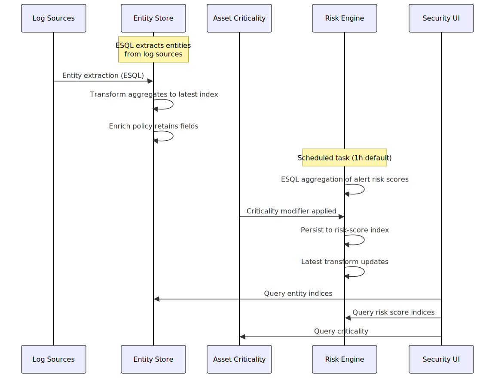

# Entity Analytics Architecture

**Entity Store | Risk Engine | Asset Criticality**

A progressive technical deep-dive for developers.

> **Updating:** Edit this Markdown file directly. To edit diagrams, modify the `.mmd` files in `diagrams/` and run `./diagrams/render.sh`.

---

## Table of Contents

- [1. The Big Picture](#1-the-big-picture)
  - [What is Entity Analytics?](#what-is-entity-analytics)
  - [High-Level Architecture](#high-level-architecture)
  - [Data Flow Overview](#data-flow-overview)
  - [Key Directories](#key-directories)
  - [Two Plugins, One System](#two-plugins-one-system)
- [2. Entity Store](#2-entity-store)
  - [What It Does](#entity-store--what-it-does)
  - [Key Concepts](#entity-store--key-concepts)
  - [Data Flow](#entity-store--data-flow)
  - [ESQL Extraction](#entity-store--esql-extraction)
  - [Elasticsearch Resources](#entity-store--elasticsearch-resources)
  - [Engine Lifecycle](#entity-store--engine-lifecycle)
  - [Kibana Tasks](#entity-store--kibana-tasks)
  - [Field Retention](#entity-store--field-retention)
- [3. Risk Engine](#3-risk-engine)
  - [What It Does](#risk-engine--what-it-does)
  - [Scoring Pipeline](#risk-engine--scoring-pipeline)
  - [ESQL Aggregation](#risk-engine--esql-aggregation)
  - [Score Modifiers](#risk-engine--score-modifiers)
  - [Data Flow](#risk-engine--data-flow)
  - [Lifecycle](#risk-engine--lifecycle)
  - [Kibana Task](#risk-engine--kibana-task)
  - [Saved Object Configuration](#risk-engine--saved-object-configuration)
- [4. Supporting Components](#4-supporting-components)
  - [Asset Criticality](#asset-criticality)
  - [Privilege Monitoring](#privilege-monitoring)
  - [Entity Details Highlights](#entity-details-highlights)
  - [Watchlists (Experimental)](#watchlists-experimental)
- [5. Operational Reference](#5-operational-reference)
  - [API Endpoints — Entity Store](#api-endpoints--entity-store)
  - [API Endpoints — Entity CRUD](#api-endpoints--entity-crud)
  - [API Endpoints — Risk Engine](#api-endpoints--risk-engine)
  - [API Endpoints — Risk Score & Asset Criticality](#api-endpoints--risk-score--asset-criticality)
  - [API Endpoints — Privilege Monitoring](#api-endpoints--privilege-monitoring)
  - [API Endpoints — Entity Store Plugin (Internal)](#api-endpoints--entity-store-plugin-internal)
  - [All Kibana Tasks](#all-kibana-tasks)
  - [Telemetry & Logging Events](#telemetry--logging-events)
  - [Feature Flags & Configuration](#feature-flags--configuration)
  - [Permissions & Privileges](#permissions--privileges)
  - [Stateful vs Serverless](#stateful-vs-serverless)
  - [Complete System Diagram](#complete-system-diagram)
- [Appendixes](#appendixes)
  - [Appendix A: RFC Template](#appendix-a-rfc-template)
  - [Appendix B: Glossary](#appendix-b-glossary)
  - [Appendix C: Quick Reference Links](#appendix-c-quick-reference-links)

---

## 1. The Big Picture

### What is Entity Analytics?

Entity Analytics is a **subsystem within Security Solution** that provides:

- **Entity Store** — Persistent, enriched records of hosts, users, and services
- **Risk Engine** — Automated risk scoring based on alert activity
- **Asset Criticality** — Business context for entities (critical servers, VIP users)
- **Privilege Monitoring** — Detection of privileged access patterns

These components work together to give security analysts a **unified risk-aware view** of all entities in their environment.

> **Not a standalone plugin** — Entity Analytics is part of `security_solution` and registered through its plugin lifecycle.

### High-Level Architecture



### Data Flow Overview



### Key Directories

| Component | Server Code | Common | Public |
|-----------|------------|--------|--------|
| **Entity Store** | [`server/lib/entity_analytics/entity_store/`][es-server] | [`common/entity_analytics/entity_store/`][es-common] | [`public/entity_analytics/`][ea-public] |
| **Risk Engine** | [`server/lib/entity_analytics/risk_engine/`][re-server] | [`common/entity_analytics/risk_engine/`][re-common] | [`public/entity_analytics/`][ea-public] |
| **Risk Score** | [`server/lib/entity_analytics/risk_score/`][rs-server] | [`common/entity_analytics/risk_score/`][rs-common] | — |
| **Asset Criticality** | [`server/lib/entity_analytics/asset_criticality/`][ac-server] | — | [`public/entity_analytics/`][ea-public] |
| **Privilege Monitoring** | [`server/lib/entity_analytics/privilege_monitoring/`][pm-server] | — | — |
| **Entity Store Plugin** | [`plugins/entity_store/server/`][esp-server] | [`plugins/entity_store/common/`][esp-common] | — |

[es-server]: https://github.com/elastic/kibana/tree/main/x-pack/solutions/security/plugins/security_solution/server/lib/entity_analytics/entity_store
[es-common]: https://github.com/elastic/kibana/tree/main/x-pack/solutions/security/plugins/security_solution/common/entity_analytics/entity_store
[ea-public]: https://github.com/elastic/kibana/tree/main/x-pack/solutions/security/plugins/security_solution/public/entity_analytics
[re-server]: https://github.com/elastic/kibana/tree/main/x-pack/solutions/security/plugins/security_solution/server/lib/entity_analytics/risk_engine
[re-common]: https://github.com/elastic/kibana/tree/main/x-pack/solutions/security/plugins/security_solution/common/entity_analytics/risk_engine
[rs-server]: https://github.com/elastic/kibana/tree/main/x-pack/solutions/security/plugins/security_solution/server/lib/entity_analytics/risk_score
[rs-common]: https://github.com/elastic/kibana/tree/main/x-pack/solutions/security/plugins/security_solution/common/entity_analytics/risk_score
[ac-server]: https://github.com/elastic/kibana/tree/main/x-pack/solutions/security/plugins/security_solution/server/lib/entity_analytics/asset_criticality
[pm-server]: https://github.com/elastic/kibana/tree/main/x-pack/solutions/security/plugins/security_solution/server/lib/entity_analytics/privilege_monitoring
[esp-server]: https://github.com/elastic/kibana/tree/main/x-pack/solutions/security/plugins/entity_store/server
[esp-common]: https://github.com/elastic/kibana/tree/main/x-pack/solutions/security/plugins/entity_store/common

### Two Plugins, One System

Entity Analytics spans **two plugins**:

#### 1. Security Solution Plugin (primary) — v1 indices
- Hosts Entity Store engine lifecycle, Risk Engine, Asset Criticality
- Manages API routes, Kibana tasks, saved objects
- Uses **v1 schema** indices: `.entities.v1.{latest|updates|history}.*`
- Coordinates all sub-components

#### 2. Entity Store Plugin (extraction engine) — v2 indices
- Standalone plugin focused on **log extraction via ESQL**
- Manages its own Kibana tasks for entity extraction
- Uses **v2 schema** indices: `.entities.v2.{latest|updates}.*`
- Internal routes under `/internal/security/entity_store/`

> These two plugins manage **independent index sets** at different schema versions. The Security Solution Plugin orchestrates the broader pipeline while the Entity Store Plugin handles ESQL-based extraction.

---

## 2. Entity Store

### Entity Store — What It Does

The Entity Store maintains **persistent, enriched records** for entities observed in your environment.

#### Entity Types

| Type | Identity Field | Description |
|------|---------------|-------------|
| **Host** | `host.name` | Servers, workstations, network devices |
| **User** | `user.name` | Human and service accounts |
| **Service** | `service.name` | Applications and microservices |
| **Generic** | configurable | Catch-all for custom entity types |

> [Entity definitions source](https://github.com/elastic/kibana/tree/main/x-pack/solutions/security/plugins/entity_store/common/domain/definitions)

### Entity Store — Key Concepts

| Concept | Description |
|---------|-------------|
| **Engine** | One engine per entity type, manages its own lifecycle |
| **Updates data stream** | Append-only stream of entity observations (v1 and v2 variants) |
| **Latest index** | Current state of each entity, maintained by a transform (v1 and v2 variants) |
| **Snapshot** | Daily point-in-time backup to history index |
| **Field Retention** | Enrich policy that preserves important fields across observations |
| **EUID** | Entity Unique Identifier — composite key for each entity |

### Entity Store — Data Flow



### Entity Store — ESQL Extraction

Entity extraction uses **ES|QL** to query log sources and extract entity records.

#### How It Works (v2)

1. The **Extract Entity Task** runs on a schedule per entity type
2. Builds an ESQL query targeting the Security Solution data view and any additional index patterns
3. Extracts identity fields and associated metadata with pagination support
4. Writes results **directly to the latest entity index** via `ingestEntities()` — no intermediate transform needed
5. For **CCS (Cross-Cluster Search)** sources, extraction writes to the **updates data stream** which is then merged into latest

#### ESQL Usage

- **Query builder**: [`logs_extraction_query_builder.ts`](https://github.com/elastic/kibana/tree/main/x-pack/solutions/security/plugins/entity_store/server/domain/logs_extraction/logs_extraction_query_builder.ts) — Constructs ESQL with `FROM`, `STATS`, and `EVAL` commands
- **EUID evaluation**: [`esql.ts`](https://github.com/elastic/kibana/tree/main/x-pack/solutions/security/plugins/entity_store/common/domain/euid/esql.ts) — Generates ESQL `EVAL` and `WHERE` clauses for entity unique IDs
- **Executor**: [`esql.ts`](https://github.com/elastic/kibana/tree/main/x-pack/solutions/security/plugins/entity_store/server/infra/elasticsearch/esql.ts) — `executeEsqlQuery()` runs the query and `esqlResponseToBulkObjects()` converts results to bulk index operations

> ESQL is chosen for its ability to efficiently aggregate across large log volumes with `STATS ... BY` grouping.

### Entity Store — Elasticsearch Resources

#### Indices (Security Solution Plugin — v1)

| Index Pattern | Purpose |
|--------------|---------|
| `.entities.v1.updates.security_{type}_{namespace}` | Append-only data stream for entity observations |
| `.entities.v1.latest.security_{type}_{namespace}` | Current state of each entity |
| `.entities.v1.history.{snapshotId}` | Daily snapshot history |
| `.entities.v1.reset.security_{type}_{namespace}` | Reset index for score zeroing |

#### Indices (Entity Store Plugin — v2)

| Index Pattern | Purpose |
|--------------|---------|
| `.entities.v2.updates.security_{namespace}` | Updates data stream (ESQL extraction target) |
| `.entities.v2.latest.security_{namespace}` | Latest entity state (CRUD + extraction) |

#### Transforms

- **Pivot transform** aggregates the updates data stream into the latest entity index
- Uses `generatePivotGroup` from `@kbn/entityManager-plugin` for transform configuration
- Groups by entity identity field, keeps latest values

#### Enrich Policies

| Resource | Purpose |
|----------|---------|
| `entity_store_field_retention_{entityType}_{namespace}_v{version}` | Field retention — preserves important fields across entity updates |

#### Ingest Pipelines

| Pipeline | Purpose |
|----------|---------|
| `.entities.v2.latest.security_{namespace}_ingest_pipeline` | Dot expander — converts flat dotted fields to nested objects |

> [ES assets source](https://github.com/elastic/kibana/tree/main/x-pack/solutions/security/plugins/security_solution/server/lib/entity_analytics/entity_store/elasticsearch_assets)

### Entity Store — Engine Lifecycle



#### Key Classes

- [**EntityStoreDataClient**](https://github.com/elastic/kibana/tree/main/x-pack/solutions/security/plugins/security_solution/server/lib/entity_analytics/entity_store/entity_store_data_client.ts) — `init()`, `start()`, `stop()`, `delete()`, `getStatus()`
- [**EntityStoreCrudClient**](https://github.com/elastic/kibana/tree/main/x-pack/solutions/security/plugins/security_solution/server/lib/entity_analytics/entity_store/entity_store_crud_client.ts) — `upsertEntity()`, `upsertEntitiesBulk()`, `deleteEntity()`

### Entity Store — Kibana Tasks

| Task Type | Schedule | Purpose |
|-----------|----------|---------|
| `entity_store:v2:extract_entity_task:{entityType}` | Configurable | Extract entities from logs via ESQL |
| `entity_store:v2:entity_maintainer_task` | Configurable | Entity lifecycle maintenance |
| `entity_store:snapshot` | Daily | Reindex latest → history, reset index |
| `entity_store:field_retention:enrichment` | Configurable | Execute field retention enrich policy |
| `entity_store:data_view:refresh` | Configurable | Refresh data views for new indices |
| `entity_store:health` | Periodic | Monitor entity store health |

> [Task definitions](https://github.com/elastic/kibana/tree/main/x-pack/solutions/security/plugins/security_solution/server/lib/entity_analytics/entity_store/tasks)

### Entity Store — Field Retention

Field retention ensures **important entity fields persist** even when newer observations don't include them.

#### What is an Elasticsearch Enrich Policy?

An [enrich policy](https://www.elastic.co/guide/en/elasticsearch/reference/current/enrich-policy-definition.html) is an Elasticsearch feature that lets you augment incoming documents with data from an existing index at ingest time. It works in three steps:

1. **Define** — You create an enrich policy that specifies a source index, a match field, and which fields to copy from the source
2. **Execute** — Elasticsearch builds a read-only, in-memory snapshot of the source data (the _enrich index_). This must be re-executed periodically to pick up changes
3. **Use via ingest pipeline** — An `enrich` processor in an ingest pipeline looks up the match field in the incoming document against the enrich index and appends the matched fields to the document

Enrich policies are designed for one-directional enrichment: they add fields to documents **as they are indexed**, not retroactively. The enrich index is a point-in-time snapshot, so policies must be periodically re-executed to stay current.

#### How Entity Store Uses Enrich Policies

The Entity Store uses enrich policies for **field retention** — preserving entity fields across observations when newer log data may not include all fields:

1. An enrich policy is created from the **latest entity index** as its source
2. The **match field** is the entity identity (e.g., `host.name`)
3. The **enrich fields** are the entity fields that should be retained
4. An ingest pipeline with an `enrich` processor runs on incoming entity documents
5. When a new observation arrives without a field (e.g., `host.os.name`), the enrich processor fills it in from the previous entity record

This creates a "carry-forward" effect where entity fields accumulate over time rather than being lost when a particular log source omits them.

#### Validation

- Enrich policy execution interval must be `≤ lookbackPeriod / 2` to ensure the enrich index stays reasonably current
- Validated at init time via [`validation.ts`](https://github.com/elastic/kibana/tree/main/x-pack/solutions/security/plugins/security_solution/server/lib/entity_analytics/entity_store/routes/validation.ts)

> This pattern prevents data loss when log sources intermittently omit fields.

---

## 3. Risk Engine

### Risk Engine — What It Does

The Risk Engine **calculates risk scores** for entities based on their security alert activity.

#### Key Characteristics

- Runs as a **scheduled Kibana task** (default: every 1 hour)
- Uses **ES|QL** to aggregate alert risk scores per entity
- Applies **modifiers** from Asset Criticality and Privilege Monitoring
- Persists scores to a **time-series data stream** with a **latest transform**
- Supports **host**, **user**, and **service** entity types

#### Scoring Formula

Uses a **Riemann zeta weighted sum** to bound the aggregation:

```
score = MV_PSERIES_WEIGHTED_SUM(TOP(risk_scores, sampleSize, "desc"), s=1.5)
```

The zeta function ensures diminishing returns — many low-severity alerts don't inflate the score as much as a few high-severity ones.

> [Scoring constants](https://github.com/elastic/kibana/tree/main/x-pack/solutions/security/plugins/security_solution/server/lib/entity_analytics/risk_score/constants.ts): `RIEMANN_ZETA_S_VALUE = 1.5`, `RIEMANN_ZETA_VALUE = 2.5924`

### Risk Engine — Scoring Pipeline



### Risk Engine — ESQL Aggregation

The risk scoring query uses ES|QL to efficiently aggregate alert data.

#### Query Structure

1. **`FROM`** — Reads from the security alerts index
2. **`WHERE`** — Filters by time range (default: `now-30d` to `now`), excludes closed alerts
3. **`STATS ... BY`** — Groups by entity identifier (host.name, user.name, service.name)
4. **`TOP`** — Selects the top N alert risk scores per entity (descending)
5. **`MV_PSERIES_WEIGHTED_SUM`** — Applies the Riemann zeta weighted sum

#### Key Parameters

| Parameter | Default | Description |
|-----------|---------|-------------|
| `range.start` | `now-30d` | Lookback window start |
| `range.end` | `now` | Lookback window end |
| `pageSize` | 3,500 | Entities processed per batch |
| `alertSampleSizePerShard` | 10,000 | Max alerts sampled per shard |
| `excludeAlertStatuses` | `['closed']` | Alert statuses to skip |

> [ESQL calculation source](https://github.com/elastic/kibana/tree/main/x-pack/solutions/security/plugins/security_solution/server/lib/entity_analytics/risk_score/calculate_esql_risk_scores.ts)

### Risk Engine — Score Modifiers

After ESQL aggregation, scores are adjusted by **modifiers**:

#### Asset Criticality Modifier

Applies a **Bayesian update** based on the entity's criticality level:

| Criticality Level | Effect |
|-------------------|--------|
| `low_impact` | Decreases score |
| `medium_impact` | Neutral |
| `high_impact` | Increases score |
| `extreme_impact` | Significantly increases score |

> [Criticality modifier source](https://github.com/elastic/kibana/tree/main/x-pack/solutions/security/plugins/security_solution/server/lib/entity_analytics/risk_score/modifiers/asset_criticality.ts)

#### Privilege Monitoring Modifier

Adjusts scores for entities identified as **privileged users** by the Privilege Monitoring engine.

> [Score modifiers source](https://github.com/elastic/kibana/tree/main/x-pack/solutions/security/plugins/security_solution/server/lib/entity_analytics/risk_score/apply_score_modifiers.ts)

### Risk Engine — Data Flow

#### Indices

| Index | Type | Purpose |
|-------|------|---------|
| `.alerts-security.alerts-{namespace}` | **Read** | Source of alert risk scores |
| `risk-score.risk-score-{namespace}` | **Write** | Time-series data stream of calculated scores |
| `risk-score.risk-score-latest-{namespace}` | **Read/Write** | Latest score per entity (via transform) |

#### Transform

- **ID**: `risk_score_latest_transform_{namespace}`
- **Type**: Latest transform
- **Unique keys**: `host.name`, `user.name`, `service.name`
- **Sync field**: `@timestamp`
- **Frequency**: Every 1 hour
- **Managed by**: `security-entity-analytics`

#### Reset to Zero

When enabled, entities **without recent alert activity** have their scores reset to zero, preventing stale high scores from persisting.

> [Index definitions](https://github.com/elastic/kibana/tree/main/x-pack/solutions/security/plugins/security_solution/common/entity_analytics/risk_engine/indices.ts) | [Transform config](https://github.com/elastic/kibana/tree/main/x-pack/solutions/security/plugins/security_solution/server/lib/entity_analytics/risk_score/configurations.ts)

### Risk Engine — Lifecycle



#### Initialization Creates

1. Risk score index template and data stream
2. Risk score latest index
3. Ingest pipeline (`event.ingested` from `@timestamp`)
4. Latest transform
5. Saved object configuration
6. Risk scoring Kibana task

> [RiskEngineDataClient](https://github.com/elastic/kibana/tree/main/x-pack/solutions/security/plugins/security_solution/server/lib/entity_analytics/risk_engine/risk_engine_data_client.ts) | [RiskScoreDataClient](https://github.com/elastic/kibana/tree/main/x-pack/solutions/security/plugins/security_solution/server/lib/entity_analytics/risk_score/risk_score_data_client.ts)

### Risk Engine — Kibana Task

| Property | Value |
|----------|-------|
| **Task Type** | `risk_engine:risk_scoring` |
| **Task ID** | `risk_engine:risk_scoring:{namespace}:0.0.1` |
| **Interval** | `1h` (default) |
| **Timeout** | `10m` |
| **Scope** | `securitySolution` |

#### Task Execution Flow

1. Load configuration from saved object
2. Resolve alerts index from data view
3. For each entity type (host, user, service):
   - Execute ESQL aggregation
   - Apply score modifiers
   - Bulk index to risk score data stream
4. Optionally reset scores for inactive entities
5. Refresh risk score index
6. Trigger latest transform

> [Task source](https://github.com/elastic/kibana/tree/main/x-pack/solutions/security/plugins/security_solution/server/lib/entity_analytics/risk_score/tasks/risk_scoring_task.ts) | [Task constants](https://github.com/elastic/kibana/tree/main/x-pack/solutions/security/plugins/security_solution/server/lib/entity_analytics/risk_score/tasks/constants.ts)

### Risk Engine — Saved Object Configuration

The risk engine stores its configuration in a **`risk-engine-configuration` saved object**:

| Field | Default | Description |
|-------|---------|-------------|
| `enabled` | `false` | Whether the engine is active |
| `dataViewId` | alerts index | Source data view |
| `interval` | `1h` | Task run frequency |
| `pageSize` | `3,500` | Entities per batch |
| `range.start` | `now-30d` | Lookback start |
| `range.end` | `now` | Lookback end |
| `enableResetToZero` | `true` | Reset stale scores |
| `excludeAlertStatuses` | `['closed']` | Statuses to skip |
| `alertSampleSizePerShard` | `10,000` | Max alerts per shard |

> [Saved object type](https://github.com/elastic/kibana/tree/main/x-pack/solutions/security/plugins/security_solution/server/lib/entity_analytics/risk_engine/saved_object/risk_engine_configuration_type.ts) | [Default configuration](https://github.com/elastic/kibana/tree/main/x-pack/solutions/security/plugins/security_solution/server/lib/entity_analytics/risk_engine/saved_object)

---

## 4. Supporting Components

### Asset Criticality

Asset Criticality lets analysts **assign business importance** to entities, which then **modifies their risk scores**.

#### Data Flow



#### Criticality Levels

`low_impact` | `medium_impact` | `high_impact` | `extreme_impact`

#### Key Files

- [**AssetCriticalityDataClient**](https://github.com/elastic/kibana/tree/main/x-pack/solutions/security/plugins/security_solution/server/lib/entity_analytics/asset_criticality/asset_criticality_data_client.ts) — CRUD operations against ES
- [**AssetCriticalityService**](https://github.com/elastic/kibana/tree/main/x-pack/solutions/security/plugins/security_solution/server/lib/entity_analytics/asset_criticality/asset_criticality_service.ts) — Business logic layer
- [**CSV parser**](https://github.com/elastic/kibana/tree/main/x-pack/solutions/security/plugins/security_solution/common/entity_analytics/asset_criticality/parse_asset_criticality_csv_row.ts) — Validates and parses CSV uploads

### Privilege Monitoring

Monitors and identifies **privileged users** whose activity should receive elevated scrutiny.

#### Components

- **Privilege Monitoring Engine** — Tracks privileged users and their sources
- **PAD (Privileged Access Detection)** — ML-based detection of privileged access patterns
- **Entity Sources** — Configurable sources that identify privileged users
- **Risk Score Modifier** — Privileged users receive adjusted risk scores

#### Key Files

- [**PrivilegeMonitoringDataClient**](https://github.com/elastic/kibana/tree/main/x-pack/solutions/security/plugins/security_solution/server/lib/entity_analytics/privilege_monitoring/engine/data_client.ts) — Engine lifecycle and data operations
- [**Privilege monitoring task**](https://github.com/elastic/kibana/tree/main/x-pack/solutions/security/plugins/security_solution/server/lib/entity_analytics/privilege_monitoring/tasks/privilege_monitoring_task.ts) — Task type: `entity_analytics:monitoring:privileges:engine`

### Entity Details Highlights

Provides **contextual highlights** in entity flyouts using ML anomaly data.

#### How It Works

1. Queries existing ML security jobs for the entity
2. Retrieves anomaly records and influence scores
3. Combines with risk score data
4. Surfaces in the entity details flyout

#### Feature Flag

`entityDetailsHighlightsEnabled` (default: `true`)

> [Highlights service](https://github.com/elastic/kibana/tree/main/x-pack/solutions/security/plugins/security_solution/server/lib/entity_analytics/entity_details)

### Watchlists (Experimental)

Watchlists allow analysts to **curate lists of entities** for focused monitoring.

#### Status

- **Feature flag**: `entityAnalyticsWatchlistEnabled` (default: `false`)
- Provides CRUD API for watchlist management
- Intended to integrate with Entity Store as an entity source

> [Watchlists source](https://github.com/elastic/kibana/tree/main/x-pack/solutions/security/plugins/security_solution/server/lib/entity_analytics/watchlists)

---

## 5. Operational Reference

### API Endpoints — Entity Store

| Method | Endpoint | Description | Key Fields |
|--------|----------|-------------|------------|
| POST | `/api/entity_store/enable` | Enable entity store for all types | `fieldHistoryLength`, `entityTypes[]` |
| GET | `/api/entity_store/status` | Overall entity store status | Returns `engines[]`, `status` |
| POST | `/api/entity_store/engines/{entityType}/init` | Initialize engine for type | `indexPattern`, `filter`, `fieldHistoryLength` |
| POST | `/api/entity_store/engines/{entityType}/start` | Start a stopped engine | — |
| POST | `/api/entity_store/engines/{entityType}/stop` | Stop a running engine | — |
| DELETE | `/api/entity_store/engines/{entityType}` | Delete engine and resources | `deleteData` (boolean) |
| DELETE | `/api/entity_store/engines` | Delete all engines | `deleteData` (boolean) |
| GET | `/api/entity_store/engines/{entityType}` | Get engine details | Returns engine descriptor |
| GET | `/api/entity_store/engines` | List all engines | Returns `engines[]` |
| POST | `/api/entity_store/engines/apply_dataview_indices` | Update source indices | — |
| GET | `/api/entity_store/privileges` | Check required ES privileges | Returns `has_all_required` |

> [Routes source](https://github.com/elastic/kibana/tree/main/x-pack/solutions/security/plugins/security_solution/server/lib/entity_analytics/entity_store/routes)

### API Endpoints — Entity CRUD

| Method | Endpoint | Description | Key Fields |
|--------|----------|-------------|------------|
| PUT | `/api/entity_store/entities/{entityType}` | Upsert single entity | `entity` object with identity + fields |
| PUT | `/api/entity_store/entities/bulk` | Bulk upsert entities | `entities[]` array |
| DELETE | `/api/entity_store/entities/{entityType}` | Delete entity by ID | `entityId` |
| POST | `/api/entity_store/entities/list` | List entities with filters | `filterQuery`, `sortField`, `page`, `perPage` |

> [Entity CRUD source](https://github.com/elastic/kibana/tree/main/x-pack/solutions/security/plugins/security_solution/server/lib/entity_analytics/entity_store/routes/entity_crud)

### API Endpoints — Risk Engine

| Method | Endpoint | Description | Key Fields |
|--------|----------|-------------|------------|
| POST | `/internal/risk_score/engine/init` | Initialize risk engine | Creates indices, transforms, task |
| POST | `/internal/risk_score/engine/enable` | Enable risk engine | Starts the scoring task |
| POST | `/internal/risk_score/engine/disable` | Disable risk engine | Stops the scoring task |
| GET | `/internal/risk_score/engine/status` | Get engine status | Returns `risk_engine_status`, `is_max_amount_of_risk_engines_reached` |
| POST | `/internal/risk_score/engine/schedule_now` | Trigger immediate run | — |
| GET | `/internal/risk_score/engine/privileges` | Check required privileges | Returns `has_all_required`, `privileges` |
| GET | `/internal/risk_score/engine/settings` | Get engine settings | Returns saved object config |
| POST | `/api/risk_score/engine/dangerously_delete_data` | Delete all data | Removes indices, transforms, tasks |
| POST | `/api/risk_score/engine/saved_object/configure` | Update configuration | `dataViewId`, `range`, `interval`, etc. |

### API Endpoints — Risk Score & Asset Criticality

#### Risk Score

| Method | Endpoint | Description | Key Fields |
|--------|----------|-------------|------------|
| POST | `/internal/risk_score/preview` | Preview scores without persisting | `data_view_id`, `filter`, `range` |
| POST | `/internal/risk_score/calculation/entity` | Calculate for specific entity | `identifier`, `identifier_type` |

#### Asset Criticality

| Method | Endpoint | Description | Key Fields |
|--------|----------|-------------|------------|
| GET | `/api/asset_criticality` | Get criticality record | `id_field`, `id_value` |
| PUT | `/api/asset_criticality` | Upsert criticality record | `id_field`, `id_value`, `criticality_level` |
| DELETE | `/api/asset_criticality` | Delete criticality record | `id_field`, `id_value` |
| POST | `/api/asset_criticality/list` | List records | `page`, `per_page`, `sort_field` |
| POST | `/api/asset_criticality/bulk` | Bulk upload | `records[]` |
| POST | `/api/asset_criticality/upload_csv` | Upload CSV file | multipart form data |
| GET | `/internal/asset_criticality/privileges` | Check privileges | Returns privilege status |

> [Asset criticality routes](https://github.com/elastic/kibana/tree/main/x-pack/solutions/security/plugins/security_solution/server/lib/entity_analytics/asset_criticality/routes)

### API Endpoints — Privilege Monitoring

| Method | Endpoint | Description |
|--------|----------|-------------|
| POST | `/api/entity_analytics/monitoring/engine/init` | Initialize monitoring engine |
| POST | `/api/entity_analytics/monitoring/engine/disable` | Disable monitoring |
| POST | `/api/entity_analytics/monitoring/engine/schedule_now` | Trigger immediate run |
| DELETE | `/api/entity_analytics/monitoring/engine/delete` | Delete monitoring engine |
| GET | `/api/entity_analytics/monitoring/privileges/health` | Health check |
| GET | `/api/entity_analytics/monitoring/privileges/privileges` | Check privileges |
| POST | `/api/entity_analytics/monitoring/users` | Create privileged user |
| GET | `/api/entity_analytics/monitoring/users/list` | List privileged users |
| PUT | `/api/entity_analytics/monitoring/users/{id}` | Update privileged user |
| DELETE | `/api/entity_analytics/monitoring/users/{id}` | Delete privileged user |
| POST | `/api/entity_analytics/monitoring/users/_csv` | Upload users via CSV |
| POST | `/api/entity_analytics/monitoring/entity_source` | Create entity source |
| GET | `/api/entity_analytics/monitoring/entity_source/{id}` | Get entity source |
| PUT | `/api/entity_analytics/monitoring/entity_source/{id}` | Update entity source |
| DELETE | `/api/entity_analytics/monitoring/entity_source/{id}` | Delete entity source |

> [Privilege monitoring routes](https://github.com/elastic/kibana/tree/main/x-pack/solutions/security/plugins/security_solution/server/lib/entity_analytics/privilege_monitoring/routes)

### API Endpoints — Entity Store Plugin (Internal)

| Method | Endpoint | Description |
|--------|----------|-------------|
| POST | `/internal/security/entity_store/install` | Install entity store resources |
| POST | `/internal/security/entity_store/uninstall` | Uninstall entity store |
| GET | `/internal/security/entity_store/status` | Get status |
| PUT | `/internal/security/entity_store/start` | Start entity store |
| PUT | `/internal/security/entity_store/stop` | Stop entity store |
| POST | `/internal/security/entity_store/{entityType}/force_log_extraction` | Force log extraction for type |
| POST | `/internal/security/entity_store/{entityType}/force_ccs_extract_to_updates` | Force CCS extraction |
| PUT | `/internal/security/entity_store/entities/{entityType}` | Upsert entity |
| PUT | `/internal/security/entity_store/entities/bulk` | Bulk upsert |
| DELETE | `/internal/security/entity_store/entities/` | Delete entity |

> [Entity Store plugin routes](https://github.com/elastic/kibana/tree/main/x-pack/solutions/security/plugins/entity_store/server/routes)

### All Kibana Tasks

| Task Type | Interval | Timeout | Purpose |
|-----------|----------|---------|---------|
| `risk_engine:risk_scoring` | 1h | 10m | Calculate and persist risk scores |
| `entity_store:v2:extract_entity_task:{type}` | Configurable | Configurable | ESQL entity extraction from logs |
| `entity_store:v2:entity_maintainer_task` | Configurable | Configurable | Entity lifecycle maintenance |
| `entity_store:snapshot` | Daily | — | Snapshot latest → history index |
| `entity_store:field_retention:enrichment` | Configurable | — | Execute field retention enrich policy |
| `entity_store:data_view:refresh` | Configurable | — | Refresh data views |
| `entity_store:health` | Periodic | — | Health monitoring |
| `entity_analytics:monitoring:privileges:engine` | Configurable | — | Privilege monitoring engine |

#### Migration Tasks (run once)

| Task Type | Purpose |
|-----------|---------|
| `security-solution-ea-risk-score-copy-timestamp-to-event-ingested` | Backfill `event.ingested` on risk scores |
| `security-solution-ea-asset-criticality-copy-timestamp-to-event-ingested` | Backfill `event.ingested` on asset criticality |
| `security-solution-ea-asset-criticality-ecs-migration` | Migrate asset criticality to ECS format |

### Telemetry & Logging Events

#### Event-Based Telemetry

| Event | When |
|-------|------|
| `ENTITY_STORE_API_CALL_EVENT` | Any Entity Store API call |
| `ENTITY_ENGINE_INITIALIZATION_EVENT` | Engine initialized |
| `ENTITY_ENGINE_DELETION_EVENT` | Engine deleted |
| `ENTITY_ENGINE_RESOURCE_INIT_FAILURE_EVENT` | Resource creation failed |
| `ENTITY_STORE_DATA_VIEW_REFRESH_EXECUTION_EVENT` | Data view refresh task runs |
| `ENTITY_STORE_SNAPSHOT_TASK_EXECUTION_EVENT` | Snapshot task runs |
| `ENTITY_STORE_HEALTH_REPORT_EVENT` | Health check reports |
| `ENTITY_STORE_USAGE_EVENT` | Entity Store usage metrics |
| `ENTITY_HIGHLIGHTS_USAGE_EVENT` | Entity highlights viewed |

#### Usage Collectors

- **Risk engine metrics**: `getRiskEngineMetrics` — collected via `server/usage/collector.ts`
- **Asset criticality stats**: `getAssetCriticalityStats` — asset counts by criticality level

> [Telemetry events](https://github.com/elastic/kibana/tree/main/x-pack/solutions/security/plugins/security_solution/server/lib/telemetry/event_based/events.ts)

### Feature Flags & Configuration

#### Experimental Features (`common/experimental_features.ts`)

| Flag | Default | Description |
|------|---------|-------------|
| `entityStoreDisabled` | `false` | Kill switch for Entity Store |
| `entityDetailsHighlightsEnabled` | `true` | Entity details highlights in flyouts |
| `entityAnalyticsWatchlistEnabled` | `false` | Watchlists feature |
| `entityThreatHuntingEnabled` | `false` | Entity threat hunting |
| `enableRiskScoreResetToZero` | `true` | Reset scores for inactive entities |
| `enableRiskScorePrivmonModifier` | `true` | Privilege monitoring risk modifier |
| `riskScoreAssistantToolDisabled` | `false` | AI assistant risk score tool |

#### Kibana Configuration (`xpack.securitySolution.entityAnalytics`)

```yaml
xpack.securitySolution.entityAnalytics:
  riskEngine:
    alertSampleSizePerShard: 10000
  assetCriticality:
    csvUpload: { ... }
  entityStore: { ... }
```

> [Experimental features](https://github.com/elastic/kibana/tree/main/x-pack/solutions/security/plugins/security_solution/common/experimental_features.ts) | [Server config](https://github.com/elastic/kibana/tree/main/x-pack/solutions/security/plugins/security_solution/server/config.ts)

### Permissions & Privileges

#### Required Capabilities

All Entity Analytics routes require: `securitySolution` + `siem-entity-analytics`

#### Elasticsearch Privileges

| Component | Index Privileges | Cluster Privileges |
|-----------|-----------------|-------------------|
| **Entity Store** | read/write on `.entities.*` | `manage_enrich`, `manage_ingest_pipelines`, `manage_transform` |
| **Risk Engine** | read/write on `risk-score.*` | `manage_transform` |
| **Asset Criticality** | read/write on asset criticality index | — |
| **Privilege Monitoring** | read/write on monitoring indices | — |

#### Key Files

- [`common/entity_analytics/privileges.ts`](https://github.com/elastic/kibana/tree/main/x-pack/solutions/security/plugins/security_solution/common/entity_analytics/privileges.ts) — Privilege checking utilities
- [`risk_engine/risk_engine_privileges.ts`](https://github.com/elastic/kibana/tree/main/x-pack/solutions/security/plugins/security_solution/server/lib/entity_analytics/risk_engine/risk_engine_privileges.ts) — Risk engine specific privileges

### Stateful vs Serverless

| Aspect | Stateful | Serverless |
|--------|----------|------------|
| **Entity Store** | Full support | Full support |
| **Risk Engine** | Full support | Full support |
| **Asset Criticality** | Full support | Full support |
| **Privilege Monitoring** | Full support | Full support |
| **API Key Management** | Uses stored API keys | Uses stored API keys |
| **Task Manager** | Standard task scheduling | Serverless task scheduling |
| **ML Integration** | Full ML features | Serverless ML constraints |
| **Index Management** | Standard ES indices | Serverless index management |

> Both deployment models share the same codebase. Differences are primarily in infrastructure constraints rather than feature availability.

#### OpenAPI Specs

- [Serverless spec](https://github.com/elastic/kibana/tree/main/x-pack/solutions/security/plugins/security_solution/docs/openapi/serverless/security_solution_entity_analytics_api_2023_10_31.bundled.schema.yaml)
- [ESS spec](https://github.com/elastic/kibana/tree/main/x-pack/solutions/security/plugins/security_solution/docs/openapi/ess/security_solution_entity_analytics_api_2023_10_31.bundled.schema.yaml)

### Complete System Diagram



---

## Appendixes

### Appendix A: RFC Template

> Add upcoming RFCs and design proposals below. Each RFC should include:
> - **Title** and link to the RFC document
> - **Status** (Draft / In Review / Accepted / Implemented)
> - **Summary** of proposed changes
> - **Impact** on existing architecture

#### A.1: [RFC Title]

**Status**: Draft | In Review | Accepted | Implemented
**Author**: —
**Link**: —

**Summary:** _Describe the proposed change._

**Architectural Impact:** _How does this change affect Entity Store, Risk Engine, or Asset Criticality?_

**New/Modified Components:** _List any new indices, tasks, APIs, or configuration changes._

#### A.2: [RFC Title]

**Status**: Draft | In Review | Accepted | Implemented
**Author**: —
**Link**: —

**Summary:** _Describe the proposed change._

**Architectural Impact:** _How does this change affect Entity Store, Risk Engine, or Asset Criticality?_

**New/Modified Components:** _List any new indices, tasks, APIs, or configuration changes._

### Appendix B: Glossary

| Term | Definition |
|------|-----------|
| **Entity** | A host, user, service, or generic object tracked by the Entity Store |
| **EUID** | Entity Unique Identifier — composite key identifying an entity |
| **Engine** | A running instance that manages one entity type's lifecycle |
| **Field Retention** | Mechanism to preserve entity fields across observations using enrich policies |
| **Latest Transform** | Elasticsearch transform that maintains the current state from a time-series stream |
| **Pivot Transform** | Aggregation transform that groups entity observations |
| **Riemann Zeta** | Mathematical function used to weight and bound risk score aggregation |
| **Score Modifier** | Post-calculation adjustment (asset criticality, privilege monitoring) |
| **Snapshot** | Daily point-in-time copy of entity data to history index |
| **Updates Data Stream** | Append-only stream of entity observations before aggregation |

### Appendix C: Quick Reference Links

#### Source Code

- [Entity Analytics (server)](https://github.com/elastic/kibana/tree/main/x-pack/solutions/security/plugins/security_solution/server/lib/entity_analytics)
- [Entity Analytics (common)](https://github.com/elastic/kibana/tree/main/x-pack/solutions/security/plugins/security_solution/common/entity_analytics)
- [Entity Analytics (public)](https://github.com/elastic/kibana/tree/main/x-pack/solutions/security/plugins/security_solution/public/entity_analytics)
- [Entity Store Plugin](https://github.com/elastic/kibana/tree/main/x-pack/solutions/security/plugins/entity_store)

#### OpenAPI Specifications

- [Entity Analytics API (Serverless)](https://github.com/elastic/kibana/tree/main/x-pack/solutions/security/plugins/security_solution/docs/openapi/serverless/security_solution_entity_analytics_api_2023_10_31.bundled.schema.yaml)
- [Entity Analytics API (ESS)](https://github.com/elastic/kibana/tree/main/x-pack/solutions/security/plugins/security_solution/docs/openapi/ess/security_solution_entity_analytics_api_2023_10_31.bundled.schema.yaml)

#### Key Files

- [Register Entity Analytics Routes](https://github.com/elastic/kibana/tree/main/x-pack/solutions/security/plugins/security_solution/server/lib/entity_analytics/register_entity_analytics_routes.ts)
- [Experimental Features](https://github.com/elastic/kibana/tree/main/x-pack/solutions/security/plugins/security_solution/common/experimental_features.ts)
- [Server Config](https://github.com/elastic/kibana/tree/main/x-pack/solutions/security/plugins/security_solution/server/config.ts)
