# Threat Intelligence Phase A — Architecture Overview & PRD

| | |
| --- | --- |
| **PR** | [#269002](https://github.com/elastic/kibana/pull/269002) — *Semantic threat hunting at machine speed* |
| **Branch** | `threat-intel-poc` |
| **Status** | POC / Phase A |
| **Updated** | 2026-05-17 |
| **Canonical code** | `x-pack/solutions/security/plugins/security_solution/server/threat_intelligence/` |

## Table of Contents

1. [Executive Summary (One-Pager)](#1-executive-summary-one-pager)
2. [Component Architecture](#2-component-architecture)
3. [Data Flow Diagrams](#3-data-flow-diagrams)
4. [Index & Schema Overview](#4-index--schema-overview)
5. [API Surface](#5-api-surface)
6. [PRD](#6-prd)

Diagrams live in [`diagrams/`](./diagrams/) as **Excalidraw-style PNG exports** (sequence and component maps). They match the layout in `threat_intelligence_phase_a_architecture.docx`. See [`diagrams/README.md`](./diagrams/README.md) for editing and regeneration.

---

## 1. Executive Summary (One-Pager)

### What Is This?

Phase A introduces a **source-agnostic Threat Intelligence skill** for Elastic Security’s Agent Builder. It continuously ingests external threat feeds, enables analysts to paste ad-hoc reports, extracts indicators of compromise (IOCs) and behavioral TTPs using LLMs, runs **semantic two-tier threat hunting** across the customer environment, proposes Detection Engine rules grounded in MITRE ATT&CK, synthesizes cross-report advisories, and delivers scheduled intelligence digests — all from a single conversational interface and a new **Intelligence Hub** dashboard.

The headline capability added in this PR: **IOC matching is brittle because adversaries rotate identifiers; behavior is durable because it is constrained by the OS.** The implementation expresses that as a tradecraft-style **Tier 1 → Tier 2** hunt pipeline at machine speed.

### Why Now?

Security analysts switch between disparate threat-intel platforms (MISP, ThreatConnect, vendor portals) and manually translate findings into Elastic detection rules. This creates latency between published threat intelligence and active detection coverage. The Threat Intelligence skill closes that gap by making the full workflow — **ingest → extract → hunt → detect → report** — agentic and automated inside Kibana.

### What Ships in Phase A

| Capability | Mechanism |
| --- | --- |
| Continuous feed ingestion (**249** default feeds) | `source_ingestion` workflow (every **4 h**) + dedicated TypeScript adapters (`rss`, `stix`, `taxii`, `vendor_api`) |
| Ad-hoc analyst paste / URL ingest | `ingest_report` skill API |
| IOC extraction + indicator mirror | `nl_extraction_behavioral` workflow (every **4 h**) + `ioc_indicator_sync` task (every **15 min**) |
| **Tier 1 forward hunt** (atomic IOC / technique lookups) | `hunt_for_threat` API across customer environment indices |
| **Tier 2 behavioral rules** (LLM + MITRE catalog) | `hunt_behavior` API; corroborated by Tier 1 hits when `tier2_when: on_hits` |
| **Orchestrated two-tier hunt** | `hunt_orchestrated` API — chains Tier 1 → Tier 2; writes hunt feedback + `corroborated_rank_score` |
| Cross-report advisory synthesis | `synthesize_advisory` API; wired into `digest_delivery` |
| ATT&CK coverage gap analysis | `coverage_gap` API → `threat-intel-mitre-heatmap` attachment |
| Scheduled intelligence digests | `digest_delivery` workflow (hourly) + `manage_subscriptions` API |
| Alert-to-report attribution (batch) | `hit_provenance_backfill` workflow (hourly) |
| **Alert flyout report provenance (P0)** | `flyout_insights` API + document flyout panel ([RFC 0002](../rfcs/0002_alert_flyout_threat_intel_insights.md)) |
| **Intelligence Hub dashboard** | `dashboard/overview` + saved views + location-aware region defaults |
| Brittle-alert → durable-rule loop | `generalize_from_telemetry` API (synthetic `telemetry` reports) |
| Shared MITRE ATT&CK catalog | `@kbn/securitysolution-mitre-catalog` package |

### What Does Not Ship (Phase A)

| Item | Notes |
| --- | --- |
| **Layer 3** (Streams Query KIs) | RFC-only ([0001](../rfcs/0001_streams_layer3_grounded_hypothesis_flow.md)). Pre-authored ES\|QL hypothesis piping into `platform.streams` is gated on a cross-team contract. |
| TAXII server exposure | Kibana does not serve indicators externally. |
| SOAR integrations | No webhook fan-out or ticketing beyond email/Slack via Kibana actions connectors. |
| Multi-space replication fan-out | `space_id` sentinel `*` is modeled; per-space fan-out logic is future work. |
| Stable public API | All routes are `/internal/`; promotion to `/api/` is Phase C. |

### Feature Flag Gating

Both capabilities are off by default on `security_solution` experimental features:

```yaml
xpack.securitySolution.enableExperimental:
  - threatIntelligenceSkillEnabled   # skill, routes, workflows, dashboard, flyout panel
  - iocIndicatorSyncEnabled          # schedules the IOC mirror task (optional)
```

Legacy `xpack.threatIntelligence.enableExperimental` keys are remapped for backward compatibility.

---

## 2. Component Architecture

### 2.1 High-Level Component Map

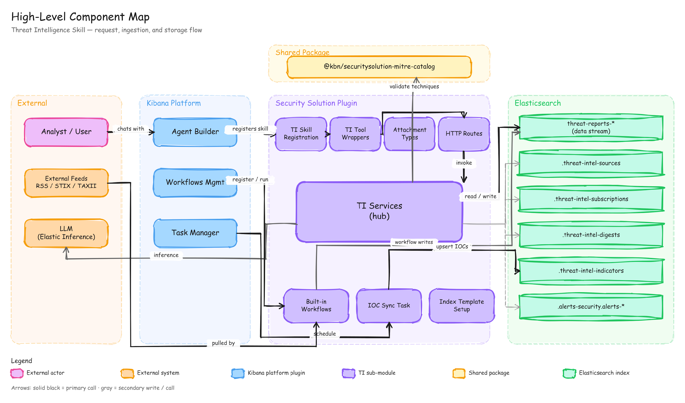

### 2.2 Plugin Dependencies

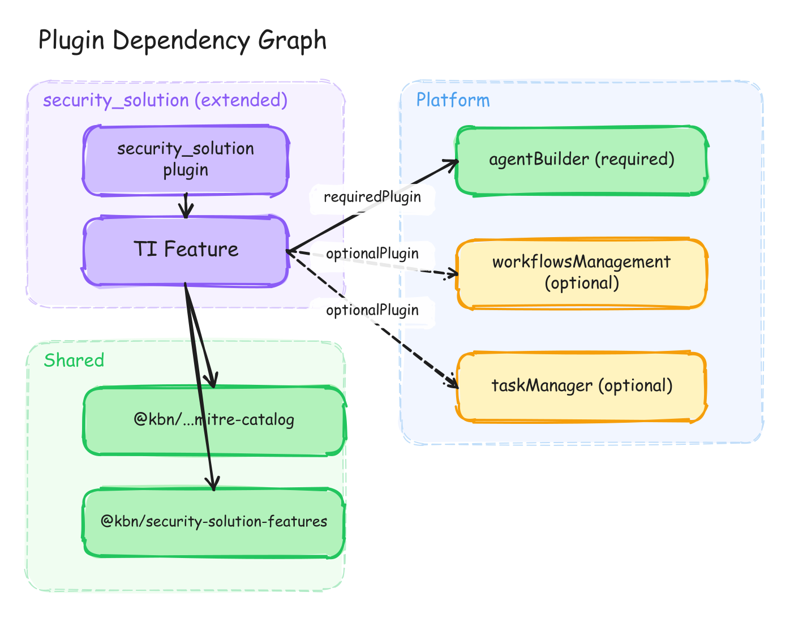

### 2.3 Plugin Placement

Threat intelligence lives **inside** `security_solution` (not a standalone plugin). Rationale unchanged: avoids cross-plugin type-check complexity; `security_solution` owns Detection Engine integration for Layer 2. A standalone plugin remains a Phase C option once API contracts stabilize.

### 2.4 Skill & Tool Registration

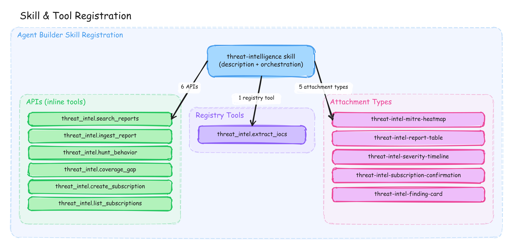

| Surface | Count | Purpose |
| --- | --- | --- |
| **Inline tools** | 7 (hard cap) | Portability wrappers for agents that cannot call Kibana HTTP directly |
| **Registry tools** | `extract_iocs`, `analyse_environment`, `hunt_orchestrated`, `synthesize_advisory`, `security.create_detection_rule`, `security.security_labs_search`, `cases` | Workflow + power-user paths; do not consume inline slots |
| **Canonical execution** | All domain logic | `/internal/threat_intelligence/*` routes → shared `server/threat_intelligence/services/*` |

**Inline tools (7):** `search_reports`, `ingest_report`, `hunt_behavior`, `coverage_gap`, `hunt_for_threat`, `manage_subscriptions`, `generalize_from_telemetry`.

**Merged subscription API:** `create_subscription` + `list_subscriptions` → `manage_subscriptions` (`action: create | list | delete`) to stay within the 7-tool cap.

### 2.5 Detection Model Layers

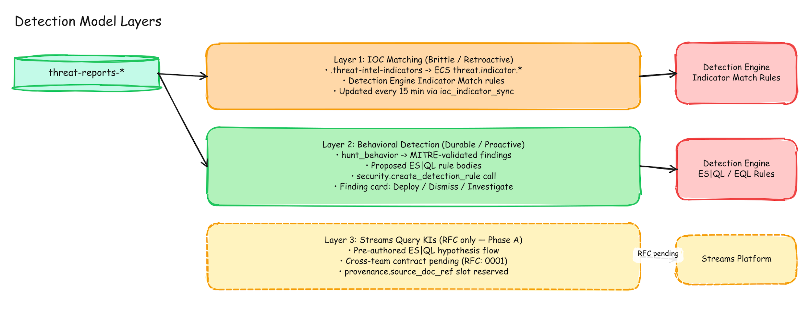

| Layer | Mechanism | Status |
| --- | --- | --- |
| **Layer 1 — IOC / Indicator Match** | `ioc_indicator_sync` → `.kibana-threat-intel-indicators`; `threat.indicator.reference = threat-report:<id>`; `hunt_for_threat` forward hunt | Implemented |
| **Layer 2 — Behavioral DE rules** | `hunt_behavior` / `hunt_orchestrated` Tier 2 → `proposed_esql_rule` → `security.create_detection_rule` | Implemented |
| **Layer 3 — Streams Query KIs** | Long-running ES\|QL on streams data | RFC only |

**Two-tier tradecraft hunt (PR headline):**

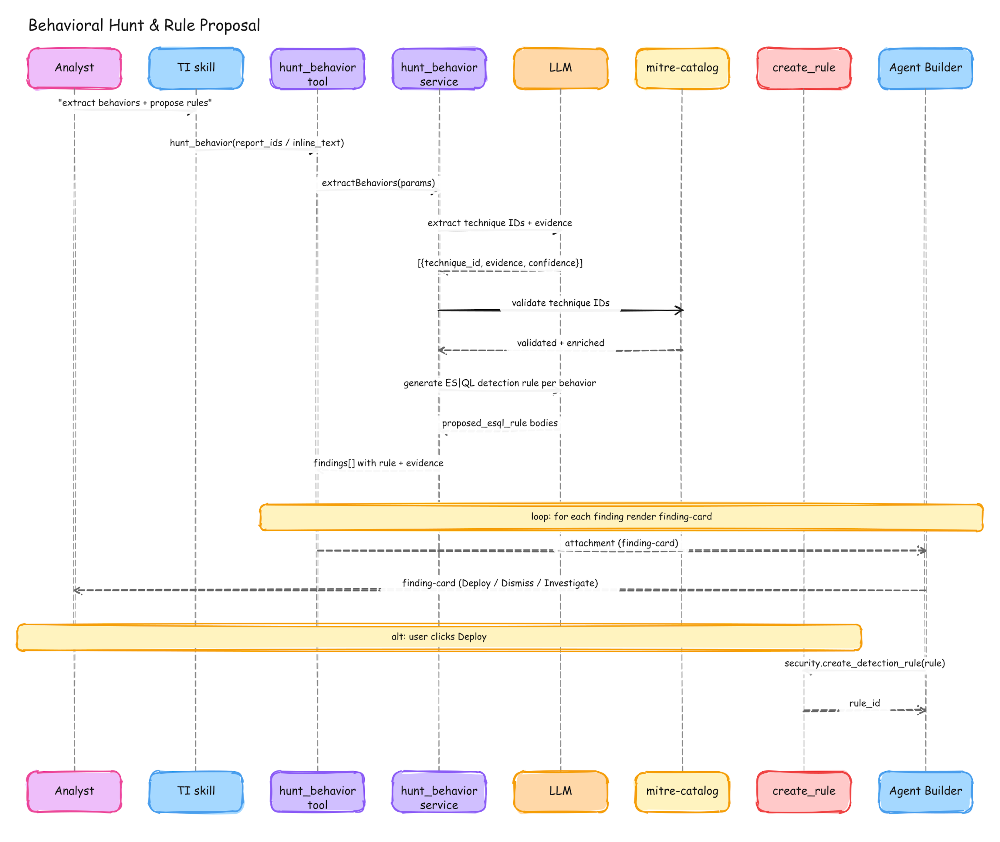

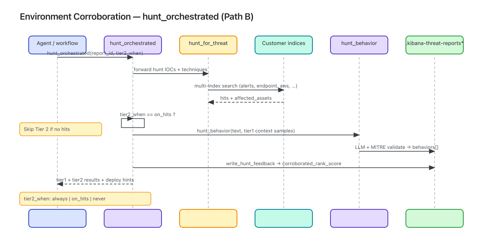

- **Tier 1 (`hunt_for_threat`):** Atomic lookups on IOCs and technique IDs across `.alerts-security.alerts-*`, `metrics-endpoint.*`, `logs-vulnerability.*`, `logs-aws.*`, `logs-network_traffic.*`.
- **Tier 2 (`hunt_behavior`):** LLM extraction + MITRE validation → ES\|QL rule proposals; optionally fed Tier 1 affected-asset context.
- **Orchestrator (`hunt_orchestrated`):** Chains both tiers; `tier2_when`: `on_hits` (default) \| `always` \| `never`; writes `feedback.*` and `corroborated_rank_score` via `write_hunt_feedback`.

### 2.6 Feed Adapters (new in PR)

Per-adapter TypeScript modules under `server/threat_intelligence/adapters/`:

| Adapter | Input | Notes |
| --- | --- | --- |
| `rss` | RSS/Atom XML | xml2js parsing; per-item fingerprint |
| `stix` | STIX 2.x bundles | Bundle splitter + normalizer |
| `taxii` | TAXII 2.x collections | Polling + STIX handoff |
| `vendor_api` | Built-in vendor dispatch | Elastic Security Labs + extensible registry |

Workflow step `threat_intel.fetch_source` invokes `runAdapter` atomically. Default seed catalog: **~37 curated** feeds + **~214** imported from `elastic/security-ciso-news-aggregator` (**249 total**, mostly RSS).

---

## 3. Data Flow Diagrams

### 3.1 Source Ingestion Workflow (every 4 h)

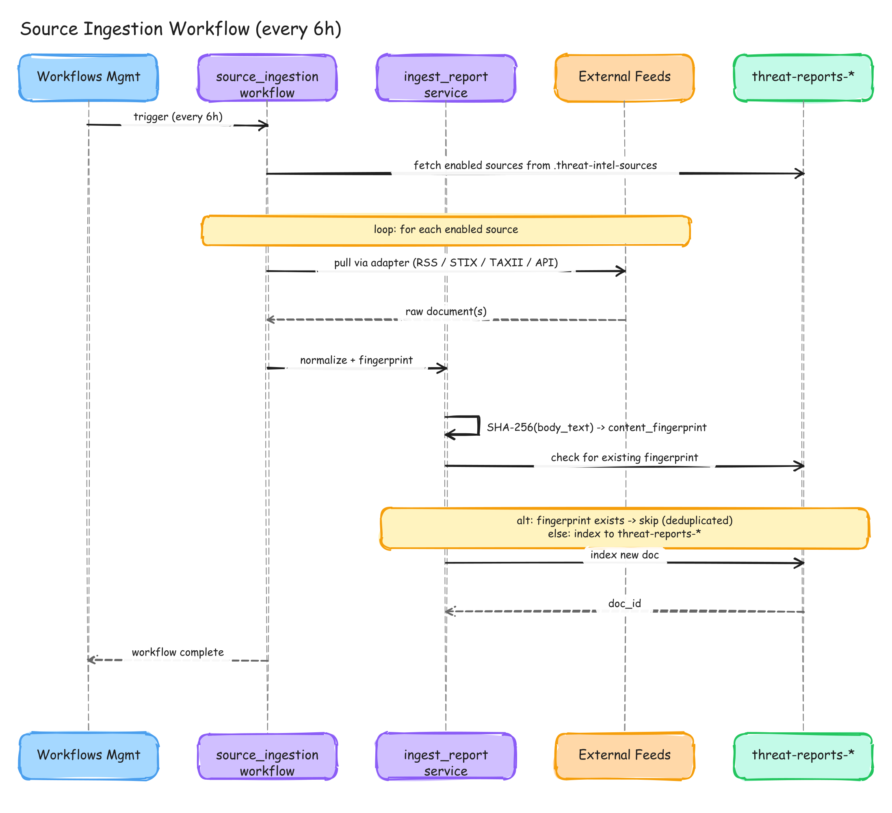

> Diagram shows the original 6 h schedule; implementation runs every **4 h**. Index names in figures use `threat-reports-*` shorthand — production indices are `.kibana-threat-reports*` and `.kibana-threat-intel-sources`.

1. Load enabled rows from `.kibana-threat-intel-sources` (space filter: current space + `*`).
2. For each source → `threat_intel.fetch_source` (adapter dispatch).
3. Per normalized item: `content_fingerprint` dedup gate → `op_type: create` into `.kibana-threat-reports` data stream (`provenance.extraction_method: pending`).

### 3.2 NL Extraction & Behavioral Analysis (every 4 h)

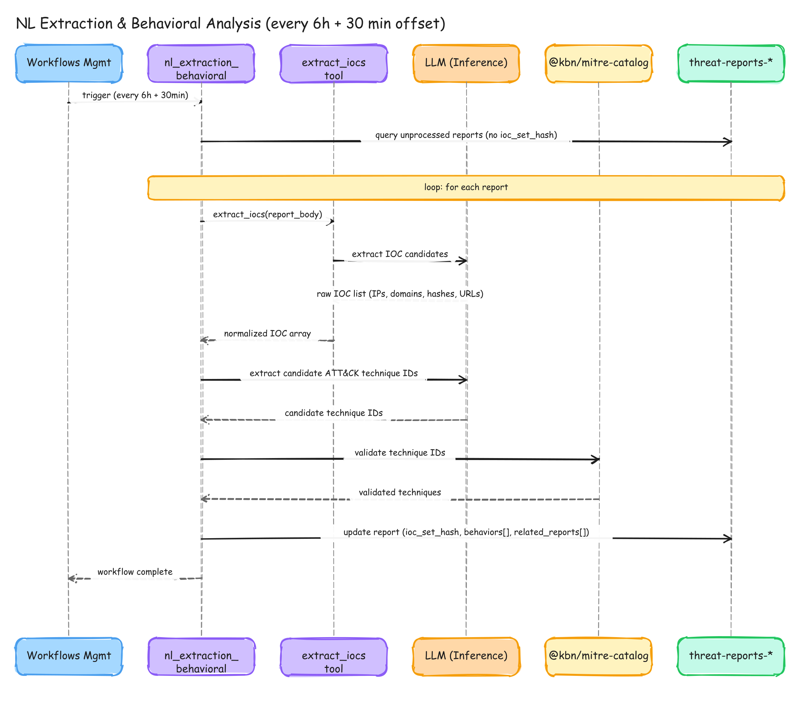

> Diagram shows 6 h + 30 min offset; implementation runs every **4 h** (aligned with source ingestion).

1. Load pending reports (`extraction_method: pending`, oldest first, page size 200).
2. Per report: dedup by `content_fingerprint` → `extract_iocs` (regex) → `hunt_behavior` (LLM + MITRE catalog).
3. Stage-2 LLM enrichment: `extracted.categories[]`, `geography.regions[]`, `extracted.relevance`, `detection_actionability`, `rank_score`.
4. Persist extracted IOCs, behaviors, TTPs, ranking signals.

### 3.3 IOC Indicator Sync Task (every 15 min)

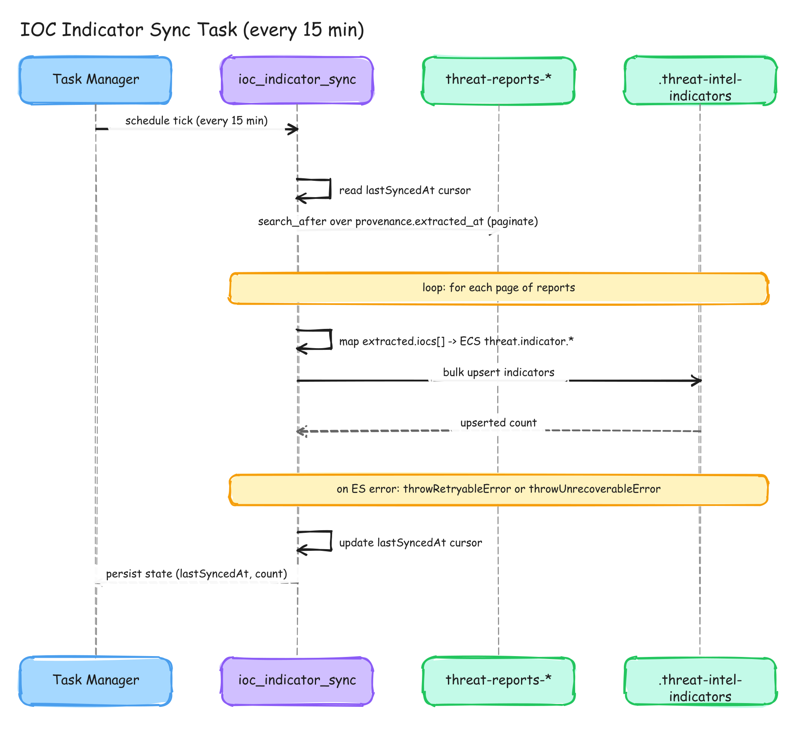

Task Manager job paginates `.kibana-threat-reports*` via `search_after` on `provenance.extracted_at`; upserts ECS-shaped rows to `.kibana-threat-intel-indicators` with `reference: threat-report:<doc_id>`.

### 3.4 Coverage Gap Analysis (analyst request)

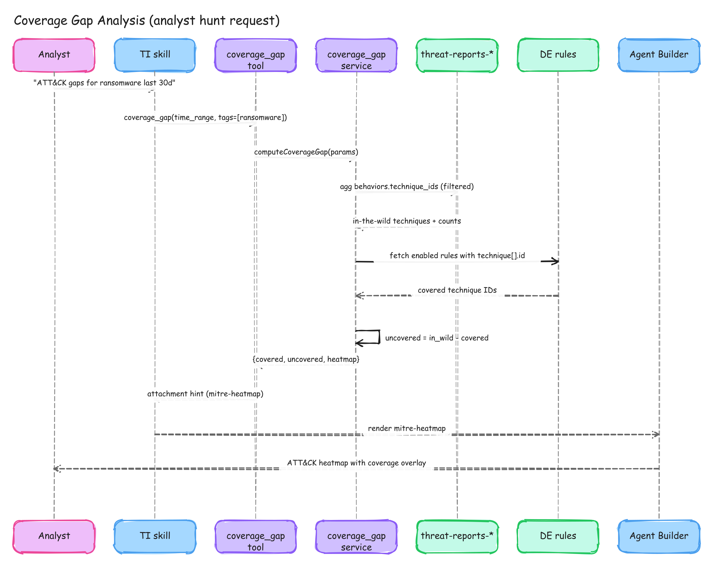

Join in-the-wild ATT&CK techniques from reports against enabled Detection Engine rules → `threat-intel-mitre-heatmap` (`mode: coverage`).

### 3.5 Behavioral Hunt & Rule Proposal


**Path A — Report text only:** `hunt_behavior` → finding cards → optional `security.create_detection_rule`.

**Path B — Environment corroboration:** `hunt_orchestrated` (or manual Tier 1 → Tier 2 chain):


1. Tier 1: forward hunt → hits + `affected_assets`.
2. Tier 2 (if gated): LLM behaviors informed by sample events.
3. `write_hunt_feedback` → `feedback.*`, `corroborated_rank_score`.

### 3.6 Digest Delivery Workflow (every hour)

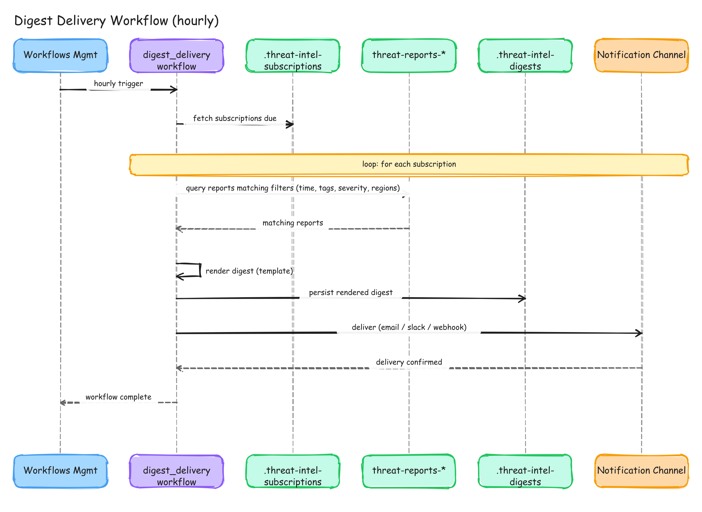

> PR adds `synthesize_advisory` (Step 1) before `search_reports`; diagram shows the pre-advisory flow. See §3.6 steps below.

1. Load subscriptions from `.kibana-threat-intel-subscriptions`.
2. Per due subscription (agent step):
   - **Step 1:** `synthesize_advisory` (`persist: true`) → executive lede + `advisory_id`.
   - **Step 2:** `search_reports` (corroborated rank, filters) → report table.
3. Deliver via Kibana actions connector (`delivery.connector_id`).
4. Archive to `.kibana-threat-intel-digests` (includes `advisory_id` for cross-linking).

### 3.7 Hit Provenance Backfill (every hour)

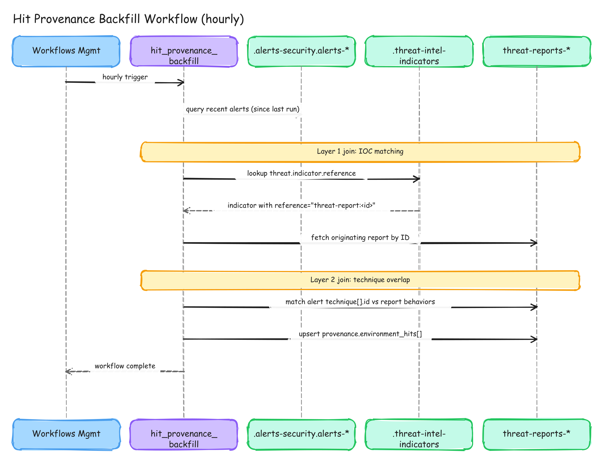

Attribute Detection Engine alerts → reports:

- **Layer 1:** `threat_match` alerts via `threat.enrichments.indicator.reference`.
- **Layer 2:** technique overlap on `kibana.alert.rule.threat.technique.id`.

Updates `provenance.environment_hits` aggregate counts (not per-alert IDs).

### 3.8 Alert Flyout Insights (on demand — RFC 0002 P0)

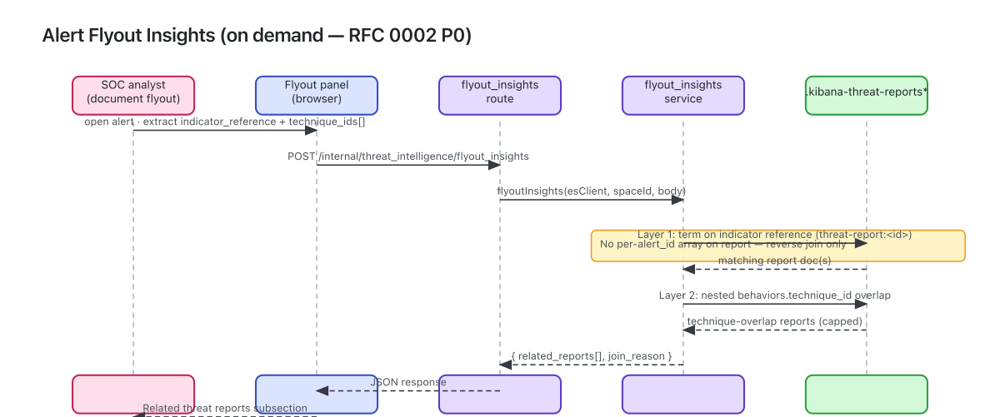

Reverse join at triage time: alert fields → `POST /internal/threat_intelligence/flyout_insights` → related reports by IOC reference and/or technique overlap.

### 3.9 Analyst Subscription Flow

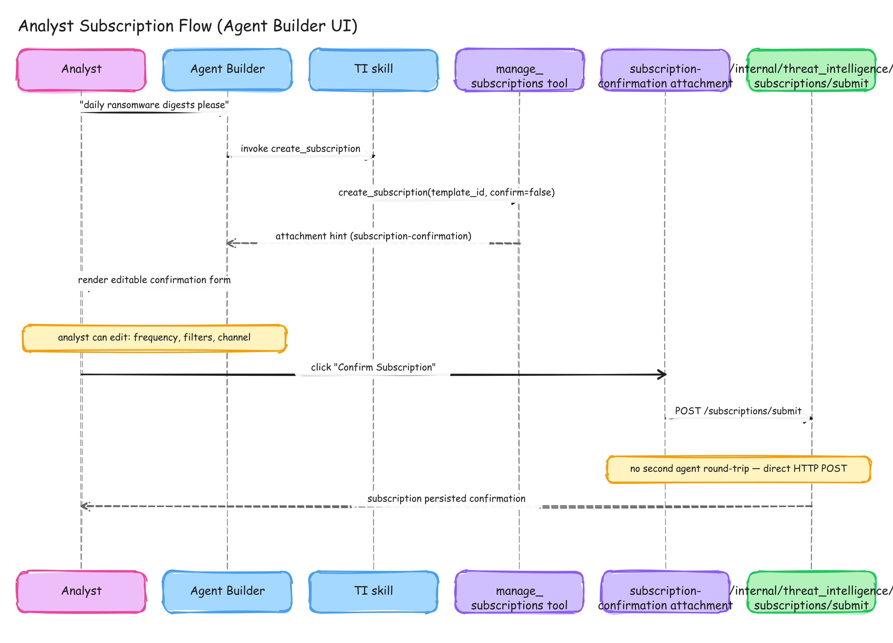

> PR merges create/list into `manage_subscriptions`; diagram shows the original split tool names.

1. Agent proposes subscription → `threat-intel-subscription-confirmation` attachment.
2. User edits inline → **Submit posts directly** to `/subscriptions/submit` (no second agent round-trip).
3. List/delete via `manage_subscriptions` or HTTP list/delete routes.

---

## 4. Index & Schema Overview

**Template version:** 11 (`.kibana-threat-*` prefix; `kibana_system`-accessible).

### 4.1 `.kibana-threat-reports*` (Data Stream)

Primary store for ingested threat intelligence.

```
.kibana-threat-reports*
├── @timestamp
├── space_id                          # '*' = all spaces
├── content_fingerprint                 # SHA-256 dedup key
├── content
│   ├── title              (semantic_text + title_bm25 copy_to)
│   ├── body_text          (semantic_text + body_text_bm25 copy_to)
│   └── language
├── source
│   ├── type               (rss|stix|taxii|vendor_api|email|manual|telemetry)
│   ├── name, url, adapter_id
├── severity
│   ├── level, score
├── rank_score                          # severity.score × extracted.relevance
├── corroborated_rank_score             # rank_score + hunt-feedback boost
├── extracted
│   ├── iocs[] (nested)
│   ├── ioc_set_hash
│   ├── relevance, detection_actionability
│   ├── categories[]       (15-item closed taxonomy)
│   ├── threat_actors[], target_sectors[]
│   ├── ttps { tactics[], techniques[] }
│   └── behaviors[] (technique_id, evidence, proposed_esql_rule, …)
├── geography.regions[]    (UN M49 macro-regions)
├── provenance
│   ├── ingested_at, extracted_at, extraction_method
│   ├── related_reports[], environment_hits { layer_1, layer_2, window }
│   └── environment_hits_total
└── feedback                 # latest orchestrated hunt outcome
    ├── ioc_hit_count, ttp_hit_count
    ├── affected_host_count, affected_user_count
    ├── last_hunted_at, last_hunt_status, last_hunt_window
```

### 4.2 `.kibana-threat-intel-sources`

Feed catalog: `adapter_type`, `name`, `enabled`, `config` (opaque), `tags`, `space_id`, timestamps. **249** feeds seeded at startup.

### 4.3 `.kibana-threat-intel-subscriptions`

Digest config: `tags`, `severity_threshold`, `schedule_rrule`, `delivery { type, target, connector_id }`, `space_id`, `template_id`, `last_delivered_at`.

### 4.4 `.kibana-threat-intel-indicators`

ECS `threat.indicator.*` mirror for Indicator Match rules. `reference: threat-report:<doc_id>`.

### 4.5 `.kibana-threat-intel-digests`

Archived digests: `subscription_id`, `rendered_body`, `report_ids[]`, `advisory_id`, `delivered_at`, `delivery_status`.

### 4.6 `.kibana-threat-intel-advisories` (new)

LLM-synthesized cross-report advisories: `theme_id`, `theme_title`, `narrative_markdown`, `recommended_actions[]`, `report_ids[]`, time window metadata.

---

## 5. API Surface

### 5.1 Domain Routes (canonical execution surface)

All routes: `/internal/threat_intelligence/...` · Authz via `threatIntelligence_read` / `threatIntelligence_write_subscriptions` / `threatIntelligence_manage_sources`.

| Tool ID | Method | Path | Description |
| --- | --- | --- | --- |
| `threat_intel.search_reports` | POST | `/search_reports` | Hybrid RRF semantic + BM25; `sort_by`: rank \| severity \| recency \| relevance; filters: categories, regions |
| `threat_intel.ingest_report` | POST | `/ingest_report` | Analyst paste; SHA-256 dedup |
| `threat_intel.hunt_behavior` | POST | `/hunt_behavior` | LLM + MITRE → ES\|QL proposals + finding-card hints |
| `threat_intel.hunt_for_threat` | POST | `/hunt_for_threat` | **Tier 1** forward hunt across environment indices |
| `threat_intel.hunt_orchestrated` | POST | `/hunt_orchestrated` | **Tier 1 → Tier 2** orchestrated hunt + feedback writeback |
| `threat_intel.synthesize_advisory` | POST | `/synthesize_advisory` | Cross-report LLM advisory; optional persist |
| `threat_intel.coverage_gap` | POST | `/coverage_gap` | ATT&CK in-the-wild vs enabled rules |
| `threat_intel.generalize_from_telemetry` | POST | `/generalize_from_telemetry` | Alert samples → durable behaviors + synthetic report |
| `threat_intel.extract_iocs` | POST | `/extract_iocs` | Regex IOC extraction (registry / workflow) |
| `threat_intel.analyse_environment` | POST | `/analyse_environment` | Integration/OS/cloud profile for feed tuning |
| `threat_intel.manage_subscriptions` | POST | `/subscriptions/submit` \| `/list` \| `/delete` | Subscription CRUD |

### 5.2 UI Routes (not Agent Builder tools)

| Method | Path | Description |
| --- | --- | --- |
| POST | `/dashboard/overview` | Intelligence Hub aggregations (stats, categories, regions, timeline, top techniques, env impact) |
| CRUD | `/saved_views` | Persist dashboard filter sets (`threat-intelligence-saved-view` SO) |
| POST | `/flyout_insights` | Alert → related threat reports (RFC 0002 P0) |

### 5.3 Agent Builder Attachment Types

Unchanged set: `threat-intel-mitre-heatmap`, `threat-intel-report-table`, `threat-intel-severity-timeline`, `threat-intel-subscription-confirmation`, `threat-intel-finding-card`.

### 5.4 Privilege Model

| Kibana feature tier | API privileges |
| --- | --- |
| Read | `threatIntelligence_read` |
| Write (all − manageSources) | read + `threatIntelligence_write_subscriptions` |
| Admin (all) | read + writeSubscriptions + `threatIntelligence_manage_sources` |

---

## 6. PRD

### 6.1 Problem Statement

Security teams are drowning in fragmented threat intelligence. Feeds are siloed, IOC-to-alert correlation is manual, translating threat reports into detection rules requires expert knowledge, and there is no single place to query “what should I be worried about right now and are we covered?”

Elastic Security sits on top of the logs, alerts, and detection rules — but until now has had no automated mechanism to continuously bring external threat context into that picture, **hunt for corroborating activity at machine speed**, and close the loop between what attackers are doing and what we are detecting.

### 6.2 Goals

| ID | Goal |
| --- | --- |
| **G1** | Continuous intelligence ingestion from **249** default feeds every **4 hours** |
| **G2** | Ad-hoc analyst augmentation (paste / URL ingest with dedup) |
| **G3** | Actionable behavioral detection: MITRE-validated ES\|QL proposals, one-click deploy |
| **G4** | Coverage gap visibility via ATT&CK heatmap |
| **G5** | Automated digest delivery with **advisory synthesis** lede |
| **G6** | Alert-to-report attribution (batch backfill + flyout P0) |
| **G7** | Source-agnostic extensibility via typed adapters |
| **G8** *(new)* | **Semantic threat hunting at machine speed:** Tier 1 environment corroboration → Tier 2 behavioral rules; hunt feedback elevates corroborated reports in search, dashboard, and digests |
| **G9** *(new)* | **Intelligence Hub dashboard** with location-aware “Affects You” filtering |
| **G10** *(new)* | **Generalize brittle IOC alerts** into durable behavioral rules (`generalize_from_telemetry`) |

### 6.3 Non-Goals (Phase A)

Unchanged from prior revision; see §1. Layer 3, TAXII server, SOAR, full MISP parity, multi-space fan-out, stable public API.

### 6.4 User Stories (additions)

**Analyst — environment impact:**  
> When I read a new advisory, I want to know whether our environment already shows matching IOCs or techniques, so I can prioritize response.

**Analyst — orchestrated hunt:**  
> I want one call that runs atomic hunts and then proposes behavioral rules only when we have corroborating hits, so I do not waste time on theoretical TTPs with no local signal.

**CISO — synthesized advisory:**  
> My weekly digest should open with an executive narrative across all relevant reports, not only a bullet list of headlines.

**SOC engineer — flyout context:**  
> When triaging an alert, I want related threat reports linked by IOC reference or technique overlap without leaving the document flyout.

### 6.5 Success Metrics (updates)

| Metric | Target | Measurement |
| --- | --- | --- |
| Time from publication → rule proposal | < 30 min | `provenance.extracted_at` → `hunt_behavior` / `hunt_orchestrated` |
| **Environment corroboration rate** | > 40% of high/critical reports hunted within 7d show Tier 1 hits | `feedback.ioc_hit_count` / `feedback.ttp_hit_count` telemetry |
| **Corroborated rank adoption** | Digests/dashboard top-N use `corroborated_rank_score` | `search_reports` `sort_by=rank` usage |
| Analyst report-to-rule deployment | > 30% | finding-card Deploy telemetry |
| IOC indicator freshness | < 15 min | `ioc_indicator_sync` lag |
| Digest retention | > 70% at 30d | subscription tracking |

### 6.6 Phase Roadmap

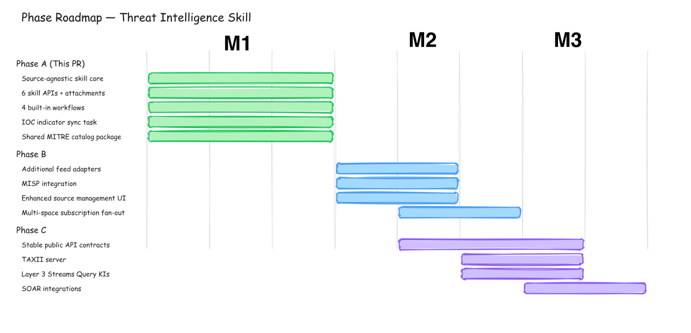

| Phase | Focus |
| --- | --- |
| **A (this PR)** | Skill, adapters, two-tier hunt, dashboard, flyout P0, advisories, feedback loop |
| **B** | Feed adapter extension point; multi-space fan-out; subscription channel expansion |
| **C** | Standalone plugin option; stable `/api/`; Layer 3 Streams KIs; public TAXII |

### 6.7 Technical Decisions (additions)

| ID | Decision | Rationale |
| --- | --- | --- |
| **TD7** | **Routes as canonical surface; tools as portability shims** | Agent Builder skill is knowledge; `execute_workflow_step` + `kibana-request` is the in-Kibana execution path. |
| **TD8** | **Two-tier orchestrator + hunt feedback** | Tradecraft corroboration semantic; `corroborated_rank_score` surfaces environment-validated intel without rerunning hunts on every read. |
| **TD9** | **`.kibana-threat-*` index prefix** | `kibana_system` access envelope; prior non-`.kibana*` names failed with `security_exception`. |
| **TD10** | **Dedicated TypeScript adapters** | Replace inline workflow parsing; testable per format; STIX/TAXII ready before seed expansion beyond RSS. |
| **TD11** | **7 inline tool cap drives API consolidation** | `manage_subscriptions`, registry placement for `hunt_orchestrated` / `synthesize_advisory`. |
| **TD12** | **Advisory synthesis in digest path** | Executive lede + `advisory_id` cross-link; graceful degradation when inference unavailable. |

Prior decisions **TD1–TD6** remain valid (plugin-in-plugin, hybrid RRF, SHA-256 dedup, Task Manager for IOC sync, shared MITRE catalog, direct subscription POST).

### 6.8 Open Questions (updates)

| # | Question | Owner | Target |
| --- | --- | --- | --- |
| **OQ1** | Layer 3 Streams contract | TI + Streams | Phase B |
| **OQ9** *(new)* | Hunt feedback staleness: when should `corroborated_rank_score` decay if no re-hunt in N days? | Engineering | Phase A follow-up |
| **OQ10** *(new)* | Should `hunt_orchestrated` run automatically post-extraction for `rule_candidate` reports? | PM | Phase A validation |

*(OQ2–OQ8 unchanged — see prior revision.)*

### 6.9 Dependencies & Risks (additions)

| Dependency | Risk | Mitigation |
| --- | --- | --- |
| Inference for Tier 2 / advisory / extraction | Hunt degrades to Tier 1-only; synthesis returns `no_inference` status | Structured degradation; digest still renders IOC table |
| Environment index availability | Tier 1 returns zero hits for missing integrations | `ignore_unavailable`; per-index hit counts in response |
| 249-feed LLM cost at extraction scale | Token budget pressure | Batch size 200/run; dedup gates; monitor `detection_actionability` filter |

---

## Related Documents

- [RFC 0001 — Streams Layer 3 grounded hypothesis flow](../rfcs/0001_streams_layer3_grounded_hypothesis_flow.md)
- [RFC 0002 — Alert flyout threat intelligence insights (P0)](../rfcs/0002_alert_flyout_threat_intel_insights.md)
- Agent Builder skill source: `server/agent_builder/skills/threat_intelligence/threat_intelligence_skill.ts`
- Hub constants: `common/threat_intelligence/hub/constants.ts`
