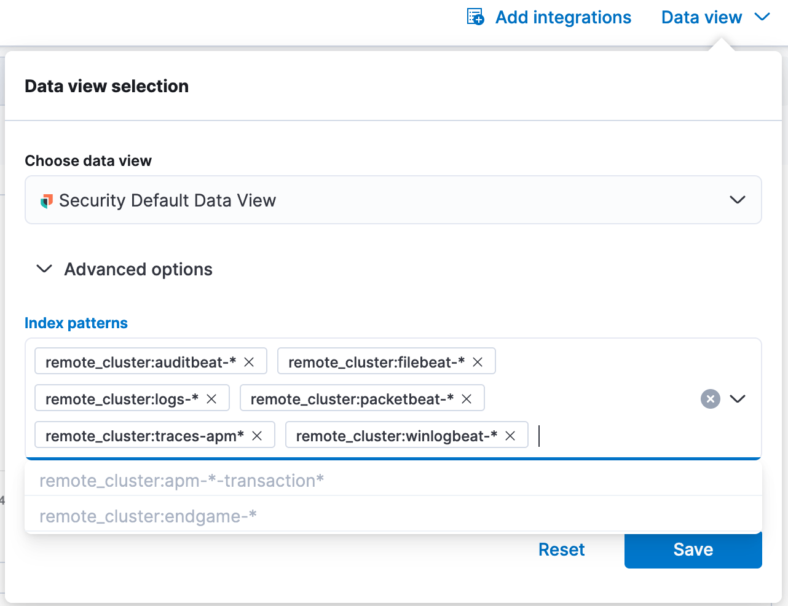
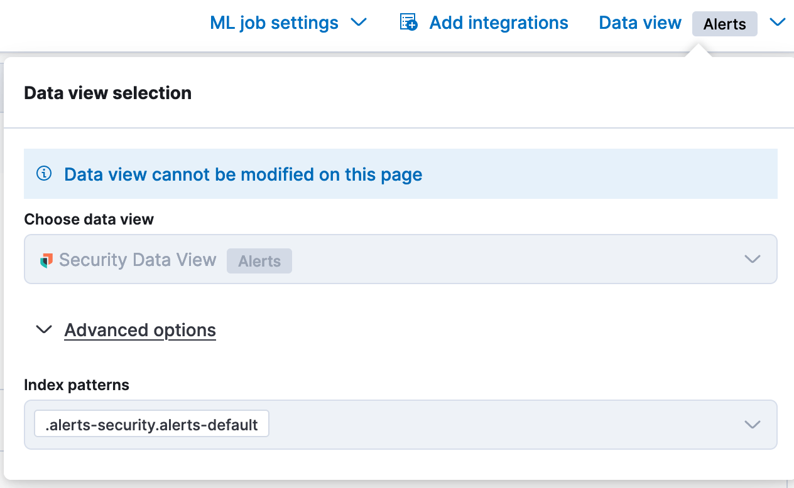
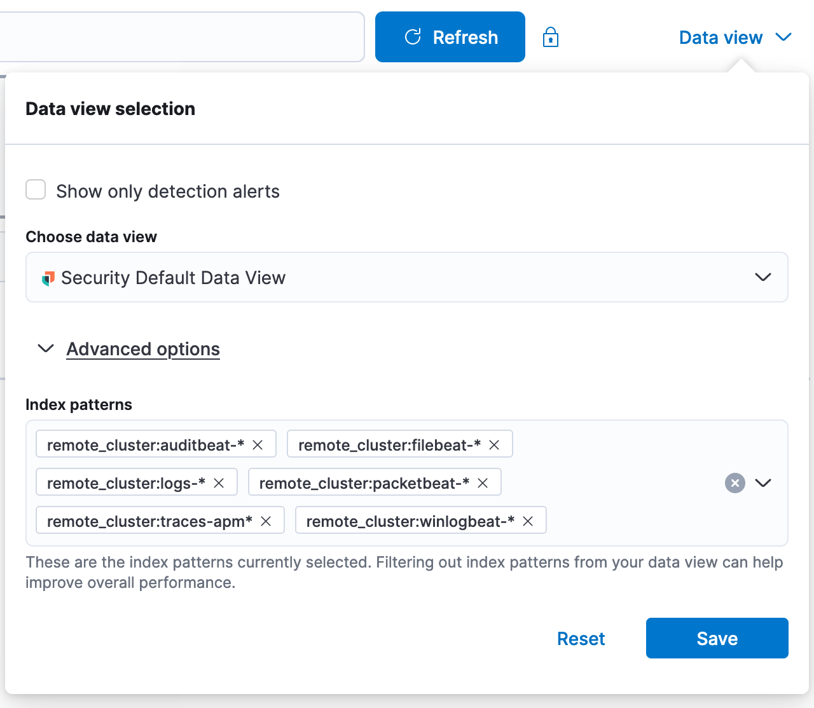
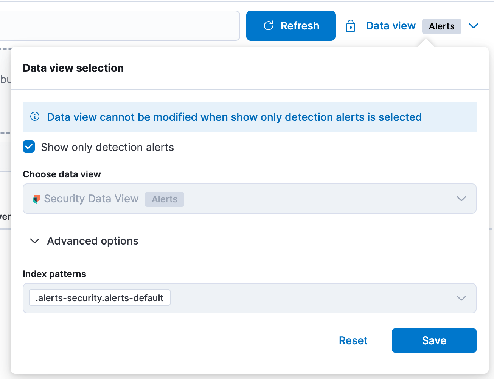

# Sourcerer Component

### Adding sourcerer to a new page
- In order for the sourcerer to show up on a page, it needs to be added to the array `sourcererPaths` in `../sourcerer/containers/sourcerer_paths.ts`
- The scope of a sourcerer component will be default unless the path is added to the `detectionsPaths` array, in which case the scope can be detections in `../sourcerer/containers/index.tsx`

## Default Sourcerer

- The data view is shown in the dropdown. All index aliases that have existing indices are selected by default. Index aliases that do NOT have existing indices are shown in the dropdown as deactivated

## Detections Sourcerer

- The detections sourcerer is locked to the signals index, and has an "Alerts" flag

## Timeline Sourcerer

- The timeline sourcerer is almost exactly like the default sourcerer, but it has a checkbox to "Show only detection alerts" which will automatically select the default data view with the alerts index locked in:

## Sourcerer Quirks
 - Signals index is not always defined yet, so we `pollForSignalIndex` on mount of detections sourcerer and timeline sourcerer
 - Signals index is hidden in default scope as it is never used on our Explore pages where default scope is used
 - When `selectedPatterns` changes, we updated the `onUpdateDetectionAlertsChecked` boolean
 - Reset button sets to the active `patternList` on the default security data view
 - The "Modified" label gets applied when the data view `selectedPatterns` diverge from the `patternList`. It does not appear when changing data views and using that data views patternList in full. It does not appear until Save is pressed!
   

## Legacy Timeline Sourcerer
 - "Update available" workflow for pre-8.0 timelines and timelines that have indices that got deleted from the default data view

### Flow 1
**Note:** i paused the most in this flow so y'all can ready the copy, the rest of the flows go quicker
Legacy Timeline includes an active index pattern that is not included in the default data view, user decides to update data view. Page refresh is prompted

### Flow 2
Legacy Timeline includes an active index pattern that is not included in the default data view, user decides to update to the new sourcerer with only the indices that already exist in the data view

### Flow 3
Legacy Timeline includes an active index pattern that is not included in the default data view, user decides to reset to the new sourcerer and abandon their index pattern

### Flow 4
Legacy Timeline index patterns are ALL included in the default data view, user updates to the new sourcerer without needing to update the data view

### Flow 5
Legacy Timeline none of the index patterns in the legacy timeline match, don't allow user to upgrade data view. Forces them to reset to new sourcerer or keep a bad index pattern

### Flow 6
Start with a valid non-legacy timeline. Delete one of the index patterns from advanced settings. Fallsback into temporary timeline and prompts user to re-add the deleted index pattern

### Flow 7
Error state, not expected

