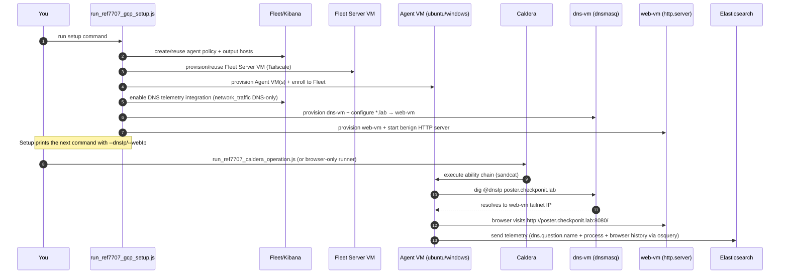

## REF7707-like benign lab (Caldera-supported)

This lab generates **benign** telemetry inspired by Elastic Security Labs' REF7707 campaign writeup ([Fragile Web of REF7707](https://www.elastic.co/security-labs/fragile-web-ref7707)).

It is intentionally **not** malware simulation; it’s a repeatable way to produce the same *investigation pivots*:
- DNS lookups for the REF7707 typosquat domains
- domain-based downloads (so DNS is involved)
- real browser visit (headless Chrome/Edge) so you can validate browser history via osquery `elastic_browser_history`
- a small process tree + outbound HTTPS (C2-like)
- persistence-ish artifacts
- SSH lateral-ish execution (initiator -> victim)

You can validate the “visited URL” using the osquery extension table `elastic_browser_history` (Chrome/Edge/Firefox; Linux/Windows/macOS) as documented in Beats: [`elastic_browser_history.md`](https://raw.githubusercontent.com/elastic/beats/616a3ab20f392e4145698d370e6cb930ce401493/x-pack/osquerybeat/ext/osquery-extension/docs/elastic_browser_history.md).

### Browser history validation (osquery)

Important details:
- Filter on **`hostname`** for `poster.checkponit.lab` (the `domain` column is eTLD+1 and would be `checkponit.lab`).
- In this lab, the Caldera “browser visit” ability writes history to a deterministic profile location. If auto-discovery doesn’t find it, query with `custom_data_dir`.

Linux (Ubuntu, standard Chrome profile under `/home/ubuntu/.config/google-chrome`):

```sql
SELECT browser, user, profile_name, hostname, url, datetime
FROM elastic_browser_history
WHERE hostname = 'poster.checkponit.lab'
ORDER BY timestamp DESC
LIMIT 50;
```

Windows (deterministic profile under `C:\ProgramData\ref7707-browser\...`):

```sql
SELECT browser, user, profile_name, hostname, url, datetime
FROM elastic_browser_history
WHERE custom_data_dir = 'C:\ProgramData\ref7707-browser\Microsoft\Edge\User Data'
  AND hostname = 'poster.checkponit.lab'
ORDER BY timestamp DESC
LIMIT 50;
```

If your query errors with “no such table: elastic_browser_history”, you’re missing the Elastic osquery extension (install Osquery Manager / Osquery integration that ships the extension).

### Why a DNS VM?

If you map domains via `/etc/hosts`, the host typically **does not perform DNS queries**, so you won’t get `dns.question.name`.

This lab provisions a DNS server VM and configures the victims to use it, forcing real DNS queries (even if they return NXDOMAIN, depending on your config).

### What it provisions (current runner)

- **dns-vm**: `dnsmasq` configured to resolve REF7707 **lab-only** domains to `web-vm`
- **web-vm**: simple Python HTTP server serving benign “payload” files (campaign-like filenames)
- **initiator-vm**: Elastic Agent enrolled (Defend + Osquery + Network Packet Capture DNS-only)
- **victim-vm**: Elastic Agent enrolled (Defend + Osquery + Network Packet Capture DNS-only)

### Diagram (GCP infra + operation execution)

```mermaid
flowchart LR
  subgraph Local["Your laptop (local)"]
    K["Kibana"]
    ES["Elasticsearch"]
    C["Caldera (UI + API)"]
    TS["Tailscale (MagicDNS)"]
    K --> ES
    C --> TS
    K --> TS
    ES --> TS
  end

  subgraph GCP["GCP (VMs)"]
    FS["Fleet Server VM\n(patrykkopycinski-kbn-fleet-server)"]
    A1["Elastic Agent VM(s)\n(patryk-ref7707-gcp-ubuntu-1/2, windows-*)"]
    DNS["REF7707 dns-vm\n(dnsmasq: *.lab → web-vm)"]
    WEB["REF7707 web-vm\n(benign HTTP artifacts)"]
  end

  %% Control plane / connectivity
  TS <-- MagicDNS + tailnet --> FS
  TS <-- MagicDNS + tailnet --> A1
  TS <-- MagicDNS + tailnet --> DNS
  TS <-- MagicDNS + tailnet --> WEB

  %% Enrollment + telemetry
  FS -->|Fleet enroll + policy| A1
  A1 -->|events (Defend + osquery + network_traffic DNS)| ES

  %% Operation execution path (Caldera → agent)
  C -->|run operation| A1

  %% Lab traffic generation during operation
  A1 -->|dig @dnsIp poster.checkponit.lab| DNS
  DNS -->|A record for *.lab| WEB
  A1 -->|browser visit http://poster.checkponit.lab:8080/\n(host-resolver-rules → webIp)| WEB
```



### Run

From Kibana repo root:

```bash
node x-pack/solutions/security/plugins/security_solution/scripts/endpoint/run_ref7707_lab.js --help
```

Example:

```bash
node x-pack/solutions/security/plugins/security_solution/scripts/endpoint/run_ref7707_lab.js \
  --kibanaUrl http://127.0.0.1:5601 \
  --elasticUrl http://127.0.0.1:9200

### Caldera orchestration (recommended for repeatability)

1) Start Caldera (Docker):

```bash
cd dev_tools/caldera
docker compose up --build -d
```

2) Run the lab with Caldera orchestrator:

```bash
node x-pack/solutions/security/plugins/security_solution/scripts/endpoint/run_ref7707_lab.js \
  --orchestrator caldera \
  --calderaUrl http://127.0.0.1:8888 \
  --calderaApiKey <YOUR_CALDERA_API_KEY> \
  --kibanaUrl http://127.0.0.1:5601 \
  --elasticUrl http://127.0.0.1:9200
```
```

### Expected telemetry

- **DNS**: `dns.question.name` matching one of the REF7707 domains
- **HTTP**: outbound HTTP to `http://<ref7707-domain>:8080/...`
- **Process**: short-lived shells, `curl`, `dig`
- **Persistence-ish**: a systemd unit named `ref7707-demo.service`
- **SSH lateral-ish**: `sshd` activity on the victim (initiator connects and runs commands)

### Forensics helper (DNS initiator attribution + osquery pack)

After running the lab, you can attribute the “initiating host” for a given domain by finding the earliest `dns.question.name` event across hosts:

```bash
node x-pack/solutions/security/plugins/security_solution/scripts/endpoint/run_ref7707_forensics.js \
  --elasticUrl http://127.0.0.1:9200 \
  --kibanaUrl http://127.0.0.1:5601 \
  --domain poster.checkponit.com \
  --from now-30m --to now
```

Notes:
- Caldera mode deploys `sandcat` to the endpoint VMs and runs an operation using the REF7707 lab adversary profile.
- Abilities embed the chosen `domain` and `web_port` at creation time (no Caldera source required).

### Run Caldera operation against GCP VMs

After provisioning GCP VMs with Caldera enabled (see `gcp_fleet_vm/README.md`), provision the REF7707 infra and then run the operation.

#### Recommended: two-command flow

1) Setup everything needed on GCP (Fleet Server + Agent VMs + DNS telemetry + REF7707 infra):

```bash
node x-pack/solutions/security/plugins/security_solution/scripts/endpoint/run_ref7707_gcp_setup.js \
  --gcpProject "$YOUR_GCP_PROJECT" \
  --gcpZone us-central1-a \
  --tailscaleAuthKey "$TS_AUTHKEY" \
  --localTailscaleHostname "$YOUR_TAILSCALE_MAGICDNS" \
  --elasticUrl "http://$YOUR_TAILSCALE_MAGICDNS:9200" \
  --namePrefix "patryk-ref7707-gcp" \
  --ubuntuAgentCount 1 \
  --osqueryOnlyAgentCount 2
```

Options:
- `--ubuntuAgentCount N`: Number of Ubuntu VMs with full integrations (Elastic Defend, Osquery, Network Packet Capture)
- `--osqueryOnlyAgentCount N`: Number of Ubuntu VMs with Osquery-only policy (no Elastic Defend, no Network Packet Capture, includes Caldera sandcat)

2) Fire the Caldera operation (use the exact command printed by setup; `CALDERA_API_KEY` is required):

```bash
node x-pack/solutions/security/plugins/security_solution/scripts/endpoint/run_ref7707_caldera_operation.js \
  --calderaUrl "http://$YOUR_TAILSCALE_MAGICDNS:8888" \
  --calderaApiKey "$CALDERA_API_KEY" \
  --dnsIp <dns-vm-ts-ip> \
  --webIp <web-vm-ts-ip>
```

#### Manual flow (legacy)

0) Ensure the GCP agents policy has DNS telemetry enabled (Network Packet Capture DNS-only):

```bash
node x-pack/solutions/security/plugins/security_solution/scripts/endpoint/run_ref7707_enable_dns_telemetry.js \
  --kibanaUrl http://127.0.0.1:5601 \
  --elasticUrl http://127.0.0.1:9200 \
  --policyName "GCP VM agents"
```

1) Provision REF7707 infra on GCP (dns-vm + web-vm) and point Ubuntu agent VMs at dns-vm:

```bash
node x-pack/solutions/security/plugins/security_solution/scripts/endpoint/run_ref7707_gcp_infra.js \
  --gcpProject "$YOUR_GCP_PROJECT" \
  --gcpZone us-central1-a \
  --tailscaleAuthKey "$TS_AUTHKEY" \
  --namePrefix "<the namePrefix you used for run_gcp_fleet_vm>" \
  --ubuntuAgentCount 2
```

2) Run the Caldera operation:

```bash
node x-pack/solutions/security/plugins/security_solution/scripts/endpoint/run_ref7707_caldera_operation.js \
  --calderaUrl http://127.0.0.1:8888 \
  --calderaApiKey ADMIN123 \
  --group ref7707 \
  --dnsIp "<dns-vm tailscale ip printed by run_ref7707_gcp_infra>" \
  --webIp "<web-vm tailscale ip printed by run_ref7707_gcp_infra>"
```


 