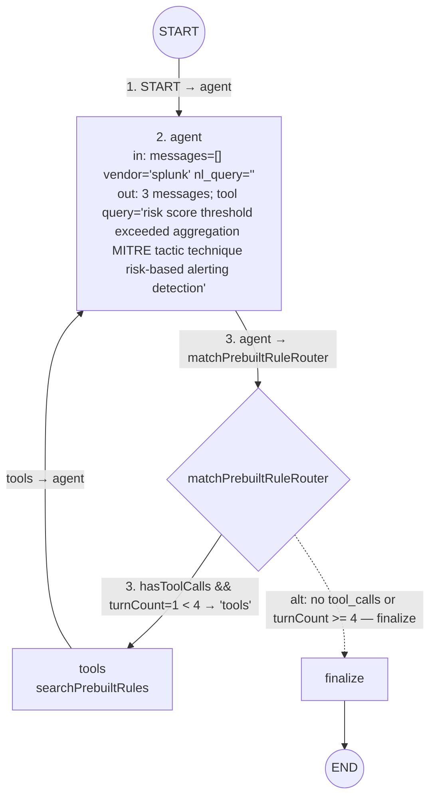

# Match Prebuilt Rule subgraph — first `agent` turn walkthrough

Traces the v2 `Match Prebuilt Rule Subgraph` (`getMatchPrebuiltRuleGraph`) for one captured LangSmith span: the first `agent` node invocation on the Splunk rule **Risk - 24 Hour Risk Threshold Exceeded - Rule**. Sibling notes: [latency vs. v1](./latency.md).

Prompt assembly, `ruleContext`, `mitreAttackIds`, the first-turn vs later-turn branch, and the router condition are deterministic and computed from the code against this input. The `AIMessage` (tool call, wording, token counts) is **captured from the LangSmith run**, not illustrative.

## The example

Captured LangSmith input for the subgraph's first `agent` span (empty conversation, Splunk vendor, no `nl_query`):

```json
{
  "comments": [],
  "elastic_rule": {},
  "match_prebuilt_rules_messages": [],
  "nl_query": "",
  "original_rule": {
    "description": "RBA: Risk Threshold exceeded for an object within the previous 24 hours.",
    "id": "https://127.0.0.1:8089/servicesNS/nobody/SA-ThreatIntelligence/saved/searches/Risk%20-%2024%20Hour%20Risk%20Threshold%20Exceeded%20-%20Rule",
    "query": "| tstats `summariesonly` mode(All_Risk.risk_object) as risk_object, sum(All_Risk.calculated_risk_score) as risk_score, count(All_Risk.calculated_risk_score) as risk_event_count,values(All_Risk.annotations.mitre_attack.mitre_tactic_id) as annotations.mitre_attack.mitre_tactic_id, dc(All_Risk.annotations.mitre_attack.mitre_tactic_id) as mitre_tactic_id_count, values(All_Risk.annotations.mitre_attack.mitre_technique_id) as annotations.mitre_attack.mitre_technique_id, dc(All_Risk.annotations.mitre_attack.mitre_technique_id) as mitre_technique_id_count, values(All_Risk.tag) as tag, values(source) as source, dc(source) as source_count, values(All_Risk.risk_object) as all_risk_objects, values(All_Risk.cim_entity_zone) as cim_entity_zone from datamodel=Risk.All_Risk by All_Risk.normalized_risk_object,All_Risk.risk_object_type | `drop_dm_object_name(\"All_Risk\")` | eval \"annotations.mitre_attack\"='annotations.mitre_attack.mitre_technique_id', risk_threshold=100 | where risk_score > $risk_threshold$ | `get_risk_severity(risk_score)`",
    "query_language": "spl",
    "title": "Risk - 24 Hour Risk Threshold Exceeded - Rule",
    "vendor": "splunk"
  }
}
```

**Entry point invocation:** the parent v2 graph node calls the subgraph with only those two fields the subgraph reads on the first turn (`nl_query` is empty for Splunk):

```ts
await matchPrebuiltRuleSubGraph.invoke({
  original_rule: state.original_rule,
  nl_query: state.nl_query, // ""
});
```

For this Splunk rule the parent reaches that call via `vendorNeedsInterpretation` → `'not_to_natural_language'` → `createSemanticQuery` → `skipPrebuiltRuleConditional` → `'matchPrebuiltRule'`. The subgraph does not consume the parent's `semantic_query`.

## Step-by-step trace

| # | Type | Component | Key input (actual value) | Key output (actual value) |
|---|---|---|---|---|
| 1 | Edge | START → [`agent`](./graph.ts) (line 50) | `nl_query = ""`, `vendor = "splunk"`, `match_prebuilt_rules_messages = []` | routes to [`agent`](./nodes/match_prebuilt_rule.ts) (line 78) |
| 2 | Node | [`agent`](./nodes/match_prebuilt_rule.ts) (line 78) | `nl_query = ""` so `ruleContext` is built from title/description/query; `mitreAttackIds = ""`; `getPreviousSearchAttempts([]) = ""`; first-turn branch because `messages.length === 0` | `match_prebuilt_rules_messages` = `[SystemMessage, HumanMessage, AIMessage]`; `match_prebuilt_rules_result = undefined`; tool query `"risk score threshold exceeded aggregation MITRE tactic technique risk-based alerting detection"` |
| 3 | Edge | [`agent`](./nodes/match_prebuilt_rule.ts) (line 78) → [`matchPrebuiltRuleRouter`](./graph.ts) (line 63) | last message is `AIMessage` with `tool_calls.length === 1`; `turnCount = 1`; `MAX_TOOL_CALL_ATTEMPTS = 4` | `"tools"` → [`tools`](./graph.ts) (line 38) |

Solid arrows are the path this LangSmith span actually takes. Dashed arrows are the other branch of the same router — not exercised by this first turn, shown so every router's full set of outcomes is visible.



### 1. START → `agent`

[`graph.ts`](./graph.ts) (line 50) is an unconditional `.addEdge(START, 'agent')`. The subgraph state for this invoke is the LangSmith input above plus annotation defaults (`comments = []`, `elastic_rule = {}`, `match_prebuilt_rules_result = undefined`).

### 2. `agent`

[`getMatchPrebuiltRuleAgentNode`](./nodes/match_prebuilt_rule.ts) (line 78) is the only node in this LangSmith span. Internally it fills template slots, then invokes the model once.

#### 2a. `ruleContext` (deterministic)

```121:123:x-pack/solutions/security/plugins/security_solution/server/lib/siem_migrations/rules/task/agent/sub_graphs/match_prebuilt_rule/nodes/match_prebuilt_rule.ts
    const ruleContext =
      state.nl_query ||
      `Title: ${state.original_rule.title}\nDescription: ${state.original_rule.description}\nQuery: ${state.original_rule.query}`;
```

`nl_query` is `""` (falsy), so the fallback string is used. Computed value (this is also the `Source rule context:` body in the HumanMessage):

```
Title: Risk - 24 Hour Risk Threshold Exceeded - Rule
Description: RBA: Risk Threshold exceeded for an object within the previous 24 hours.
Query: | tstats `summariesonly` mode(All_Risk.risk_object) as risk_object, sum(All_Risk.calculated_risk_score) as risk_score, count(All_Risk.calculated_risk_score) as risk_event_count,values(All_Risk.annotations.mitre_attack.mitre_tactic_id) as annotations.mitre_attack.mitre_tactic_id, dc(All_Risk.annotations.mitre_attack.mitre_tactic_id) as mitre_tactic_id_count, values(All_Risk.annotations.mitre_attack.mitre_technique_id) as annotations.mitre_attack.mitre_technique_id, dc(All_Risk.annotations.mitre_attack.mitre_technique_id) as mitre_technique_id_count, values(All_Risk.tag) as tag, values(source) as source, dc(source) as source_count, values(All_Risk.risk_object) as all_risk_objects, values(All_Risk.cim_entity_zone) as cim_entity_zone from datamodel=Risk.All_Risk by All_Risk.normalized_risk_object,All_Risk.risk_object_type | `drop_dm_object_name("All_Risk")` | eval "annotations.mitre_attack"='annotations.mitre_attack.mitre_technique_id', risk_threshold=100 | where risk_score > $risk_threshold$ | `get_risk_severity(risk_score)`
```

#### 2b. `mitreAttackIds` (deterministic)

```124:124:x-pack/solutions/security/plugins/security_solution/server/lib/siem_migrations/rules/task/agent/sub_graphs/match_prebuilt_rule/nodes/match_prebuilt_rule.ts
    const techniqueIds = state.original_rule.annotations?.mitre_attack?.join(',') ?? '';
```

`original_rule` has no `annotations` field → `techniqueIds = ""`. That string is interpolated as `- mitre_attack_technique_ids: ` with nothing after the colon. It is **not** automatically passed as the tool's `technique_ids` argument; the model would have to set that itself.

#### 2c. Previous-search block (deterministic)

`match_prebuilt_rules_messages = []`, so [`getPreviousSearchAttempts`](./nodes/match_prebuilt_rule.ts) (line 273) returns `[]`.

This LangSmith HumanMessage still contains an empty `<previous_search_attempts>` wrapper because the run used the older template that always rendered it. Current [`formatSearchInstructionsPrompt`](./prompts.ts) returns the bare "call the tool" directive when there are no attempts, so a re-run on this branch omits that wrapper and the retry sentences.

#### 2d. First-turn branch (deterministic)

```139:139:x-pack/solutions/security/plugins/security_solution/server/lib/siem_migrations/rules/task/agent/sub_graphs/match_prebuilt_rule/nodes/match_prebuilt_rule.ts
    if (matchPrebuiltRulesMessages.length > 0) {
```

`length === 0`, so the later-turn path is skipped: no [`MATCH_PREBUILT_RULE_PROMPT_SPLUNK_V2`](./prompts.ts) matching-guidelines message is injected. The model is invoked with only:

1. [`MATCH_PREBUILT_RULE_SYSTEM_PROMPT_V2`](./prompts.ts) → `SystemMessage`
2. [`CREATE_PREBUILT_RULE_SEMANTIC_QUERY_PROMPT_V2`](./prompts.ts) → `HumanMessage`

How each HumanMessage slot is filled for this rule:

| Slot | Source | Actual value this run |
|---|---|---|
| `{ruleContext}` | `nl_query \|\| Title/Description/Query` | the three-line string in 2a |
| `{vendor}` | `original_rule.vendor` | `splunk` |
| `{mitreAttackIds}` | `annotations?.mitre_attack?.join(',') ?? ''` | `""` |
| `{searchInstructions}` | `formatSearchInstructionsPrompt(getPreviousSearchAttempts([]))` | LangSmith: empty `<previous_search_attempts>` block; current code: just the "call the searchPrebuiltRules tool" directive |

On later turns this message is injected only when a search comes back empty — see finding 2 below.

The `SystemMessage` content is the static `AGENT_ROLE_GUIDELINES` string (no slots).

#### 2e. `invokeAndValidateFinalAnswer` (LLM — captured)

```84:95:x-pack/solutions/security/plugins/security_solution/server/lib/siem_migrations/rules/task/agent/sub_graphs/match_prebuilt_rule/nodes/match_prebuilt_rule.ts
  const invokeAndValidateFinalAnswer = async (
    messages: BaseMessage[],
    attempt = 1
  ): Promise<FinalAnswerResult> => {
    const aiMessage = await modelWithTools.invoke(messages);

    const isSearchingAgain = Boolean(aiMessage.tool_calls?.length);
    if (isSearchingAgain) {
      return { aiMessage };
    }
```

Captured `AIMessage`:

- `content`: `I'll analyze the source rule and craft a targeted search query. This rule is about Risk-Based Alerting (RBA) - it aggregates risk scores across objects over 24 hours and triggers when a threshold is exceeded. Let me search for relevant Elastic pre-built rules.`
- `tool_calls`: `[{ id: "toolu_bdrk_01QrqkXkpDDSS1fz7mGV9Uh4", name: "searchPrebuiltRules", args: { query: "risk score threshold exceeded aggregation MITRE tactic technique risk-based alerting detection" } }]`
- `response_metadata.tokenUsage`: `{ promptTokens: 1634, completionTokens: 134, totalTokens: 1768 }`

Because `tool_calls.length === 1`, the node returns `{ aiMessage }` with **no** `matchResult`. The JSON parser is not run. The model's prose content is kept but not interpreted.

The node then returns a **partial** state update (LangGraph merges it onto the existing state):

```194:197:x-pack/solutions/security/plugins/security_solution/server/lib/siem_migrations/rules/task/agent/sub_graphs/match_prebuilt_rule/nodes/match_prebuilt_rule.ts
    return {
      match_prebuilt_rules_messages: [...prompt, aiMessage],
      match_prebuilt_rules_result: matchResult,
    };
```

That is the LangSmith output you captured: three serialized messages (`lc: 1` / `type: "constructor"` is LangChain's wire format for `SystemMessage` / `HumanMessage` / `AIMessage`). `match_prebuilt_rules_result` is `undefined`, so it does not appear in the dumped output object. `comments` / `elastic_rule` are unchanged from the input defaults.

### 3. `matchPrebuiltRuleRouter`

```63:69:x-pack/solutions/security/plugins/security_solution/server/lib/siem_migrations/rules/task/agent/sub_graphs/match_prebuilt_rule/graph.ts
const matchPrebuiltRuleRouter = (state: MatchPrebuiltRuleState) => {
  const messages = state.match_prebuilt_rules_messages;
  const turnCount = messages.filter((message) => AIMessage.isInstance(message)).length;
  const lastMessage = messages.at(-1);
  const hasToolCalls = AIMessage.isInstance(lastMessage) && Boolean(lastMessage.tool_calls?.length);

  return hasToolCalls && turnCount < MAX_TOOL_CALL_ATTEMPTS ? 'tools' : 'finalize';
};
```

Computed: `turnCount = 1`, `hasToolCalls = true`, `MAX_TOOL_CALL_ATTEMPTS = 4` → `"tools"`.

Untaken branch: `"finalize"` when the last AI message has no tool calls, or when `turnCount >= 4`.

This LangSmith span ends at the `agent` output. The next graph step would be [`tools`](./graph.ts) (line 38) executing [`searchPrebuiltRules`](../../tools/prebuilt_rules_search.ts) (line 46) with `query = "risk score threshold exceeded aggregation MITRE tactic technique risk-based alerting detection"` and no `technique_ids`, then looping back to `agent` with the `ToolMessage`.

## Final output

Partial state returned by this first `agent` turn (the LangSmith dump). `match_prebuilt_rules_result` is omitted because it is `undefined`:

```json
{
  "match_prebuilt_rules_messages": [
    { "type": "SystemMessage", "content": "You are an expert assistant in Cybersecurity helping migrate SIEM detection rules to Elastic Security.\nYour goal is to find an Elastic Prebuilt Detection Rule that covers the same use case as the source rule, if any.\nYou have no built-in knowledge of the current Elastic pre-built rule catalog — always use the searchPrebuiltRules tool to retrieve candidates before deciding." },
    { "type": "HumanMessage", "content": "<see LangSmith dump: Source rule context + query_guidelines + (this run) empty previous_search_attempts + call-the-tool sentence>" },
    {
      "type": "AIMessage",
      "content": "I'll analyze the source rule and craft a targeted search query. This rule is about Risk-Based Alerting (RBA) - it aggregates risk scores across objects over 24 hours and triggers when a threshold is exceeded. Let me search for relevant Elastic pre-built rules.",
      "tool_calls": [
        {
          "id": "toolu_bdrk_01QrqkXkpDDSS1fz7mGV9Uh4",
          "name": "searchPrebuiltRules",
          "args": { "query": "risk score threshold exceeded aggregation MITRE tactic technique risk-based alerting detection" }
        }
      ]
    }
  ]
}
```

After the reducer (`messagesStateReducer`) this is the full `match_prebuilt_rules_messages` array, because it started empty.

## Findings from this run

1. **Empty previous-search prompt was still rendered.** The captured HumanMessage includes `<previous_search_attempts></previous_search_attempts>` plus the "do not repeat a query listed there" instructions, even though no search has happened yet. That matches the old template. Current `formatSearchInstructionsPrompt` drops that block when attempts are empty/null; a re-run of this same first turn would not include it.

2. **The query prompt used to be re-sent on every evaluation turn, and told the model its fresh candidates had already failed.** `getPreviousSearchAttempts` lists *every* query issued so far, and its last entry is always the search whose candidates the model has not evaluated yet — on turn 2 that is the only entry. The old wording asserted "none of them produced a confident match" over that list and closed with an unconditional "Call the searchPrebuiltRules tool", so on every evaluation turn the model was told its just-returned candidates had already failed and that it should search again.

   The fix is structural rather than a rewording. The query prompt is now injected only in the two states where the model has nothing to judge: the first turn, and a turn whose search returned no candidates (`hasCandidatesToEvaluate`, line 264). When candidates *are* present the match prompt goes in alone — this message's source rule and `<query_guidelines>` are already earlier in the conversation, since `match_prebuilt_rules_messages` accumulates and the whole array is replayed on each invoke, so re-sending them only added tokens and a trailing search imperative. The queries already tried still ride along compactly on the match prompt's `{previousQueries}` slot so a re-search doesn't repeat one. As a side effect, the "none produced a confident match" wording is now accurate wherever it appears: the only branch that renders it is the empty-search one, where every listed query genuinely failed.

3. **The matching guidelines used to advertise the remaining search budget.** They stated the cap as arithmetic the model had to perform — "3 tries total, including your first search" and "if none of them is a confident match and you still have attempts left" — which frames the remainder as an allowance to spend and nudges a model that is lukewarm about a decent candidate into searching again rather than committing. That sentence was not pointless: a tool call made on the fourth turn is discarded by `matchPrebuiltRuleRouter`, so the run finalizes with no parsed result and falls back to `NO_MATCH_SUMMARY`, losing a match the model could have made.    Removing the countdown alone would have been necessary but not sufficient: it takes away a push to keep searching without adding any pull toward committing. The real trigger is the match bar itself — `MATCH_CORE_GUIDELINE_BULLETS` demands the use case be "almost identical", which most candidate sets fail, and the model then chose between two exits presented as equals. So the fix isn't to hide the cap but to gate the retry. The guidelines now make answering the default and allow another search *only* for one of three enumerated query defects (wrong product vocabulary, wrong data source or event type, missed attack technique), justified by telling the model that `searchPrebuiltRules` is a semantic similarity search whose reworded queries sample almost the same neighbourhood. They also close the loophole where a scope mismatch — which the generic bullets explicitly treat as a non-match — read as a reason to search again, when no reworded query can produce a differently-scoped rule that isn't in the catalog.

   With that gate in place the ceiling is safe to state plainly, so it is: the guidelines interpolate `MAX_TOOL_CALL_ATTEMPTS - 1` directly, and the model measures its usage against the `{previousQueries}` list injected beside it rather than counting its own turns. That list has exactly `MAX_TOOL_CALL_ATTEMPTS - 1` entries on the last allowed turn, so the cap is readable off data we already provide. An earlier iteration instead injected a "this is your final turn" line computed from the `AIMessage` count; the static form supersedes it, keeping the prompt identical on every evaluation turn and removing turn-counting from the node.

4. **A correct "no match" verdict was still emitted as a match.** Observed on a QRadar network-flow rule (outbound TCP packet flood): the model's summary concluded "it is not a confident match" and "No Elastic pre-built rule closely matches", yet `match` held `"Spike in Network Traffic"` — the closest candidate. `finalize` behaved as designed, resolved that name against the candidate list, and produced a full `elastic_rule` with `translation_result: 'full'`, so a rule the model had argued against shipped as a match.

   The reasoning was right; only the field was wrong. `OUTPUT_FORMAT_GUIDELINES` defined `"match"` as "the exact Elastic prebuilt rule name, or `""` if none", and "if none" reads as *if the search returned nothing*. With five candidates in hand that clause never engaged, leaving the field's other reading — "the rule name", i.e. the closest one. The single worked example compounded it by only ever demonstrating a named match. The field is now defined by verdict rather than by candidate availability, explicitly forbids naming a rule the summary argues against, and a second `<example_response_no_match>` example shows the empty shape. Note this is a precision risk inherent to making "answer now" the default (finding 3): pushing the model to commit is only safe if committing to *nothing* is equally concrete. No deterministic guard is possible here — detecting that a summary contradicts its own `match` needs a judge, which is what the `Prebuilt Rule Match Justification` evaluator is for.

5. **MITRE technique IDs never reach the tool.** The SPL query *reads* `All_Risk.annotations.mitre_attack.mitre_technique_id` from the Risk datamodel, but `original_rule.annotations` is absent, so `mitreAttackIds` is `""`. The model also did not set the optional `technique_ids` tool argument. Semantic search therefore runs on `query` alone.
