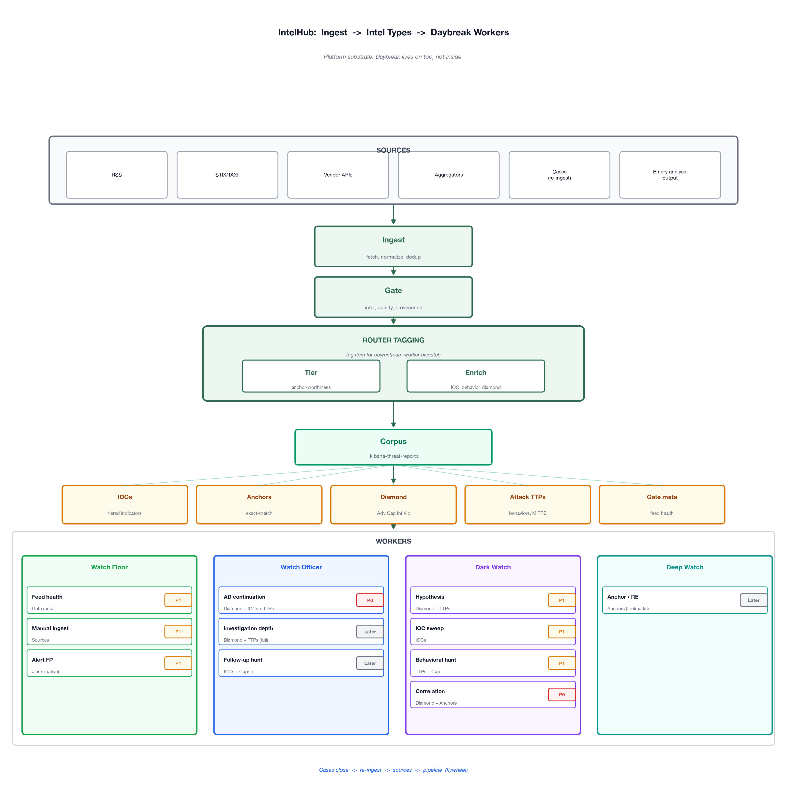

# Daybreak + IntelHub — One Page

*For Paul / threat intel workstream · Seth · 2026-07-07*

**Workstream doc (problem + links):** [`daybreak_threat_intel.md`](daybreak_threat_intel.md)

Daybreak docs describe **intel consumers**. They don't describe the **pipeline** that builds and routes intel to them. IntelHub is that pipeline — a **platform substrate** Daybreak lives on top of, not a Watch inside Daybreak.

---

## The flow

  
SVG: [`daybreak_intel_flow.svg`](daybreak_intel_flow.svg)

**Flywheel:** Cases close → re-ingest → pipeline → corpus → future hunts + IOC tracking.

**Key routing logic:**

- **Diamon + TTPs** → hypothesis worker → fans out to IOC sweep, behavioral hunt, correlation
- **IOCs alone** → IOC hunts (Tier 1 ES|QL)
- **Anchors alone** → RE / toolmark correlation (exact match)
- **Gate meta** → Watch Floor feed health (not Officer or Dark Watch)

---

## Workers (P0 / P1 / Later)

| Priority  | Watch      | Worker                     | Intel input                                 | Output                                                                             |
| --------- | ---------- | -------------------------- | ------------------------------------------- | ---------------------------------------------------------------------------------- |
| **P0**    | Officer    | AD continuation            | AD narrative + corpus (Diamond, IOCs, TTPs) | Investigation Proposal + Evidence                                                  |
| **P0**    | Dark Watch | Correlation                | Diamond + Anchors                           | Related campaigns, citations                                                       |
| **P0**    | —          | Proposal / Evidence schema | Correlation findings + hunt hits            | Evidence package ([#17942](https://github.com/elastic/security-team/issues/17942)) |
| **P1**    | Floor      | Feed health                | Gate meta, source economics                 | "Disable feed" / "Fix fetch" Proposal                                              |
| **P1**    | Floor      | Manual ingest              | Source registry                             | Trigger ingest now                                                                 |
| **P1**    | Floor      | Alert FP                   | Alert metadata (Daybreak-native)            | Rule tune Proposal                                                                 |
| **P1**    | Dark Watch | Hypothesis                 | Diamond (Cap/Inf) + TTPs                    | Hunt hypothesis → other workers                                                    |
| **P1**    | Dark Watch | IOC sweep                  | IOCs (discriminating)                       | Tier 1 telemetry sweep                                                             |
| **P1**    | Dark Watch | Behavioral hunt            | TTPs + Cap diamond                          | Tier 2 hunt rules                                                                  |
| **Later** | Officer    | Investigation depth        | Full corpus + correlate (full)              | Enriched case                                                                      |
| **Later** | Officer    | Follow-up hunt             | IOCs + Cap/Inf from correlation             | Env sweep Proposal                                                                 |
| **Later** | Deep Watch | Anchor / RE                | Toolmark anchors (mutex, beacon, …)         | RE indicator match                                                                 |
| **Later** | —          | Case re-ingest             | Closed case report                          | Corpus flywheel                                                                    |

Same pipeline also feeds **SONAR, TRADE, INFOSEC, Mustard** — Daybreak is one subscriber.

---

## Pipeline status

| Stage                                           | Status                   |
| ----------------------------------------------- | ------------------------ |
| Ingest, Gate, Tier, Enrich, Corpus              | 🟢 Built + live          |
| IOCs, Diamond, TTPs, Anchors (network)          | 🟢 Workers can consume   |
| Explicit router (artifact → worker dispatch)    | 🟡 Designed, not unified |
| Hypothesis object, RE toolmarks, case re-ingest | 🔴 Later                 |

---

## Reality check

|                                                 |                                              |
| ----------------------------------------------- | -------------------------------------------- |
| ✅ Ingest + gate + enrich work autonomously      | ❌ Daybreak docs don't describe this pipeline |
| ✅ Correlate + hunt demo'd over MCP              | ❌ Router spine not built yet                 |
| ✅ One substrate serves Daybreak + org consumers | ❌ IntelHub is not a Daybreak Watch           |

---

## Links

- [Daybreak operating model](https://github.com/elastic/project-daybreak/blob/main/docs/daybreak-operating-model.md)
- [AD → Daybreak #17941](https://github.com/elastic/security-team/issues/17941) · [Correlation #17861](https://github.com/elastic/security-team/issues/17861)
- Deep dive: `[routing_fabric_pitch.md](routing_fabric_pitch.md)` · `[NORTH_STAR.md](NORTH_STAR.md)`

